<p align="center">
  
</p>

<p align="center">
  
</p>


<p align="center">
  
</p>

<p align="center">
  
</p>


<p align="center">
  
</p>
<p align="center">
  
</p>


<p align="center">
  
</p>


<p align="center">
  
</p>


<p align="center">
  
  
  
  
</p>


> "Programs must be written for people to read, and only incidentally for machines to execute." —— Harold Abelson  
>
> ---
>
> 本笔记为 **第二讲 · 数据结构** 的 C++ 模板与题解，涵盖单、双链表，栈与队列，单调栈与单调队列，KMP，Trie 树，并查集，堆，哈希表，以及常用的 C++ STL等核心内容。 旨在帮助学习者系统掌握各类数据结构的特性与应用场景，为算法设计打下坚实的实现基础。
> 
>---
> 
>若算法是思想的灵魂，那么数据结构便是承载思想的形体。 
> 从链表的衔接，到栈与队列的调度；从并查集的联通，到堆与哈希的高效—— 每一种结构，都是对“组织与存储”的极致追求。  
> 
> 本章将带你构筑算法的骨架， 理解抽象背后的逻辑与美感， 让数据在结构中流动，让思维在代码中成形。[雪青紫]


---

# 📖 第二讲 数据结构

## 🔗⛓️ 1. 单链表、双链表

> **核心思想**：链表是一种物理存储单元上非连续、非顺序的存储结构，数据元素的逻辑顺序是通过链表中的指针链接次序实现的。它允许高效的节点插入和删除，但随机访问效率较低。

### 1.0 洛谷题单

| 来源 | 题目/题单                                | 说明                             |
| ---- | ---------------------------------------- | -------------------------------- |
| 洛谷 | https://www.luogu.com.cn/problem/U231659 | U231659 单链表                   |
| 洛谷 | https://www.luogu.com.cn/problem/T430507 | T430507 双向链表                 |
| 洛谷 | https://www.luogu.com.cn/training/869224 | 数据结构-线性表（题单）          |
| 洛谷 | https://www.luogu.com.cn/training/113    | 【数据结构1-1】线性表（题单）    |
| 洛谷 | https://www.luogu.com.cn/training/579247 | 《算法竞赛》第1.1节-链表（题单） |

### 1.1 单链表

>**核心思想**：单链表是一种线性数据结构，通过指针将一系列零散的内存块串联起来。每个节点包含数据域和指向下一个节点的指针域。它能高效地进行头插和在指定节点后插入/删除操作，但访问特定元素需要 O(n) 的时间。这里使用数组模拟链表，`e[i]` 存节点值，`ne[i]` 存下一节点下标，`idx` 作为内存池指针。


<details>
<summary><strong>🔗 练习平台</strong></summary>

- **洛谷**: [U231659 【模板】单链表](https://www.luogu.com.cn/problem/U231659)

</details>


<details>
<summary><strong>🎯 AcWing 题目与题解</strong></summary>

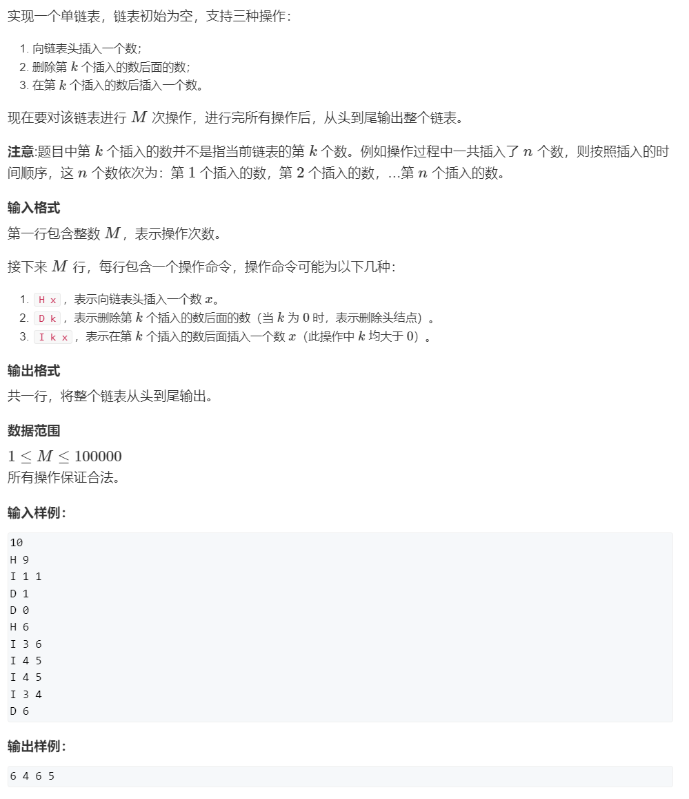

> **数组模拟单链表模板**
>
> 通过数组模拟链表，`e[i]` 存节点值，`ne[i]` 存下一节点下标，`idx` 作为内存池指针。
> - `head`: 头指针，存储头节点的下标。
> - `e[i]`: 节点 `i` 的值。
> - `ne[i]`: 节点 `i` 的 `next` 指针，存储下一个节点的下标。
> - `idx`: 当前可用的最新节点的下标。

```cpp
// 单链表模板
int head, e[N], ne[N], idx;

// 初始化
void init() {
    head = -1;
    idx = 0;
}

// 头插法
void insert_to_head(int x) {
    e[idx] = x;
    ne[idx] = head;
    head = idx++;
}

// 在第 k 个插入的数后插入一个数
void insert(int k, int x) {
    e[idx] = x;
    ne[idx] = ne[k];
    ne[k] = idx++;
}

// 删除第 k 个插入的数后面的数
void remove(int k) {
    ne[k] = ne[ne[k]];
}
```

> **题解代码**

```cpp
#include<iostream>
using namespace std;
const int N = 1e5 + 10;

int head, e[N], ne[N], idx;

void init() {
    head = -1;
    idx = 0;
}

void insert_to_head(int x) {
    e[idx] = x;
    ne[idx] = head;
    head = idx++;
}

void insert(int k, int x) {
    e[idx] = x;
    ne[idx] = ne[k];
    ne[k] = idx++;
}

void remove(int k) {
    ne[k] = ne[ne[k]];
}

int main() {
    int m;
    cin >> m;
    init();
    while (m--) {
        char op;
        cin >> op;
        if (op == 'H') {
            int x;
            cin >> x;
            insert_to_head(x);
        } else if (op == 'D') {
            int k;
            cin >> k;
            if (k == 0) head = ne[head];
            else remove(k - 1); // 第k个插入的数下标是k-1
        } else {
            int k, x;
            cin >> k >> x;
            insert(k - 1, x);
        }
    }
    for (int i = head; i != -1; i = ne[i]) cout << e[i] << " ";
    cout << endl;
    return 0;
}
```
</details>

### 1.2 双链表

> **核心思想**：双链表在单链表的基础上增加了一个前驱指针，使得每个节点都能直接访问其前一个和后一个节点。这使得在任意位置的插入和删除操作都变为 O(1)，但代价是需要额外的空间存储前驱指针。数组模拟时，通常用 `l[i]` 和 `r[i]` 分别存储前驱和后继的下标。


<details>
<summary><strong>🔗 练习平台</strong></summary>

- **洛谷**: [T430507 【模板】双链表](https://www.luogu.com.cn/problem/T430507)

</details>


<details>
<summary><strong>🎯 AcWing 题目与题解</strong></summary>

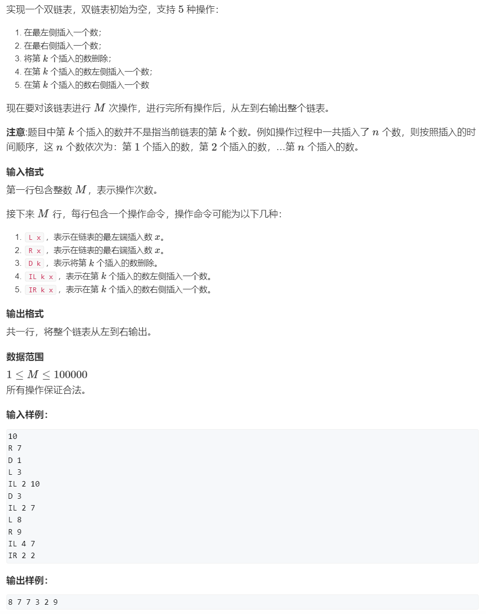

> **数组模拟双链表模板**
>
> 增加一个前驱指针，使得每个节点都能直接访问其前后节点。数组模拟时，通常用 `l[i]` 和 `r[i]` 分别存储前驱和后继的下标。
> - `0` 号点是左端点/头哨兵，`1` 号点是右端点/尾哨兵。
> - `l[i]`: 节点 `i` 的前驱。
> - `r[i]`: 节点 `i` 的后继。

```cpp
// 双链表模板
int e[N], l[N], r[N], idx;

// 初始化
void init() {
    // 0是头，1是尾
    r[0] = 1;
    l[1] = 0;
    idx = 2;
}

// 在节点k的右边插入一个数x
void insert(int k, int x) {
    e[idx] = x;
    r[idx] = r[k];
    l[idx] = k;
    l[r[k]] = idx;
    r[k] = idx++;
}

// 删除节点k
void remove(int k) {
    r[l[k]] = r[k];
    l[r[k]] = l[k];
}
```

> **题解代码**

```cpp
#include<iostream>
#include<string>
using namespace std;
const int N = 1e5 + 10;

int e[N], l[N], r[N], idx;

void init() {
        //头结点指向尾结点，尾结点指向头节点，头结点指针为0，尾结点指针为1，所以头指针为1，尾指针为0
    r[0] = 1;
    l[1] = 0;
    idx = 2;
}

void insert(int k, int x) {
    e[idx] = x;
    r[idx] = r[k];
    l[idx] = k;
    l[r[k]] = idx;//必须这步在前面，否则r[k]的值会被修改 
    r[k] = idx++;
}

void remove(int k) {
    r[l[k]] = r[k];
    l[r[k]] = l[k];
}

int main() {
    int m;
    cin >> m;
    init();
    while (m--) {
        string op;
        cin >> op;
        if (op == "L") {
            int x; cin >> x;
            insert(0, x); // 在头哨兵右边插入
        } else if (op == "R") {
            int x; cin >> x;
            insert(l[1], x); // 在尾哨兵左边插入
        } else if (op == "D") {
            int k; cin >> k;
            remove(k + 1); // 第k个插入的数下标是k+1
        } else if (op == "IL") {
            int k, x; cin >> k >> x;
            insert(l[k + 1], x);
        } else { // IR
            int k, x; cin >> k >> x;
            insert(k + 1, x);
        }
    }
    for (int i = r[0]; i != 1; i = r[i]) cout << e[i] << " ";
    cout << endl;
    return 0;
}
```
</details>


### 1.3 P1160 队列安排

<details>
<summary><strong>🔗 P1160 队列安排</strong></summary>

- **洛谷**: [P1160 队列安排](https://www.luogu.com.cn/problem/P1160)

本题要求按照指定规则动态地在队列中插入和删除同学，可用**双向链表**高效维护队列结构。

1、**核心思想**： 用数组模拟双向链表。

`l[i]` 表示节点 `i` 的左邻居编号，`r[i]` 表示节点 `i` 的右邻居编号，`e[i]` 存储当前节点代表的同学编号。

2、**初始化**： 建立哨兵节点 `0`（左端）与 `1`（右端），初始队列为空（仅两个哨兵）。

3、**插入操作**： 对于每个同学 `i`：

- 若 `p == 0` → 插到 `k` 的左边：修改 `l[k]`、`r[k]` 以及相邻节点的指针。
- 若 `p == 1` → 插到 `k` 的右边：修改 `r[k]`、`l[k]` 以及相邻节点的指针。用 `add[i]` 记录每个同学在链表中的位置索引，方便之后删除。

4、**删除操作**： 若同学 `x` 当前仍在队列（`e[add[x]] != 0`），则断开其左右链接，并标记为已删除。

5、**输出**： 从 `r[0]`（哨兵右侧）开始，依次输出所有节点的 `e[i]`。

> **题解代码**

```cpp
#include <iostream>
using namespace std;
const int N = 1e5 + 5;
int l[N], e[N], r[N], add[N];
int idx;
void init() {
    r[0] = 1, l[1] = 0, idx = 2;
    add[0] = 0;
}
void insert_right(int k, int val) {
    e[idx] = val;
    l[idx] = k;
    r[idx] = r[k];
    l[r[k]] = idx;
    r[k] = idx;
    add[++add[0]] = idx++;
}
void insert_left(int k, int val) {
    e[idx] = val;
    l[idx] = l[k];
    r[idx] = k;
    r[l[k]] = idx;
    l[k] = idx;
    add[++add[0]] = idx++;
}
void remove(int k) {
    l[r[k]] = l[k];
    r[l[k]] = r[k];
    e[k] = 0;
    add[0]--;
}
void printList() {
    for (int i = r[0]; i != 1; i = r[i]) {
        printf("%d ", e[i]);
    }
}
int main() {
    init();
    int n, k, p, m, x;
    scanf("%d", &n);
    insert_right(0, 1);
    for (int i = 2; i <= n; i++) {
        scanf("%d %d", &k, &p);
        if (p == 0) {
            insert_left(add[k], i);
        } else {
            insert_right(add[k], i);
        }
    }
    scanf("%d", &m);
    while (m--) {
        scanf("%d", &x);
        if (e[add[x]] != 0) {
            remove(add[x]);
        }
    }
    printList();
    return 0;
}
```
</details>


---

## 🥞 ➡️2. 栈、队列

> **核心思想**：栈（Stack）和队列（Queue）是两种重要的线性数据结构。栈遵循 **后进先出（LIFO）** 原则，所有操作在栈顶进行。队列遵循 **先进先出（FIFO）** 原则，元素从队尾进入，从队头离开。

> [!note]
>
> 1、栈：
> **核心思想**：栈（Stack）是一种遵循 **后进先出（LIFO）** 原则的线性数据结构。所有操作都在栈的一端——栈顶进行。常用操作包括 `push`（入栈）、`pop`（出栈）和 `top`（查看栈顶元素）。
>
> 2、队列：
>
> **核心思想**：队列（Queue）是一种遵循 **先进先出（FIFO）** 原则的线性数据结构。元素从队尾（rear）进入，从队头（front）离开。


### 2.0 洛谷题单

| 来源 | 题目/题单                                | 说明                       |
| ---- | ---------------------------------------- | -------------------------- |
| 洛谷 | https://www.luogu.com.cn/problem/B3614   | B3614 【模板】栈           |
| 洛谷 | https://www.luogu.com.cn/problem/U295781 | U295781 模拟栈             |
| 洛谷 | https://www.luogu.com.cn/problem/B3616   | B3616 【模板】队列         |
| 洛谷 | https://www.luogu.com.cn/training/151204 | 队列与栈（题单）           |
| 洛谷 | https://www.luogu.com.cn/training/754878 | 数据结构2-栈与队列（题单） |

### 2.1 模拟栈

<details>
<summary><strong>🔗 练习平台</strong></summary>

- **洛谷**: [B3614 【模板】栈](https://www.luogu.com.cn/problem/B3614)

</details>

<details>
<summary><strong>🎯 AcWing 题目与题解</strong></summary>


> **数组模拟栈模板**
>
> - `stk[]`: 存储栈元素的数组。
> - `top`: 栈顶指针，指向栈顶元素的下一个位置（或当前位置，依实现而定）。

```cpp
// 数组模拟栈 (top指向栈顶元素)
int stk[N], top = -1;

// 入栈
stk[++top] = x;

// 出栈
top--;

// 查看栈顶
stk[top];

// 判空
if (top == -1) { /* 栈空 */ }
```

> **题解代码**

```cpp
#include<iostream>
#include<string>
using namespace std;
const int N = 100010;

int stk[N], top = -1;

int main() {
    int m;
    cin >> m;
    while (m--) {
        string s;
        cin >> s;
        if (s == "push") {
            int x;
            cin >> x;
            stk[++top] = x;
        } else if (s == "pop") {
            top--;
        } else if (s == "empty") {
            cout << (top == -1 ? "YES" : "NO") << endl;
        } else { // query
            cout << stk[top] << endl;
        }
    }
    return 0;
}
```
</details>

### 2.2 模拟队列

<details>
<summary><strong>🔗 练习平台</strong></summary>

- **洛谷**: [B3616 【模板】队列](https://www.luogu.com.cn/problem/B3616)

</details>

<details>
<summary><strong>🎯 AcWing 题目与题解</strong></summary>

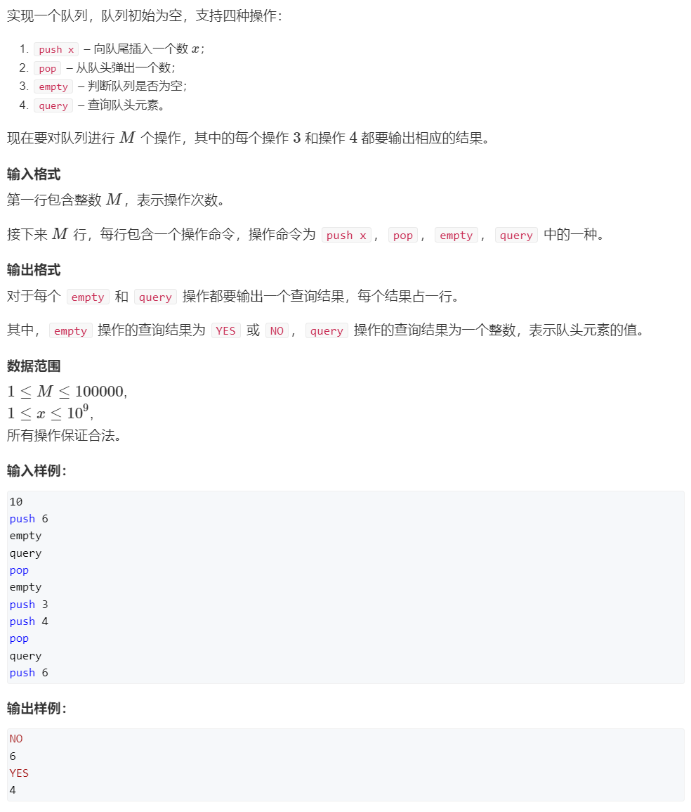

> **数组模拟队列模板**
>
> - `q[]`: 存储队列元素的数组。
> - `hh`: 队头指针。
> - `tt`: 队尾指针。

**模拟普通队列模板：**

```cpp
//模拟普通队列模板

// hh 表示队头，tt表示队尾
int q[N], hh = 0, tt = -1;

// 向队尾插入一个数
q[ ++ tt] = x;

// 从队头弹出一个数
hh ++ ;

// 队头的值
q[hh];

// 判断队列是否为空，如果 tt >= hh，则表示不为空
if (tt >= hh)
{

}

//模拟循环队列模板

// hh 表示队头，tt表示队尾的后一个位置
int q[N], hh = 0, tt = 0;

// 向队尾插入一个数
q[tt ++ ] = x;
if (tt == N) tt = 0;

// 从队头弹出一个数
hh ++ ;
if (hh == N) hh = 0;

// 队头的值
q[hh];

// 判断队列是否为空，如果hh != tt，则表示不为空(其实不能这样简单判断是否为空)
if (hh != tt)
{

}
```

> **题解代码**

```cpp
#include <iostream>
using namespace std;
const int N = 100010;
int q[N];

//[hh, tt] 之间为队列（左闭右闭）
int hh = 0;//队头位置
int tt = -1;//队尾位置，存第一个元素时的索引为0，所以从0开始存储 
int m;
string s;


int main(){
    cin >> m;
    while(m--){
        cin >> s;
        //入队
        if(s == "push"){
            int x;
            cin >> x;
            q[++tt] = x;
        }
        //出队
        else if(s == "pop"){
            hh++;
        }
        //问空
        else if(s == "empty"){
            if(tt >= hh) cout << "NO" << endl;
    		else cout << "YES" << endl;
        }
        //查询 
        else if(s == "query"){
            cout << q[hh] << endl;
        }
    }
}

```
</details>

### 2.3 表达式求值

<details>
<summary><strong>🎯 AcWing 题目与题解</strong></summary>

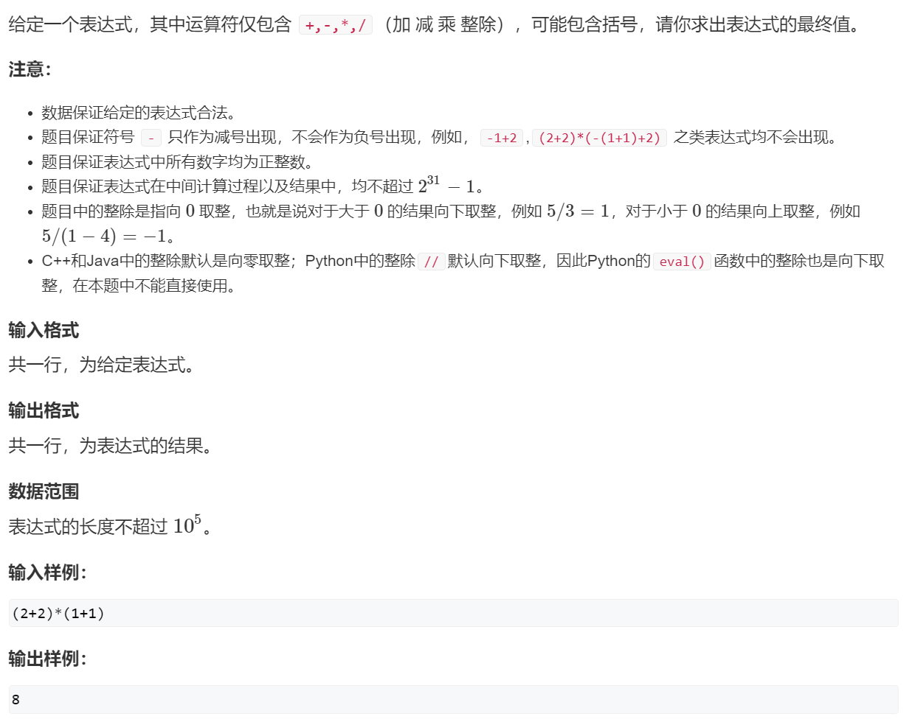

> **解法思路**：使用双栈法。一个 `num` 栈存放数字，一个 `op` 栈存放操作符。遍历表达式：
> 1.  **数字**：直接入 `num` 栈。
> 2.  **左括号**：直接入 `op` 栈。
> 3.  **右括号**：不断计算直到遇到左括号，并将左括号弹出。
> 4.  **操作符**：若 `op` 栈顶操作符优先级 **不低于** 当前操作符，则弹出 `op` 栈顶和 `num` 栈顶两个数进行计算，结果压回 `num` 栈，重复此过程，直到 `op` 栈顶优先级更低或栈空，再将当前操作符入栈。
> 最后，清空 `op` 栈进行计算。

```cpp
#include <iostream>
#include <stack>
#include <string>
#include <map>
using namespace std;

//双栈加优先级表 
stack<int> num;
stack<char> op;
map<char, int> h = { {'+', 1}, {'-', 1}, {'*',2}, {'/', 2} };

//求值函数 
void eval()
{
    int b = num.top();//第二个操作数
    num.pop();

    int a = num.top();//第一个操作数
    num.pop();

    char p = op.top();//运算符
    op.pop();

    int r = 0;//结果 

    //计算结果
    if (p == '+') r = a + b;
    else if (p == '-') r = a - b;
    else if (p == '*') r = a * b;
    else if (p == '/') r = a / b;

    num.push(r);//结果入栈
}

int main()
{
    string s;//读入表达式
    cin >> s;

    for (int i = 0; i < s.size(); i++)
    {
    	char c = s[i]; 
    	//1.数字，数字入栈 
        if (isdigit(c))
        {	
        	//此while循环是在读到了数字时读完一整个数字 
            int x = 0, j = i;
            while (j < s.size() && isdigit(s[j]))
            {
                x = x * 10 + s[j] - '0';
                j++;
            }
            num.push(x);
            i = j - 1;
        }
        //2.左括号，左括号无优先级，直接入栈
        else if (c == '(')//左括号入栈
        {
            op.push(c);
        }
        //3.右括号，括号特殊，遇到左括号直接入栈，遇到右括号不进栈，直接计算 
        else if (c == ')')
        {
            while(op.top() != '(')
                eval();
            op.pop();//左括号出栈
        }
        //4.运算符，主要是优先级的问题 
        else
        {
            while (op.size() && h[op.top()] >= h[c])//待入栈运算符优先级低，则先计算
                eval();
            op.push(c);//算完之后此运算符入栈
        }
    }
    while (op.size()) eval();//剩余的进行计算 
    cout << num.top() << endl;//输出结果
    return 0;
}
```
</details>

---

## 📈📉  3. 单调栈、单调队列

> **核心思想**：单调栈和单调队列是两种内部元素维持单调性的数据结构。单调栈常用于解决 **寻找每个元素左/右侧第一个比它大/小的元素** 的问题。单调队列常用于解决 **滑动窗口内的最值问题**。


> [!note]
>
> 1、单调栈：
>
> **核心思想**：单调栈是一种特殊的栈，其内部元素始终保持单调（递增或递减）。它可以高效地解决一类问题：**寻找每个元素左/右侧第一个比它大/小的元素**。当一个新元素入栈时，为了维护单调性，会弹出栈顶所有“破坏”单调性的元素。
>
> 
>
> 2、单调队列：
>
> **核心思想**：单调队列是一种双端队列，其内部元素同样保持单调性。它常用于解决 **滑动窗口内的最值问题**。队列中存储的是元素的 **下标**。当窗口滑动时：
>
> 1. 从队头移除已经滑出窗口的元素。
> 2. 从队尾移除所有“破坏”单调性的元素。
> 3. 将当前元素加入队尾。 此时，队头元素就是当前窗口的最值。


### 3.0 洛谷题单

| 来源 | 题目/题单                                | 说明                             |
| ---- | ---------------------------------------- | -------------------------------- |
| 洛谷 | https://www.luogu.com.cn/problem/P5788   | P5788 【模板】单调栈             |
| 洛谷 | https://www.luogu.com.cn/problem/P1886   | P1886 滑动窗口 /【模板】单调队列 |
| 洛谷 | https://www.luogu.com.cn/training/762625 | 单调栈 & 单调队列 练习题（题单） |
| 洛谷 | https://www.luogu.com.cn/training/238103 | 单调栈（题单）                   |

### 3.1 单调栈

<details>
<summary><strong>🔗 练习平台</strong></summary>

- **洛谷**: [P5788 【模板】单调栈](https://www.luogu.com.cn/problem/P5788)

</details>

<details>
<summary><strong>🎯 AcWing 题目与题解</strong></summary>

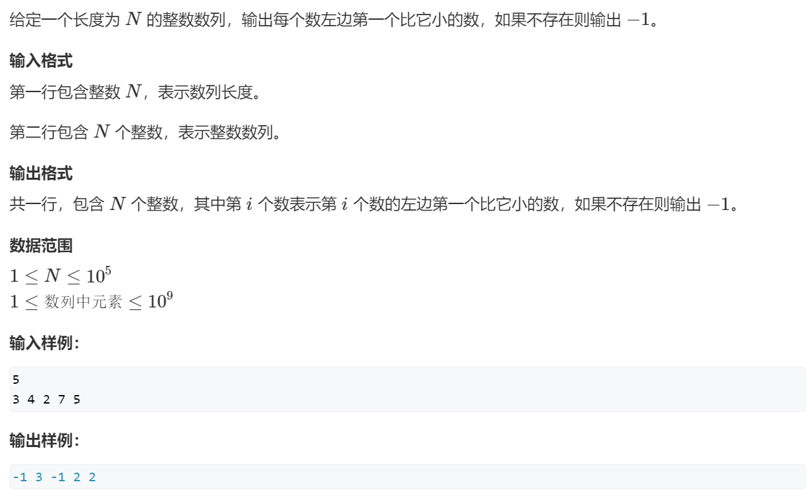

> **单调栈模型 (求左边第一个更小的数)**
> 
> 当一个新元素 `x` 入栈时，为了维护单调性，会弹出栈顶所有“破坏”单调性（`>=x`）的元素。弹空后，栈顶元素即为所求。

```cpp
for (int i = 0; i < n; i++) {
    // 栈顶元素不满足条件(>=x)，则出栈
    while (top > -1 && stk[top] >= x) top--;
    if (top > -1) // 栈不空，栈顶就是答案
        result[i] = stk[top];
    else // 栈空，没有答案
        result[i] = -1;
    // 当前元素入栈
    stk[++top] = x;
}
```

> **题解代码**

```cpp
#include <iostream>
using namespace std;
const int N = 100010;

int stk[N], top = -1;

int main() {
    int n;
    cin >> n;
    for (int i = 0; i < n; i++) {
        int x;
        cin >> x;
        // 当栈不空且栈顶元素大于等于x，则出栈
        while (top > -1 && stk[top] >= x) top--;
        // 此时栈顶即为左侧第一个比x小的数
        if (top > -1) cout << stk[top] << " ";
        else cout << -1 << " ";
        // 当前元素x入栈
        stk[++top] = x;
    }
    cout << endl;
    return 0;
}
```
</details>

### 3.2 单调队列

<details>
<summary><strong>🔗 练习平台</strong></summary>

- **洛谷**: [P1886 滑动窗口 /【模板】单调队列](https://www.luogu.com.cn/problem/P1886)

</details>

<details>
<summary><strong>🎯 AcWing 题目与题解</strong></summary>

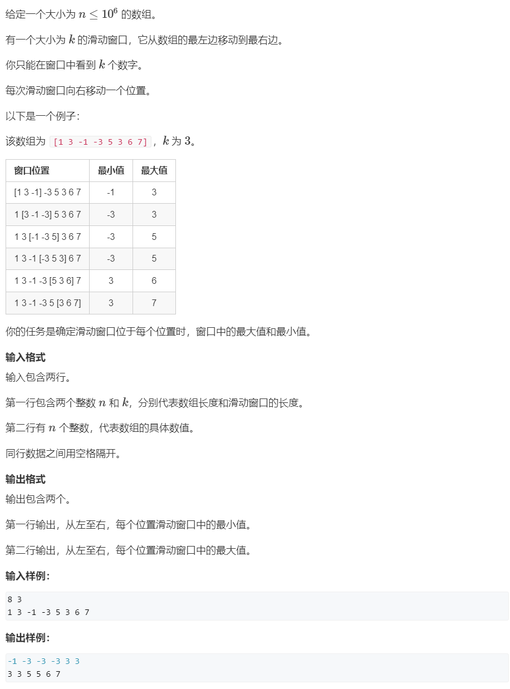

> **单调队列模型 (求滑动窗口最小值)**
> 
> 队列中存储的是元素的 **下标**。当窗口滑动时：
> 1.  从队头移除已经滑出窗口的元素下标。
> 2.  从队尾移除所有值 `>=` 当前元素值的元素下标。
> 3.  将当前元素下标加入队尾。
> 此时，队头元素的下标对应的值就是当前窗口的最值。

```cpp
int hh = 0, tt = -1;
for (int i = 0; i < n; i++) {
    // 1. 判断队头是否滑出窗口
    if (hh <= tt && q[hh] < i - k + 1) hh++;
    // 2. 维护队列单调性，从队尾移除 >= 当前元素的
    while (hh <= tt && a[q[tt]] >= a[i]) tt--;
    // 3. 当前元素下标入队
    q[++tt] = i;
    // 4. 形成窗口后，输出队头（最值）
    if (i >= k - 1) cout << a[q[hh]] << " ";
}
```

> **题解代码**

```cpp
#include <iostream>
using namespace std;
const int N = 1000010;

int a[N], q[N]; // q存的是下标

int main() {
    int n, k;
    cin >> n >> k;
    for (int i = 0; i < n; i++) cin >> a[i];

    // 求窗口最小值
    int hh = 0, tt = -1;
    for (int i = 0; i < n; i++) {
        if (hh <= tt && q[hh] < i - k + 1) hh++;
        while (hh <= tt && a[q[tt]] >= a[i]) tt--;
        q[++tt] = i;
        if (i >= k - 1) cout << a[q[hh]] << " ";
    }
    cout << endl;

    // 求窗口最大值
    hh = 0, tt = -1;
    for (int i = 0; i < n; i++) {
        if (hh <= tt && q[hh] < i - k + 1) hh++;
        while (hh <= tt && a[q[tt]] <= a[i]) tt--;
        q[++tt] = i;
        if (i >= k - 1) cout << a[q[hh]] << " ";
    }
    cout << endl;
    return 0;
}
```
> **另一种写法：**

```c++
#include <deque>
#include <iostream>
#include <stack>
#include <vector>
using namespace std;
int n, k;
const int N = 1e6 + 5;
int nums[N];
class MonotonicMaxQueue {
public:
    deque<int> que;
    void pop(int val) {
        if (!que.empty() && que.front() == val) {
            que.pop_front();
        }
    }
    int getMaxVal() { return que.front(); }
    void push(int val) {
        while (!que.empty() && que.back() < val) {
            que.pop_back();
        }
        que.emplace_back(val);
    }
};
class MonotonicMinQueue {
public:
    deque<int> que;
    void pop(int val) {
        if (!que.empty() && que.front() == val) {
            que.pop_front();
        }
    }
    int getMaxVal() { return que.front(); }
    void push(int val) {
        while (!que.empty() && que.back() > val) {
            que.pop_back();
        }
        que.emplace_back(val);
    }
};
int main() {
    scanf("%d %d", &n, &k);
    for (int i = 0; i < n; i++) {
        scanf("%d", &nums[i]);
    }
    vector<int> result;
    //  最小值
    MonotonicMinQueue mqMin;
    for (int i = 0; i < k; i++) {
        mqMin.push(nums[i]);
    }
    printf("%d ", mqMin.getMaxVal());
    for (int i = k; i < n; i++) {
        mqMin.pop(nums[i - k]);
        mqMin.push(nums[i]);
        printf("%d ", mqMin.getMaxVal());
    }
    printf("\n");
    //  最大值
    MonotonicMaxQueue mqMax;
    for (int i = 0; i < k; i++) {
        mqMax.push(nums[i]);
    }
    printf("%d ", mqMax.getMaxVal());
    for (int i = k; i < n; i++) {
        mqMax.pop(nums[i - k]);
        mqMax.push(nums[i]);
        printf("%d ", mqMax.getMaxVal());
    }
    return 0;
}
```


</details>

---

## 📜 4. KMP

> **核心思想**：KMP 算法是一种高效的字符串匹配算法，其核心在于利用一个 `next` 数组来避免在匹配失败时不必要的回溯。`next[i]` 表示模式串 `p` 的前 `i` 个字符组成的子串中，**最长公共前后缀** 的长度。当 `s[i]` 与 `p[j+1]` 匹配失败时，`j` 直接跳到 `next[j]`，实现了 O(m+n) 的时间复杂度。

### 4.0 洛谷题单

| 来源 | 题目/题单                                | 说明                  |
| ---- | ---------------------------------------- | --------------------- |
| 洛谷 | https://www.luogu.com.cn/problem/P3375   | P3375 【模板】KMP     |
| 洛谷 | https://www.luogu.com.cn/training/427862 | KMP基础练习题（题单） |

### 4.1 KMP 字符串匹配

<details>
<summary><strong>🔗 练习平台</strong></summary>

- **洛谷**: [P3375 【模板】KMP字符串匹配](https://www.luogu.com.cn/problem/P3375)

</details>

<details>
<summary><strong>🎯 AcWing 题目与题解</strong></summary>

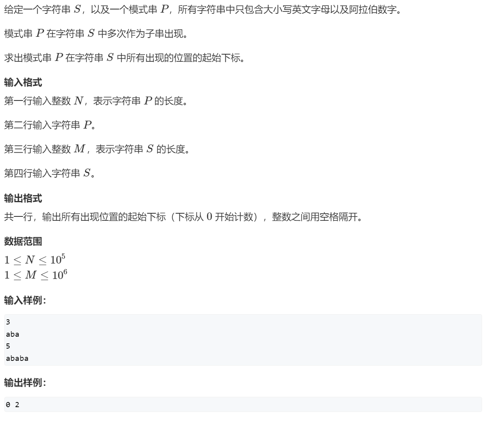


手动模拟求next数组：

对 p = “abcab”

|   p    |  a   |  b   |  c   |  a   |  b   |
| :----: | :--: | :--: | :--: | :--: | :--: |
|  下标  |  1   |  2   |  3   |  4   |  5   |
| next[] |  0   |  0   |  0   |  1   |  2   |

对next[ 1 ] ：前缀 = 空集—————后缀 = 空集—————next[ 1 ] = 0;

对next[ 2 ] ：前缀 = { a }—————后缀 = { b }—————next[ 2 ] = 0;

对next[ 3 ] ：前缀 = { a , ab }—————后缀 = { c , bc}—————next[ 3 ] = 0;

对next[ 4 ] ：前缀 = { **a** , ab , abc }—————后缀 = { **a** . ca , bca }—————next[ 4 ] = 1;

对next[ 5 ] ：前缀 = { a , **ab** , abc , abca }————后缀 = { b , **ab** , cab , bcab}————next[ 5 ] = 2;


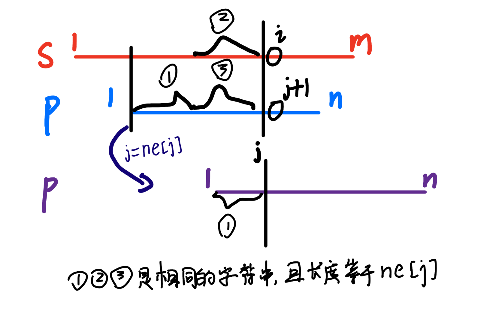


> **KMP 模板**
>
> 1、计算 Next 数组
>
> ```c++
> // p是模式串(1-indexed)，n是其长度，ne是next数组
> for (int i = 2, j = 0; i <= n; i++) {
>     while (j && p[i] != p[j + 1]) j = ne[j];
>     if (p[i] == p[j + 1]) j++;
>     ne[i] = j;
> }
> ```
>
> 2、 匹配过程:
>
> ```c++
> // s是主串(1-indexed), m是其长度
> for (int i = 1, j = 0; i <= m; i++) {
>     while (j && s[i] != p[j + 1]) j = ne[j];
>     if (s[i] == p[j + 1]) j++;
>     if (j == n) {
>         // 匹配成功，处理逻辑...
>         // 寻找下一个匹配
>         j = ne[j]; 
>     }
> }
> ```
>
> 


> **题解代码**

```cpp
#include <iostream>
using namespace std;
const int N = 1e5 + 10, M = 1e6 + 10;

char p[N], s[M];
int ne[N];

int main() {
    int n, m;
    cin >> n >> (p + 1) >> m >> (s + 1);

    // 求next数组
    for (int i = 2, j = 0; i <= n; i++) {
        while (j && p[i] != p[j + 1]) j = ne[j];
        if (p[i] == p[j + 1]) j++;
        ne[i] = j;
    }

    // kmp匹配
    for (int i = 1, j = 0; i <= m; i++) {
        while (j && s[i] != p[j + 1]) j = ne[j];
        if (s[i] == p[j + 1]) j++;
        if (j == n) {
            cout << i - n << " "; // 题目要求0-indexed
            j = ne[j];
        }
    }
    cout << endl;
    return 0;
}
```
</details>

---

## 🌳 5. Trie 树

> **核心思想**：Trie 树（字典树）是一种用于高效存储和检索字符串集合的树形结构。每个节点代表一个字符，从根到某个节点的路径构成一个字符串。它利用字符串的公共前缀来节约存储空间，查询一个字符串是否存在或其出现次数的时间复杂度为 O(L)，L为字符串长度。

### 5.0 洛谷题单

| 来源 | 题目/题单                                                    | 说明                                              |
| ---- | ------------------------------------------------------------ | ------------------------------------------------- |
| 牛客 | [【模板】Trie 字典树_牛客题霸_牛客网](https://www.nowcoder.com/practice/feed1cd7546a4901965751b9fbf5f8a1) | **【模板】Trie 字典树**                           |
| 洛谷 | https://www.luogu.com.cn/problem/P8306                       | P8306 【模板】字典树                              |
| 牛客 | https://www.nowcoder.com/practice/2db2a8c399ef415cbb8e92ba1032f131 | **两数最大异或值**                                |
| 洛谷 | https://www.luogu.com.cn/problem/P10471                      | P10471 最大异或对 The XOR Largest Pair            |
| 洛谷 | https://www.luogu.com.cn/problem/U149703                     | U149703 最大异或对                                |
| 洛谷 | https://www.luogu.com.cn/problem/U272877                     | U272877 最大异或对                                |
| 洛谷 | https://www.luogu.com.cn/problem/U208351                     | U208351 最大异或对                                |
| 洛谷 | https://www.luogu.com.cn/problem/U314156                     | U314156 最大异或对                                |
| 洛谷 | https://www.luogu.com.cn/problem/T563454                     | T563454 最大异或对                                |
| 洛谷 | https://www.luogu.com.cn/problem/U554945                     | U554945 最大异或对(01字典树)                      |
| 洛谷 | https://www.luogu.com.cn/problem/T552859                     | T552859 最大异或对 The XOR Largest Pair(12-18/19) |
| 洛谷 | https://www.luogu.com.cn/problem/T520388                     | T520388 最大异或对                                |
| 洛谷 | https://www.luogu.com.cn/training/338101                     | **【字典树】Trie Tree（题单）**                   |
| 洛谷 | https://www.luogu.com.cn/training/5061                       | **Trie 树 基础练习（题单）**                      |


### 5.1 Trie 字符串统计

<details>
<summary><strong>🔗 练习平台</strong></summary>

- **洛谷**: [P8306 【模板】字典树](https://www.luogu.com.cn/problem/P8306)
- **牛客**: [【模板】Trie](https://www.nowcoder.com/practice/feed1cd7546a4901965751b9fbf5f8a1)

</details>

<details>
<summary><strong>🎯 AcWing 题目与题解</strong></summary>

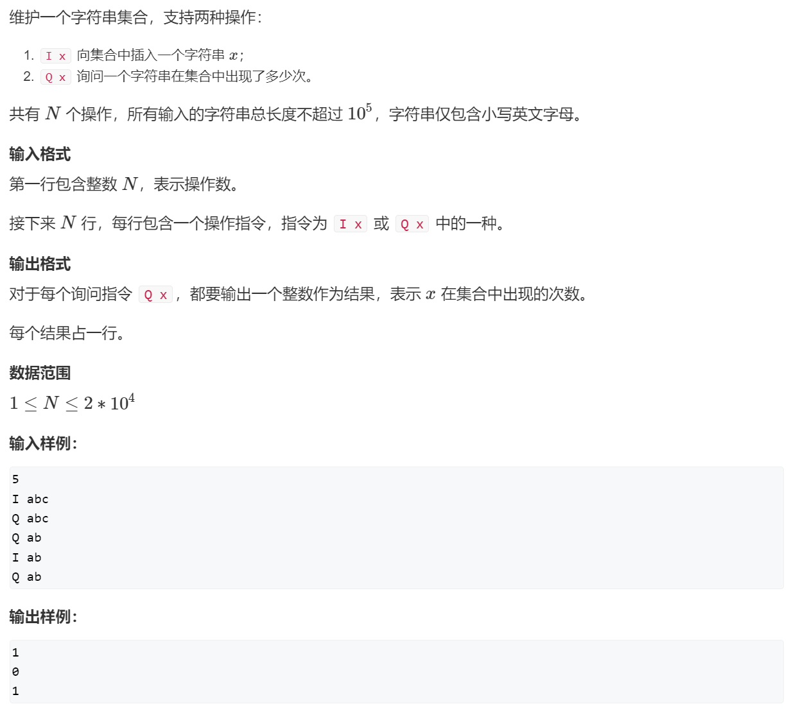


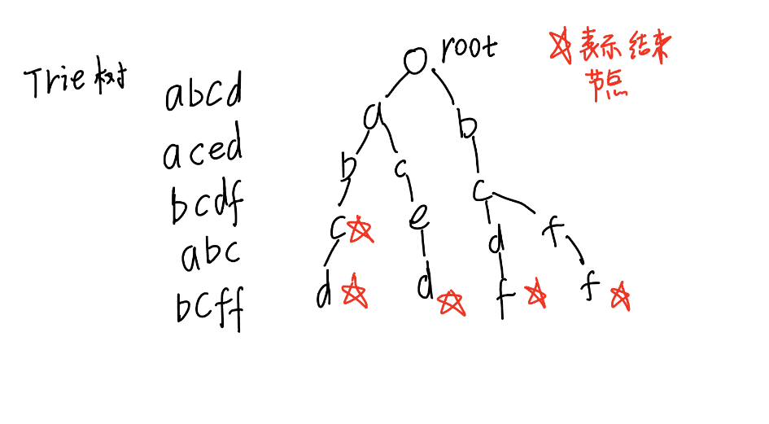


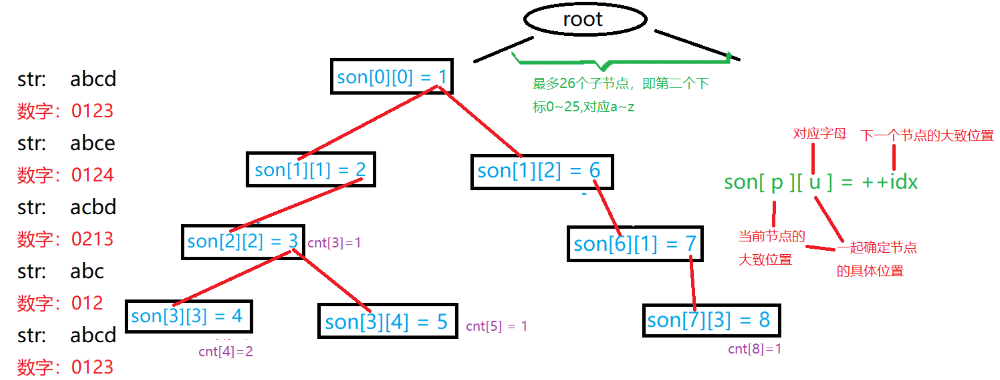

> **Trie 树模板**
>
> - `son[p][u]`: 节点 `p` 的 `u` 字符儿子节点的下标。
> - `cnt[p]`: 以节点 `p` 结尾的字符串数量。
> - `idx`: 当前可用节点的下标。

```cpp
int son[N][26], cnt[N], idx;
// 0号点既是根节点，又是空节点
// son[][]存储树中每个节点的子节点
// cnt[]存储以每个节点结尾的字符串数量

// 插入
void insert(char *str) {
    int p = 0;
    for (int i = 0; str[i]; i++) {
        int u = str[i] - 'a';
        if (!son[p][u]) son[p][u] = ++idx;
        p = son[p][u];
    }
    cnt[p]++;
}

// 查询
int query(char *str) {
    int p = 0;
    for (int i = 0; str[i]; i++) {
        int u = str[i] - 'a';
        if (!son[p][u]) return 0;
        p = son[p][u];
    }
    return cnt[p];
}
```

> **题解代码**

```cpp
//Trie树快速存储字符集合和快速查询字符集合
#include <iostream>
using namespace std;
const int N = 100010;
//son[][]存储子节点的位置，也存储第几个结点（idx的值），分支最多26条；
//cnt[p]存储以p节点结尾的字符串个数（同时也起标记作用）
//idx表示当前要插入的节点是第几个,每创建一个节点值+1
int son[N][26], cnt[N], idx;
char str[N];

void insert(char *str) {
    int p = 0;  //类似指针，指向当前节点
    for(int i = 0; str[i]; i++){
        int u = str[i] - 'a'; //将字母转化为数字
        if(!son[p][u]) son[p][u] = ++idx;   //该节点不存在，创建节点
        p = son[p][u];  //使“p指针”指向下一个节点
    }
    cnt[p]++;  //结束时的标记，也是记录以此节点结束的字符串个数
}

int query(char *str){
    int p = 0;
    for (int i = 0; str[i]; i++) {
        int u = str[i] - 'a';
        if(!son[p][u]) return 0;  //该节点不存在，即该字符串不存在
        p = son[p][u];
    }
    return cnt[p];  //返回字符串出现的次数
}

int main() {
    int m;
    cin >> m;
    while (m--) {
        char op[2];
		cin>>op>>str; 
        if(*op == 'I') insert(str);
        else cout<<query(str)<<endl;
        //改成char op; op == 'I'也行
    }
    return 0;
}
```
</details>

### 5.2 最大异或对

<details>
<summary><strong>🎯 AcWing 题目与题解</strong></summary>


> **解法思路**：将所有数字的二进制表示（从高位到低位）插入到一棵 Trie 树中。对于每个数字 `x`，在 Trie 树中查询与其异或值最大的数。查询时，从高位到低位遍历 `x` 的每一位，**贪心**地选择与当前位相反的路径走。如果相反路径存在，就走过去，结果的当前位贡献为1；否则只能走相同路径，结果当前位贡献为0。


> 写法1

```cpp
#include<iostream>
#include<algorithm>
using namespace std;
const int N = 100010, M = 31 * N;

int a[N];
int son[M][2], idx; // 01-Trie

void insert(int x) {
    int p = 0;
    for (int i = 30; i >= 0; i--) {
        int u = (x >> i) & 1;
        if (!son[p][u]) son[p][u] = ++idx;
        p = son[p][u];
    }
}

int search(int x) {
    int p = 0, res = 0;
    for (int i = 30; i >= 0; i--) {
        int u = (x >> i) & 1;
        if (son[p][!u]) { // 贪心：走相反的路
            p = son[p][!u];
            res = res * 2 + !u;
        } else {
            p = son[p][u];
            res = res * 2 + u;
        }
    }
    return x ^ res; // 返回异或值
}

int main() {
    int n;
    cin >> n;
    for (int i = 0; i < n; i++) {
        cin >> a[i];
        insert(a[i]);
    }
    int res = 0;
    for (int i = 0; i < n; i++) {
        res = max(res, search(a[i]));
    }
    cout << res << endl;
    return 0;
}
```


> 写法2

```c++
#include <iostream>
using namespace std;
const int N = 1e5 + 5, M = 3e6 + 5;
int a[N];
int son[M][2], idx;
// 将当前的x插入Trie树中
void insert(int x) {
  int p = 0;
  for (int i = 30; ~i; i--) {
    int& s = son[p][x >> i & 1];
    if (!s) {
      s = ++idx;  // 创建新节点
    }
    p = s;
  }
}
// 查找当前Trie树中和 x 异或最大的结果
int query(int x) {
  int res = 0;
  int p = 0;
  for (int i = 30; ~i; i--) {
    int t = x >> i & 1;
    if (son[p][!t]) {
      res += 1 << i;
      p = son[p][!t];
    } else {
      p = son[p][t];
    }
  }
  return res;
}
int main() {
  int n;
  scanf("%d", &n);
  for (int i = 0; i < n; i++) {
    scanf("%d", a + i);
    insert(a[i]);
  }
  int res = 0;
  for (int i = 0; i < n; i++) { res = max(res, query(a[i])); }
  printf("%d", res);
  return 0;
}
```


</details>

---

## 👨‍👩‍👧‍👦 6. 并查集

> **核心思想**：并查集（Disjoint Set Union）是一种维护集合的数据结构，支持两种操作：**合并** 两个集合，以及 **查询** 两个元素是否属于同一集合。它用一棵树表示一个集合，树根是集合的代表。核心是 `find` 函数，用于查找元素的根，并通过 **路径压缩** 优化，使得操作接近 O(1) 复杂度。

### 6.0 洛谷题单


| 来源 | 题目/题单                                | 说明                     |
| ---- | ---------------------------------------- | ------------------------ |
| 洛谷 | https://www.luogu.com.cn/problem/P3367   | P3367 【模板】并查集     |
| 洛谷 | https://www.luogu.com.cn/problem/U514565 | U514565 连通块中点的数量 |
| 洛谷 | https://www.luogu.com.cn/problem/T432686 | T432686 连通块中点的数量 |
| 洛谷 | https://www.luogu.com.cn/problem/P2024   | P2024 [NOI2001] 食物链   |
| 洛谷 | https://www.luogu.com.cn/problem/T537325 | T537325 食物链           |
| 洛谷 | https://www.luogu.com.cn/problem/T244988 | T244988 [NOI2001] 食物链 |
| 洛谷 | https://www.luogu.com.cn/training/874315 | **并查集模板题（题单）** |


### 6.1 合并集合

<details>
<summary><strong>🔗 练习平台</strong></summary>

- **洛谷**: [P3367 【模板】并查集](https://www.luogu.com.cn/problem/P3367)

</details>

<details>
<summary><strong>🎯 AcWing 题目与题解</strong></summary>

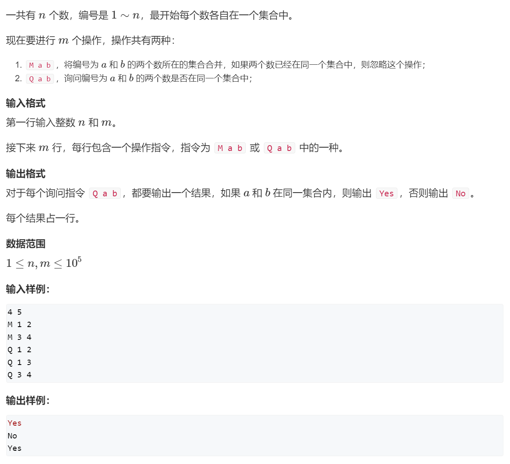


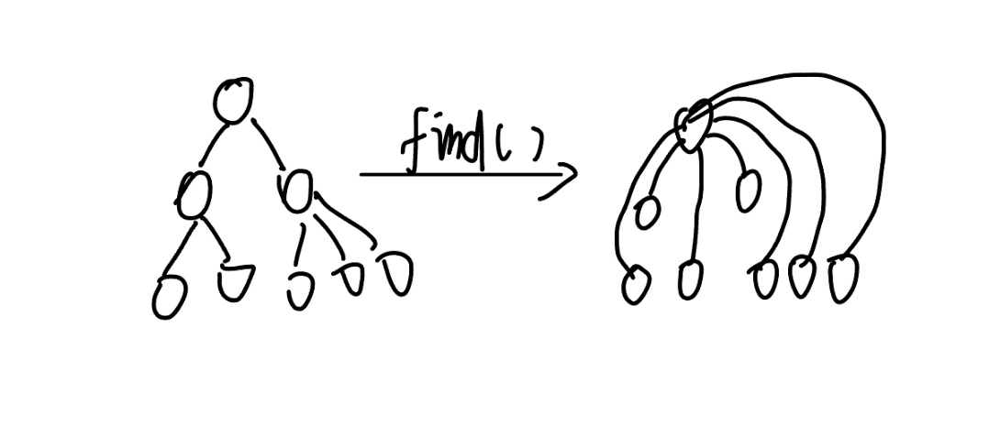


> **朴素并查集模板**
> 
> `p[x]` 存储元素 `x` 的父节点。`find(x)` 通过递归（或循环）找到 `x` 所在树的根节点，并在回溯时将路径上所有节点的父节点直接指向根，实现路径压缩。

```cpp
int p[N]; // p[x] 表示 x 的父节点

// 返回x的根节点 + 路径压缩
int find(int x) {
    if (p[x] != x) p[x] = find(p[x]);
    return p[x];
}

// 合并a和b所在的集合
p[find(a)] = find(b);
```

> **题解代码**

```cpp
#include<iostream>

using namespace std;

const int N=100010;
int p[N];//存储父节点的数组，p[x]=y表示x的父节点为y 

//找根节点（集合编号）的函数 ，查找过一遍后所有经过的x的父节点的父节点都会变为集合编号以降低时间复杂度 
int find(int x)
{
    if(p[x]!=x) p[x]=find(p[x]);//只有根节点的p[x]=x，所以要一直找直到找到根节点 
    return p[x];//找到了便返回根节点的值
}

int main()
{
    int n,m;
    cin>>n>>m;
    for(int i=1;i<=n;i++) p[i]=i;//刚开始每个数自成一个集合，每个数自己为根节点 
    while(m--)
    {
        char op;
        int a,b;
        cin>>op>>a>>b;
        if(op=='M') p[find(a)]=find(b);//集合合并操作(把a合并到b集合)
        else{
        	if(find(a)==find(b)) cout<<"Yes"<<endl;//如果根节点一样,就输出yes
	        else cout<<"No"<<endl;
		}
    }
    return 0;
}
```
</details>

### 6.2 连通块中点的数量

<details>
<summary><strong>🎯 AcWing 题目与题解</strong></summary>

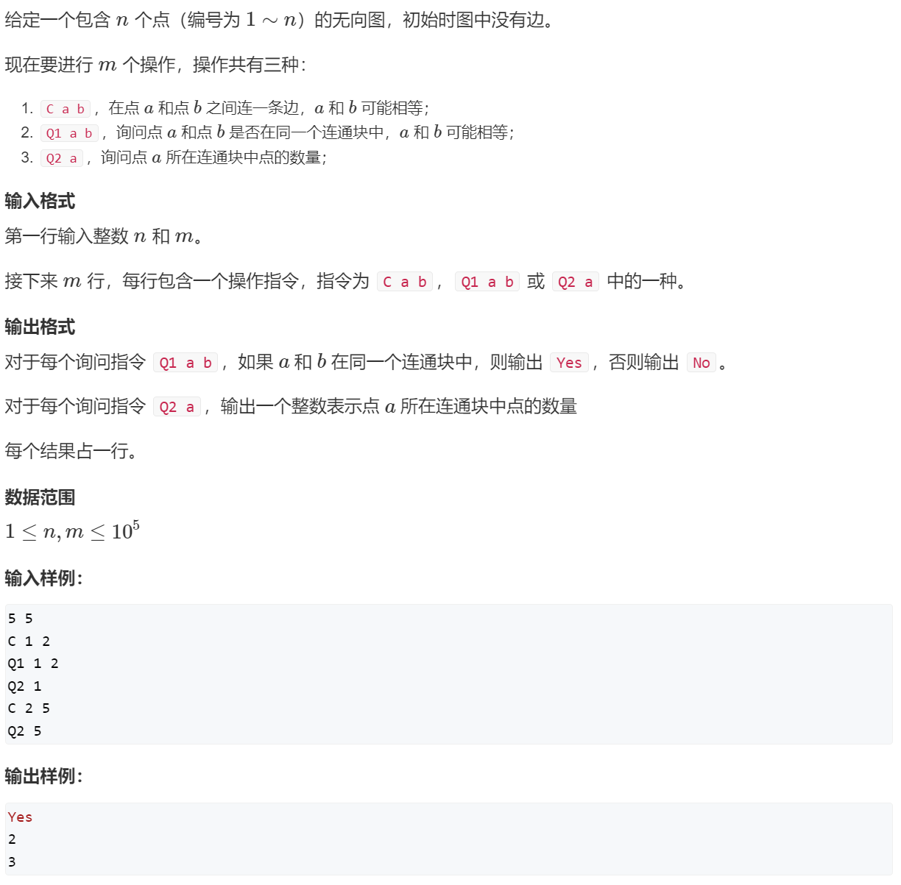

> **维护 size 的并查集**
> 
> 在朴素并查集基础上，增加一个 `size` 数组。`size[i]` 仅在 `i` 是根节点时有意义，表示该集合的大小。合并时，将小集合合并到大集合（按秩合并，可选），并将 `size` 值相加。


> 写法1


```cpp
#include <iostream>

using namespace std;

const int N = 100010;

//只有根节点的s能代表集合的节点数量，所以s中括号里一般都要有find函数先找出根节点
int p[N], s[N];

int find(int x) {
    if (p[x] != x) p[x] = find(p[x]);
    return p[x];
}

int main() {
    int n, m;
    cin >> n >> m;
    for (int i = 1; i <= n; i++) {
        p[i] = i;
        s[i] = 1;
    }
    while (m--) {
        string op;
        int a, b;
        cin >> op;
        if (op == "C") {
            cin >> a >> b;
            if (find(a) == find(b)) continue;
            s[find(b)] += s[find(a)]; //先加size
            p[find(a)] = find(b);//再连
        } else if (op == "Q1") {
            cin >> a >> b;
            if (find(a) == find(b)) cout << "Yes" << endl;
            else cout << "No" << endl;
        } else {
            cin >> a;
            cout << s[find(a)] << endl;
        }
    }
    return 0;
}
```


> 写法2


```c++
#include <cstdio>
#include <iostream>
using namespace std;

const int N = 1e5 + 5;

// p[i] 表示节点 i 的父节点（并查集的父指针）
// sz[i] 表示以 i 为根的集合大小（仅对根节点有效）
int p[N], sz[N];

// 初始化：每个节点单独成集合，父节点指向自己，大小为 1
void init() {
  for (int i = 0; i < N; i++) {
    p[i] = i;  // 初始父节点为自己
  }
  // 将 sz 数组全部填充为 1（每个单独节点的集合大小为 1）
  fill(sz, sz + N, 1);
}

// 查找函数（带路径压缩）：返回节点 x 的根节点
// 同时把沿途节点直接挂到根上，以加速后续查询
int find(int x) {
  if (x == p[x]) {
    return x;  // x 本身就是根
  } else {
    // 递归查找并压缩路径
    return p[x] = find(p[x]);
  }
}

int main() {
  // op 用于存储操作类型字符串，比如 "C"、"Q1"、"Q2"
  char op[5];
  init();
  int n, m, a, b;
  scanf("%d%d", &n, &m);

  while (m--) {
    scanf("%s", op);

    if (op[0] == 'C') {
      // 合并操作：C a b
      // 把 a 所在集合合并到 b 所在集合（不使用按秩合并，仅把 a 的根接到 b
      // 的根）
      scanf("%d%d", &a, &b);
      a = find(a);
      b = find(b);
      if (a == b) {
        // 已经在同一集合中，直接跳过
        continue;
      } else {
        // 先把 b 的集合大小增加 a 的集合大小
        sz[b] += sz[a];
        // 再把 a 的根指向 b 的根（合并）
        p[a] = b;
      }

    } else if (op[1] == '1') {
      // 查询连通性：Q1 a b（注意 op[1] == '1' 用来判断是否为 Q1）
      scanf("%d%d", &a, &b);
      a = find(a);
      b = find(b);
      if (a == b) {
        printf("Yes\n");
      } else {
        printf("No\n");
      }

    } else {
      // 查询集合大小：Q2 a
      // 读取 a，输出 a 所在集合的大小（通过 sz[find(a)] 获得根节点的大小）
      scanf("%d", &a);
      printf("%d\n", sz[find(a)]);
    }
  }
  return 0;
}
```


</details>


### 6.3 食物链

<details>
<summary><strong>🎯 AcWing 题目与题解</strong></summary>

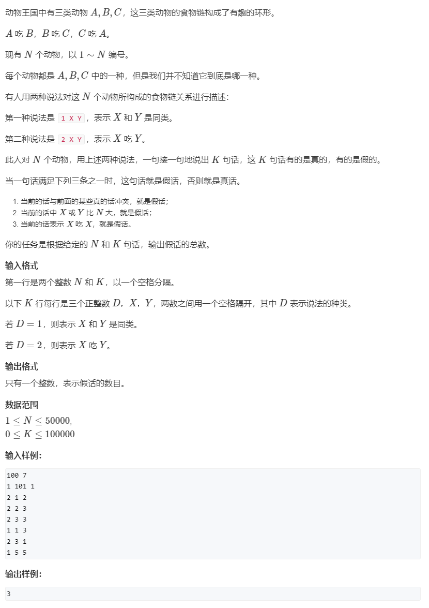


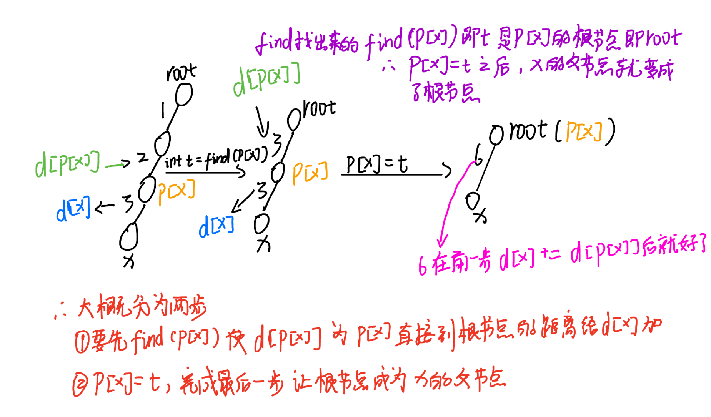


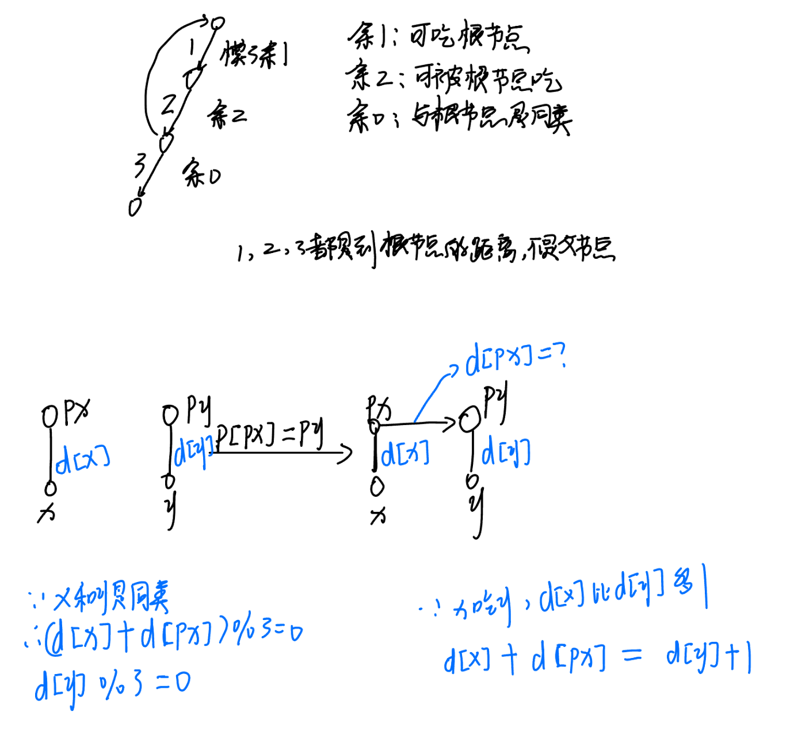


> **带权并查集**：在 `find` 操作中除了维护父节点，还维护一个权值 `d[x]`，表示 `x` 到其父节点 `p[x]` 的某种关系（如距离、种类差异）。路径压缩时，`d[x]` 也要相应更新，`d[x] = d[x] + d[p[x]]`。本题中，`d[x] % 3` 表示 `x` 相对于根节点的种类：0-同类, 1-吃根, 2-被根吃。


> 题解代码（注释版）：

```cpp
#include <iostream>

using namespace std;

const int N = 50010;

//d[x]表示x到父节点的距离，p[x]表示x的父节点
int p[N], d[N];

/*int find(int x)函数两个作作用：
1.使根节点成为x的父节点，并返回x的根节点
2.将d[x]即x到父节点的距离变为x到根节点的距离*/
int find(int x) {
    if (p[x] != x) {
        int t = find(p[x]);
        //find完之后，p[x]直接连接根节点了，d[p[x]]是x的父节点p[x]到根节点的距离，即：
        /*x到根节点的距离 = x到父节点的距离 + 父节点到根节点的距离
        d[x] = d[x] + d[p[x]];*/
        //如果不先find那么d[p[x]]就是x的父节点p[x]到父节点的距离，就不一定是p[x]到根节点的距离，即：
        /*x到根节点的距离 = x到父节点的距离 + 父节点到父节点的距离
        d[x] = d[x] + d[p[x]];*/
        //因为find完之后p[x]的子节点就是x，父节点就是根节点0
        d[x] += d[p[x]];//这步进行完d[x]是没错的了，就是x到根节点的总距离
        //这步再把x的父节点改为根节点，取代之前x和根节点之间的父节点，这样x和根节点就是距离也没错也是直接连接的了
        p[x] = t;
    }
    return p[x];
}

int main() {
    int n, m;
    cin >> n >> m;
    for (int i = 1; i <= n; i++) p[i] = i;
    int res = 0;
    while (m--) {
        int t, x, y;
        cin >> t >> x >> y;
        //1.X或Y比N大，假话
        if ( x > n || y > n) res++;
        else {
            //为什么px一定要等于py也就是x和y为什么一定要在一个集合内呢
            //如果不在同一个集合内，就无法正确地模拟食物链的关系。因为在同一个集合内，才能通过距离数组 d 来维护元素之间的食物链关系，并查集核心思想也是要在一个集合内
            int px = find(x), py = find(y);
            if (t == 1) { //此时t == 1，表示已经告诉我们x和y是同类
                //在一个树上并且x和y不是同类即(d[x] - d[y])%3余1或余2，假话+1
                if (px == py &&
                        (d[x] - d[y]) % 3) res++; //注意此时已经经过了find函数所以d[x]是x到根节点的距离
                else if (px !=
                         py) { //当x和y不在一个集合内时把他们合并，注意if条件不要漏，不要直接else，是只有x和y不在一个集合时才要合并
                    p[px] = py;
                    d[px] = d[y] - d[x];//1式
                }
            } else { //此时告诉我们x吃y
                //在一个树上并且x不吃y即(d[x] - d[y] - 1)%3不等于0，假话+1
                if (px == py && (d[x] - d[y] - 1) % 3) res++;
                else if (px !=
                         py) { //当x和y不在一个集合内时把他们合并，注意if条件不要漏，不要直接else，是只有x和y不在一个集合时才要合并
                    p[px] = py;
                    d[px] = d[y] + 1 - d[x]; //2式，1式和2式具体思路看图
                }
            }
        }
    }
    cout << res << endl;
    return 0;
}
```
> 题解代码（简洁版）：

```c++
//简洁版
#include <iostream>

using namespace std;

const int N = 50010;

int p[N],d[N];

int find(int x){
	if(p[x] != x){
		int t= find(p[x]);
		d[x]+=d[p[x]];
		p[x] = t;
	}
	return p[x];
}

int main(){
	int n,m;
	cin>>n>>m;
	for(int i = 1; i <= n ; i++) p[i] = i;
	int res = 0;
	while(m--){
		int op,x,y;
		cin>>op>>x>>y;
		if(x > n ||y > n) res++;
		else{
			int px = find(x),py = find(y);
			if(op == 1){
				if( px == py && (d[x]-d[y])%3) res++;
				else if(px != py){
					p[px] = py;
					d[px] = d[y]-d[x]; 
				}
			}
			else{
				if( px == py && (d[x]-d[y]-1)%3) res++;
				else if(px != py){
					p[px] = py;
					d[px] = d[y]-d[x] + 1; 
				}
			}
		}
	}
	cout<<res<<endl;
	return 0;
}
```


</details>

---

## ⛰️ 7. 堆

> **核心思想**：堆（Heap）是一种特殊的完全二叉树，满足 **堆性质**：父节点的值总是大于等于（大顶堆）或小于等于（小顶堆）其子节点的值。它常用于实现优先队列，可以 O(1) 获取最值，O(log n) 插入和删除。核心操作是 `down` (下沉) 和 `up` (上浮)，用于维护堆性质。

> **堆操作模板 (小顶堆)**
>
> - **下沉 (down)**: 将一个节点与其较小的子节点交换，直到满足堆性质。
> - **上浮 (up)**: 将一个节点与其父节点交换，直到满足堆性质。
> - **插入**: 在末尾加入元素，然后上浮。
> - **删除堆顶**: 用末尾元素替换堆顶，然后下沉。


### 7.0 洛谷题单

| 来源 | 题目/题单                                | 说明             |
| ---- | ---------------------------------------- | ---------------- |
| 洛谷 | https://www.luogu.com.cn/problem/P3378   | P3378 【模板】堆 |
| 洛谷 | https://www.luogu.com.cn/training/12191  | 堆（题单）       |
| 洛谷 | https://www.luogu.com.cn/training/168012 | 堆（题单）       |

### 7.1 堆排序

<details>
<summary><strong>🔗 练习平台</strong></summary>

- **洛谷**: [P3378 【模板】堆](https://www.luogu.com.cn/problem/P3378)

</details>

<details>
<summary><strong>🎯 AcWing 题目与题解</strong></summary>

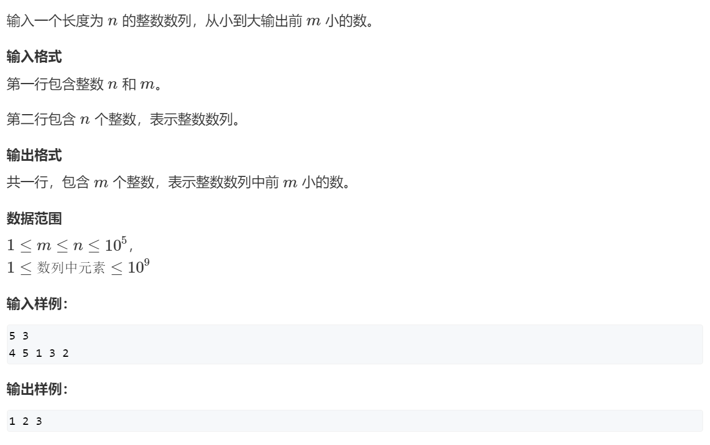


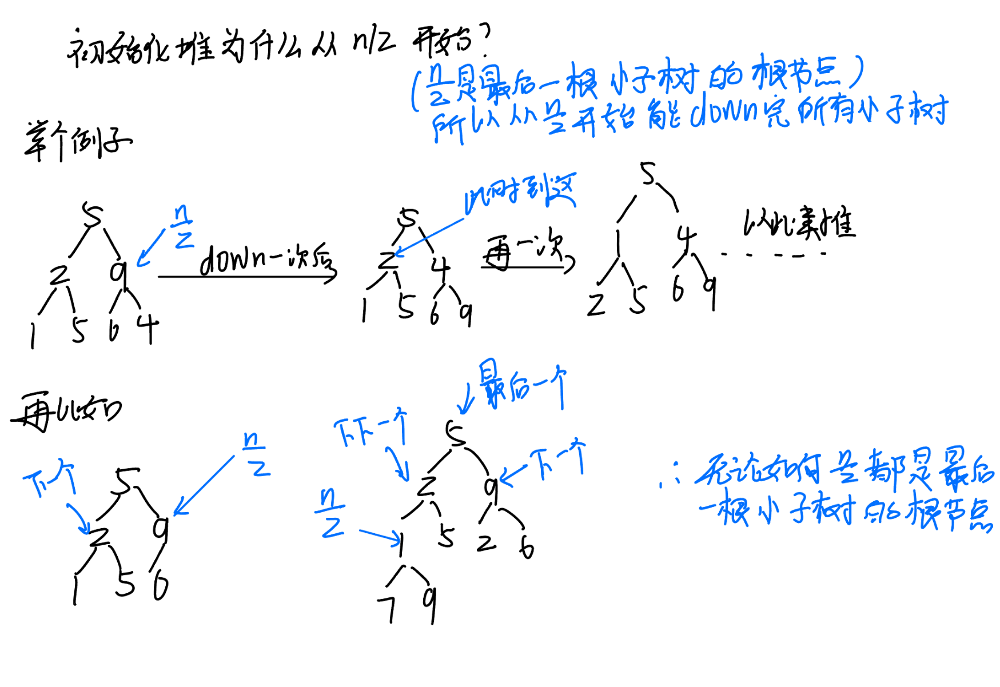


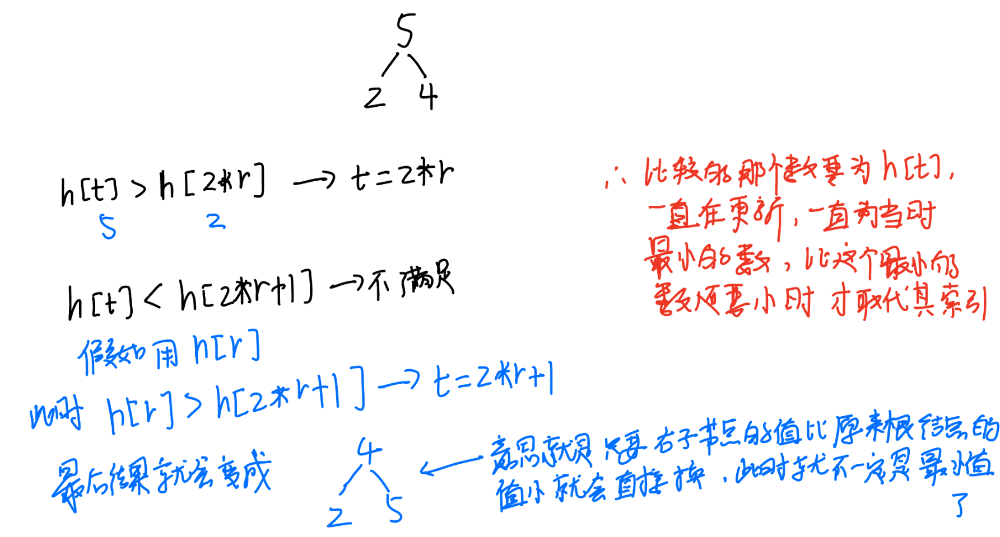


> **堆排序思路 (小顶堆)**
>
> 1.  **建堆**: 从最后一个非叶子节点 (`n/2`) 开始，倒序对每个节点执行 `down` 操作，建成小顶堆。
> 2.  **排序**: 重复 `n` 次：
>     -   取出堆顶（最小值）。
>     -   将最后一个元素放到堆顶。
>     -   堆大小减一，对新堆顶执行 `down` 操作。


```cpp

//小顶堆：1.根节点小于等于两个子节点；2.假如根节点的索引为x，则左子节点索引为2x，右为2x+1；3.堆在几何意义上是一颗完全二叉树

#include<iostream>
#include<algorithm>

using namespace std;

const int N = 100010;

int h[N], se;//se是数组长度size

int n, m;

void down(int r) {
    int t = r;
    //一定要用h[t]比较，如上图
    if (2 * r <= se && h[2 * r] < h[t])//先跟左子节点比
        t = 2 * r;
    if (2 * r + 1 <= se && h[2 * r + 1] < h[t])//再跟右子节点比
        t = 2 * r + 1;
    if (r != t) {
        swap(h[r], h[t]);//跟最后比出来的最小的那个结点换值
        /*为什么要在if (r != t)里面down(t)，而不是这个函数的最后或其他位置：因为当r == t时，根节点就是最小值，也就是之前t没被赋索引；如果t被赋索引了，此时t是两个子节点中最小的那一个，因为这个最小的值被这个小子树的根节点换走了，所以此时这个子节点的值就是根结点的值，是比原来的值更大的，所以以这个子节点为根节点的子树可能就不满足小顶堆了，所以要再down一下，同理，到了以这个子节点为根节点的小子树如果也是这种情况也要继续再down，以此类推。*/
        down(t);
    }
}

int main() {
    cin >> n >> m;
    se = n;
    for (int i = 1; i <= n; i++) cin >> h[i];
    //使数组成为堆，即初始化堆
    for (int i = n / 2; i > 0; i--) down(i);

    while (m--) {
        cout << h[1] << " ";
        h[1] = h[se--];
        down(1);
    }

    return 0;
}
```
</details>

### 7.2 P3378 【模板】堆


<details>
<summary><strong>🔗 P3378 【模板】堆</strong></summary>

- **洛谷**: [P3378 【模板】堆](https://www.luogu.com.cn/problem/P3378)

> **代码实现**

```cpp
#include<iostream>
using namespace std;
const int N = 1e6 + 5;
int heap[N];
int sz; // size的缩写，表示当前堆的大小
// 小顶堆
void down(int pos) {
    int temp = heap[pos];
    for (int i = 2 * pos; i <= sz; i = 2 * pos) {
        if (i < sz && heap[i] > heap[i + 1]) {
            i++;
        }
        if (heap[i] > temp) {
            break;
        } else {
            heap[pos] = heap[i];
            pos = i;
        }
    }
    heap[pos] = temp;
}
void up(int pos) {
    while (pos / 2 && heap[pos] < heap[pos / 2]) {
        swap(heap[pos], heap[pos / 2]);
        pos /= 2;
    }
}
int main() {
    int n, op, x;
    scanf("%d", &n);
    while (n--) {
        scanf("%d", &op);
        switch (op) {
            case 1:
                scanf("%d", &x);
                heap[++sz] = x;
                up(sz);
                break;
            case 2:
                printf("%d\n", heap[1]);
                break;
            case 3:
                heap[1] = heap[sz];
                sz--;
                down(1);
                break;
        }
    }
    return 0;
}
```
</details>


### 7.3 模拟堆（复杂操作）

<details>
<summary><strong>🎯 AcWing 题目与题解</strong></summary>

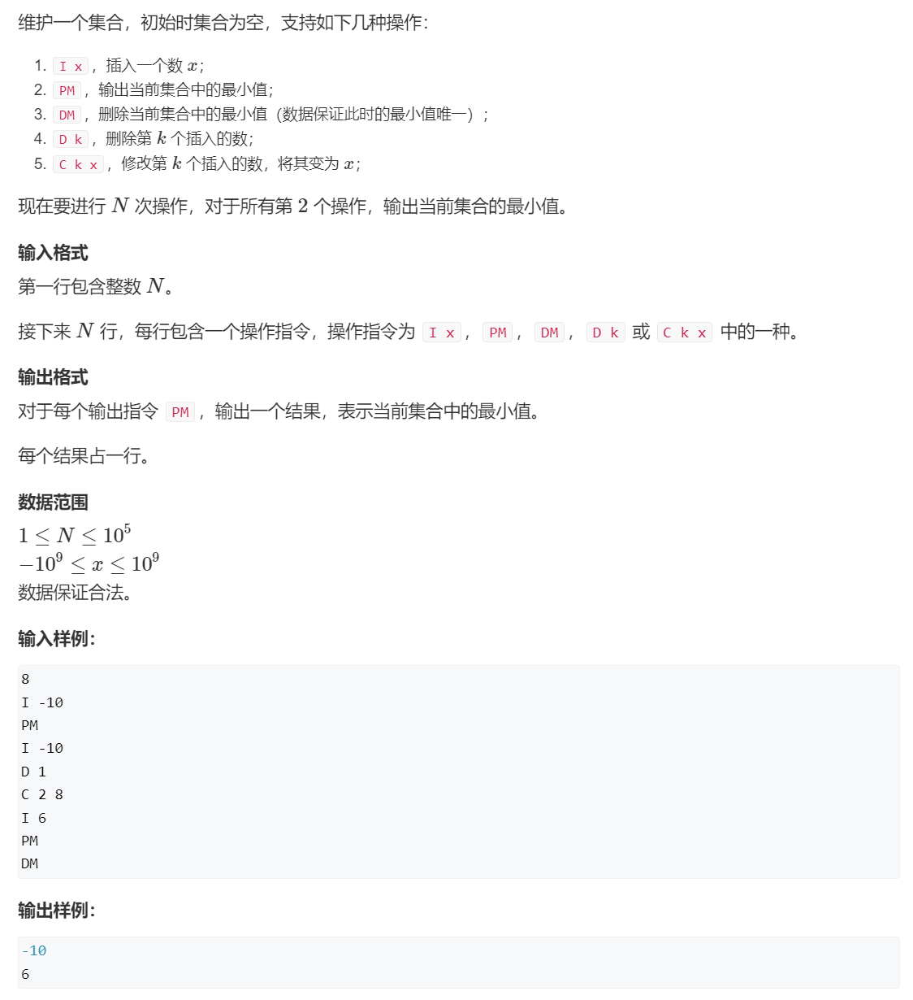


> **解法思路**：为了支持对 **第 k 个插入的数** 进行操作，需要额外的映射关系：
>
> - `ph[k]`: 第 `k` 个插入的数在堆 `h` 中的下标。
> - `hp[i]`: 堆中下标为 `i` 的元素是第几个插入的。
>
> `swap` 操作需要同时维护 `h`, `ph`, `hp` 三个数组的映射关系。删除和修改任意元素，都可定位到其在堆中的位置，交换到堆尾再删除，或直接修改后执行 `up` 和 `down` 调整。

```cpp
#include<iostream>
#include<algorithm>

using namespace std;

const int N = 100010;

//ph存储堆中的下标，ph是插入顺序数组
//hp存储元素的插入顺序，h存储的是元素的值，h和hp都是堆数组
//se表示size，插入点在堆中的下标
int h[N], ph[N], hp[N], se;

//参数是堆中的下标
void heap_swap(int a, int b) {
    swap(ph[hp[a]], ph[hp[b]]);//交换堆中的下标
    /*上面这一步是交换堆中的下标，为什么不能直接交换a和b：首先，是因为交换a和b会影响后面两个交换。
    但是这么交换的实际意思是：只是交换了ph数组中对应a和b的那个值，所以这样既正确修改了映射，又没影响到a和b*/
    swap(hp[a], hp[b]);//交换插入顺序
    swap(h[a], h[b]);//交换值
}

void down(int r) {
    int t = r;
    if (r * 2 <= se && h[r * 2] < h[t]) t = r * 2;
    if (r * 2 + 1 <= se && h[r * 2 + 1] < h[t]) t = r * 2 + 1;
    if (r != t) {
        heap_swap(r, t);
        down(t);
    }
}
void up(int u) {
    //只要保证比根结点的值大就行了
    while (u / 2 && h[u] < h[u / 2]) { //此节点索引为u，根节点为u/2
        heap_swap(u / 2, u);
        u /= 2;//下次循环再跟根节点的根节点比...以此类推
    }
}

int main() {
    int m;
    cin >> m;
    int n = 0;//n表示插入的第几个数
    while (m--) {
        string op;
        int k, x;
        cin >> op;
        //1.插入一个数x
        if (op == "I") {
            cin >> x;
            n++;
            se++;//se表示在堆中的下标
            h[se] = x;
            hp[se] = n;
            ph[hp[se]] = se;
            up(se);//新插入的值浮上去，注意这点易忘
        }
        //2.输出当前集合中的最小值
        else if (op == "PM") cout << h[1] << endl;
        //3.删除当前集合中的最小值
        else if (op == "DM") {
            heap_swap(1,
                      se); //删除操作都是通过交换实现，删除完要进行沉或者浮
            se--;
            down(1);
        }
        //4.删除第k个插入的数
        else if (op == "D") {
            cin >> k;
            int u = ph[k];
            heap_swap(u,
                      se); //删除操作都是通过交换实现，删除完要进行沉或者浮
            se--;
            up(u);
            down(u);
        }
        //5.修改第 k个插入的数，将其变为 x
        else if (op == "C") {
            //ph[k]表示第k个数在堆中的下标
            cin >> k >> x;
            h[ph[k]] = x;
            down(ph[k]);
            up(ph[k]);
        }

    }
    return 0;
}
```
</details>


---

## #️⃣ 8. 哈希表

> **核心思想**：哈希表（Hash Table）通过哈希函数将任意键（Key）映射到数组的固定位置（索引），从而实现快速的插入、删除和查找，平均时间复杂度为 O(1)。处理哈希冲突的常用方法有 **拉链法** 和 **开放寻址法**。字符串哈希则是将整个字符串映射为一个整数，用于快速比较两个字符串是否相等。

### 8.0 洛谷题单

| 来源 | 题目/题单                                | 说明                       |
| ---- | ---------------------------------------- | -------------------------- |
| 洛谷 | https://www.luogu.com.cn/problem/T332544 | T332544 【模板】模拟散列表 |
| 洛谷 | https://www.luogu.com.cn/training/379836 | 哈希：从入门到入土（题单） |

### 8.1 模拟散列表

<details>
<summary><strong>🔗 练习平台</strong></summary>

- **洛谷**: [T332544 【模板】哈希表](https://www.luogu.com.cn/problem/T332544)

</details>

<details>
<summary><strong>🎯 AcWing 题目与题解</strong></summary>

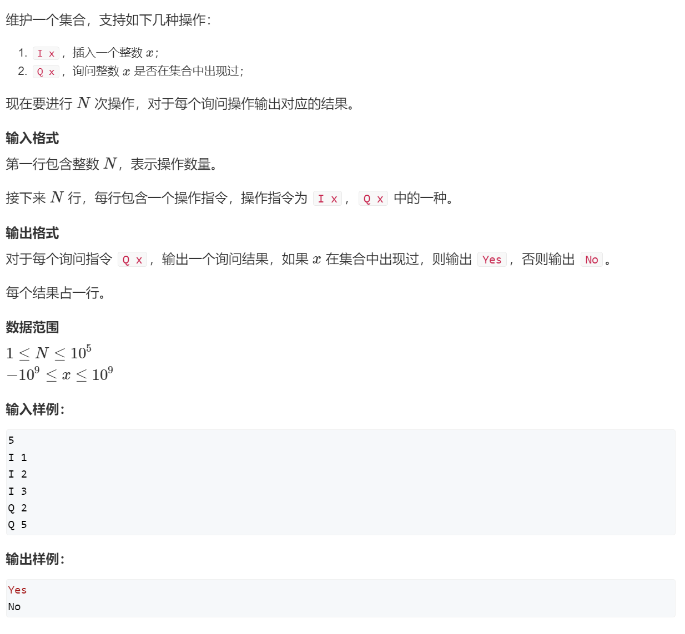

> **拉链法**
> 
> 数组 `h` 存每个哈希槽的链表头节点。`e` 和 `ne` 数组模拟链表，存储冲突的元素。

```cpp
#include <iostream>
#include <cstring>
using namespace std;
const int N = 100003; // 取大于数据范围的第一个质数

int h[N], e[N], ne[N], idx;

void insert(int x) {
    int k = (x % N + N) % N;
    e[idx] = x;
    ne[idx] = h[k];
    h[k] = idx++;
}

bool find(int x) {
    int k = (x % N + N) % N;
    for (int i = h[k]; i != -1; i = ne[i]) {
        if (e[i] == x) return true;
    }
    return false;
}

int main() {
    int n;
    cin >> n;
    memset(h, -1, sizeof h);
    while (n--) {
        char op;
        int x;
        cin >> op >> x;
        if (op == 'I') insert(x);
        else {
            if (find(x)) cout << "Yes" << endl;
            else cout << "No" << endl;
        }
    }
    return 0;
}
```

> **开放寻址法**
> 
> 只用一个数组 `h`。遇到冲突时，向后探测（`k++`）直到找到空位。数组大小通常要开到数据量的2-3倍。

```cpp
#include <cstring>
#include <iostream>
using namespace std;
const int N = 200003; // 通常开2-3倍大小
const int null = 0x3f3f3f3f;

int h[N];

int find(int x) {
    int k = (x % N + N) % N;
    while (h[k] != null && h[k] != x) {
        k++;
        if (k == N) k = 0;
    }
    return k;
}

int main() {
    int n;
    cin >> n;
    memset(h, 0x3f, sizeof(h));
    while (n--) {
        char op;
        int x;
        cin >> op >> x;
        int k = find(x);
        if (op == 'I') {
            h[k] = x;
        } else {
            if (h[k] != null) cout << "Yes" << endl;
            else cout << "No" << endl;
        }
    }
    return 0;
}
```
</details>


### 8.2 字符串哈希

<details>
<summary><strong>🎯 AcWing 题目与题解</strong></summary>

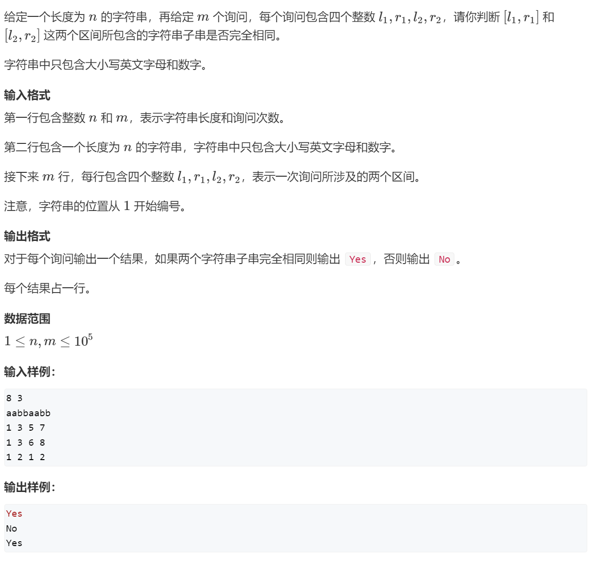

> **字符串哈希公式**
> 将字符串看作 P 进制数，`h[i]` 存储前 `i` 个字符的哈希值。
> ```c++
> h[i] = h[i-1] * P + str[i]
> get(l, r) = h[r] - h[l-1] * p[r-l+1]
> ```
> `p[k]` 预处理 `P^k` 的值。使用 `unsigned long long` 可自动处理取模 `2^64`。

```cpp
#include <iostream>
using namespace std;
typedef unsigned long long ULL;
const int N = 100010, P = 131; // P=131 或 13331

char str[N];
ULL h[N], p[N];

ULL get(int l, int r) {
    return h[r] - h[l - 1] * p[r - l + 1];
}

int main() {
    int n, m;
    scanf("%d%d%s", &n, &m, str + 1); // 字符串从1开始存
    
    p[0] = 1;
    for (int i = 1; i <= n; i++) {
        p[i] = p[i - 1] * P;
        h[i] = h[i - 1] * P + str[i];
    }
    
    while (m--) {
        int l1, r1, l2, r2;
        scanf("%d%d%d%d", &l1, &r1, &l2, &r2);
        if (get(l1, r1) == get(l2, r2)) puts("Yes");
        else puts("No");
    }
    return 0;
}
```

</details>

---

## 🛠️ 9. C++ STL简介

> **核心思想**：STL (Standard Template Library) 是 C++ 的标准库，提供了一套强大的、可复用的组件，包括容器、算法和迭代器。熟练使用 STL 可以极大地提高编程效率和代码质量。

### 9.0 洛谷题单

| 来源 | 题目/题单                                | 说明                 |
| :--- | :--------------------------------------- | :------------------- |
| 洛谷 | https://www.luogu.com.cn/training/475184 | STL容器-练习（题单） |
| 洛谷 | https://www.luogu.com.cn/training/51437  | STL超级作业（题单）  |

### 9.1 常用STL容器

-   **`vector`**: 变长数组/动态数组。
    -   `push_back()`, `pop_back()`, `size()`, `empty()`, `clear()`, `begin()`, `end()`, `[]`

-   **`pair<T1, T2>`**: 对组，常用于存储二元组。
    -   `first`, `second`，支持字典序比较。

-   **`string`**: 字符串类。
    -   `size()`, `length()`, `empty()`, `clear()`, `substr()`, `c_str()`

-   **`queue`**: 队列 (FIFO)。
    -   `push()`, `pop()`, `front()`, `back()`, `size()`, `empty()`

-   **`priority_queue`**: 优先队列 (默认大顶堆)。
    -   `push()`, `pop()`, `top()`, `size()`, `empty()`
    -   小顶堆: `priority_queue<int, vector<int>, greater<int>> q;`

-   **`stack`**: 栈 (LIFO)。
    -   `push()`, `pop()`, `top()`, `size()`, `empty()`

-   **`deque`**: 双端队列，支持两端的高效插入删除。

-   **有序集合/映射 (基于红黑树, O(log n))**:
    -   **`set`**: 存储不重复元素的有序集合。
    -   **`map`**: 存储键值对 `(key-value)` 的有序映射，键唯一。
    -   **`multiset`**: 允许元素重复的 `set`。
    -   **`multimap`**: 允许键重复的 `map`。
    -   常用操作: `insert()`, `erase()`, `find()`, `count()`, `lower_bound()`, `upper_bound()`.

-   **无序集合/映射 (基于哈希表, 平均 O(1))**:
    -   **`unordered_set`**, **`unordered_map`**, **`unordered_multiset`**, **`unordered_multimap`**
    -   功能类似有序版本，但内部无序，不支持 `lower/upper_bound`。

-   **`bitset`**: 位图，用于高效地存储和操作二进制位。
    -   支持位运算 `~, &, |, ^, >>, <<`。
    -   `count()`: 1的个数。`any()`: 是否有1。`none()`: 是否全0。`set()`, `reset()`, `flip()`.
