<p align="center">
  
</p>


<p align="center">
  
</p>


<p align="center">
  
</p>


<p align="center">
  
</p>


<p align="center">
  
  
  
  
</p>


> "Mathematics is the queen of the sciences—and number theory is the queen of mathematics." -- Carl Friedrich Gauss
>
> ---
>
> 本笔记为 **第四讲 · 数学知识** 的 C++ 模板与题解，内容涵盖质数、约数、欧拉函数、快速幂、扩展欧几里得、组合计数、容斥原理与博弈论等算法竞赛中的核心数学工具。
>
> ---
>
> 在算法的世界里，数学知识是那座连接问题与最优解的桥梁。从判断一个数的素性，到求解复杂的组合问题，每一个概念都是一块坚实的基石。本章将引导你探索数字背后的奥秘，掌握那些能让代码效率产生质的飞跃的数学技巧，将抽象的理论转化为解决实际问题的强大武器。

---

## 📋 本章目录

[[toc]]

<!-- * [🧮 第四讲 数学知识](#-第四讲-数学知识)
  * [📚 0. 总、杂](#-0-总杂)
  * [✨ 1. 质数](#-1-质数)
    * [📜 1.0 洛谷 & LeetCode 题单](#-10-洛谷--leetcode-题单)
    * [🔍 1.1 试除法判定质数](#-11-试除法判定质数)
    * [🧩 1.2 分解质因数](#-12-分解质因数)
    * [⏳ 1.3 筛质数](#-13-筛质数)
  * [📏 2. 约数](#-2-约数)
    * [📜 2.0 洛谷 & 牛客题单](#-20-洛谷--牛客题单)
    * [🔍 2.1 试除法求约数](#-21-试除法求约数)
    * [➕ 2.2 约数个数和约数之和](#-22-约数个数和约数之和)
    * [🤝 2.3 最大公约数 (GCD)](#-23-最大公约数-gcd)
  * [φ 3. 欧拉函数](#-3-欧拉函数)
    * [📜 3.0 洛谷 & 牛客题单](#-30-洛谷--牛客题单)
    * [📝 3.1 定义法求欧拉函数](#-31-定义法求欧拉函数)
    * [⏳ 3.2 筛法求欧拉函数](#-32-筛法求欧拉函数)
    * [👑 3.3 欧拉定理和费马小定理](#-33-欧拉定理和费马小定理)
  * [🚀 4. 快速幂](#-4-快速幂)
    * [📜 4.0 洛谷 & 牛客题单](#-40-洛谷--牛客题单)
    * [⚡ 4.1 快速幂](#-41-快速幂)
    * [🔄 4.2 快速幂求逆元](#-42-快速幂求逆元)
  * [📐 5. 扩展欧几里得算法](#-5-扩展欧几里得算法)
    * [📜 5.0 洛谷题单](#-50-洛谷题单)
    * [✒️ 5.1 扩展欧几里得算法](#-51-扩展欧几里得算法)
    * [⛓️ 5.2 线性同余方程](#-52-线性同余方程)
  * [🇨🇳 6. 中国剩余定理 (*)](#-6-中国剩余定理-)
    * [📜 6.0 洛谷 & 牛客题单](#-60-洛谷--牛客题单)
    * [❓ 6.1 表达整数的奇怪方式](#-61-表达整数的奇怪方式)
    * [📜 6.2 中国剩余定理（纯模板）](#-62-中国剩余定理纯模板)
  * [🌀 7. 高斯消元 (*)](#-7-高斯消元-)
    * [📜 7.0 洛谷 & 牛客题单](#-70-洛谷--牛客题单)
    * [🔢 7.1 高斯消元解线性方程组](#-71-高斯消元解线性方程组)
    * [💡 7.2 高斯消元解异或线性方程组](#-72-高斯消元解异或线性方程组)
  * [🎲 8. 求组合数](#-8-求组合数)
    * [📜 8.0 洛谷 & 牛客题单](#-80-洛谷--牛客题单)
    * [🪜 8.1 方法一：递推法](#-81-方法一递推法)
    * [🏭 8.2 方法二：预处理阶乘和逆元](#-82-方法二预处理阶乘和逆元)
    * [🌟 8.3 方法三：卢卡斯定理 (Lucas Theorem)](#-83-方法三卢卡斯定理-lucas-theorem)
    * [🔬 8.4 方法四：高精度计算](#-84-方法四高精度计算)
    * [🌳 8.5 卡特兰数](#-85-卡特兰数)
  * [∪∩ 9. 容斥原理](#-9-容斥原理)
    * [📜 9.0 洛谷题单](#-90-洛谷题单)
    * [✅ 9.1 能被整除的数](#-91-能被整除的数)
  * [🕹️ 10. 博弈论](#-10-博弈论)
    * [📜 10.0 洛谷 & LeetCode 题单](#-100-洛谷--leetcode-题单)
    * [🗿 10.1 Nim 游戏](#-101-nim-游戏)
    * [🪜 10.2 台阶-Nim 游戏](#-102-台阶-nim-游戏)
    * [🧩 10.3 集合-Nim 游戏 (SG 函数)](#-103-集合-nim-游戏-sg-函数)
    * [💥 10.4 拆分-Nim 游戏 (SG 函数)](#-104-拆分-nim-游戏-sg-函数) -->

---

# 🧮 第四讲 数学知识

## 📚 0. 总、杂

| 来源 | 题目/题单                                | 说明                         |
| :--- | :--------------------------------------- | :--------------------------- |
| 洛谷 | https://www.luogu.com.cn/training/637552 | 质数，约数，欧拉函数，快速幂（题单） |
| 洛谷 | https://www.luogu.com.cn/training/17933  | 初等数论（题单）             |
| 洛谷 | https://www.luogu.com.cn/training/234164 | 数论专题 I（题单）           |
| 洛谷 | https://www.luogu.com.cn/training/236965 | 数论专题 II（题单）          |


## ✨ 1. 质数

> **核心思想**：质数，又称素数，是指在大于1的自然数中，除了1和它自身以外不再有其他因数的自然数。质数是数论的基石，相关的算法包括质数的判定、分解质因数以及高效地筛选出一定范围内的所有质数。


### 📜 1.0 洛谷 & LeetCode 题单

| 来源 | 题目/题单 | 说明 |
| :--- | :--- | :--- |
| leetcode | [204. 计数质数](https://leetcode.cn/problems/count-primes/) | 计数质数 |
| 牛客 | [判断质数_牛客题霸_牛客网](https://www.nowcoder.com/practice/9f418ff48b5e4e879f398352bed6118d) | **判断质数** |
| 牛客 | [分解质因数_牛客题霸_牛客网](https://www.nowcoder.com/practice/35723516d6f841ca8869ecbcf3ddacaf) | **分解质因数** |
| 牛客 | [筛法判断质数_牛客题霸_牛客网](https://www.nowcoder.com/practice/8afab457ef11456d8602ce6dc30db776) | **筛法判断质数** |
| 洛谷 | [P3383 【模板】线性筛素数](https://www.luogu.com.cn/problem/P3383) | P3383 【模板】线性筛素数 |
| 洛谷 | [P1075 [NOIP 2012 普及组] 质因数分解](https://www.luogu.com.cn/problem/P1075) | P1075 质因数分解 |
| 洛谷 | [https://www.luogu.com.cn/training/436457](https://www.luogu.com.cn/training/436457) | 质数题目大全（题单） |
| 洛谷 | [https://www.luogu.com.cn/training/689368](https://www.luogu.com.cn/training/689368) | 质数与筛法练习（题单） |


### 🔍 1.1 试除法判定质数

> **解法思路**：
>
> 判断一个数 `x` 是否为质数，最直观的方法是**试除法**。
>
> 1.  **基本原理**：检查从 `2` 到 `x-1` 是否有数能整除 `x`。
> 2.  **优化**：一个数的因数总是成对出现的。如果 `i` 是 `x` 的一个因数，那么 `x/i` 也是。其中一个必然小于等于 `sqrt(x)`，另一个大于等于 `sqrt(x)`。因此，我们只需要检查从 `2` 到 `sqrt(x)` 的数即可。
> 3.  **代码实现**：循环条件 `i <= x / i` 等价于 `i * i <= x`，但可以有效避免 `i*i` 溢出。
> 4.  **时间复杂度**：O(√n)。


<strong>🔗 练习平台</strong>


| 来源 | 题目/题单 | 说明 |
| :--- | :--- | :--- |
| 牛客 | [判断质数_牛客题霸_牛客网](https://www.nowcoder.com/practice/9f418ff48b5e4e879f398352bed6118d) | **判断质数** |
| 洛谷 | https://www.luogu.com.cn/problem/T409608 | T409608 【模板】试除法判断质数 |
| 洛谷 | https://www.luogu.com.cn/problem/U203147 | U203147 试除法判定质数 |
| 洛谷 | [https://www.luogu.com.cn/training/384711](https://www.luogu.com.cn/training/384711) | 判断质数（题单） |
| 洛谷 | [https://www.luogu.com.cn/training/436457](https://www.luogu.com.cn/training/436457) | 质数题目大全（题单） |


<details>
<summary><strong>🎯 AcWing 题目与题解</strong></summary>

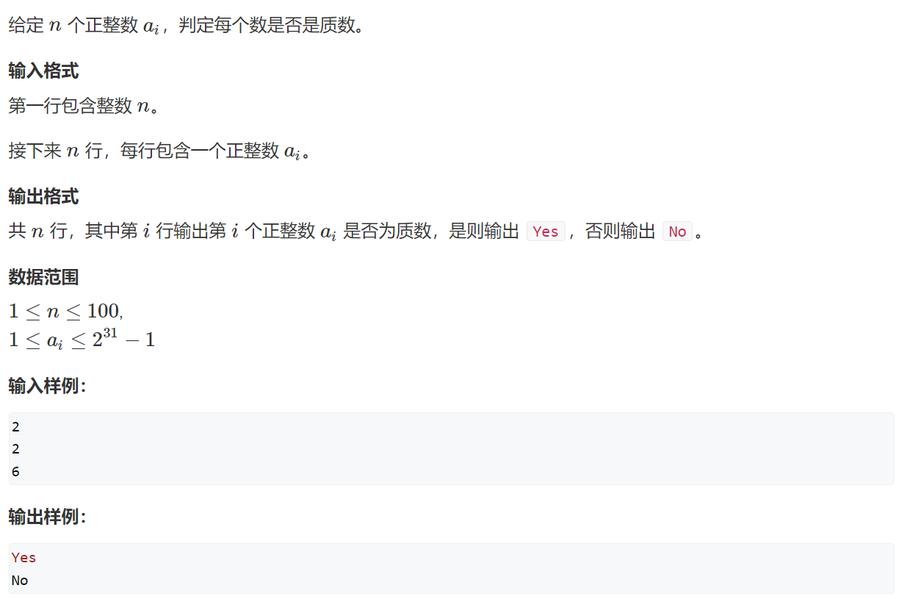


> **核心代码函数**

```c++
bool is_prime(int x)
{
    if (x < 2) return false;
    for (int i = 2; i <= x / i; i ++ )
        if (x % i == 0)
            return false;
    return true;
}
```

> **AcWing 题解**

```cpp
#include <iostream>
#include <algorithm>

using namespace std;

bool is_prime(int x)
{
    if (x < 2) return false;
    // x 的一个更小的因子为 i ，另一个更大的因子为 x / i ，遍历所有更小的因子即可
    for (int i = 2; i <= x / i; i ++ )
        if (x % i == 0)
            return false;
            
    return true;
}

int main()
{
    int n;
    cin >> n;

    while (n -- )
    {
        int x;
        cin >> x;
        if (is_prime(x)) puts("Yes");
        else puts("No");
    }

    return 0;
}
```
</details>

### 🧩 1.2 分解质因数


> [!note]
>
> **重要性质**：一个正整数`n`中最多只包含`一个`大于$\sqrt(n)$的质因数
>
> **解法思路**：
>
> 同样利用试除法，从 `2` 开始依次尝试 `x` 的质因子。
>
> 1.  **遍历**：从 `i = 2` 循环到 `x / i`。
> 2.  **提取因子**：如果 `i` 能整除 `x`，说明 `i` 是 `x` 的一个质因子。用一个 `while` 循环将 `x` 中所有的因子 `i` 除尽，并计数。
> 3.  **正确性**：因为我们是从小到大枚举 `i`，所以当找到一个因子 `i` 时，它一定是质数。因为如果 `i` 是合数，它的质因子（比 `i` 小）必然在之前就被除尽了。
> 4.  **特殊情况**：循环结束后，如果 `x > 1`，说明剩下的 `x` 是一个大于 `sqrt(原x)` 的质因子。
> 5.  **时间复杂度**：O(√n)。


<strong>🔗 练习平台</strong>

| 来源 | 题目/题单 | 说明 |
| :--- | :--- | :--- |
| 牛客 | [分解质因数_牛客题霸_牛客网](https://www.nowcoder.com/practice/35723516d6f841ca8869ecbcf3ddacaf) | **分解质因数**                      |
| 洛谷 | https://www.luogu.com.cn/problem/P1075                       | P1075 [NOIP 2012 普及组] 质因数分解 |
| 洛谷 | https://www.luogu.com.cn/problem/T159080                     | T159080 分解质因数                  |
| 洛谷 | https://www.luogu.com.cn/problem/P2043                       | P2043 质因子分解                    |
| 洛谷 | https://www.luogu.com.cn/training/561479                     | 〔Fancy Zone〕质数与约数（题单）    |
| 洛谷 | https://www.luogu.com.cn/training/826945                     | 分解质因数（题单）                  |


<details>
<summary><strong>🎯 AcWing 题目与题解</strong></summary>

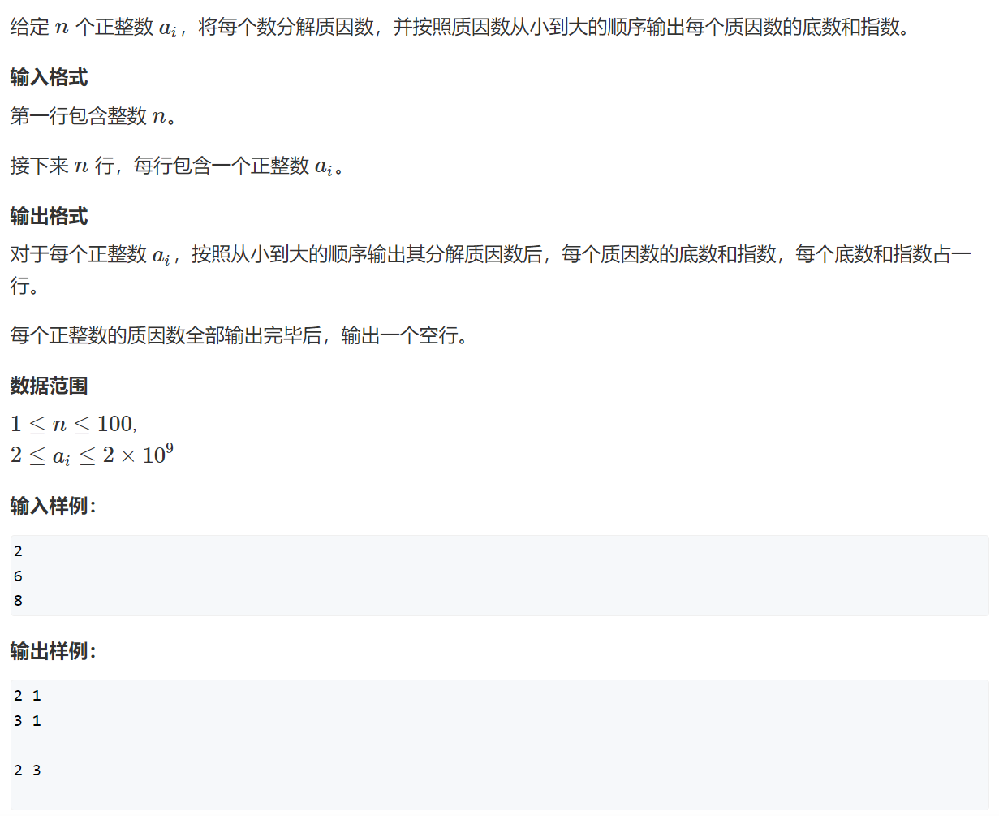


> **核心代码函数**

```c++
void divide(int x)
{
    for (int i = 2; i <= x / i; i ++ )
        if (x % i == 0)
        {
            int s = 0;
            while (x % i == 0) x /= i, s ++ ;
            cout << i << ' ' << s << endl;
        }
    if (x > 1) cout << x << ' ' << 1 << endl;
    cout << endl;
}
```


> **AcWing 题解**

```cpp
#include <iostream>
#include <algorithm>

using namespace std;

void divide(int x)
{
	/*这里遍历的 i 肯定所有都是质数，假如 i 是合数那么 i 肯定也可分解为更小的质数相乘，由于循环是从小到大遍历的
	所以 i 分解的更小的质数肯定是遍历过， x 除过了的，所以不可能遍历到合数*/
	//因最多只有一个大于 sqrt(n) 的质因子，所以先遍历小于 sqrt(n) 的 
    for (int i = 2; i <= x / i; i ++ )
    	//每有一个质因子 
        if (x % i == 0)
        {
            int s = 0;
            while (x % i == 0) x /= i, s ++ ;
            cout << i << ' ' << s << endl;
        }
    //如果最后 x > 1 ，那此时的 x 就是那个大于 sqrt(n) 的质因子 
    if (x > 1) cout << x << ' ' << 1 << endl;
    cout << endl;
}

int main()
{
    int n;
    cin >> n;
    while (n -- )
    {
        int x;
        cin >> x;
        divide(x);
    }

    return 0;
}
```


> 写法2（题目：[分解质因数_牛客题霸_牛客网](https://www.nowcoder.com/practice/35723516d6f841ca8869ecbcf3ddacaf)）：

```c++
#include<iostream>
using namespace std;
void handle(long n) {
    while (n % 2 == 0) {
        printf("2 ");
        n /= 2;
    }
    for (int i = 3; i <= n / i; i += 2) {
        while (n % i == 0) {
            printf("%d ", i);
            n /= i;
        }
    }
    if (n > 1) {
        printf("%ld ", n);
    }
}
int main () {
    long n;
    cin >> n;
    handle(n);
    return 0;
}
```


</details>

### ⏳ 1.3 筛质数

<strong>🔗 练习平台</strong>

| 来源 | 题目/题单 | 说明 |
| :--- | :--- | :--- |
| leetcode | [204. 计数质数](https://leetcode.cn/problems/count-primes/)  | 204. 计数质数                          |
| 牛客     | [素数_牛客题霸_牛客网](https://www.nowcoder.com/practice/7f4be54b37a04fdaa4ee545819151114) | **素数**                               |
| 牛客     | [筛法判断质数_牛客题霸_牛客网](https://www.nowcoder.com/practice/8afab457ef11456d8602ce6dc30db776) | **筛法判断质数**                       |
| 牛客     | [质数的计数_牛客题霸_牛客网](https://www.nowcoder.com/practice/190167d1990442da9adb133980259a27) | **质数的计数**                         |
| 洛谷     | https://www.luogu.com.cn/problem/P5736                       | P5736 【深基7.例2】质数筛              |
| 洛谷 | https://www.luogu.com.cn/problem/U208323 | U208323 埃氏筛质数 |
| 洛谷 | https://www.luogu.com.cn/problem/P3383 | P3383 【模板】线性筛素数 |
| 洛谷 | https://www.luogu.com.cn/problem/P3912 | P3912 素数个数 |
| 洛谷 | https://www.luogu.com.cn/problem/U127482 | **U127482 线性筛（目前0提交 0 通过）** |
| 洛谷 | https://www.luogu.com.cn/training/530241 | 练习素数（题单） |
| 洛谷 | https://www.luogu.com.cn/training/305627 | 数学计数——基础筛法（题单） |
| 洛谷 | https://www.luogu.com.cn/training/689368 | 质数与筛法练习（题单） |


<details>
<summary><strong>🎯 AcWing 题目与题解</strong></summary>

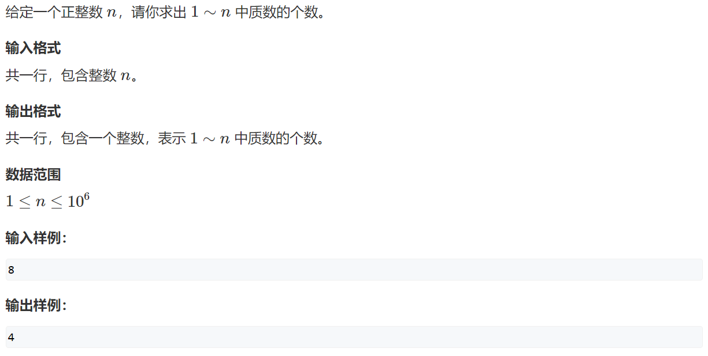

> **解法思路**：
>
> 当需要找出一定范围内的所有质数时，单个判断效率太低，需要使用筛法。
>
> 1. 朴素筛法（把所有数的所有倍数筛掉 ，时间复杂度为$O(n logn)$）
>
> 2. **埃氏筛法 (Sieve of Eratosthenes)**：
>
>    -   从 `2` 开始，如果一个数 `i` 没有被标记，则 `i` 是质数。
>
>    -   然后将 `i` 的所有倍数 `2i, 3i, ...` 标记为合数。
>
>    -   继续检查下一个未被标记的数。
>
>    -   **时间复杂度**：O(n log log n)。
>
> 3. **线性筛法 (Euler's Sieve)**：
>
>    -   埃氏筛法会重复标记合数（如 12 会被 2 和 3 分别标记）。
>
>    -   线性筛的核心思想是：**让每个合数只被其最小的质因子筛掉**。
>
>    -   遍历 `2`到 `n`，如果 `i` 未被标记，则为质数。
>
>    -   内层循环遍历已找到的质数 `primes[j]`，将 `i * primes[j]` 标记为合数。
>
>    -   **关键**：当 `i % primes[j] == 0` 时 `break`。因为 `primes[j]` 是 `i` 的最小质因子，那么 `primes[j]` 也是 `i * primes[j]` 的最小质因子。对于更大的质数 `primes[k]`，`i * primes[k]` 的最小质因子仍然是 `primes[j]`，应该由 `(i * primes[k] / primes[j]) * primes[j]` 来筛，而不是现在筛，从而保证每个数只被筛一次。
>
>    -   **时间复杂度**：O(n)。

> **AcWing 题解 (线性筛法)**
```cpp
#include <iostream>
#include <vector>

using namespace std;

const int N = 1000010;

int primes[N], cnt; // 存储质数
bool st[N];         // 标记是否为合数

void get_primes(int n)
{
    for (int i = 2; i <= n; i ++ )
    {
        if (!st[i]) primes[cnt ++ ] = i; // i是质数
        
        // 用已找到的质数去筛掉合数
        // 保证 primes[j] * i 不越界
        for (int j = 0; primes[j] <= n / i; j ++ )
        {
            // primes[j] 是 primes[j] * i 的最小质因子
            st[primes[j] * i] = true;
            
            // 如果 i 是 primes[j] 的倍数，说明 primes[j] 是 i 的最小质因子
            // 再往后的 primes[k] * i 的最小质因子也是 primes[j]，应该由其他数来筛
            // 及时 break，保证每个合数只被其最小质因子筛一次
            if (i % primes[j] == 0) break;
        }
    }
}

int main()
{
    int n;
    cin >> n;
    get_primes(n);
    cout << cnt << endl;
    return 0;
}
```


> [!Tip]
>
> 以下是其他各种筛法的代码实现：
>
> 1、朴素筛法（把所有数的所有倍数筛掉 ，时间复杂度为$O(n logn)$）
>
> ```c++
> int primes[N], cnt;// primes 是存储质数的数组， cnt 是质数的数量 
> bool st[N];
> 
> void get_primes(int n)
> {
>     for (int i = 2; i <= n; i ++ ){
>         if(!st[i]){
>         	primes[cnt ++ ] = i;
> 		}
>         //把所有数的所有倍数筛掉 
>         for (int j = i + i; j <= n; j += i) st[j] = true;
>     }
> }
> ```
>
> 2、埃氏筛法（**把所有质数的所有倍数筛掉** ，时间复杂度为$O(nloglogn)$）
>
> ```c++
> int primes[N], cnt;// primes 是存储质数的数组， cnt 是质数的数量 
> bool st[N];
> 
> void get_primes(int n)
> {
>     for (int i = 2; i <= n; i ++ ){
>         if(!st[i]){
>         	primes[cnt ++ ] = i;
>         	//把此质数的所有倍数筛掉 
>         	for (int j = i + i; j <= n; j += i) st[j] = true;
> 		}
>     }
> }
> ```
>
> 埃氏筛的另一种写法：
>
> ```c++
> int primes[N], cnt;// primes 是存储质数的数组， cnt 是质数的数量 
> bool st[N];
> 
> void get_primes(int n)
> {
>     for (int i = 2; i <= n / i; i ++ ){
>         if(!st[i]){
>         	primes[cnt ++ ] = i;
>         	//把此质数的所有倍数筛掉 
>         	for (int j = i * i; j <= n; j += i) st[j] = true;
> 		}
>     }
> }
> ```
>
> 埃氏筛的完整代码
>
> ```c++
> 
> //埃氏筛法 
> 
> #include <iostream>
> #include <algorithm>
> 
> using namespace std;
> 
> const int N= 1000010;
> 
> int primes[N], cnt;// primes 是存储质数的数组， cnt 是质数的数量 
> bool st[N];
> 
> void get_primes(int n)
> {
>     for (int i = 2; i <= n; i ++ ){
>         if(!st[i]){
>         	primes[cnt ++ ] = i;
>         	//把此质数的所有倍数筛掉 
>         	for (int j = i + i; j <= n; j += i) st[j] = true;
> 		}
>     }
> }
> 
> int main()
> {
>     int n;
>     cin >> n;
> 
>     get_primes(n);
> 
>     cout << cnt << endl;
> 
>     return 0;
> }
> ```
>
> 3、线性筛法（**一个数只被其最小质因子筛掉**）
>
> 核心代码
>
> ```c++
> int primes[N], cnt;     // primes[]存储所有素数
> bool st[N];         // st[x]存储x是否被筛掉
> 
> void get_primes(int n)
> {
>     for (int i = 2; i <= n; i ++ )
>     {
>         if (!st[i]) primes[cnt ++ ] = i;
>         for (int j = 0; primes[j] <= n / i; j ++ )
>         {
>             st[primes[j] * i] = true;
>             if (i % primes[j] == 0) break;
>         }
>     }
> }
> 
> ```
>
> 完整代码：
>
> ```c++
> 
> //线性筛法，数据大时会快很多
> //详解参考：https://blog.csdn.net/littlegengjie/article/details/134164936
> 
> #include <iostream>
> #include <algorithm>
> 
> using namespace std;
> 
> const int N= 1000010;
> 
> int primes[N], cnt;
> bool st[N];//st[x]存储x是否被筛掉，非质数要被筛掉，起初全为 false ，全为质数
> 
> void get_primes(int n)
> {
>     for (int i = 2; i <= n; i ++ )
>     {
>         //当 i 是质数
>         if (!st[i]) primes[cnt ++ ] = i;
>         
>         //在筛 i 的最小质因子的过程中把 primes[j] * i <= n 的所有合数筛出来 
>         for (int j = 0; primes[j] <= n / i; j ++ )
>         {
>         	/*
> 			当  i % primes[j] != 0  时：
> 			primes[j]一定小于 i 的最小质因子，而且 primes[j] 一定是primes[j] * i的最小质因子。
> 			把对应 primes[j] 的合数筛掉
> 			*/
>             st[primes[j] * i] = true;
>             /*
>             当  i % primes[j] == 0  时：
> 			就说明枚举到 i 的最小质因子，退出循环 
> 			*/
>             if (i % primes[j] == 0) break;
>         }
>     }
> }
> 
> int main()
> {
>     int n;
>     cin >> n;
> 
>     get_primes(n);
> 
>     cout << cnt << endl;
> 
>     return 0;
> }
> 
> ```


</details>

---

## 📏 2. 约数

> **核心思想**：约数，又称因数，是指能整除给定整数的整数。围绕约数的问题通常包括求一个数的所有约数、约数的个数、约数之和以及两个数的最大公约数等。

### 📜 2.0 洛谷 & 牛客题单


**（1）试除法求约数、约数个数、约数之和**


| 来源 | 题目/题单                                                    | 说明                              |
| :--- | :----------------------------------------------------------- | :-------------------------------- |
| 洛谷 | https://www.luogu.com.cn/problem/U576695                     | U576695 试除法求约数              |
| 洛谷 | https://www.luogu.com.cn/problem/U203210                     | U203210 约数个数                  |
| 牛客 | [约数的个数_牛客题霸_牛客网](https://www.nowcoder.com/practice/04c8a5ea209d41798d23b59f053fa4d6) | **约数的个数**                    |
| 洛谷 | https://www.luogu.com.cn/problem/P3327                       | P3327 [SDOI2015] 约数个数和       |
| 洛谷 | https://www.luogu.com.cn/problem/U492051                     | U492051 求约数个数                |
| 洛谷 | https://www.luogu.com.cn/problem/P1403                       | P1403 [AHOI2005] 约数研究         |
| 洛谷 | https://www.luogu.com.cn/problem/U506557                     | U506557 约数之和                  |
| 洛谷 | https://www.luogu.com.cn/problem/U507255                     | U507255 约数之和Ⅱ                 |
| 牛客 | [约数之和](https://ac.nowcoder.com/acm/problem/22196)        | **约数之和**                      |
| 洛谷 | https://www.luogu.com.cn/problem/P2424                       | P2424 约数和                      |
| 洛谷 | https://www.luogu.com.cn/training/601405                     | CSP-J-分解质因数、GCD/LCM（题单） |
| 洛谷 | https://www.luogu.com.cn/training/456009                     | 筛选法 分解质因数 GCD/LCM（题单） |
| 洛谷 | https://www.luogu.com.cn/training/509126                     | 约数相关（题单）                  |


**（2）最大公约数**


| 来源     | 题目/题单                                                    | 说明                                |
| :------- | :----------------------------------------------------------- | :---------------------------------- |
| leetcode | [1979. 找出数组的最大公约数](https://leetcode.cn/problems/find-greatest-common-divisor-of-array/) | 1979. 找出数组的最大公约数          |
| 牛客     | [最大公约数](https://www.nowcoder.com/practice/cf4091ca75ca47958182dae85369c82c) | **最大公约数**                      |
| 洛谷     | https://www.luogu.com.cn/problem/B4025                       | B4025 最大公约数                    |
| 洛谷     | https://www.luogu.com.cn/training/492388                     | 最大公约数 GCD（题单）              |
| 洛谷     | https://www.luogu.com.cn/training/387666                     | 数学-最大公约数与最小公倍数（题单） |
| 洛谷     | https://www.luogu.com.cn/training/681959                     | 最大公约数练习题（题单）            |


### 🔍 2.1 试除法求约数

<details>
<summary><strong>🎯 AcWing 题目与题解</strong></summary>

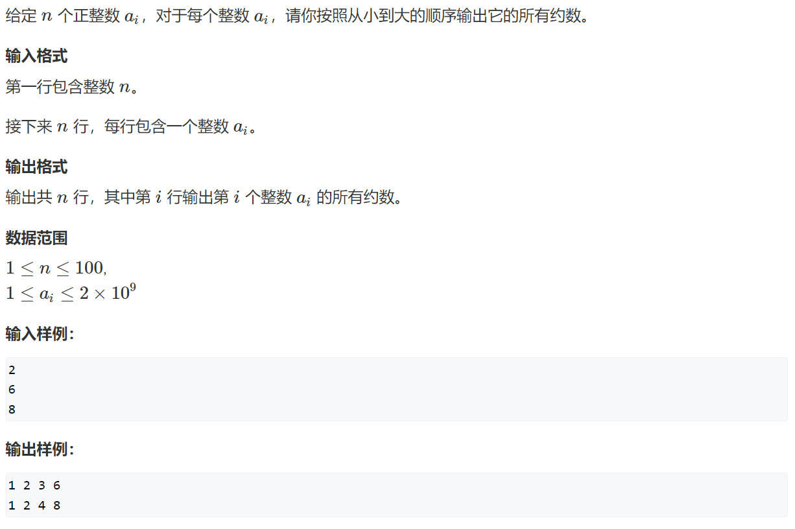

> **解法思路**：
>
> 类似于试除法判定质数，我们可以通过遍历到 `sqrt(x)` 来找到所有约数。
>
> 1.  **遍历**：循环 `i` 从 `1` 到 `x / i`。
> 2.  **成对添加**：如果 `i` 能整除 `x`，那么 `i` 和 `x / i` 都是 `x` 的约数。将它们都加入结果列表。
> 3.  **去重**：当 `x` 是完全平方数时，`i` 和 `x / i` 会相等，此时只添加一个 `i` 即可。
> 4.  **排序**：最后对结果进行排序，以确保输出顺序正确。
> 5.  **时间复杂度**：O(√n)。


> **函数关键代码**

```c++
vector<int> get_divisors(int x)
{
    vector<int> res;
    for (int i = 1; i <= x / i; i ++ )
        if (x % i == 0)
        {
            res.push_back(i);
            if (i != x / i) res.push_back(x / i);
        }
    sort(res.begin(), res.end());
    return res;
}
```

> **AcWing 题解**

```cpp
#include <iostream>
#include <algorithm>
#include <vector>

using namespace std;

vector<int> get_divisors(int x)
{
    vector<int> res;
    // 遍历到 sqrt(x)
    for (int i = 1; i <= x / i; i ++ )
        if (x % i == 0)
        {
            res.push_back(i);
            // 如果 i != x / i, 避免重复添加
            if (i != x / i) res.push_back(x / i);
        }
    sort(res.begin(), res.end());
    return res;
}

int main()
{
    int n;
    cin >> n;

    while (n -- )
    {
        int x;
        cin >> x;
        vector<int> res = get_divisors(x);

        for (int val : res) cout << val << ' ';
        cout << endl;
    }

    return 0;
}
```
</details>

### ➕ 2.2 约数个数和约数之和

> **核心公式**：
>
> 设正整数 $N$ 的标准质因数分解为： $N = p_1^{a_1} p_2^{a_2} \cdots p_k^{a_k}$
>
> 1. **约数个数**： 
>    $$
>    \tau(N) = (a_1 + 1)(a_2 + 1) \cdots (a_k + 1) = \prod_{i=1}^{k} (a_i + 1)
>    $$
>    
>
>    > 每个质因子 $p_i$ 可以选 $0, 1, \dots, a_i$ 次，共 $a_i+1$ 种选择，根据乘法原理得出。
>
> 2. **约数之和**： 
>    $$
>    \sigma(N) = (p_1^0 + p_1^1 + p_1^2 + \cdots + p_1^{a_1}) \cdot (p_2^0 + p_2^1 + p_2^2 + \cdots + p_2^{a_2}) \cdots (p_k^0 + p_k^1 + p_k^2 + \cdots + p_k^{a_k})
>    $$
>    
>
>    > 这是所有约数展开后的形式，利用等比数列求和公式可以简化为：
>    > $$
>    > \sigma(N) = \prod_{i=1}^{k} \left( \sum_{j=0}^{a_i} p_i^j \right) = \prod_{i=1}^{k} \frac{p_i^{a_i + 1} - 1}{p_i - 1} \quad (p_i 
>    > eq 1)
>    > $$
>    > 

#### 🔢 2.2.1 约数个数


<strong>🔗 练习平台</strong>


| 来源 | 题目/题单 | 说明 |
| :--- | :--- | :--- |
| 洛谷 | https://www.luogu.com.cn/problem/U203210 | U203210 约数个数 |
| 牛客 | [约数的个数_牛客题霸_牛客网](https://www.nowcoder.com/practice/04c8a5ea209d41798d23b59f053fa4d6) | **约数的个数**              |
| 洛谷 | https://www.luogu.com.cn/problem/P3327                       | P3327 [SDOI2015] 约数个数和 |
| 洛谷 | https://www.luogu.com.cn/problem/U492051                     | U492051 求约数个数          |


<details>
<summary><strong>🎯 AcWing 题目与题解</strong></summary>

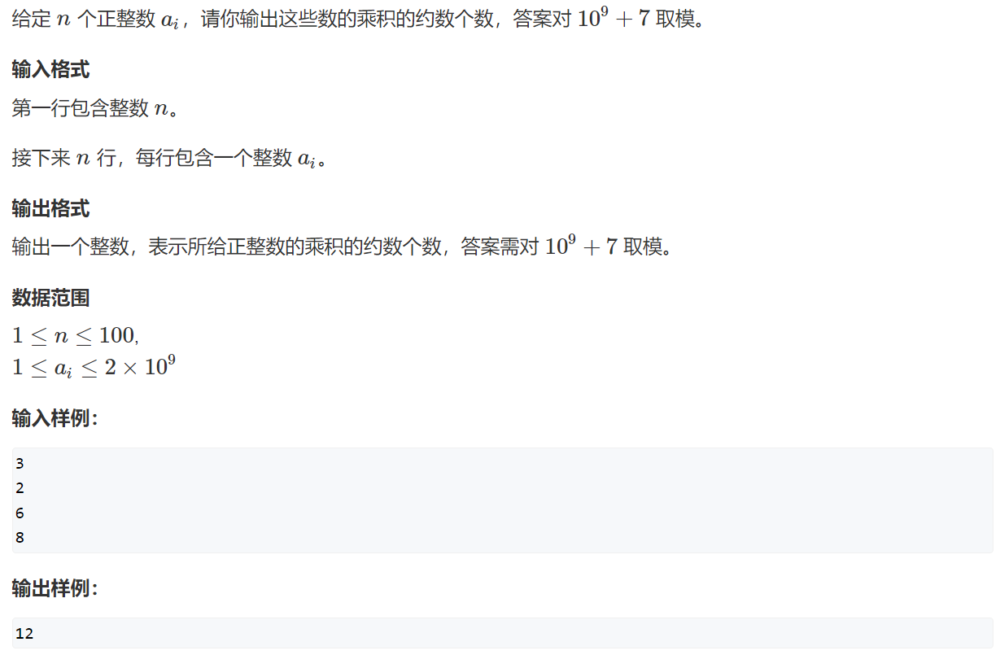

> **AcWing 题解**
```cpp

//约数个数定理：一个正整数的约数个数等于其质因子分解中每个质数指数加1的乘积。
/*
例如： 
将378000分解质因数378000=2^4×3^3×5^3×7^1
由约数个数定理可知378000共有正约数(4+1)×(3+1)×(3+1)×(1+1)=160个。
*/

#include <iostream>
#include <algorithm>
#include <unordered_map>
#include <vector>

using namespace std;

typedef long long LL;

const int N = 110, mod = 1e9 + 7;

int main()
{
    int n;
    cin >> n;

    unordered_map<int, int> primes;//primes[i] 表示 i 这个质因子对应的指数 

    while (n -- )
    {
        int x;
        cin >> x;
		//分解质因数
        for (int i = 2; i <= x / i; i ++ )
            while (x % i == 0)
            {
                x /= i;
                primes[i] ++ ;
            }
		//最多只有一个大于 sqrt(n) 的质因子，要考虑这个大于 sqrt(n) 的质因子
        if (x > 1) primes[x] ++ ;
    }

    LL res = 1;
    
    for (pair<int,int> p : primes) res = res * (p.second + 1) % mod;

    cout << res << endl;

    return 0;
}
```
</details>


#### 💰 2.2.2 约数之和


<strong>🔗 练习平台</strong>

| 来源 | 题目/题单 | 说明 |
| :--- | :--- | :--- |
| 洛谷 | https://www.luogu.com.cn/problem/U506557 | U506557 约数之和 |
| 洛谷 | https://www.luogu.com.cn/problem/U507255 | U507255 约数之和Ⅱ |
| 牛客 | [约数之和](https://ac.nowcoder.com/acm/problem/22196) | **约数之和** |
| 洛谷 | https://www.luogu.com.cn/problem/P2424 | P2424 约数和 |


<details>
<summary><strong>🎯 AcWing 题目与题解</strong></summary>

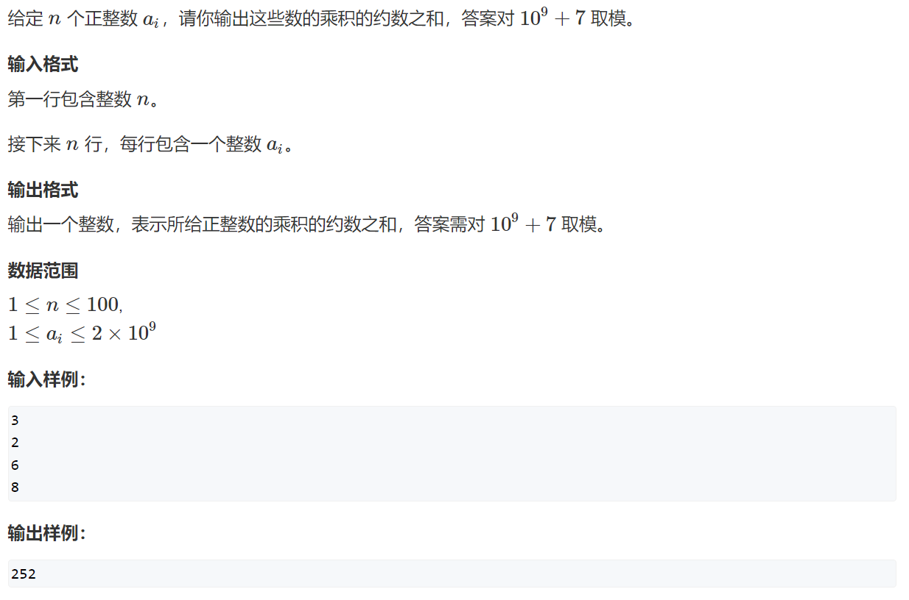

> **AcWing 题解**
```cpp

/*
例： 
将 37800 分解质因数可得

360=2^4*3^3*5^3+7^1

1.由约数个数定理可知 378000 共有正约数(4+1)×(3+1)×(3+1)×(1+1)=160个。
2.由约数和定理可知， 378000 所有正约数的和为
(2^0+2^1+2^2+2^3+2^4)×(3^0+3^1+3^2+3^3)×(5^0+5^1+5^2+5^3) x (7^0+7^1)
=(1+2+4+8+16)(1+3+9+27)(1+5+25+125)(1+7)=31×40×156 x8 =1537920
*/

#include <iostream>
#include <algorithm>
#include <unordered_map>
#include <vector>

using namespace std;

typedef long long LL;

const int N = 110, mod = 1e9 + 7;

int main()
{
    int n;
    cin >> n;

    unordered_map<int, int> primes;

    while (n -- )
    {
        int x;
        cin >> x;
		//分解质因数
        for (int i = 2; i <= x / i; i ++ )
            while (x % i == 0)
            {
                x /= i;
                primes[i] ++ ;
            }

        if (x > 1) primes[x] ++ ;
    }

    LL res = 1;
    for (pair<int,int> p : primes)
    {
        LL a = p.first, b = p.second;
        LL t = 1;
        while (b -- ) t = (t * a + 1) % mod;//算出开头例子的括号项 
        res = res * t % mod;//把括号项乘起来 
    }

    cout << res << endl;

    return 0;
}
```
</details>


### 🤝 2.3 最大公约数 (GCD)

<strong>🔗 练习平台</strong>

| 来源 | 题目/题单 | 说明 |
| :--- | :--- | :--- |
| leetcode | [1979. 找出数组的最大公约数](https://leetcode.cn/problems/find-greatest-common-divisor-of-array/) | 1979. 找出数组的最大公约数 |
| 牛客 | [最大公约数](https://www.nowcoder.com/practice/cf4091ca75ca47958182dae85369c82c) | **最大公约数** |
| 洛谷 | https://www.luogu.com.cn/problem/B4025 | B4025 最大公约数 |
| 洛谷 | https://www.luogu.com.cn/training/492388 | 最大公约数 GCD（题单） |
| 洛谷 | https://www.luogu.com.cn/training/387666 | 数学-最大公约数与最小公倍数（题单） |
| 洛谷 | https://www.luogu.com.cn/training/681959 | 最大公约数练习题（题单） |


<details>
<summary><strong>🎯 AcWing 题目与题解</strong></summary>

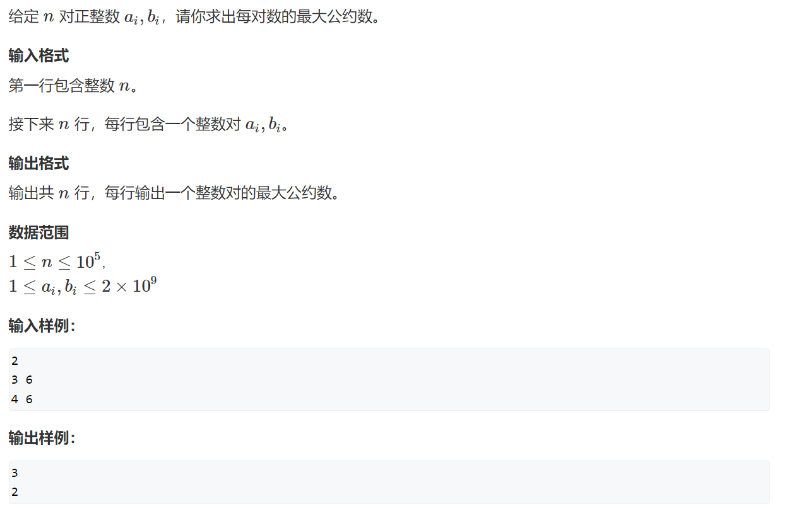

> **解法思路**：
>
> 求解最大公约数最经典和高效的算法是**欧几里得算法**（又称辗转相除法）。
>
> **核心原理**：`gcd(a, b) = gcd(b, a % b)`。
>
> **递归终止条件**：当 `b` 为 `0` 时，`a` 就是最大公约数。
>
> **时间复杂度**：O(log(min(a,b)))。

> **AcWing 题解**

```c++

//欧几里得算法（辗转相除法） 

#include <iostream>

using namespace std;

int gcd(int a, int b)
{
    return b ? gcd(b, a % b) : a;//如果 b 不为0，则返回 gcd(b, a % b)，否则返回 a。
}

int main()
{
    int n;
    cin >> n;
    while (n -- )
    {
        int a, b;
        cin>>a>>b;
        cout<<gcd(a,b)<<endl;
    }

    return 0;
}
```


> **拓展**
>
> 1、欧几里得算法（递归）
>
> ```c++
> int gcd1(int a, int b) {
>     if (b == 0) {
>         return a;
>     } else {
>         return gcd(b, a % b);
>     }
> }
> ```
>
> 2、欧几里得算法（迭代）
>
> ```c++
> int gcd2(int a, int b) {
>     while (b != 0) {
>         int temp = a % b;
>         a = b;
>         b = temp;
>     }
>     return a;
> }
> ```
>
> 3、更相减损法
>
> ```c++
> int gcd3(int a, int b) {
>     while (a != b) {
>         if (a > b) {
>             a -= b;
>         } else {
>             b -= a;
>         }
>     }
>     return a;
> }
> ```


</details>

---

## φ 3. 欧拉函数

> **核心思想**：欧拉函数 $\varphi(n)$（或 $\phi(n)$）表示在 $1$ 到 $n$ 的正整数中，与 $n$ **互质**（最大公约数为1）的数的个数。
>
> **计算公式**：
>
> 若 $n$ 的标准质因数分解为 $n = p_1^{a_1} p_2^{a_2} \cdots p_k^{a_k}$，则：
>
> 
> $$
> \varphi(n) = n \cdot \left(1 - \frac{1}{p_1}\right) \cdot \left(1 - \frac{1}{p_2}\right) \cdots \left(1 - \frac{1}{p_k}\right) = n \cdot \prod_{i=1}^{k} \left(1 - \frac{1}{p_i}\right)
> $$
> 

### 📜 3.0 洛谷 & 牛客题单


| 来源 | 题目/题单                                                    | 说明                                                |
| :--- | :----------------------------------------------------------- | :-------------------------------------------------- |
| 牛客 | [【模板】欧拉函数Ⅰ ‖ 单个整数](https://www.nowcoder.com/practice/6a22f91ad3904c6cbd624ae5ff6a4eac) | **【模板】欧拉函数Ⅰ ‖ 单个整数**                    |
| 洛谷 | https://www.luogu.com.cn/problem/T618140                     | T618140 【循环嵌套】欧拉函数                        |
| 洛谷 | https://www.luogu.com.cn/problem/T349567                     | T349567 欧拉函数                                    |
| 洛谷 | https://www.luogu.com.cn/problem/U203244                     | U203244 欧拉函数                                    |
| 洛谷 | https://www.luogu.com.cn/problem/T349752                     | T349752 筛法求欧拉函数                              |
| 洛谷 | https://www.luogu.com.cn/problem/U398681                     | U398681 【模板】欧拉函数线性筛/phi                  |
| 洛谷 | https://www.luogu.com.cn/problem/U546927                     | U546927 线性筛求欧拉函数                            |
| 洛谷 | https://www.luogu.com.cn/problem/U231250                     | **U231250 【模板】欧拉函数（提高+/省选−）**         |
| 洛谷 | https://www.luogu.com.cn/problem/T291051                     | **T291051 【模板】欧拉函数（普及+/提高）**          |
| 洛谷 | https://www.luogu.com.cn/problem/U578745                     | U578745  线性筛求欧拉函数 弱化版                    |
| 洛谷 | https://www.luogu.com.cn/problem/U578687                     | U578687 欧拉函数（加强版）~~可能有点毒瘤~~          |
| 洛谷 | https://www.luogu.com.cn/problem/P5091                       | **P5091 【模板】扩展欧拉定理（难度：提高+/省选−）** |
| 洛谷 | https://www.luogu.com.cn/problem/U523821                     | **U523821 【模板】欧拉函数（提高+/省选−）**         |
| 洛谷 | https://www.luogu.com.cn/training/7052                       | 欧拉函数与欧拉定理（题单）                          |


### 📝 3.1 定义法求欧拉函数

<strong>🔗 练习平台</strong>

| 来源 | 题目/题单                                                    | 说明                             |
| :--- | :----------------------------------------------------------- | :------------------------------- |
| 牛客 | [【模板】欧拉函数Ⅰ ‖ 单个整数](https://www.nowcoder.com/practice/6a22f91ad3904c6cbd624ae5ff6a4eac) | **【模板】欧拉函数Ⅰ ‖ 单个整数** |
| 洛谷 | https://www.luogu.com.cn/problem/T618140                     | T618140 【循环嵌套】欧拉函数     |
| 洛谷 | https://www.luogu.com.cn/problem/T349567                     | T349567 欧拉函数                 |
| 洛谷 | https://www.luogu.com.cn/problem/U203244                     | U203244 欧拉函数                 |


<details>
<summary><strong>🎯 AcWing 题目与题解</strong></summary>

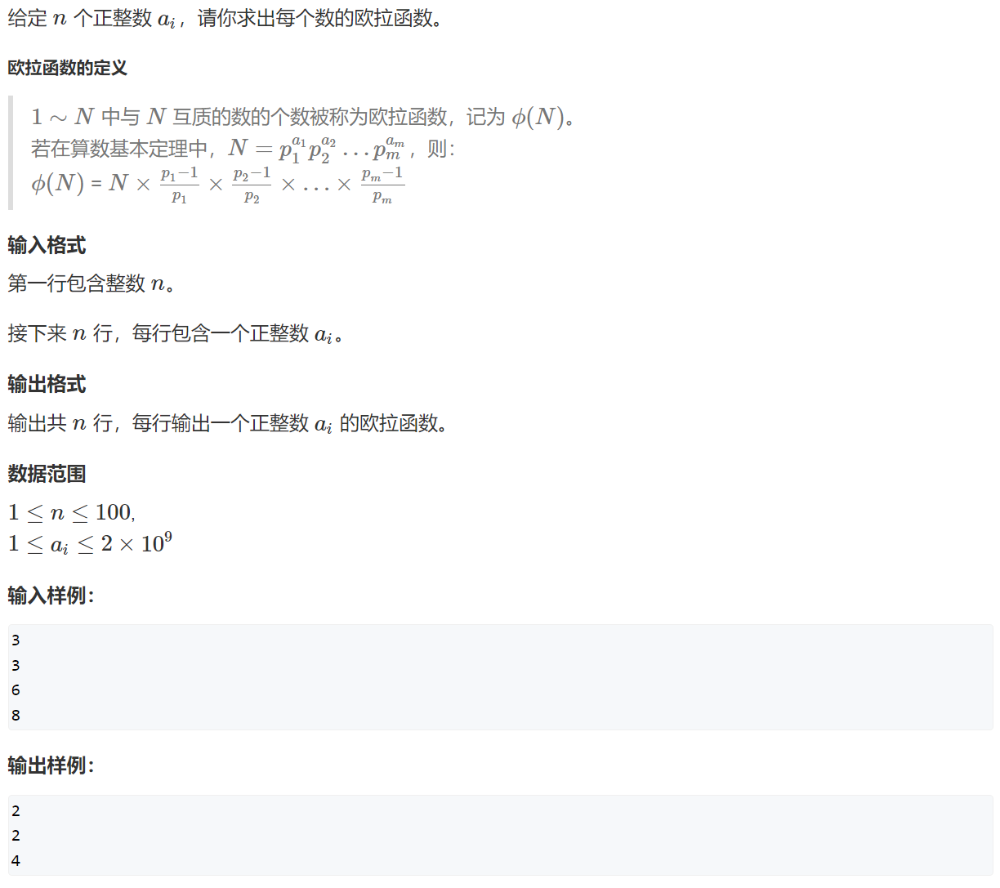

> **解法思路**：
>
> 直接根据公式计算 $\varphi(n)$。
>
> 1.  **分解质因数**：首先对 `n` 进行质因数分解，找出所有的质因子 $p_i$。
> 2.  **套用公式**：初始化 `res = n`，对于每个找到的质因子 `p`，执行 `res = res / p * (p - 1)`。这等价于 `res * (1 - 1/p)`，但避免了浮点数运算。
> 3.  **算法流程**：和分解质因数的算法几乎一样，只是在找到一个质因子 `p` 后，应用欧拉函数的公式更新 `res`，然后把 `n` 中所有的因子 `p` 除尽。
> 4.  **时间复杂度**：O(√n)。


>  定义法求欧拉函数（模板）

```c++
int phi(int x)
{
    int res = x;//res初始值是x
    for (int i = 2; i <= x / i; i ++ )
        if (x % i == 0)
        {
            res = res / i * (i - 1);//相当于 N * (1 - 1 / p)，是为了防止小数 
            while (x % i == 0) x /= i;
        }
    if (x > 1) res = res / x * (x - 1);

    return res;
}
```


> **AcWing 题解**

```cpp

//互质是公约数只有1的两个整数，叫做互质整数。

#include <iostream>

using namespace std;


int phi(int x)
{
    int res = x;//res初始值是x!!
    for (int i = 2; i <= x / i; i ++ )
        if (x % i == 0)
        {
            res = res / i * (i - 1);//相当于 N * (1 - 1 / p)，是为了防止小数 
            while (x % i == 0) x /= i;
        }
    if (x > 1) res = res / x * (x - 1);

    return res;
}


int main()
{
    int n;
    cin >> n;
    while (n -- )
    {
        int x;
        cin >> x;
        cout << phi(x) << endl;
    }

    return 0;
}
```

</details>

### ⏳ 3.2 筛法求欧拉函数

<strong>🔗 练习平台</strong>

| 来源 | 题目/题单 | 说明 |
| :--- | :--- | :--- |
| 洛谷 | https://www.luogu.com.cn/problem/T349752 | T349752 筛法求欧拉函数 |
| 洛谷 | https://www.luogu.com.cn/problem/U398681 | U398681 【模板】欧拉函数线性筛/phi |
| 洛谷 | https://www.luogu.com.cn/problem/U546927 | U546927 线性筛求欧拉函数 |
| 洛谷 | https://www.luogu.com.cn/problem/U578745 | U578745  线性筛求欧拉函数 弱化版 |


<details>
<summary><strong>🎯 AcWing 题目与题解</strong></summary>

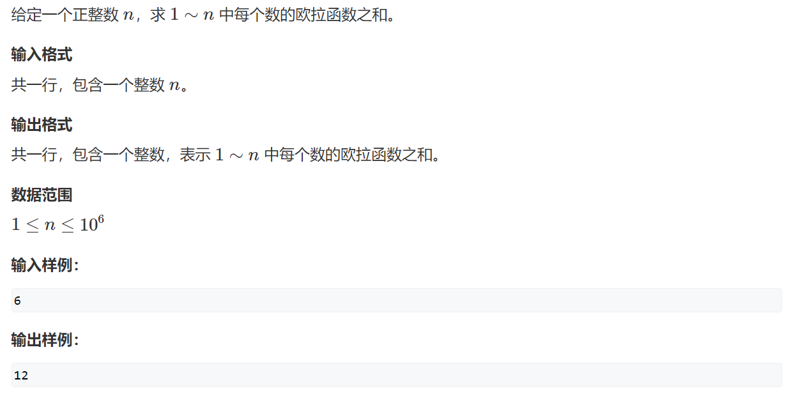

> **解法思路**：
>
> 当需要求 $1$ 到 $n$ 所有数的欧拉函数时，可以在线性筛质数的基础上进行扩展。利用欧拉函数的性质：
>
> 1.  如果 `p` 是质数，$\varphi(p) = p - 1$。
> 2.  如果 `i % p == 0`，则 `i` 和 `i*p` 含有相同的质因子。此时 $\varphi(i \cdot p) = \varphi(i) \cdot p$。
> 3.  如果 `i % p != 0`，则 `i` 和 `p` 互质。根据积性函数性质，$\varphi(i \cdot p) = \varphi(i) \cdot \varphi(p) = \varphi(i) \cdot (p - 1)$。
>
> 在线性筛的过程中，根据以上三种情况递推计算出每个数的欧拉函数值。


> **核心函数代码**

```c++
int primes[N], cnt;     // primes[]存储所有素数
int euler[N];           // 存储每个数的欧拉函数
bool st[N];         // st[x]存储x是否被筛掉


void get_eulers(int n)
{
    euler[1] = 1;
    for (int i = 2; i <= n; i ++ )
    {
        if (!st[i])
        {
            primes[cnt ++ ] = i;
            euler[i] = i - 1;
        }
        for (int j = 0; primes[j] <= n / i; j ++ )
        {
            int t = primes[j] * i;
            st[t] = true;
            if (i % primes[j] == 0)
            {
                euler[t] = euler[i] * primes[j];
                break;
            }
            euler[t] = euler[i] * (primes[j] - 1);
        }
    }
}
```


> **AcWing 题解**

```cpp
#include <iostream>

using namespace std;

typedef long long LL;

const int N = 1000010;


int primes[N], cnt;
int euler[N];//存储元素的欧拉函数 
bool st[N];


void get_eulers(int n)
{
	// 1 的欧拉函数是 1  
    euler[1] = 1;
    
    //在线性筛法的过程中求出 1 到 n 的欧拉函数 
    for (int i = 2; i <= n; i ++ )
    {
    	//当 i 是质数 
        if (!st[i])
        {
            primes[cnt ++ ] = i;
            //质数的欧拉函数为 i - 1 
            euler[i] = i - 1;
        }
        
        for (int j = 0; primes[j] <= n / i; j ++ )
        {
        	//筛掉对应primes[j]的合数 
            int t = primes[j] * i;
            st[t] = true;
            
            //当 i % primes[j] == 0 时，primes[j] 是 i 的最小质因子，也是 primes[j] * i 的最小质因子  
            if (i % primes[j] == 0)
            {
            	//修正 primes[j] * i 的欧拉函数 
                euler[t] = euler[i] * primes[j];
                break;
            }
            
            //当 i % primes[j] ！= 0 时，primes[j] 不是 i 的最小质因子，但是 primes[j] * i 的最小质因子
            //修正 primes[j] * i 的欧拉函数
            euler[t] = euler[i] * (primes[j] - 1);
        }
    }
}


int main()
{
    int n;
    cin >> n;

    get_eulers(n);

    LL res = 0;
    for (int i = 1; i <= n; i ++ ) res += euler[i];

    cout << res << endl;

    return 0;
}
```
</details>

### 👑 3.3 欧拉定理和费马小定理

> **欧拉定理 (Euler's Theorem)**
>
> 若正整数 $a$ 与 $n$ **互质**（$\gcd(a, n) = 1$），则：
> $$
> a^{\varphi(n)} \equiv 1 \pmod{n}
> $$
>
> **费马小定理 (Fermat's Little Theorem)**
>
> 欧拉定理的特例。若 $p$ 是一个**质数**，且整数 $a$ 不是 $p$ 的倍数（$\gcd(a, p) = 1$），则：
> $$
> a^{p-1} \equiv 1 \pmod{p}
> $$
> 这两个定理是模运算中进行降幂的核心工具，常用于计算 $a^b \pmod{n}$，特别是当 $b$ 非常大时。

---

## 🚀 4. 快速幂

> **核心思想**：快速幂（也称二进制取幂）是一种在 $O(\log k)$ 时间内计算 $a^k \pmod{p}$ 的高效算法。其核心是将指数 $k$ 进行二进制拆分。
>
> 例如，计算 $a^{13}$，$13$ 的二进制是 $1101_2$。
> $$
> a^{13} = a^{8+4+1} = a^8 \cdot a^4 \cdot a^1
> $$
> 我们只需预处理出 $a^1, a^2, a^4, a^8, \dots$（通过不断平方得到），然后根据 $k$ 的二进制位是否为 1 来决定是否将对应的项乘入结果。

### 📜 4.0 洛谷 & 牛客题单

| 来源 | 题目/题单 | 说明 |
| :--- | :--- | :--- |
| 牛客 | [【模板】快速幂Ⅰ ‖ 整数](https://www.nowcoder.com/practice/3d624107a6904da1bd0e8c9c85e17167) | **【模板】快速幂Ⅰ ‖ 整数** |
| 牛客 | [快速幂_牛客题霸_牛客网](https://www.nowcoder.com/practice/defdedf4fe984c6c91eefa6b00d5f4f0) | **快速幂**                 |
| 洛谷 | https://www.luogu.com.cn/problem/P1226                       | P1226 【模板】快速幂       |
| 洛谷 | https://www.luogu.com.cn/problem/U579207                     | U579207 快速幂求逆元       |
| 洛谷 | https://www.luogu.com.cn/training/53467                      | 快速幂、逆元（题单）       |
| 洛谷 | https://www.luogu.com.cn/training/34972                      | 快速幂（题单）             |


### ⚡ 4.1 快速幂

<strong>🔗 练习平台</strong>

| 来源 | 题目/题单 | 说明 |
| :--- | :--- | :--- |
| 牛客 | [【模板】快速幂Ⅰ ‖ 整数](https://www.nowcoder.com/practice/3d624107a6904da1bd0e8c9c85e17167) | **【模板】快速幂Ⅰ ‖ 整数** |
| 牛客 | [快速幂_牛客题霸_牛客网](https://www.nowcoder.com/practice/defdedf4fe984c6c91eefa6b00d5f4f0) | **快速幂**                 |
| 洛谷 | https://www.luogu.com.cn/problem/P1226                       | P1226 【模板】快速幂       |


<details>
<summary><strong>🎯 AcWing 题目与题解</strong></summary>

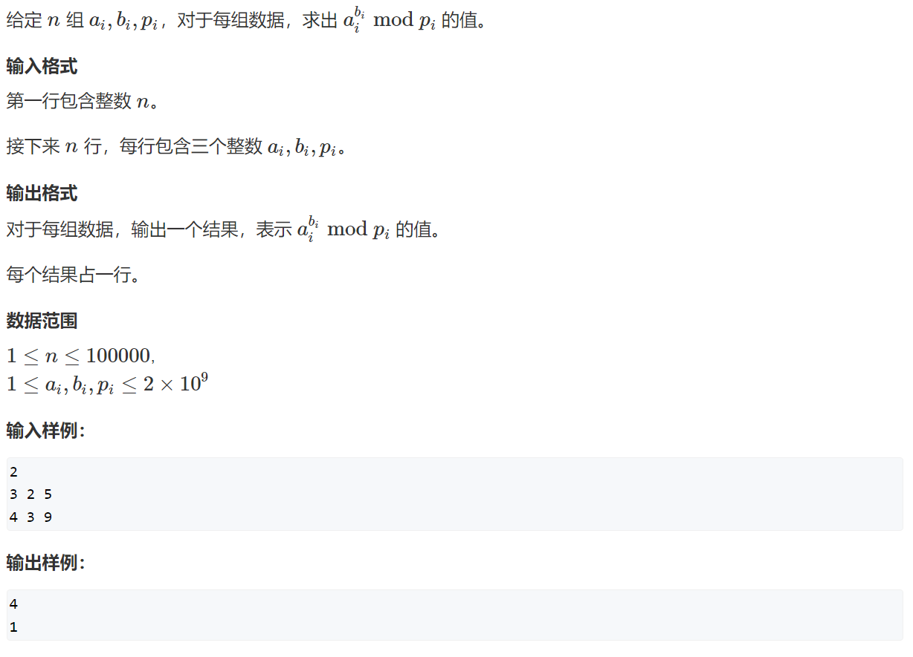


> **核心函数代码**

```c++
LL qmi(int a, int b, int p)
{
    LL res = 1 % p;
    while (b)
    {
        if (b & 1) res = res * a % p;
        a = (LL)a * a % p;
        b >>= 1;
    }
    return res;
}
```


> **AcWing 题解**

```cpp
#include <iostream>
using namespace std;

typedef long long LL;

// 计算 (a^k) % p
LL qmi(int a, int k, int p)
{
    LL res = 1;
    while (k)
    {
        // 如果 k 的当前最低位是 1，则将底数乘入结果
        if (k & 1) res = res * a % p;
        // 底数平方，用于下一轮计算
        a = (LL)a * a % p;
        // 指数右移一位，考察下一位
        k >>= 1;
    }
    return res;
}

int main()
{
    int n;
    cin >> n;
    while (n -- )
    {
        int a, b, p;
        cin >> a >> b >> p;
        cout << qmi(a, b, p) << endl;
    }
    return 0;
}
```
</details>

### 🔄 4.2 快速幂求逆元

<strong>🔗 练习平台</strong>

| 来源 | 题目/题单 | 说明 |
| :--- | :--- | :--- |
| 洛谷 | https://www.luogu.com.cn/problem/U579207                     | U579207 快速幂求逆元 |
| 洛谷 | [https://www.luogu.com.cn/training/53467](https://www.luogu.com.cn/training/53467) | 快速幂、逆元（题单） |


<details>
<summary><strong>🎯 AcWing 题目与题解</strong></summary>

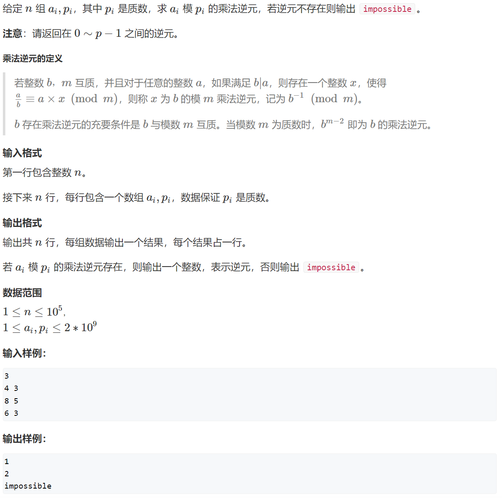

> **解法思路**：
>
> 模逆元是指，对于整数 `a` 和模数 `p`，如果存在一个整数 `x` 使得 $a \cdot x \equiv 1 \pmod{p}$，则称 `x` 是 `a` 关于模 `p` 的逆元。
>
> 当 **`p` 是质数** 且 `a` 不是 `p` 的倍数时，根据**费马小定理** $a^{p-1} \equiv 1 \pmod{p}$，我们可以推导出：
> $$ a \cdot a^{p-2} \equiv 1 \pmod{p} $$
> 因此，$a^{p-2}$ 就是 `a` 关于模 `p` 的逆元。我们可以用快速幂算法高效计算 $a^{p-2} \pmod p$。

> **AcWing 题解**
```cpp
#include <iostream>

using namespace std;

typedef long long LL;


LL qmi(int a, int b, int p)
{
    LL res = 1 % p;
    while (b)
    {
        if (b & 1) res = res * a % p;
        a = (LL)a * a % p;
        b >>= 1;
    }
    return res;
}


int main()
{
    int n;
    cin>>n;
    while (n -- )
    {
        int a, p;
        cin>>a>>p;
        /*
        a 和 p 互质并且 p 是质数时 a 的逆元为 a^p-2 mod p
        因 p 为质数，因子只有 1 和 p，所以 a 和 p 存在除 1 以外的公因数即不互质的话，那个公因数只能是 p
        所以只需要判断 p 是否为 a 的因子就可以确定 a 和 p 是否互质
        */
        if (a % p == 0) puts("impossible");
        else cout<<qmi(a, p - 2, p)<<endl;
    }

    return 0;
}
```
</details>

---

## 📐 5. 扩展欧几里得算法

> **核心思想**：扩展欧几里得算法用于求解形如 $a \cdot x + b \cdot y = \gcd(a, b)$ 的方程的一组整数解 $(x, y)$。它在标准欧几里得算法的递归回溯过程中，递推地求出解。
>
> **递推关系**：
> 设我们通过递归调用 `exgcd(b, a % b, x', y')` 得到了 
> $$
> b \cdot x' + (a \pmod b) \cdot y' = \gcd(b, a \pmod b)
> $$
> 因为 
> $$
> a \pmod b = a - \lfloor a/b \rfloor \cdot b
> $$
> 
>
> 代入上式并整理可得：
> $$
> a \cdot y' + b \cdot (x' - \lfloor a/b \rfloor \cdot y') = \gcd(a, b)
> $$
> 
>
> 故原方程的解为 $x = y', y = x' - \lfloor a/b \rfloor \cdot y'$。
>
> | 特性 | 描述 |
> | :--- | :--- |
> | **输入** | 两个整数 $a$, $b$ |
> | **输出** | 三元组 $(d, x, y)$，满足 $d = \gcd(a, b) = a \cdot x + b \cdot y$ |
> | **关键应用** | **求解模运算下的乘法逆元** (当 $\gcd(a, m)=1$ 时) |
> | **时间复杂度** | $O(\log(\min(a, b)))$，与标准欧几里得算法相同，非常高效 |

### 📜 5.0 洛谷题单


| 来源 | 题目/题单                                | 说明                              |
| :--- | :--------------------------------------- | :-------------------------------- |
| 洛谷 | https://www.luogu.com.cn/problem/T270218 | T270218 【模板】扩展欧几里得算法  |
| 洛谷 | https://www.luogu.com.cn/problem/T114032 | T114032 扩展欧几里得算法          |
| 洛谷 | https://www.luogu.com.cn/problem/U553464 | U553464 扩展欧几里得              |
| 洛谷 | https://www.luogu.com.cn/problem/P1082   | P1082 [NOIP 2012 提高组] 同余方程 |
| 洛谷 | https://www.luogu.com.cn/problem/T580848 | T580848 线性同余方程              |
| 洛谷 | https://www.luogu.com.cn/training/164481 | 拓展欧几里得算法（题单）          |
| 洛谷 | https://www.luogu.com.cn/training/5539   | 同余方程-从入门到入土（题单）     |


### ✒️ 5.1 扩展欧几里得算法

<strong>🔗 练习平台</strong>

| 来源 | 题目/题单 | 说明 |
| :--- | :--- | :--- |
| 洛谷 | https://www.luogu.com.cn/problem/T270218 | T270218 【模板】扩展欧几里得算法 |
| 洛谷 | https://www.luogu.com.cn/problem/T114032 | T114032 扩展欧几里得算法         |
| 洛谷 | https://www.luogu.com.cn/problem/U553464 | U553464 扩展欧几里得             |


<details>
<summary><strong>🎯 AcWing 题目与题解</strong></summary>

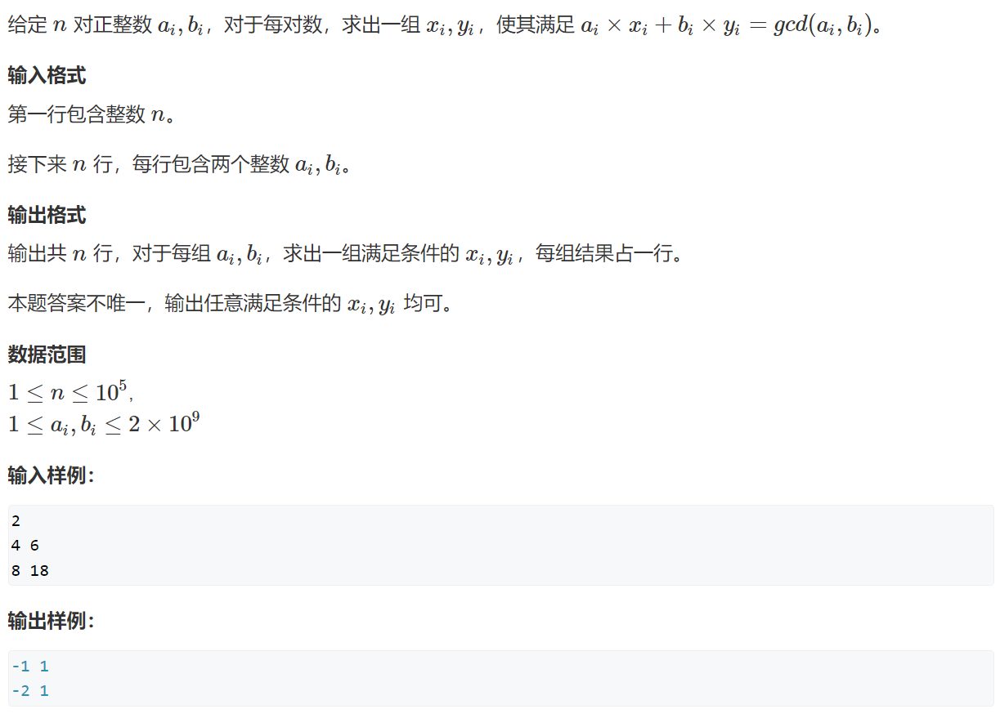


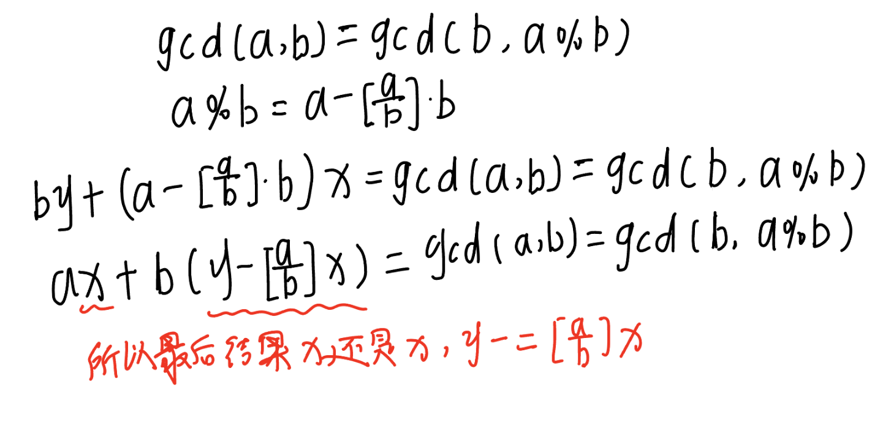


> **核心函数代码**

```c++
// 求x, y，使得ax + by = gcd(a, b)
int exgcd(int a, int b, int &x, int &y)
{
    if (!b)
    {
        x = 1; y = 0;
        return a;
    }
    int d = exgcd(b, a % b, y, x);
    y -= (a/b) * x;
    return d;
}
```


> **AcWing 题解**

```cpp
#include <iostream>
#include <algorithm>

using namespace std;

int exgcd(int a, int b, int &x, int &y)//必须传引用，不能用全局变量
{
	//b 为 0 时，最大公约数为 a ，所以 a x 1 + 0 x 0 = a 
    if (!b)
    {
        x = 1, y = 0;
        return a;
    }
    //b 不为 0 时，详细过程见手动模拟 
    int d = exgcd(b, a % b, y, x);
    y -= a / b * x;//调用函数求得最大公约数之后发现 y 要减 a / b * x 才是 b 的真正的系数
    return d;
}

int main()
{
    int n;
    scanf("%d", &n);//数据范围比较大时用scanf会快很多

    while (n -- )
    {
        int a, b;
        scanf("%d%d", &a, &b);
        int x, y;
        exgcd(a, b, x, y);
        printf("%d %d\n", x, y);
    }

    return 0;
}

```
</details>

### ⛓️ 5.2 线性同余方程

<strong>🔗 练习平台</strong>

| 来源 | 题目/题单 | 说明 |
| :--- | :--- | :--- |
| 洛谷 | https://www.luogu.com.cn/problem/P1082                       | P1082 [NOIP 2012 提高组] 同余方程 |
| 洛谷 | https://www.luogu.com.cn/problem/T580848                     | T580848 线性同余方程              |
| 洛谷 | [https://www.luogu.com.cn/training/5539](https://www.luogu.com.cn/training/5539) | 同余方程-从入门到入土（题单） |


<details>
<summary><strong>🎯 AcWing 题目与题解</strong></summary>

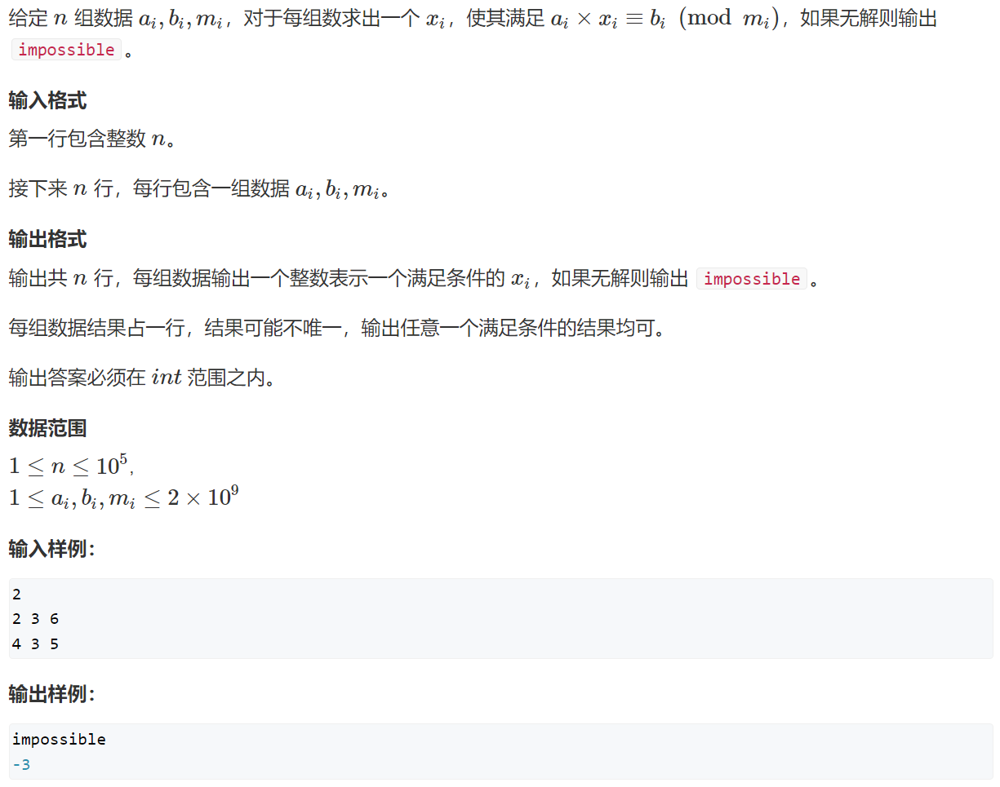

> **解法思路**：
>
> 求解形如 $a \cdot x \equiv b \pmod m$ 的线性同余方程。
>
> 1.  **转化**：方程等价于 $a \cdot x = m \cdot (-y) + b$，即 $a \cdot x + m \cdot y = b$。
> 2.  **求解**：这正是扩展欧几里得算法可以解决的形式。我们先用 `exgcd(a, m, x, y)` 求出 $a \cdot x_0 + m \cdot y_0 = \gcd(a, m)$ 的一组解 $(x_0, y_0)$。
> 3.  **有解条件**：原方程有解，当且仅当 $b$ 是 $\gcd(a, m)$ 的倍数。如果 $b \pmod{\gcd(a,m)} \neq 0$，则无解。
> 4.  **构造解**：如果有解，令 $d = \gcd(a,m)$。我们将 $a \cdot x_0 + m \cdot y_0 = d$ 两边同时乘以 $b/d$，得到 $a \cdot (x_0 \cdot b/d) + m \cdot (y_0 \cdot b/d) = b$。
> 5.  **通解**：方程的一个特解是 $x = x_0 \cdot (b/d)$。通解为 $x' = x + k \cdot (m/d)$。题目要求最小正整数解，可以通过取模得到 `(x % (m/d) + (m/d)) % (m/d)`。此题数据范围下，直接 `x % m` 即可。

> **AcWing 题解**
```cpp
#include <iostream>
#include <algorithm>

using namespace std;

typedef long long LL;


int exgcd(int a, int b, int &x, int &y)
{
    if (!b)
    {
        x = 1, y = 0;
        return a;
    }
    int d = exgcd(b, a % b, y, x);
    y -= a / b * x;
    return d;
}


int main()
{
    int n;
    scanf("%d", &n);
    while (n -- )
    {
        int a, b, m;
        scanf("%d%d%d", &a, &b, &m);

        int x, y;
        int d = exgcd(a, m, x, y);
        // b 不是 a 和 m 的最大公约数的倍数 ，无解 
        if (b % d) puts("impossible");
        //ax + by = gcd ,ax0 + by0 = b 解得 x0 = x * b / gcd , y0 = y * b / gcd（扩大 b / gcd 倍）
        /*
        由题可知 b 的范围几乎就是 int 的范围，所以要转成 LL ，防止x * b结果溢出，但是题中所说输出答案必须在 int 范围之内，所以用 %d 保证输出答案为 int（%lld 为 long long）
        */
        else printf("%d\n", (LL)x * b / d % m);
    }

    return 0;
}

```
</details>

---

## 🇨🇳 6. 中国剩余定理 (*)

> **核心思想**：中国剩余定理 (CRT) 用于求解一组形如 $x \equiv a_i \pmod{m_i}$ 的线性同余方程组，其中模数 $m_i$ **两两互质**。
>
> **解法**：
>
> 1.  令 $M = \prod m_i$。
> 2.  对每个方程，令 $M_i = M / m_i$。
> 3.  求 $M_i$ 在模 $m_i$ 下的逆元 $M_i^{-1}$。
> 4.  最终解为 $x = \sum (a_i \cdot M_i \cdot M_i^{-1}) \pmod M$。
>
> 当模数不互质时，需要使用**扩展中国剩余定理**，通过两两合并方程来求解。


> **详细介绍**
>
> 设 $m_1, m_2, \ldots, m_k$ 是**两两互质**的正整数（即对于任意 $i \neq j$，有 $\gcd(m_i, m_j) = 1$）。
>
> 则对于任意的整数 $a_1, a_2, \ldots, a_k$，下面的同余方程组：
> $$
> \begin{cases}
> x \equiv a_1 \pmod{m_1} \\
> x \equiv a_2 \pmod{m_2} \\
> \vdots \\
> x \equiv a_k \pmod{m_k}
> \end{cases}
> $$
>
> 在模 $M = m_1 \times m_2 \times \cdots \times m_k$ 下有**唯一解**。求解方法：
>
> 1. 计算所有模数的乘积：$M = m_1 \times m_2 \times \cdots \times m_k$
> 2. 对每个 $i$，计算：$M_i = \frac{M}{m_i}$
> 3. 对每个 $i$，求 $M_i$ 在模 $m_i$ 下的乘法逆元 $y_i$（即 $M_i y_i \equiv 1 \pmod{m_i}$）
> 4. 方程组的解为：$x \equiv a_1 M_1 y_1 + a_2 M_2 y_2 + \cdots + a_k M_k y_k \pmod{M}$
>
> **公式**：
> $$
> x \equiv \sum_{i=1}^k a_i M_i y_i \pmod{M}
> $$
>
> 

### 📜 6.0 洛谷 & 牛客题单

| 来源 | 题目/题单 | 说明 |
| :--- | :--- | :--- |
| 牛客竞赛 | [曹冲养猪](https://ac.nowcoder.com/acm/problem/50569)        | 曹冲养猪                                    |
| 牛客竞赛 | [Strange Way to Express Integers](https://ac.nowcoder.com/acm/problem/50570) | Strange Way to Express Integers             |
| 洛谷     | https://www.luogu.com.cn/problem/P1495                       | P1495 【模板】中国剩余定理（CRT）/ 曹冲养猪 |
| 洛谷     | https://www.luogu.com.cn/problem/P4777                       | P4777 【模板】扩展中国剩余定理（EXCRT）     |
| 牛客竞赛 | [中国剩余定理](https://ac.nowcoder.com/acm/skill/detail/acm/1620) | 中国剩余定理（题单）                        |
| 洛谷     | https://www.luogu.com.cn/training/61614                      | (扩展)中国剩余定理（题单）                  |
| 洛谷     | https://www.luogu.com.cn/training/87157                      | 【数论】CRT 与 ExCRT（题单）                |
| 洛谷     | https://www.luogu.com.cn/training/561502                     | 〔Fancy Zone〕中国剩余定理与BSGS（题单）    |
| 洛谷     | https://www.luogu.com.cn/training/18315                      | 中国剩余定理（题单）                        |
|          |                                                              |                                             |


### ❓ 6.1 表达整数的奇怪方式

<strong>🔗 练习平台</strong>

| 来源 | 题目/题单 | 说明 |
| :--- | :--- | :--- |
| 洛谷 | [P4777 【模板】扩展中国剩余定理（EXCRT）](https://www.luogu.com.cn/problem/P4777) | **P4777** |
| 牛客竞赛 | [Strange Way to Express Integers](https://ac.nowcoder.com/acm/problem/50570) | Strange Way to Express Integers |
| 洛谷 | [https://www.luogu.com.cn/training/61614](https://www.luogu.com.cn/training/61614) | (扩展)中国剩余定理（题单） |


<details>
<summary><strong>🎯 AcWing 题目与题解</strong></summary>

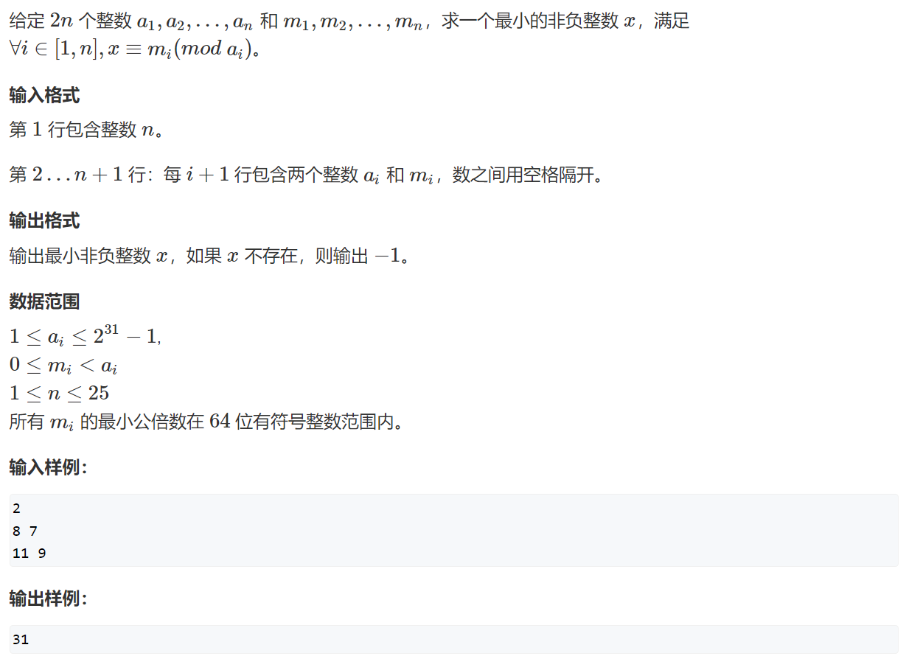

> **解法思路 (扩展中国剩余定理)**：
>
> 由于模数不一定两两互质，我们采用两两合并的思想。
>
> 假设我们已经求出了前 $i-1$ 个方程的解，满足 $x \equiv a_1 \pmod{m_1}$。这个解可以表示为 $x = k \cdot m_1 + a_1$。
> 现在要满足第 $i$ 个方程 $x \equiv a_2 \pmod{m_2}$。
>
> 1.  **联立**：$k \cdot m_1 + a_1 \equiv a_2 \pmod{m_2}$。
> 2.  **变形**：$k \cdot m_1 \equiv a_2 - a_1 \pmod{m_2}$。
> 3.  **求解**：这是一个关于 $k$ 的线性同余方程，可以用扩展欧几里得算法求解。
> 4.  **合并**：解出 $k$ 的一个特解 $k_0$ 后，通解为 $k = k_0 + t \cdot (m_2/d)$。代回 $x$ 的表达式，得到新的解 $x = (k_0 + t \cdot m_2/d) \cdot m_1 + a_1 = (k_0 \cdot m_1 + a_1) + t \cdot \operatorname{lcm}(m_1, m_2)$。
> 5.  **新方程**：这等价于一个新的同余方程 $x \equiv (k_0 \cdot m_1 + a_1) \pmod{\operatorname{lcm}(m_1, m_2)}$。
> 6.  **迭代**：重复此过程，直到合并完所有方程。

> **AcWing 题解**
```cpp
#include <iostream>
#include <algorithm>

using namespace std;

typedef long long LL;


LL exgcd(LL a, LL b, LL &x, LL &y)
{
    if (!b)
    {
        x = 1, y = 0;
        return a;
    }

    LL d = exgcd(b, a % b, y, x);
    y -= a / b * x;
    return d;
}


int main()
{
    int n;
    cin >> n;

    LL x = 0, m1, a1;
    cin >> m1 >> a1;
    for (int i = 0; i < n - 1; i ++ )
    {
        LL m2, a2;
        cin >> m2 >> a2;
        LL k1, k2;
        LL d = exgcd(m1, m2, k1, k2);
        if ((a2 - a1) % d)
        {
            x = -1;
            break;
        }

        k1 *= (a2 - a1) / d;
        k1 = (k1 % (m2/d) + m2/d) % (m2/d);

        x = k1 * m1 + a1;

        LL m = abs(m1 / d * m2);
        a1 = k1 * m1 + a1;
        m1 = m;
    }

    if (x != -1) x = (a1 % m1 + m1) % m1;

    cout << x << endl;

    return 0;
}

```


</details>


> 牛客竞赛：[Strange Way to Express Integers](https://ac.nowcoder.com/acm/problem/50570)

```c++
#include <iostream>
using namespace std;
typedef long long LL;
LL exgcd(LL a, LL b, LL& x, LL& y) {
  if (b == 0) {
    x = 1, y = 0;
    return a;
  }
  LL d = exgcd(b, a % b, y, x);
  y -= a / b * x;
  return d;
}
int main() {
  int n;
  while (scanf("%d", &n) != EOF) {
    bool flag = true;
    LL a1, b1, a2, b2;
    scanf("%lld %lld", &a1, &b1);
    for (int i = 1; i <= n - 1; i++) {
      scanf("%lld %lld", &a2, &b2);
      LL k1, k2;
      LL d = exgcd(a1, a2, k1, k2);
      if ((b2 - b1) % d) {
        flag = false;
        // 继续读完
        for (int j = i + 1; j < n; j++) scanf("%lld %lld", &a2, &b2);
        break;
      }
      //    s = k1 * (b2 - b1) / d;
      k1 *= (b2 - b1) / d;
      LL t = a2 / d;
      k1 = (k1 % t + t) % t;
      b1 = a1 * k1 + b1;
      a1 = a1 * a2 / d;  // LCM(a1, a2)
    }
    if (flag) {
      printf("%lld\n", (b1 % a1 + a1) % a1);
    } else {
      printf("-1\n");
    }
  }

  return 0;
}
```


> 洛谷：https://www.luogu.com.cn/problem/P4777
>
> 有个测试点会卡`long long`溢出，需要用到`__int128`

```c++
#include <iostream>
using namespace std;
typedef long long LL;
LL exgcd(LL a, LL b, LL& x, LL& y) {
  if (b == 0) {
    x = 1, y = 0;
    return a;
  }
  LL d = exgcd(b, a % b, y, x);
  y -= a / b * x;
  return d;
}
int main() {
  int n;
  scanf("%d", &n);
  bool flag = true;
  LL a1, b1, a2, b2;
  scanf("%lld %lld", &a1, &b1);
  for (int i = 1; i <= n - 1; i++) {
    scanf("%lld %lld", &a2, &b2);
    LL k1, k2;
    LL d = exgcd(a1, a2, k1, k2);
    if ((b2 - b1) % d) { flag = false; }
    __int128 s = (__int128)k1 * (b2 - b1) / d;
    // k1 *= (b2 - b1) / d;
    LL t = a2 / d;
    s = (s % t + t) % t;
    b1 = (__int128)a1 * s + b1;
    a1 = (__int128)a1 * a2 / d;  // LCM(a1, a2)
  }
  if (flag) {
    printf("%lld\n", (b1 % a1 + a1) % a1);
  } else {
    printf("-1\n");
  }

  return 0;
}
```


### 📜 6.2 中国剩余定理（纯模板）

牛客竞赛：[曹冲养猪](https://ac.nowcoder.com/acm/problem/50569)

洛谷：https://www.luogu.com.cn/problem/P1495

代码实现：

```c++
#include <iostream>
using namespace std;
const int N = 14;
int a[N], b[N];
typedef long long LL;
// (a * b) % mod
LL mul_mod(LL a, LL b, LL k) {
  LL result = 0;
  a %= k;
  while (b) {
    if (b & 1) { result = (result + a) % k; }
    b >>= 1;
    a = 2 * a % k;
  }
  return result;
}
LL exgcd(LL a, LL b, LL& x, LL& y) {
  if (b == 0) {
    x = 1, y = 0;
    return a;
  }
  LL d = exgcd(b, a % b, y, x);
  y -= a / b * x;
  return d;
}
// 求模逆元，即求x使得 a * x ≡ 1 mod m
LL mod_inverse(LL a, LL m) {
  LL x, y;
  LL d = exgcd(a, m, x, y);
  if (d != 1) { return -1; }
  return (x % m + m) % m;
}
int main() {
  int n;
  scanf("%d", &n);
  LL M = 1;
  for (int i = 0; i < n; i++) {
    scanf("%d %d", a + i, b + i);
    M *= a[i];
  }
  LL result = 0;
  for (int i = 0; i < n; i++) {
    LL Mi = M / a[i];
    LL yi = mod_inverse(Mi, a[i]);
    result = (result + mul_mod(mul_mod(b[i], Mi, M), yi, M)) % M;
  }
  result = (result % M + M) % M;
  printf("%lld", result);
  return 0;
}
```


---

## 🌀 7. 高斯消元 (*)

> **核心思想**：高斯消元法是求解线性方程组的经典算法。其基本步骤是通过一系列的初等行变换（交换两行、某行乘以非零数、某行加上另一行的倍数）将增广矩阵化为**行阶梯形矩阵**，然后通过**回代**求出方程组的解。
>
> **过程**：
>
> 1.  **消元 (Elimination)**：从第一列开始，选取主元（通常是当前列绝对值最大的元素所在行），将其交换到当前行。然后用这一行将下面所有行的当前列元素消为 0。
> 2.  **回代 (Back Substitution)**：从最后一行开始，逐步向上解出每个变量的值。


### 📜 7.0 洛谷 & 牛客题单

| 来源 | 题目/题单 | 说明 |
| :--- | :--- | :--- |
| 牛客 | [高斯消元法求解线性方程组_牛客题霸_牛客网](https://www.nowcoder.com/practice/02b6ff112b9b4eb2ad4403e30e0f076a) | **高斯消元法求解线性方程组**                   |
| 洛谷 | https://www.luogu.com.cn/problem/P3389                       | P3389 【模板】高斯消元法                       |
| 洛谷 | https://www.luogu.com.cn/problem/P2455                       | P2455 [SDOI2006] 线性方程组                    |
| 洛谷 | https://www.luogu.com.cn/training/600407                     | **高斯消元（题单）**                           |
| 洛谷 | https://www.luogu.com.cn/training/4919                       | **【日报配套题单】高斯消元，线性代数（题单）** |
|      |                                                              |                                                |


### 🔢 7.1 高斯消元解线性方程组

<strong>🔗 练习平台</strong>

| 来源 | 题目/题单 | 说明 |
| :--- | :--- | :--- |
| 牛客 | [高斯消元法求解线性方程组_牛客题霸_牛客网](https://www.nowcoder.com/practice/02b6ff112b9b4eb2ad4403e30e0f076a) | **高斯消元法求解线性方程组** |
| 洛谷 | https://www.luogu.com.cn/problem/P3389                       | P3389 【模板】高斯消元法     |
| 洛谷 | https://www.luogu.com.cn/problem/P2455                       | P2455 [SDOI2006] 线性方程组  |


<details>
<summary><strong>🎯 AcWing 题目与题解</strong></summary>

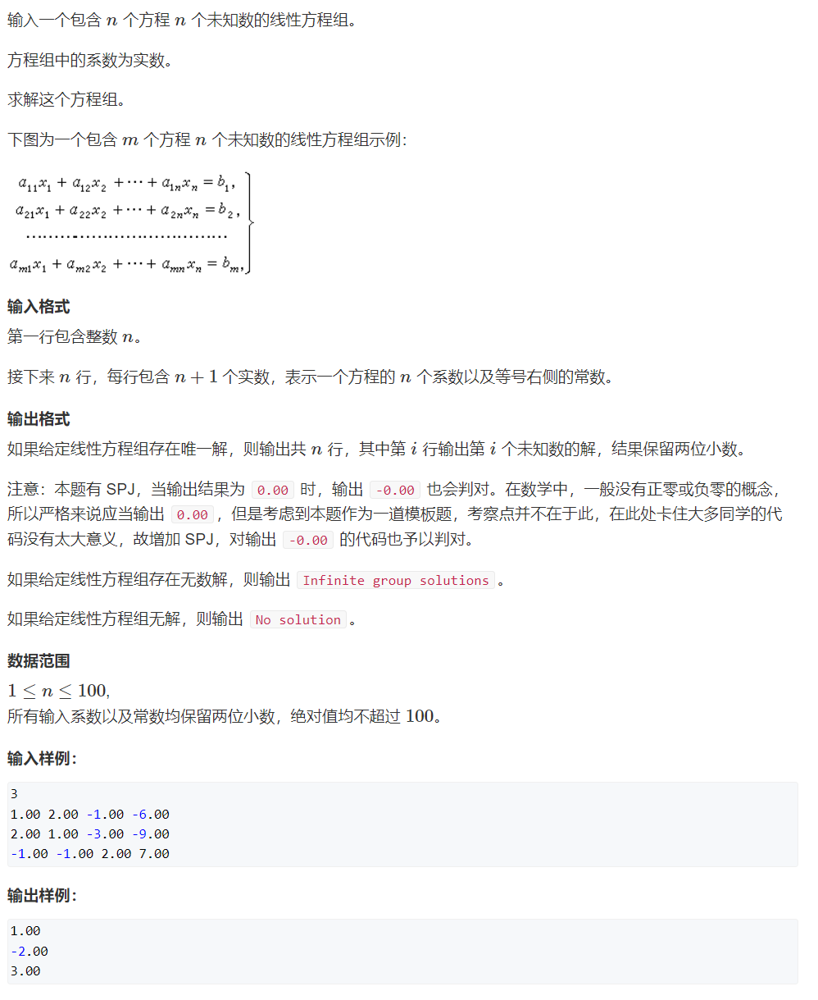

> **AcWing 题解**
```cpp
#include <iostream>
#include <cstring>
#include <algorithm>
#include <cmath>

using namespace std;

const int N = 110;
const double eps = 1e-8;

int n;
double a[N][N];

int gauss()  // 高斯消元，答案存于a[i][n]中，0 <= i < n
{
    int c, r;
    for (c = 0, r = 0; c < n; c ++ )
    {
        int t = r;
        for (int i = r; i < n; i ++ )  // 找绝对值最大的行
            if (fabs(a[i][c]) > fabs(a[t][c]))
                t = i;

        if (fabs(a[t][c]) < eps) continue;

        for (int i = c; i <= n; i ++ ) swap(a[t][i], a[r][i]);  // 将绝对值最大的行换到最顶端
        for (int i = n; i >= c; i -- ) a[r][i] /= a[r][c];  // 将当前行的首位变成1
        for (int i = r + 1; i < n; i ++ )  // 用当前行将下面所有的列消成0
            if (fabs(a[i][c]) > eps)
                for (int j = n; j >= c; j -- )
                    a[i][j] -= a[r][j] * a[i][c];

        r ++ ;
    }

    if (r < n)
    {
        for (int i = r; i < n; i ++ )
            if (fabs(a[i][n]) > eps)
                return 2; // 无解
        return 1; // 有无穷多组解
    }

    for (int i = n - 1; i >= 0; i -- )
        for (int j = i + 1; j < n; j ++ )
            a[i][n] -= a[i][j] * a[j][n];

    return 0; // 有唯一解
}


int main()
{
    scanf("%d", &n);
    for (int i = 0; i < n; i ++ )
        for (int j = 0; j < n + 1; j ++ )
            scanf("%lf", &a[i][j]);

    int t = gauss();
    if (t == 2) puts("No solution");
    else if (t == 1) puts("Infinite group solutions");
    else
    {
        for (int i = 0; i < n; i ++ )
            printf("%.2lf\n", a[i][n]);
    }

    return 0;
}

```
</details>


### 💡 7.2 高斯消元解异或线性方程组


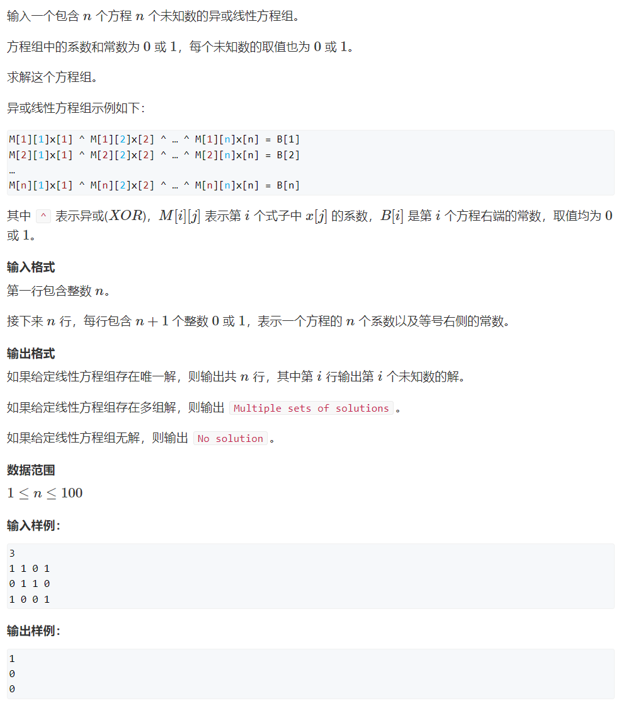

```c++
#include <iostream>
#include <algorithm>

using namespace std;

const int N = 110;


int n;
int a[N][N];


int gauss()
{
    int c, r;
    for (c = 0, r = 0; c < n; c ++ )
    {
        int t = r;
        for (int i = r; i < n; i ++ )
            if (a[i][c])
                t = i;

        if (!a[t][c]) continue;

        for (int i = c; i <= n; i ++ ) swap(a[r][i], a[t][i]);
        for (int i = r + 1; i < n; i ++ )
            if (a[i][c])
                for (int j = n; j >= c; j -- )
                    a[i][j] ^= a[r][j];

        r ++ ;
    }

    if (r < n)
    {
        for (int i = r; i < n; i ++ )
            if (a[i][n])
                return 2;
        return 1;
    }

    for (int i = n - 1; i >= 0; i -- )
        for (int j = i + 1; j < n; j ++ )
            a[i][n] ^= a[i][j] * a[j][n];

    return 0;
}


int main()
{
    cin >> n;

    for (int i = 0; i < n; i ++ )
        for (int j = 0; j < n + 1; j ++ )
            cin >> a[i][j];

    int t = gauss();

    if (t == 0)
    {
        for (int i = 0; i < n; i ++ ) cout << a[i][n] << endl;
    }
    else if (t == 1) puts("Multiple sets of solutions");
    else puts("No solution");

    return 0;
}

```


---

## 🎲 8. 求组合数

> **核心思想**：组合数 $C_a^b$（或 $\binom{a}{b}$）表示从 $a$ 个不同元素中取出 $b$ 个元素的方案数。根据数据范围和是否需要取模，有多种计算方法。

### 📜 8.0 洛谷 & 牛客题单


### 🪜 8.1 方法一：递推法

> **解法思路**：
>
> 利用组合数的递推公式（杨辉三角性质）：
> $$
> C_a^b = C_{a-1}^{b-1} + C_{a-1}^b
> $$
>
> -   **适用场景**：当 `a` 和 `b` 的范围不大（如 2000 以内），且需要多次查询时。
> -   **方法**：通过动态规划，预处理出一个二维数组 `c[a][b]` 存储所有组合数的值。
> -   **时间复杂度**：预处理 O(n²)，查询 O(1)。

<strong>🔗 练习平台</strong>

| 来源 | 题目/题单                                | 说明                                        |
| :--- | :--------------------------------------- | :------------------------------------------ |
| 洛谷 | https://www.luogu.com.cn/problem/T334372 | T334372 组合数（递归）                      |
| 洛谷 | https://www.luogu.com.cn/problem/T181707 | T181707 计算组合数 ($n<=20$)                |
| 洛谷 | https://www.luogu.com.cn/problem/T474685 | T474685 求组合数 I<br />($n<= 2000$)        |
| 洛谷 | https://www.luogu.com.cn/problem/U526513 | U526513 求组合数2（嵌套组合数）             |
| 洛谷 | https://www.luogu.com.cn/problem/U300348 | U300348 组合数 ($n \le 20$)                 |
| 洛谷 | https://www.luogu.com.cn/problem/U159710 | U159710 组合数 ($n \le 1000$, 多组查询)     |
| 洛谷 | https://www.luogu.com.cn/problem/U450830 | U450830 组合数 ($n \le 5000$, 多组查询)     |
| 洛谷 | https://www.luogu.com.cn/problem/U569470 | U569470 计算组合数 ($n \le 2000$, 结果取模) |
| 洛谷 | https://www.luogu.com.cn/problem/P2822   | P2822 [NOIP 2016 提高组] 组合数问题         |


<details>
<summary><strong>🎯 AcWing 题目与题解</strong></summary>

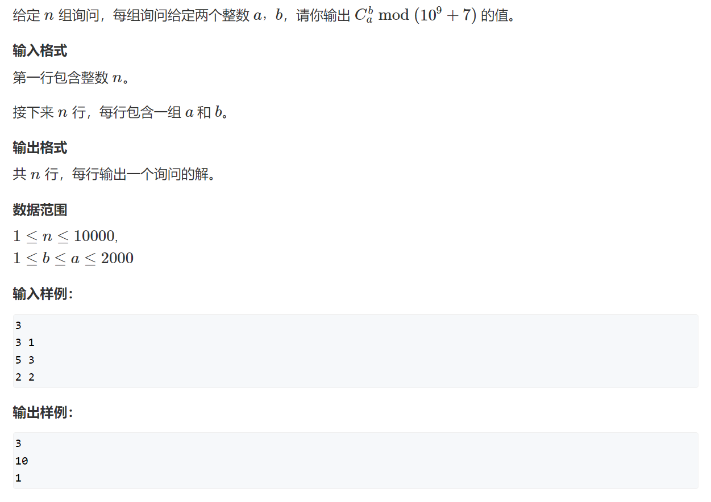


> **AcWing 题解**
```cpp
#include <iostream>
using namespace std;

const int N = 2010, mod = 1e9 + 7;
int c[N][N];

void init()
{
    // c[i] = 1, c[i][i] = 1
    for (int i = 0; i < N; i ++ )
        for (int j = 0; j <= i; j ++ )
            if (!j) c[i][j] = 1;
            else c[i][j] = (c[i - 1][j] + c[i - 1][j - 1]) % mod;
}

int main()
{
    init(); // 预处理

    int n;
    scanf("%d", &n);
    while (n -- )
    {
        int a, b;
        scanf("%d%d", &a, &b);
        printf("%d\n", c[a][b]);
    }

    return 0;
}
```
</details>

### 🏭 8.2 方法二：预处理阶乘和逆元

> **解法思路**：
>
> 利用公式 $C_a^b = \frac{a!}{b!(a-b)!}$。在模运算下，除法变为乘以**模逆元**。
> $$
> C_a^b \equiv a! \cdot (b!)^{-1} \cdot ((a-b)!)^{-1} \pmod p
> $$
> -   **适用场景**：模数 `p` 是质数，`a` 较大（如 10⁵），查询次数多。
> -   **方法**：
>     1.  预处理 $1!$ 到 $N!$ 的阶乘值 `fact[]`。
>     2.  预处理 $1!$ 到 $N!$ 的阶乘的逆元 `infact[]`。可以先用快速幂求出 `N!` 的逆元，然后利用 $(i!)^{-1} = ((i+1)!)^{-1} \cdot (i+1)$ 倒序递推。
> -   **时间复杂度**：预处理 O(n log p) 或 O(n)，查询 O(1)。


<strong>🔗 练习平台</strong>

| 来源 | 题目/题单                                                    | 说明                                       |
| :--- | :--- | :--- |
| 牛客 | [【模板】组合数_牛客题霸_牛客网](https://www.nowcoder.com/practice/53f82db091b2452bae5fef4437ffd0bb) | **【模板】组合数**                         |
| 洛谷 | https://www.luogu.com.cn/problem/U583220                     | U583220 求组合数II (阶乘+ 模拟元求解)      |
| 洛谷 | https://www.luogu.com.cn/problem/T474686                     | T474686 求组合数II (阶乘+ 模拟元求解)      |
| 洛谷 | https://www.luogu.com.cn/problem/U51417                      | U51417 【模板】求组合数 (阶乘+ 模拟元求解) |
| 洛谷 | https://www.luogu.com.cn/problem/B3717                       | B3717 组合数问题 (阶乘+ 模拟元求解)        |
|      |                                                              |                                            |


<details>
<summary><strong>🎯 AcWing 题目与题解</strong></summary>


> **核心代码函数**

```c++
int qmi(int a, int k, int p)    // 快速幂模板
{
    int res = 1;
    while (k)
    {
        if (k & 1) res = (LL)res * a % p;
        a = (LL)a * a % p;
        k >>= 1;
    }
    return res;
}

// 预处理阶乘的余数和阶乘逆元的余数
fact[0] = infact[0] = 1;
for (int i = 1; i < N; i ++ )
{
    fact[i] = (LL)fact[i - 1] * i % mod;
    infact[i] = (LL)infact[i - 1] * qmi(i, mod - 2, mod) % mod;
}

```


> **AcWing 题解**

```cpp
#include <iostream>
using namespace std;

typedef long long LL;
const int N = 100010, mod = 1e9 + 7;

int fact[N], infact[N];

int qmi(int a, int k, int p)
{
    int res = 1;
    while (k)
    {
        if (k & 1) res = (LL)res * a % p;
        a = (LL)a * a % p;
        k >>= 1;
    }
    return res;
}

int main()
{
    fact[0] = infact[0] = 1;
    for (int i = 1; i < N; i++)
    {
        fact[i] = (LL)fact[i - 1] * i % mod;
        infact[i] = (LL)infact[i - 1] * qmi(i, mod - 2, mod) % mod;
    }

    int n;
    scanf("%d", &n);
    while (n -- )
    {
        int a, b;
        scanf("%d%d", &a, &b);
        printf("%d\n", (LL)fact[a] * infact[b] % mod * infact[a - b] % mod);
    }

    return 0;
}
```

</details>


> 求逆元的优化版本
>
> 题目：https://www.luogu.com.cn/problem/U51417


> [!important]
>
> 前提条件：
>
> 所有涉及的逆元必须存在，即 $\gcd(n!, M) = 1$ 且 $\gcd((n+1)!, M) = 1$；等价于：$\gcd((n+1)!, M) = 1$（因为 $n! \mid (n+1)!$）；特别地，当 $M$ 是质数且 $n+1 < M$ 时，条件自然满足。
>
>
> 以下公式成立：
>
> $$
> (n!)^{-1} \equiv ((n+1)!)^{-1} \cdot (n+1) \pmod{M}
> $$
>
>
> 证明过程：
>
> 我们知道阶乘的递推关系：
>
> $$
> (n+1)! = (n+1) \cdot n!
> $$
>
> 对两边在模 $M$ 下取乘法逆元（假设逆元存在）：
>
> $$
> ((n+1)!)^{-1} \equiv \big((n+1) \cdot n!\big)^{-1} \pmod{M}
> $$
>
> 利用模逆元的性质 $(ab)^{-1} \equiv a^{-1} b^{-1} \pmod{M}$（当 $a,b$ 与 $M$ 互质时）：
>
> $$
> ((n+1)!)^{-1} \equiv (n+1)^{-1} \cdot (n!)^{-1} \pmod{M}
> $$
>
> 两边同时乘以 $(n+1)$（注意：这里是原数，不是逆元）：
>
> $$
> ((n+1)!)^{-1} \cdot (n+1) \equiv (n+1)^{-1} \cdot (n!)^{-1} \cdot (n+1) \pmod{M}
> $$
>
> 由于 $(n+1)^{-1} \cdot (n+1) \equiv 1 \pmod{M}$，右边化简为：
>
> $$
> ((n+1)!)^{-1} \cdot (n+1) \equiv (n!)^{-1} \pmod{M}
> $$
>
> 即：
>
> $$
> (n!)^{-1} \equiv ((n+1)!)^{-1} \cdot (n+1) \pmod{M}
> $$
>
> 


> 代码实现逻辑：

```c++
// 步骤1：计算最大值的阶乘逆元
infact[N-1] = quickPow(fact[N-1], M-2, M);
// 这里使用费马小定理：a^(M-2) ≡ a^(-1) mod M
// 计算：((N-1)!)^(-1) mod M

// 步骤2：反向递推
for (int i = N-2; i >= 0; i--) {
    infact[i] = (LL)infact[i+1] * (i+1) % M;
    // 应用公式：(i!)^(-1) = ((i+1)!)^(-1) × (i+1) mod M
}
```

> 完整代码实现：


```c++
#include<iostream>
using namespace std;
typedef long long LL;

const int N = 3e7 + 5;  // 最大可能的值+5，用于数组大小
const int M = 1e9 + 7;  // 模数，10^9+7是一个质数

int fact[N];    // 存储阶乘数组：fact[i] = i! mod M
int infact[N];  // 存储阶乘的逆元数组：infact[i] = (i!)^(-1) mod M

// 快速幂函数：计算 a^k mod p
int quickPow(int a, int k, int p){
    int result = 1;
    while(k){
        if(k & 1){  // 如果k的二进制最低位为1
            result = (LL)result * a % p;
        }
        a = (LL)a * a % p;  // a平方
        k >>= 1;  // k右移一位
    }
    return result;
}

// 初始化函数：预处理阶乘和阶乘逆元
void init(){
    // 初始化0的阶乘和阶乘逆元为1
    fact[0] = infact[0] = 1;
    
    // 正向计算阶乘数组：fact[i] = i! mod M
    for(int i = 1; i < N; i++){
        fact[i] = (LL)fact[i - 1] * i % M;
    }

    // --- 关键部分：逆元的高效求解 ---
    // 1. 先计算最大阶乘的逆元：((N-1)!)^(-1) mod M
    //    使用费马小定理：a^(M-2) ≡ a^(-1) mod M
    infact[N - 1] = quickPow(fact[N - 1], M - 2, M);
    
    // 2. 反向递推计算所有阶乘的逆元
    //    利用公式：(n!)^(-1) ≡ ((n+1)!)^(-1) × (n+1) mod M
    for (int i = N - 2; i >= 0; i--) {
        infact[i] = (LL)infact[i + 1] * (i + 1) % M;
    }
}

int main(){
    init();  // 预处理阶乘和逆元
    
    int t, n, m, result;
    scanf("%d", &t);
    while(t--){
        scanf("%d%d", &m, &n);
        // 计算组合数：C(m,n) = m! / (n! × (m-n)!) mod M
        result = (LL)fact[m] * infact[n] % M * infact[m - n] % M;
        printf("%d\n", result);
    }
    return 0;
}
```


### 🌟 8.3 方法三：卢卡斯定理 (Lucas Theorem)

> **解法思路**：
>
> 卢卡斯定理用于处理 $a, b$ 很大，但模数 $p$ 较小且为质数的情况。
>
> **定理**：
> 
> $$
> C_a^b \equiv C_{\lfloor a/p \rfloor}^{\lfloor b/p \rfloor}  \cdot (lucas)C_{a \pmod p}^{b \pmod p}  \pmod p
> $$
> 
> -   **方法**：这是一个递归过程。将求 $C_a^b$ 的问题分解为求 $C_{a \pmod p}^{b \pmod p}$（`p` 较小，可直接用定义法+逆元求）和 $C_{a/p}^{b/p}$（递归求解）。
> -   **时间复杂度**：$O(p \log_p a \cdot \log p)$，其中 $O(p)$ 是预处理阶乘逆元的时间，$\log_p a$ 是递归深度。


<strong>🔗 练习平台</strong>


| 来源 | 题目/题单 | 说明 |
| :--- | :--- | :--- |
| 洛谷 | https://www.luogu.com.cn/problem/U583140 | U583140 求组合数III (Lucas定理)  |
| 洛谷 | https://www.luogu.com.cn/problem/T474691 | T474691 求组合数 III (Lucas定理) |


<details>
<summary><strong>🎯 AcWing 题目与题解</strong></summary>

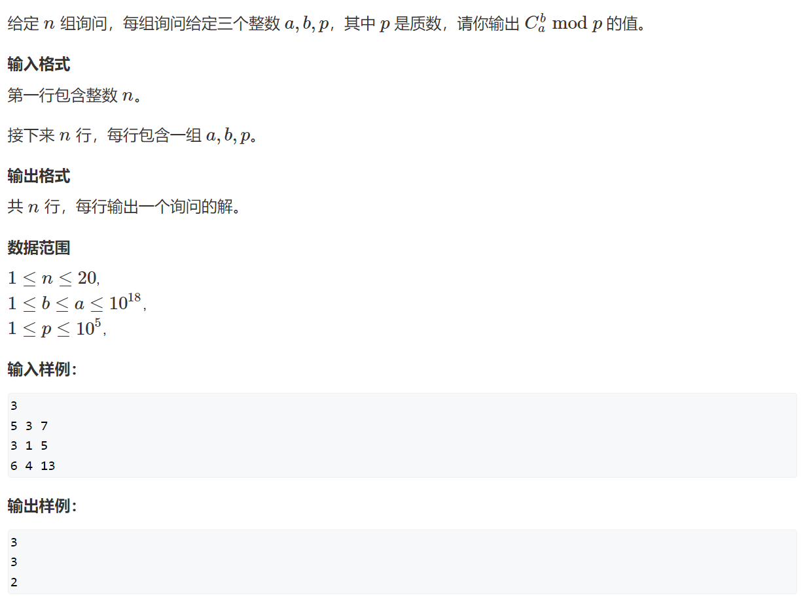


> **核心函数代码**

```c++

//若 p 是质数，C(n, m) = C(n / p, m / p) * C(n % p, m % p) (mod p)


int qmi(int a, int k, int p)
{
    int res = 1;
    while (k)
    {
        if (k & 1) res = (LL)res * a % p;
        a = (LL)a * a % p;
        k >>= 1;
    }
    return res;
}


int C(int a, int b, int p)
{
    if (b > a) return 0;
    int res = 1;
    for (int i = 1, j = a; i <= b; i ++, j -- )
    {   	
        res = (LL)res * j % p;
        res = (LL)res * qmi(i, p - 2, p) % p;
    }
    return res;
}


int lucas(LL a, LL b, int p)
{
	
    if (a < p && b < p) return C(a, b, p);
    return (LL)lucas(a / p, b / p, p) * C(a % p, b % p, p) % p;
}
```


> **AcWing 题解**

```cpp
#include <iostream>
#include <algorithm>

using namespace std;

typedef long long LL;


int qmi(int a, int k, int p)
{
    int res = 1;
    while (k)
    {
        if (k & 1) res = (LL)res * a % p;
        a = (LL)a * a % p;
        k >>= 1;
    }
    return res;
}


int C(int a, int b, int p)
{
    if (b > a) return 0;//注意 b > a 的情况

    int res = 1;
    for (int i = 1, j = a; i <= b; i ++, j -- )
    {
    	// a 到 a - b + 1 总共 a - b 个数 
        res = (LL)res * j % p;
        //再乘 1 到 b 的逆元也就是 b 的阶乘的逆元 
        res = (LL)res * qmi(i, p - 2, p) % p;
    }
    return res;
}


int lucas(LL a, LL b, int p)
{
	//递归终点 a < p && b < p
    if (a < p && b < p) return C(a, b, p);
    
    return (LL)lucas(a / p, b / p, p) * C(a % p, b % p, p) % p;
}


int main()
{
    int n;
    cin >> n;

    while (n -- )
    {
        LL a, b;//注意 a 和 b 的类型
        int p;
        cin >> a >> b >> p;
        cout << lucas(a, b, p) << endl;
    }

    return 0;
}

```
</details>

### 🔬 8.4 方法四：高精度计算

> **解法思路**：
>
> 当需要计算组合数的精确值，且结果可能超出 `long long` 范围时，需要使用高精度算法。
>
> -   **方法**：为避免直接计算阶乘导致中间结果溢出，我们将组合数公式 $C_a^b = \frac{a!}{b!(a-b)!}$ 转化为质因数分解的形式。
>     1.  **筛质数**：先用线性筛找出 $1$ 到 $a$ 之间的所有质数。
>     2.  **计算指数**：对于每个质数 $p$，计算它在 $a!, b!, (a-b)!$ 中的指数。一个数 $n!$ 中质因子 $p$ 的指数等于 $\sum_{i=1}^{\infty} \lfloor \frac{n}{p^i} \rfloor$。
>     3.  $p$ 在 $C_a^b$ 中的指数就是 $p$ 在 $a!$ 中的指数减去它在 $b!$ 和 $(a-b)!$ 中的指数。
>     4.  **高精度乘法**：最后，将所有质因子及其对应的指数用高精度乘法累乘起来，得到最终结果。


<strong>🔗 练习平台</strong>


| 来源 | 题目/题单 | 说明 |
| :--- | :--- | :--- |
| 洛谷 | https://www.luogu.com.cn/problem/U453736 | U453736 计算组合数 ($n \le 10^5$, 💎高精度) |
| 洛谷 | https://www.luogu.com.cn/problem/U380451 | U380451 求组合数2 ($n\le10^4$, 💎高精度)    |
| 洛谷 | https://www.luogu.com.cn/problem/U583210 | U583210 求组合数Ⅳ ($n\le5000$, 💎高精度)    |


<details>
<summary><strong>🎯 AcWing 题目与题解</strong></summary>

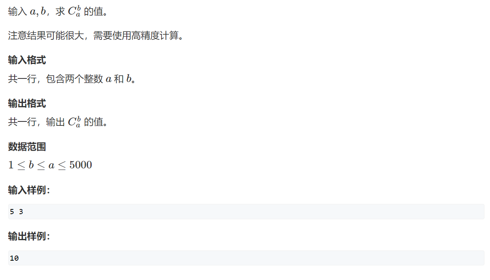


> **AcWing 题解**
```cpp
#include <iostream>
#include <algorithm>
#include <vector>

using namespace std;


const int N = 5010;

int primes[N], cnt;
int sum[N];
bool st[N];

//线性筛法筛质数
void get_primes(int n)
{
    for (int i = 2; i <= n; i ++ )
    {
        if (!st[i]) primes[cnt ++ ] = i;
        for (int j = 0; primes[j] <= n / i; j ++ )
        {
            st[primes[j] * i] = true;
            if (i % primes[j] == 0) break;
        }
    }
}


//返回 n 的阶乘中质因子 p 的次数 
int get(int n, int p)
{
    int res = 0;
    while (n)
    {
        res += n / p;
        n /= p;
    }
    return res;
}


vector<int> mul(vector<int> a, int b)
{
    vector<int> c;
    int t = 0;
 
    for (int i = 0; i < a.size(); i ++ )
    {
        t += a[i] * b;
        c.push_back(t % 10);
        t /= 10;
    }
    while (t)
    {
        c.push_back(t % 10);
        t /= 10;
    }
    return c;
}


int main()
{
    int a, b;
    cin >> a >> b;
    
	//筛出 1 到 a 的质数，因为 b 和 a - b 都比 a 小，所以 1 到 b 和 a - b的质数包含在 1 到 a 的质数中 
    get_primes(a);
    
	//求出1 到 a ，1 到 b 和 a - b每个质数的总次数 
    for (int i = 0; i < cnt; i ++ )
    {
        int p = primes[i];
        //C(a,b) 中 p 的总次数等于 a! 中 p 的次数减去 a - b! 中 p 的次数减去b! 中 p 的次数 
        sum[i] = get(a, p) - get(a - b, p) - get(b, p);
    }

    vector<int> res;
    res.push_back(1);
    
	//把每个质数乘起来，即上图最后一步的结果（分解质因数） 
    for (int i = 0; i < cnt; i ++ )
        for (int j = 0; j < sum[i]; j ++ )
            res = mul(res, primes[i]);
	
	//输出最终结果 
    for (int i = res.size() - 1; i >= 0; i -- ) printf("%d", res[i]);
    puts("");

    return 0;
}

```
</details>

### 🌳 8.5 卡特兰数

> **核心思想**：卡特兰数是一个在各种计数问题中出现的数列。它满足递推关系，并有多种组合数表示形式。
>
> **通项公式**：
> $$
> Cat_n = \frac{C_{2n}^n}{n+1} = \frac{1}{n+1}\binom{2n}{n}
> $$
>
> **应用**：n个节点的二叉树形态数、n对括号的合法匹配数、凸n+2边形的三角剖分数、出栈序列数等。

<strong>🔗 练习平台</strong>

| 来源 | 题目/题单 | 说明 |
| :--- | :--- | :--- |
| 洛谷 | https://www.luogu.com.cn/problem/U215548 | U215548 卡特兰数 |
| 洛谷 | https://www.luogu.com.cn/problem/U140713 | U140713 卡特兰数 |
| 洛谷 | https://www.luogu.com.cn/training/507379 | 卡特兰数（题单） |
| 洛谷 | https://www.luogu.com.cn/training/327894 | 【数学】卡特兰数（题单） |
| 洛谷 | https://www.luogu.com.cn/training/504110 | S③数学4-7    卡特兰数7星（题单） |

<details>
<summary><strong>🎯 AcWing 题目与题解</strong></summary>

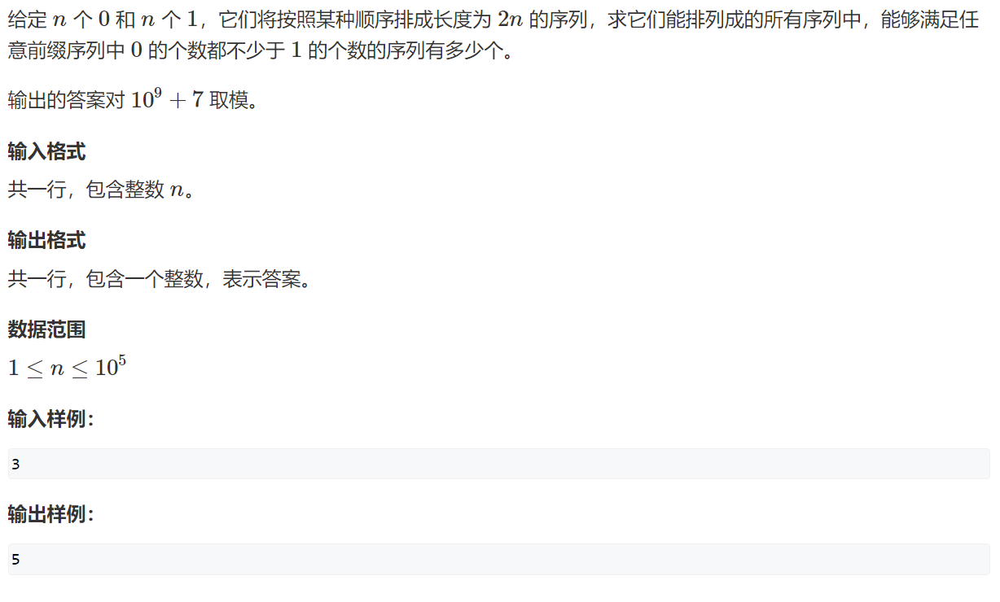


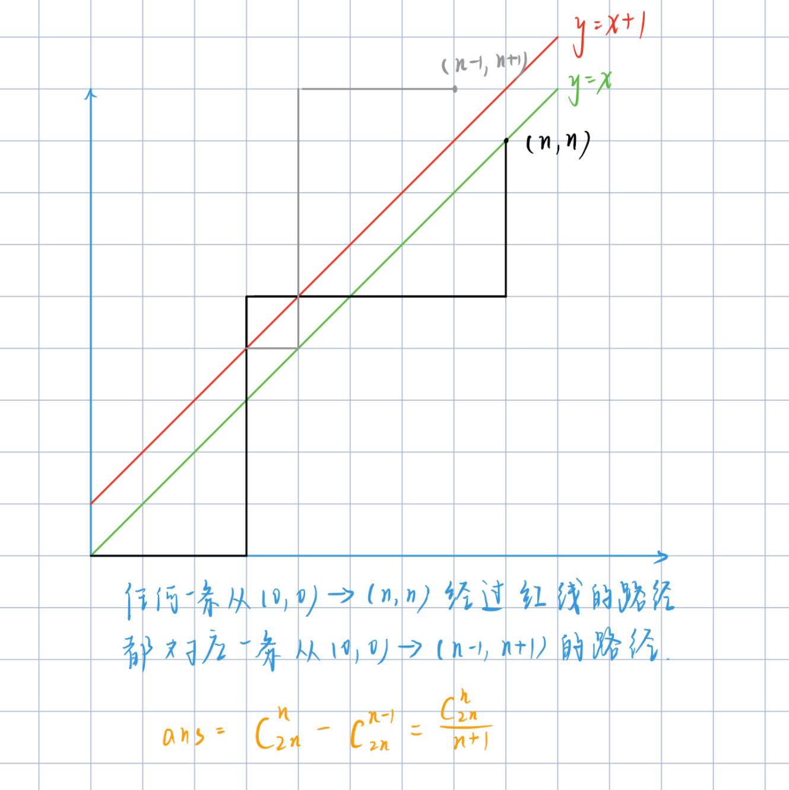


> **解法思路**：
>
> 本题是卡特兰数的直接应用。一个由 `n` 个 0 和 `n` 个 1 组成的序列，要求任意前缀中 0 的个数不少于 1 的个数，其方案数正好是第 `n` 个卡特兰数 $Cat_n$。
>
> 我们可以利用通项公式 $Cat_n = \frac{C_{2n}^n}{n+1}$ 来计算。
>
> 1.  计算 $C_{2n}^n \pmod p$。
> 2.  计算 $n+1$ 关于模 $p$ 的逆元 $(n+1)^{-1} \pmod p$。
> 3.  将两者相乘再取模。
>
> 其中 $C_{2n}^n$ 和逆元都可以用**快速幂**和**预处理阶乘**的方法（方法二）来高效计算。

> **AcWing 题解**
>
> 
```cpp

/*给定n个0和n个1，它们按照某种顺序排成长度为2n的序列
满足任意前缀中0的个数都不少于1的个数的序列的数量为： Cat(n) = C(2n, n) / (n + 1)*/


#include <iostream>
#include <algorithm>

using namespace std;

typedef long long LL;

const int N = 100010, mod = 1e9 + 7;


int qmi(int a, int b, int p)
{
    int res = 1;
    while (b)
    {
        if (b & 1) res = (LL)res * a % p;
        a = (LL)a * a % p;
        b >>= 1;
    }
    return res;
}
// C(2n, n) = (2n * (2n-1) * ... * (n+1)) / n!
int C(int a,int b, int p){
	if(b > a) return 0;
	int res = 1;
	for(int i = 1, j = a; i <= b; i++,j--){
		res = (LL)res * j % p;
		res = (LL)res * qmi(i, p - 2, p) % p;
	}
	return res;
} 


int main()
{
    int n;
    cin >> n;

    cout<<(LL)C(2 * n, n, mod) * qmi(n + 1, mod - 2, mod) % mod<<endl;

    return 0;
}

```

</details>

---

## ∪∩ 9. 容斥原理

> **核心思想**：容斥原理（Inclusion-Exclusion Principle）用于计算多个集合并集的大小。其核心是通过交替地加减各级交集的大小，来精确计算总元素数，避免重复计数。
>
> **公式**（以三个集合为例）：
> $$
> |A \cup B \cup C| = (|A| + |B| + |C|) - (|A \cap B| + |A \cap C| + |B \cap C|) + |A \cap B \cap C|
> $$
>
> **n个集合的一般形式**:
> $$
> \left| \bigcup_{i=1}^n A_i \right| = \sum_{i} |A_i| - \sum_{i<j} |A_i \cap A_j| + \sum_{i<j<k} |A_i \cap A_j \cap A_k| - \cdots + (-1)^{n+1} \left| \bigcap_{i=1}^n A_i \right|
> $$
> 
>
> 🧠 **记忆口诀**
>
> > "🔢 奇加偶减"：交集项的符号随集合数量的奇偶性变化（奇数加，偶数减）
>
> ⏱️ **复杂度分析**
>
> 容斥原理的时间复杂度为 **O(2ⁿ)**（n为集合数），因为需要计算所有可能的交集组合（共2ⁿ-1项），仅适合小规模问题（通常n≤10）。

### 📜 9.0 洛谷题单

| 来源 | 题目/题单                                | 说明                 |
| :--- | :--- | :--- |
| 洛谷 | https://www.luogu.com.cn/problem/U430606 | U430606 整除的数     |
| 洛谷 | https://www.luogu.com.cn/problem/U381835 | U381835 能被整除的数 |
| 洛谷 | https://www.luogu.com.cn/problem/U274900 | U274900 能被整除的数 |
| 洛谷 | https://www.luogu.com.cn/training/674529 | 容斥原理例题（题单） |
| 洛谷 | https://www.luogu.com.cn/training/106492 | 容斥（题单）         |
| 洛谷 | https://www.luogu.com.cn/training/187357 | 容斥与反演（题单）   |


### ✅ 9.1 能被整除的数

<strong>🔗 练习平台</strong>


| 来源 | 题目/题单 | 说明 |
| :--- | :--- | :--- |
| 洛谷 | https://www.luogu.com.cn/problem/U430606 | U430606 整除的数     |
| 洛谷 | https://www.luogu.com.cn/problem/U381835 | U381835 能被整除的数 |
| 洛谷 | https://www.luogu.com.cn/problem/U274900 | U274900 能被整除的数 |
| 洛谷 | https://www.luogu.com.cn/training/674529 | 容斥原理例题（题单） |


<details>
<summary><strong>🎯 AcWing 题目与题解</strong></summary>


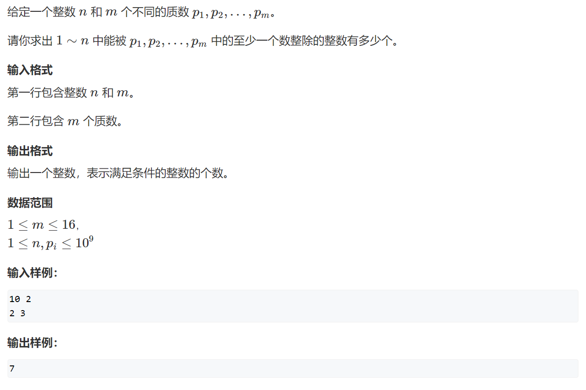


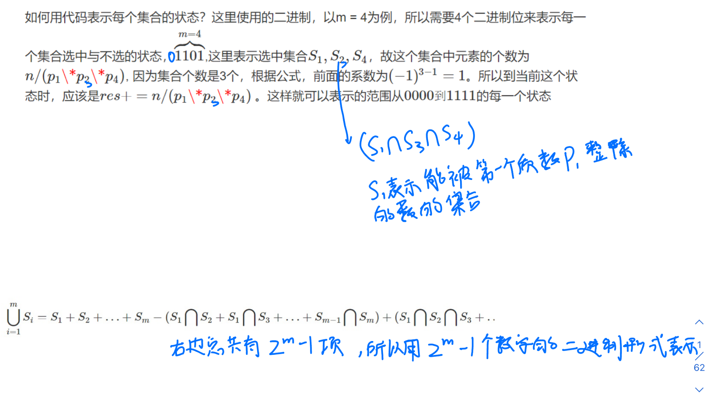


> **解法思路**：
>
> 设 $S_i$ 是 $1$到 $n$ 中能被 $p_i$ 整除的数的集合。问题求 $|S_1 \cup S_2 \cup \dots \cup S_m|$。
>
> 1.  **应用容斥原理**：
>     -   加上所有 $|S_i|$。$|S_i| = \lfloor n/p_i \rfloor$。
>     -   减去所有 $|S_i \cap S_j|$。$|S_i \cap S_j| = \lfloor n / \operatorname{lcm}(p_i, p_j) \rfloor$。因为 $p_i$ 都是质数，所以 $\operatorname{lcm}(p_i, p_j) = p_i \cdot p_j$。
>     -   加上所有 $|S_i \cap S_j \cap S_k| = \lfloor n/(p_i p_j p_k) \rfloor$。
>     -   以此类推...
> 2.  **二进制枚举**：我们可以用二进制数来枚举所有质数的组合。一个 `m` 位的二进制数，从 `1` 到 `2^m - 1`，每一位对应一个质数。如果第 `j` 位是 `1`，就表示选中第 `j` 个质数。
> 3.  **计算**：
>     -   遍历 `i` 从 `1` 到 `(1 << m) - 1`。
>     -   对于每个 `i`，计算它选中的质数的乘积 `t` 和选中质数的个数 `s`。
>     -   如果 `s` 是奇数，则将 $\lfloor n/t \rfloor$ 加到结果中。
>     -   如果 `s` 是偶数，则将 $\lfloor n/t \rfloor$ 从结果中减去。

> **AcWing 题解**
```cpp
#include <iostream>
#include <algorithm>

using namespace std;

typedef long long LL;

const int N = 20;

int p[N];


int main()
{
    int n, m;
    cin >> n >> m;
	
	//用 p 数组存储 m 个质数 
    for (int i = 0; i < m; i ++ ) cin >> p[i];

    int res = 0;
    //外层循环遍历从1 到 1111...(m个1，2^m - 1)的每一个数字，每个数字代表上图中第二幅图等式右边的一个加项 
    for (int i = 1; i < 1 << m; i ++ )
    {
        int t = 1, s = 0;//t 为选中集合对应质数的乘积 ，s 为选中集合的数量
		 
        //内层循环，确定当前加项的具体形式，从最低位开始遍历当前数字的每一位，每个数字都当成有 m 位，看当前数字有多少个 1，确定当前项是哪个集合或哪几个集合的交集 
        for (int j = 0; j < m; j ++ )
            if (i >> j & 1)
            {
            	//若 t * p[j] > n ，则 n / t = 0，无意义 
                if ((LL)t * p[j] > n)
                {
                    t = -1;
                    break;
                }
                t *= p[j];//乘上集合对应的质数
                s ++ ;//有一个 1 ，集合数量加一 
            }

        if (t != -1)
        { 
            //除对应集合的质数的乘积就是集合的数量
            if (s % 2) res += n / t;//奇数项为正 
            else res -= n / t;//偶数项为负 
        }
    }

    cout << res << endl;

    return 0;
}
```
</details>

---

## 🕹️ 10. 博弈论

> **核心思想**：博弈论研究的是决策者之间的策略互动。在算法竞赛中，通常指**公平组合游戏 (ICG)**，其特点是：两名玩家交替行动；在任意时刻，可执行的合法行动与轮到哪名玩家无关；不能行动的玩家判负。
>
> -   **必胜态 (N-state)**：存在一种走法，可以到达一个必败态。
> -   **必败态 (P-state)**：无论怎么走，都只能到达必胜态。
>
> **Nim 游戏**：
>
> -   **规则**：有 `n` 堆石子，两人轮流从任意一堆中取任意数量（至少一个）的石子，取走最后一个石子者胜。
> -   **Nim 和**：所有堆石子数量的异或和，$A_1 \oplus A_2 \oplus \dots \oplus A_n$。
> -   **结论**：Nim 和 **不为 0**，则先手**必胜**；Nim 和 **为 0**，则先手**必败**。
>
> **SG 函数**：
>
> -   **Mex (Minimum Excluded value)**：`mex(S)` 是不属于集合 `S` 的最小非负整数。
> -   **SG(x)**：一个游戏状态 `x` 的 SG 函数值定义为其所有后继状态 `y` 的 SG 值的 `mex`。`SG(x) = mex({SG(y_1), SG(y_2), ...})`。
> -   **结论**：`SG(x) != 0`，状态 `x` 是必胜态；`SG(x) == 0`，状态 `x` 是必败态。
> -   **游戏和的 SG 值**：多个独立游戏的和的 SG 值，等于各个游戏 SG 值的异或和。$SG(G) = SG(G_1) \oplus SG(G_2) \oplus \dots$

### 📜 10.0 洛谷 & LeetCode 题单

| 来源 | 题目/题单 | 说明 |
| :--- | :--- | :--- |
| leetcode | [292. Nim 游戏](https://leetcode.cn/problems/nim-game/)      | 292. Nim 游戏                           |
| 牛客     | [Nim游戏_牛客题霸_牛客网](https://www.nowcoder.com/practice/bb574ea90ed2495680fef88d59238231) | Nim游戏                                 |
| 牛客     | [【模板】Nim游戏_牛客题霸_牛客网](https://www.nowcoder.com/practice/8a43384a6a1c42eb9c7cbe47fb600db9) | 【模板】Nim游戏                         |
| 洛谷     | https://www.luogu.com.cn/problem/P2197                       | P2197 【模板】Nim 游戏                  |
| 洛谷     | https://www.luogu.com.cn/problem/T407141                     | T407141 0x3A-博弈论与SG函数-台阶nim游戏 |
| 洛谷     | https://www.luogu.com.cn/problem/U413951                     | U413951 NIM游戏（台阶Nim游戏）          |
| 洛谷     | https://www.luogu.com.cn/problem/U583675                     | U583675 Nim游戏-集合                    |
| 洛谷     | https://www.luogu.com.cn/problem/T580886                     | T580886 拆分-Nim游戏                    |

### 🗿 10.1 Nim 游戏

<details>
<summary><strong>🔗 练习平台</strong></summary>

- **LeetCode**: [292. Nim 游戏](https://leetcode.cn/problems/nim-game/)
- **牛客**: [【模板】Nim游戏](https://www.nowcoder.com/practice/8a43384a6a1c42eb9c7cbe47fb600db9)
- **洛谷**: [P2197 【模板】Nim 游戏](https://www.luogu.com.cn/problem/P2197)

</details>


<details>
<summary><strong>🎯 AcWing 题目与题解</strong></summary>

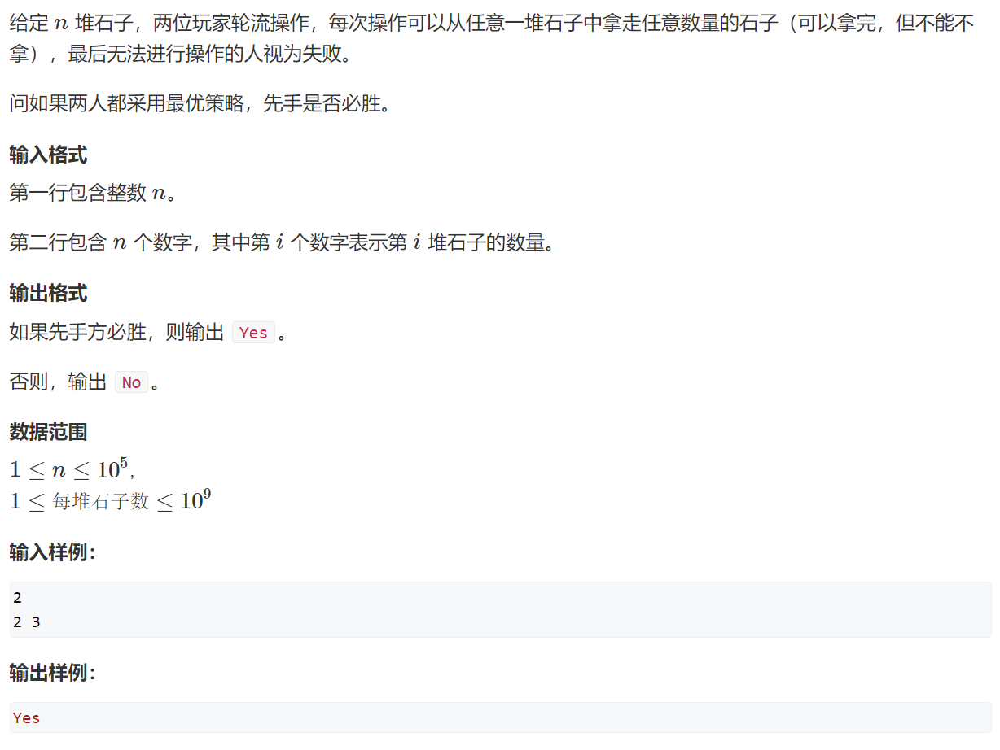

> **解法思路**：
>
> 这是最经典的公平组合游戏。根据 **Bouton's theorem**，Nim 游戏的胜负状态完全由所有堆石子数量的**异或和**（Nim Sum）决定。
>
> 1.  **必败态**：当所有石子数的异或和为 `0` 时，当前局面为必败态。因为无论怎么取，都会使异或和变为非 `0`。
> 2.  **必胜态**：当异或和不为 `0` 时，当前局面为必胜态。因为总存在一种取法，使得取完后新的异或和变为 `0`，从而将必败态留给对手。
> 3.  **算法**：直接计算所有堆石子数量的异或和，判断其是否为 `0` 即可。

> **AcWing 题解**

```cpp
#include <iostream>
using namespace std;

int main()
{
    int n;
    scanf("%d", &n);

    int res = 0;
    while (n -- )
    {
        int x;
        scanf("%d", &x);
        res ^= x;
    }
    
    // Nim 和不为 0，先手必胜
    if (res) puts("Yes");
    else puts("No");

    return 0;
}
```


</details>

### 🪜 10.2 台阶-Nim 游戏

<details>
<summary><strong>🔗 练习平台</strong></summary>

- **洛谷**: [T407141 台阶nim游戏](https://www.luogu.com.cn/problem/T407141)
- **洛谷**: [U413951 NIM游戏（台阶Nim游戏）](https://www.luogu.com.cn/problem/U413951)

</details>

<details>
<summary><strong>🎯 AcWing 题目与题解</strong></summary>

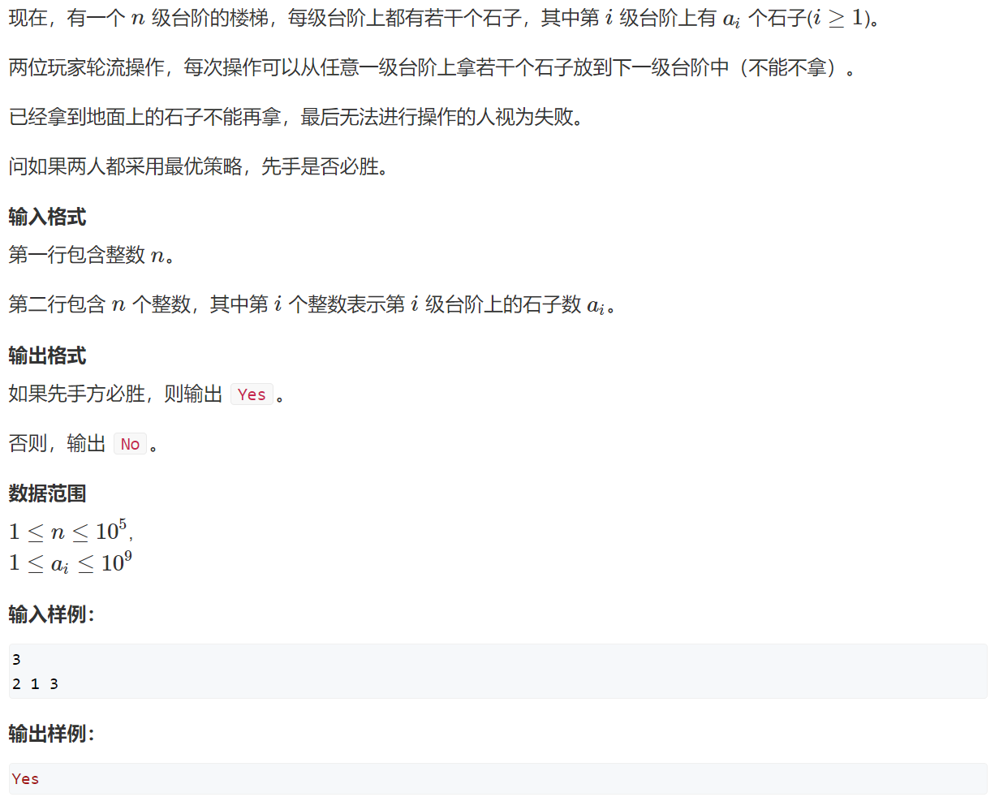

> **解法思路**：
>
> 这是 Nim 游戏的一个巧妙变体。石子只能从高台阶移向低台阶。
>
> 1.  **关键洞察**：位于**偶数**台阶（2, 4, 6...）上的石子是“安全”的。如果对手将石子从奇数台阶移动到偶数台阶，你可以立即将这些石子再移动到下一个偶数台阶，对手的操作被无效化。最终，将石子移动到第 0 级台阶相当于移出游戏。
> 2.  **等价模型**：因此，偶数台阶上的石子对游戏胜负没有影响。整个游戏等价于一个只在**奇数**台阶（1, 3, 5...）上进行的标准 Nim 游戏。
> 3.  **算法**：我们只关心所有位于**奇数编号**台阶上的石子堆。计算这些堆的 Nim 和（异或和）。
>     -   如果奇数台阶的 Nim 和不为 `0`，先手必胜。
>     -   如果为 `0`，先手必败。

> **AcWing 题解**

```cpp

//奇数台阶上的值的异或值为非0，则先手必胜，反之必败！

#include <iostream>
#include <algorithm>

using namespace std;

const int N = 100010;

int main()
{
    int n;
    scanf("%d", &n);

    int res = 0;
    for (int i = 1; i <= n; i ++ )
    {
        int x;
        scanf("%d", &x);
        //奇数二进制形式最低位为 1 ，&1 后为 1，偶数为 0 
        if (i & 1) res ^= x;
    }

    if (res) puts("Yes");
    else puts("No");

    return 0;
}

```
</details>


### 🧩 10.3 集合-Nim 游戏 (SG 函数)

<details>
<summary><strong>🔗 练习平台</strong></summary>

- **洛谷**: [U583675 Nim游戏-集合](https://www.luogu.com.cn/problem/U583675)

</details>

<details>
<summary><strong>🎯 AcWing 题目与题解</strong></summary>

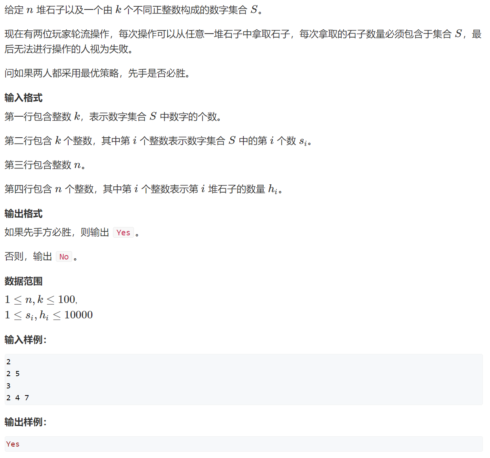

> **解法思路**：
>
> 这是一个多个独立游戏的和，每堆石子是一个独立的游戏。与标准 Nim 游戏不同的是，每次可取走的石子数量受限于一个集合 `S`。
>
> 1.  **SG 定理**：根据 Sprague-Grundy 定理，整个游戏的 SG 值是每堆石子的 SG 值的异或和。
> 2.  **单个游戏 SG 值**：对于一堆 `x` 个石子的游戏，其后继状态是 `x - s_i`（其中 `s_i` 是集合 `S` 中的元素且 `x >= s_i`）。根据 SG 函数定义：
>     $$sg(x) = \text{mex}(\{sg(x - s_i) \mid s_i \in S, x \ge s_i\})$$
> 3.  **计算方法**：我们可以用**记忆化搜索**（或动态规划）来计算 `sg(x)` 的值，`f[x]` 存储 `sg(x)`。
>     -   `sg(0)` 的后继状态为空集，`sg(0) = mex(\emptyset) = 0`。
>     -   计算 `sg(x)` 时，收集所有后继状态 `x-s_i` 的 `sg` 值，放入一个 `set` 中，然后求这个 `set` 的 `mex` 值。
> 4.  **最终判断**：计算所有堆的 `sg` 值的异或和，如果不为 `0`，则先手必胜。

> **AcWing 题解**
```cpp
#include <cstring>
#include <iostream>
#include <algorithm>
#include <unordered_set>

using namespace std;

const int N = 110, M = 10010;

int n, k;
int s[N], f[M];//s 存储的是可拿取的石子数量，f 存储的是存储已经计算过的状态（石子数量）的 Nim 值，避免重复计算 


int sg(int x)
{
    if (f[x] != -1) return f[x];
    
	// S 要在函数内部定义 ，因为每次递归 S 都是针对当前状态的，S用于当前状态之后的状态的sg值 
    unordered_set<int> S;
    
    //递归计算当前状态 x 可以到达的之后的所有状态的值插入 S（x 能否减可拿取石子数量集合 S 中的元素） 
    for (int i = 0; i < k; i ++ )
    {
        int sum = s[i];
        if (x >= sum) S.insert(sg(x - sum));
    }
	
	//递归完之后就剩当前状态 x 没有值（不在 S 集合中）了，遍历自然数，如果有不在 S 中的自然数便是当前状态 x 的 sg 值 
    for (int i = 0; ; i ++ )
        if (!S.count(i))
            return f[x] = i;
}


int main()
{
    cin >> k;
    for (int i = 0; i < k; i ++ ) cin >> s[i];
    cin >> n;

    memset(f, -1, sizeof f);

    int res = 0;
    for (int i = 0; i < n; i ++ )
    {
        int x;
        cin >> x;
        res ^= sg(x);
    }

    if (res) puts("Yes");
    else puts("No");

    return 0;
}
```
</details>


### 💥 10.4 拆分-Nim 游戏 (SG 函数)

<details>
<summary><strong>🔗 练习平台</strong></summary>

- **洛谷**: [T580886 拆分-Nim游戏](https://www.luogu.com.cn/problem/T580886)

</details>

<details>
<summary><strong>🎯 AcWing 题目与题解</strong></summary>

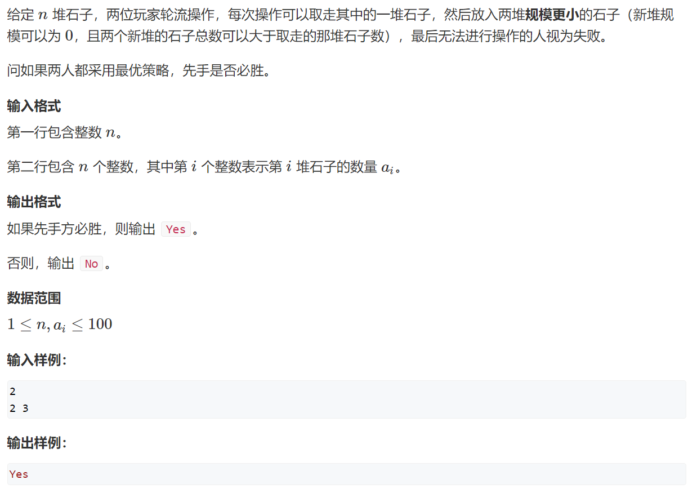

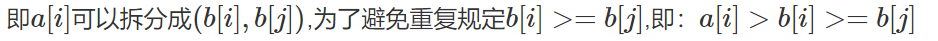

> **解法思路**：
>
> 这是一个拆分游戏。一堆石子可以被拆分成两堆非空石子，这相当于当前游戏结束，变成了两个新的独立游戏的和。
>
> 1.  **SG 定理**：当一个游戏可以分解为多个子游戏的和时，原游戏的 SG 值等于所有子游戏 SG 值的异或和。
> 2.  **状态转移**：对于一堆 `x` 个石子的游戏，一个合法的移动是将其拆分为 `i` 和 `j` 两堆，其中 `i > 0`, `j > 0` 且 `i + j = x`。这个操作的后继状态是 `游戏i + 游戏j`。
> 3.  **计算 SG 值**：根据 SG 定理，后继状态的 SG 值为 `sg(i) ^ sg(j)`。因此，`x` 的 SG 值为：
>     $$sg(x) = \text{mex}(\{sg(i) \oplus sg(j) \mid i+j=x, i,j > 0\})$$
> 4.  **计算方法**：同样使用记忆化搜索。计算 `sg(x)` 时，需要遍历所有可能的拆分 `(i, x-i)`，计算 `sg(i) ^ sg(x-i)`，将这些值放入 `set`，然后求 `mex`。
> 5.  **最终判断**：整个游戏是多堆石子的和，所以最终胜负由初始时所有堆的 `sg` 值的异或和决定。

> **AcWing 题解**
```cpp
#include <cstring>
#include <iostream>
#include <algorithm>
#include <unordered_set>

using namespace std;

const int N = 110;


int n;
int f[N];


int sg(int x)
{
    if (f[x] != -1) return f[x];

    unordered_set<int> S;
    
    //x > i >= j
    for (int i = 0; i < x; i ++ )
        for (int j = 0; j <= i; j ++ )
            S.insert(sg(i) ^ sg(j));

    for (int i = 0;; i ++ )
        if (!S.count(i))
            return f[x] = i;
}


int main()
{
    cin >> n;

    memset(f, -1, sizeof f);

    int res = 0;
    while (n -- )
    {
        int x;
        cin >> x;
        res ^= sg(x);
    }

    if (res) puts("Yes");
    else puts("No");

    return 0;
}
```

</details>