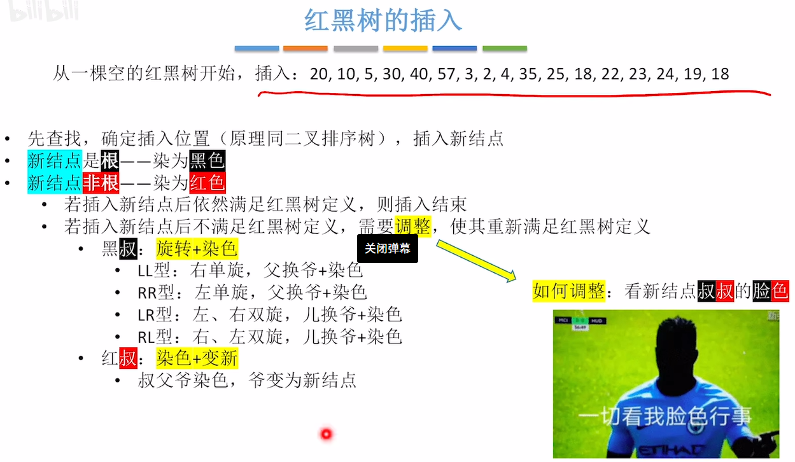

[[toc]]


# 1 绪论

## 1.1 基本概念

数据结构三要素：

1、逻辑结构，分为线性结构和非线性结构

（1）线性结构，元素之间一一对应，如线性表、队列和栈

（2）非线性结构，非线性结构中的节点存在着一对多的关系，如集合、树、图

2、存储结构（物理结构），分为顺序存储结构、链式存储结构、索引存储结构、散列存储结构

3、数据的运算


## 1.2 算法和算法评价

时间复杂度：如果一个问题的规模是`n`，解这一问题的某一算法所需要的时间为`T(n)`，它是`n`的某一函数。`T(n)`称为这一算法的“时间复杂度”。当输入量`n`逐渐加大时，时间复杂度的极限情形称为算法的“渐近时间复杂度”

空间复杂度：算法的空间复杂度S(n)定义为该算法所耗费的存储空间，它是问题规模n的函数。空间复杂度大多数情况下等于递归调用的深度。


# 2 线性表

## 2.1 线性表的顺序表示

### 2.1.1 定义

线性表的顺序存储又称 顺序表 。它是用一组地址连续的存储单元依次存储线性表中的数据元素，从而使得**逻辑上相邻的两个元素在物理上也相邻。**顺序表的特点是 表中元素的逻辑顺序与其物理顺序相同。

静态分配：

```c++
// 顺序表实现（静态分配）
#define MaxSize 10

#include <stdio.h>
#include <stdlib.h>

typedef struct {
    int data[MaxSize];
    int length;
} SqList;

void InitList(SqList &L) {
    L.length = 0;
}

int main() {
    SqList L;
    InitList(L);
    for (int i = 0; i < MaxSize; i++) {
        printf("data[%d]=%d\n", i, L.data[i]);
    }
    printf("%d", L.length);
    return 0;
}
```

动态分配：

```c++
//顺序表实现（动态分配）
#define InitSize 10     // 初始化顺序表的长度

#include <stdio.h>
#include <stdlib.h>

typedef struct {
    int *data;      // 声明动态分配数组的指针
    int MaxSize;    // 最大长度
    int length;     // 当前长度
} SeqList;

// 初始化顺序表
void InitList(SeqList &L) {
    // 用malloc函数申请一片连续的存储空间
    L.data = (int *) malloc(sizeof(int) * InitSize);
    L.length = 0;
    L.MaxSize = InitSize;
}

// 增加动态数组的长度，本质上是将数据从旧的区域复制到新区域
void IncreaseSize(SeqList &L, int len) {
    // 使p指针和data指向同一目标
    int *p = L.data;
    L.data = (int *) malloc(sizeof(int) * (L.MaxSize + len));  // 申请一块新的连续空间用于存放新表，并将data指针指向新区域
    for (int i = 0; i < L.length; i++) {
        L.data[i] = p[i];  //将数据复制到新区域
    }
    L.MaxSize += len;
    free(p);  //释放原区域的内存空间
}

// 打印顺序表
void printList(SeqList L) {
    for (int i = 0; i < L.length; i++) {
        printf("%d, ", L.data[i]);
    }
}

int main() {
    SeqList L;
    InitList(L);
    printf("增加前顺序表的长度：%d \n", L.MaxSize);
    printList(L);
    IncreaseSize(L, 5);
    printf("增加后顺序表的长度：%d \n", L.MaxSize);
    return 0;
}
```

> 动态分配并不是链式存储，同样属于顺序存储结构，物理结构没有变化，依然是随机存储方式，只是分配的空间大小可以在运行时动态决定


### 2.1.2 基本操作

| 操作                 | 最好时间复杂度 | 最坏时间复杂度 | 平均时间复杂度 |
| -------------------- | -------------- | -------------- | -------------- |
| 插入                 | O(1)           | O(n)           | O(n)           |
| 删除                 | O(1)           | O(n)           | O(n)           |
| 按值查找（顺序查找） | O(1)           | O(n)           | O(n)           |
| 按序号查找           | O(1)           | O(1)           | O(1)           |


## 2.2 线性表的链式表示

### 2.2.1 定义

（1）单链表

1、定义

用**链式存储**实现了线性结构。一个结点存储一个数据元素，各结点间的前后关系用一个**指针**表示。

2、特点

- 优点：不要求大片连续空间，改变容量方便。插入和删除操作不需要移动大量元素

- 缺点：不可随机存取，要耗费一定空间存放指针。

3、两种实现方式：

- 带头结点，写代码更方便。头结点不存储数据，头结点指向的下一个结点才存放实际数据。（L = NULL;)

- 不带头结点，麻烦。对第一个数据结点与后续数据结点的处理需要用不同的代码逻辑，对空表和非空表的处理需要用不同的代码逻辑。(L->next = NULL)

4、代码定义实现

```c++
typedef struct LNode {
    int data;
    struct LNode* next;  // 由于指针域中的指针要指向的也是一个节点，因此要声明为 LNode 类型
} LNode, *LinkList;      //这里的*LinkList强调元素是一个单链表.LNode强调元素是一个节点。本质上是同一个结构体
```

（2）双链表

代码定义实现

```c++
typedef struct DNode {
    int data;   // 数据域
    struct DNode *prior, *next;     // 前驱和后继指针
}DNode, *DLinkList;
```


（3）循环链表


（4）静态链表

1、定义

用数组的方式实现的链表。分配一整片连续的内存空间，各个结点集中安置，**每个结点包括了数据元素和下一个结点的数组下标。**

2、特点

- 优点：增、删操作不需要大量移动元素。
- 缺点：不能随机存取，只能从头结点开始依次往后查找，**容量固定不变！**

3、代码定义实现

- 定义1

```c++
#define MaxSize 10        //静态链表的最大长度
struct Node{              //静态链表结构类型的定义  
    ElemType data;        //存储数据元素    
    int next;             //下一个元素的数组下标
};
```

- 定义2

```c++
#define MaxSize 10        //静态链表的最大长度
typedef struct{           //静态链表结构类型的定义       
    ELemType data;        //存储数据元素     
    int next;             //下一个元素的数组下标
}SLinkList[MaxSize];

void testSLinkList(){      
    SLinkList a;
}
```

> 第一种是我们更加熟悉的写法，第二种写法则更加侧重于强调 a 是一个静态链表而非数组。

### 2.2.2 基本操作

（1）单链表

1、时间复杂度

- **插入**：在单链表的头部或尾部插入元素可以在O(1)时间内完成。但如果需要在特定位置i之前插入元素，则需要先遍历到该位置，这将花费O(n)的时间。
- **删除**：删除尾部元素可以在O(1)时间内完成（如果存在指向最后一个元素的指针）。然而，要删除特定位置i的元素，首先需要找到它，这通常需要O(n)的时间。
- **按值查找（顺序查找）**：从链表的第一个元素开始逐一检查直到找到目标值或到达链表末尾。最佳情况下，目标值位于第一个节点处，最坏情况和平均情况下则可能需要遍历整个链表。
- **按序号查找**：为了访问第i个元素，必须从头节点开始逐个节点遍历直到到达目标节点。因此，查找操作的时间复杂度取决于目标节点的位置，最好的情况是查找第一个节点，而最坏的情况是查找最后一个节点或者找不到节点，平均情况下需要遍历一半的链表长度，即O(n)。

2、空间复杂度

单链表的插入和删除操作的空间复杂度均为O(1)。

（2）双链表

（3）循环链表

（4）静态链表

用数组的方式实现的链表。分配一整片连续的内存空间，各个结点集中安置，每个结点包括了数据元素和下一个结点的数组下标。


## 2.3 顺序表和链表的对比

链表与顺序表的各种操作的复杂度如下所示：

| 操作            | 链表 | 顺序表 |
| --------------- | ---- | ------ |
| 访问元素        | O(n) | O(1)   |
| 在头部插入/删除 | O(1) | O(n)   |
| 在尾部插入/删除 | O(n) | O(1)   |
| 在中间插入/删除 | O(n) | O(n)   |

> 虽然表面看起来复杂度都是 O(n)，但是链表与顺序表的插入与删除是不同的操作，链表主要消耗的时间主要是遍历查找，删除和操作的复杂度都是 O(1)。顺序表查找比较快，主要耗时是在添加以及覆盖上面。

详细对比

|                | 顺序表                                                       | 链表                                                         |
| -------------- | ------------------------------------------------------------ | ------------------------------------------------------------ |
| 逻辑结构       | 属于线性表，都是线性结构                                     | 属于线性表，都是线性结构                                     |
| 存储结构       | 顺序存储 优点：支持随机存取，存储密度高 缺点：大片连续空间分配不方便，改变容量不方便 | 链式存储 优点：离散的小空间分配方便，改变容量方便 缺点：不可随机存取，存储密度低 |
| 基本操作——创建 | 需要预分配大片连续空间。若分配空间过小，则之后不方便拓展容量；若分配空间过大，则浪费内存资源。 静态分配：静态数组，容量不可改变。 动态分配：动态数组，容量可以改变，但是需要移动大量元素，时间代价高（使用`malloc()`、`free()`）。 | 只需要分配一个头结点或者只声明一个头指针。                   |
| 基本操作——销毁 | 修改 `Length` = 0 静态分配：静态数组——系统自动回收空间。 动态分配：动态数组——需要手动`free()`。 | 依次删除各个结点 `free()`。                                  |
| 基本操作——增删 | 插入 / 删除元素要将后续元素后移 / 前移； 时间复杂度：O(n)，时间开销主要来自于移动元素。 | 插入 / 删除元素只需要修改指针； 时间复杂度：O(n)，时间开销主要来自查找目标元素。 |
| 基本操作——查找 | 按位查找：O(1) 按值查找：O(n)，若表内元素有序，可在O(log2n) 时间内找到（二分法） | 按位查找：O(n) 按值查找：O(n)                                |

​	

# 3 栈和队列

## 3.1 栈的定义

栈是特殊的线性表：只允许在一端进行插入或删除操作，其逻辑结构与普通线性表相同。

1. 栈顶：允许进行插入和删除的一端 （最上面的为栈顶元素）。
2. 栈底：不允许进行插入和删除的一端 （最下面的为栈底元素）。
3. 空栈：不含任何元素的空表。
4. 特点：**后进先出**（后进栈的元素先出栈）、LIFO（Last In First Out）。
5. 缺点：**栈的大小不可变**，解决方法：共享栈。

> 栈的数学性质：n个不同元素进栈，出栈元素不同排列的个数是$\frac{1}{n+1} C_{2n}^{n}$
>

## 3.2 栈的实现

### 3.2.1 顺序栈

采用顺序从存储的栈称为顺序栈，利用一组地址连续的存储单元存放自栈底到栈顶的数据元素，同时附设一个智真（top）指示当前栈顶元素的位置。代码实现如下：

（1）定义

```c++
#define MaxSize 10
typedef struct {
    int data[MaxSize];  // 存放栈中元素
    int top;            // 栈顶指针，记录栈顶坐标
}SqStack;
```

（2）操作

```c++
// 1、初始化栈 
void InitStack(SqStack& S){
	S.top = -1;
}
// 2、判断是否为空
bool isEmpty(SqStack& S){
	return S.top == -1;
}
// 3、进栈操作
bool Push(SqStack& S, int x){
	if(S.top == MaxSize - 1){
		return false;
	}else{
		S.data[++S.top] = x;
		return true;
	}
}
// 4、出栈操作
bool Pop(SqStack& S, int& x){
	if(S.top == -1){
		return false;
	} else{
		x = S.data[S.top--];
		return true;
	}
}
// 5、读栈顶元素
int GetTop(SqStack& S) {
	if (S.top == -1) {
		cout << "当前栈为空" << endl;
		return NULL;
	}
	return S.data[S.top];
}
```

（3）调用示例

```c++
int main () {
	SqStack Sq;
	InitStack(Sq);
	int *a = new int[5] {0, 5, 9, 8, 510};
	int x;
	for(int i = 0; i < 5; i++) {
		Push(Sq, a[i]);
		x = GetTop(Sq);
		printf("top = %d, ", x);
	}
	return 0;
}
```

### 3.2.2 共享栈

让两个顺序栈共享一个一维数组空间，将两个栈的栈底分别设置在共享空间的两端，两个栈顶同时向共享空间的中间延伸。代码实现：

```c++
#define MaxSize 10         //定义栈中元素的最大个数
typedef struct{       
    ElemType data[MaxSize];       //静态数组存放栈中元素  
    int top0;                     //0号栈栈顶指针  
    int top1;                     //1号栈栈顶指针
}ShStack;

// 初始化栈
void InitSqStack(ShStack &S){    
    S.top0 = -1;      
    S.top1 = MaxSize;   
}
```

### 3.2.3 链栈

采用链式存储的栈称为链栈。链栈的优点是便于多个栈共享存储空间和提高效率，且不存在栈满上溢的清空。通常采用单链表实现，并且规定所有操作都是在单链表的表头进行上的（因为头结点的 `next` 指针指向栈的栈顶结点）。

（1）定义

```c++
typedef struct LinkNode {
    int data;
    struct LinkNode *next;
} *LiStack;
```

（2）初始化

```c++
bool InitStack(LiStack &L) {
    L = (LinkNode *) malloc(sizeof(LinkNode));
    if(L == NULL){
        return false;
    }
    L->next = NULL;
    return true;
}
```

## 3.3 队列的定义

队列是操作受限的线性表：只允许在一端进行插入 (入队)，另一端进行删除 (出队)。队列的特性：**先进先出（FIFO, First In First Out）**

队头（Front），允许删除的一端，

队尾（Rear），允许插入的一端

空队列，不含任何元素的空表

## 3.4 队列的实现

### 3.4.1 队列的顺序存储

（1）定义

队列的顺序实现是指分配一块**连续的存储单元**存放队列中的元素，并附设两个指针:

队头指针front指向队头元素，队尾指针rear指向队尾元素的下一个位置。代码如下：

```c++
#define MaxSize 100
typedef struct {
	int data[MaxSize];
	int front, rear;
} SqQueue;
```

（2）操作

```c++
// 1、初始化队列
bool InitQueue(SqQueue& Q) {
	Q.front = 0;
	Q.rear = 0;
	return true;
}
// 2、判断是否为空
bool isEmpty(SqQueue& Q) {
	return Q.front == Q.rear;
}
// 3、进队列
bool EnQueue(SqQueue& Q, int x) {
	if(Q.rear == MaxSize) {
		return false;
	} else {
		Q.data[Q.rear++] = x;
		return true;
	}
}
// 4、出队列
bool DeQueue (SqQueue& Q, int& x) {
	if(Q.front == Q.rear){
		return false;
	}
	x = Q.data[Q.front++];
	return true;
}
```

（3）调用示例

```c++
int main () {
	SqQueue q;
	InitQueue(q);
	vector<int> a = {5, 8, 4, 65, 12};
	for(int i = 0; i< a.size();i++){
		EnQueue(q, a[i]);
		printf("rear = %d, ", q.data[q.rear -1]);
	}
	return 0;
}
```

### 3.4.2 循环队列

1、为了解决“假溢出”的问题，提出了循环队列的概念。将顺序队列臆造为一个环状的空间，即把存储队列元素的表**从逻辑上视为一个环**，称为循环队列。当队首指针`Q.front=MaxSize-1`后，再前进一个位置就自动到0，这可以利用除法取余运算(%）来实现。

> 初始时：`Q.front = Q.rear = 0`
>
> 队首指针进1：`Q.front = (Q.front + 1) % MaxSize`
>
> 队尾指针进1：`Q.rear = (Q.rear + 1) % MaxSize`
>
> 队列长度：`(Q.rear + MaxSize - Q.front) % MaxSize`
>
> 出队入队时：`指针都往顺时针方向进1`

2、为了区分队空队满的情况，有以下三种处理方式：

（1）牺牲一个存储单元来区分队空或队满（或者增加辅助变量），这是一种普遍的方式，约定：队头指针在队尾指针的下一位置作为队满的标志。

> 此时：
>
> 队满条件： `(Q.rear + 1) % MaxSize == Q.front `
>
> 队空条件：`Q.front == Q.rear`
>
> 队列中的元素个数：`(Q.rear + MaxSize - Q.front) % MaxSize`

（2）类型中增设表示元素个数的数据成员

（3）类型中增设tag数据成员

3、入队和出队代码

```c++
// 将x入队
bool EnQueue(SqQueue &Q, int x) {
    if ((Q.rear + 1) % MaxSize == Q.front) {    // 队满
        cout << "队满，无法插入" << endl;
        return false;
    }
    Q.data[Q.rear] = x;
    Q.rear = (Q.rear + 1) % MaxSize;
    return true;
}

// 出队，并将出队元素存储到x中
bool DeQueue(SqQueue &Q, int &x) {
    if (Q.rear == Q.front) {
        cout << "队空，无法出队" << endl;
        return false;
    }
    x = Q.data[Q.front];
    Q.front = (Q.front + 1) % MaxSize;
    return true;
}

```

### 3.4.3 队列的链式存储结构

（1）定义

队列的链式表示称为链队列，它实际上是一个同时带有队头指针和队尾指针的单链表。

（2）操作

```c++
typedef struct LinkNode {  // 链队结点
    int data;
    struct LinkNode *next;
} LinkNode;

typedef struct {             // 链式队列
    LinkNode *front, *rear;  // 头尾指针
} LinkQueue;
```

### 3.4.4 双端队列

> 定义：
>
> 双端队列是允许从两端插入、两端删除的线性表。
>
> 如果只使用其中一端的插入、删除操作，则等同于栈。
>
> 输入受限的双端队列：允许一端插入，两端删除的线性表。
>
> 输出受限的双端队列：允许两端插入，一端删除的线性表。


# 4 串

## 4.1 定义

串：即字符串（String）是由零个或多个字符组成的有限序列。

串的长度：中字符的个数 n，n = 0 时的串称为空串。

子串：串中任意个连续的字符组成的子序列。

主串：包含子串的串。

字符在主串中的位置：字符在串中的序号。

子串在主串中的位置：子串的第一个字符在主串中的位置 。

## 4.2 串的存储结构

1、定长顺序存储表示

```c++
typedef struct {
    char ch[MAXLEN];    // 每个分量存储一个字符
    int length;         // 串的实际长度
} SString;
```

2、堆分配存储表示（动态存储）

```c++
typedef struct {
    char *ch;       // 按串长分配存储区，ch指向串的基地址
    int length;     // 串的长度
} HString;
```


## 4.3 KMP算法

next[j]就是记录着j（包括j）之前的子串的相同前后缀的长度。

那么 s[i] 与 s[j+1] 不相同，就要找 j+1前一个元素在next数组里的值（就是next[j]）。

```c++
#include<iostream>
#include<vector>
#include<stack>
#include<algorithm>
#include<string>
using namespace std;
void getNext(int* next, string &s){
	int j = -1;
	next[0] = j;
	for(int i = 1; i <s.size();i++){
		while(j>=0 && s[j+1]!=s[i]){
			j = next[j];
		}
		if(s[j+1] == s[i]){
			j++;
		}
		next[i] = j;
	}
}
int KMP_match(string& s, string& subString){
	if(subString.size() == 0){
		return 0;
	}
	vector<int> next(subString.size());
	getNext(&next[0], subString);
	int j = -1;
	for(int i = 0;i < s.size();i++){
		while(j>=0 && subString[j+1]!=s[i]){
			j = next[j];
		}
		if(subString[j+1]==s[i]){
			j++;
		}
		if(j == subString.size()-1){
			return i-j;
		}
	}
	return -1;
	
}
int main () {
	string s = "abcaccabcab";
	string subString = "abcab";
	printf("%d", KMP_match(s, subString));
	return 0;
}
```

# 5 树

## 5.1 树的定义

1. 树是n（n≥0）个结点的有限集合，n = 0时，称为**空树**。
2. 空树中应满足：
   1. 有且仅有一个特定的称为根的结点。
   2. 当n > 1时，其余结点可分为m（m>0）个互不相交的有限集合T1，T2，…，Tm，其中每个集合本身又是一棵树，并且称为根结点的子树。
3. 度：树中一个结点的孩子个数称为该结点的度。**所有结点的度的最大值是树的度。**
4. 度大于0的结点称为分支结点，度为0的结点称为叶子结点。
5. 结点的层次（深度）：从上往下数。
6. 结点的高度：从下往上数。
7. 树的高度（深度）：树中结点的层数。
8. 有序树：逻辑上看，树中结点的各子树从左至右是有次序的，不能互换。
9. 若树中结点的各子树从左至右是有次序的，不能互换，则该树称为有序树，否则称为无序树。
10. 树中两个结点之间的路径是由这两个结点之间所经过的结点序列构成的，而路径长度是路径上所经过的边的个数。
11. 森林：森林是m（m≥0）棵互不相交的树的集合。


### 5.1.2 树的常考性质

1、结点数 = 总度数 + 1

2、度为 m 的树、m 叉树的区别：

| 度为m的树                       | m叉树的区别                   |
| ------------------------------- | ----------------------------- |
| 任意结点的度≤m（最多m个孩子）   | 任意结点的度≤m（最多m个孩子） |
| 至少有一个结点度=m（有m个孩子） | 允许所有结点的度都＜m         |
| 一定是非空树，至少有m+1个结点   | 可以是空树                    |

3、度为m的树中第i层至多有 $m^{i-1}$ 个结点（i ≥1），m叉树中第i层至多有 $m^{i-1}$ 个结点（i ≥1）

4、高度为h的m叉树至多有：
$$
1 + m + m^{2}+ ... + m^{h-1} = \frac{m^h - 1}{m - 1}
$$
5、高度为 h 的 m 叉树至少有 h 个结点；高度为 h、度为 m 的树至少有（h+m-1）个结点。

6、m 叉树，具有 n 个结点的最小高度 = 度为m，具有n个结点的树的最小高度，为
$$
⌈log_m[n(m-1)+1]⌉
$$
7、度为m，具有n个结点的树的最大高度为 n-m+1

8、树的遍历：先根遍历、后根遍历

## 5.2 二叉树

### 5.2.1 二叉树的定义

1、二叉树是 n（n≥0）个结点的有限集合：

（1）要么为空二叉树，即 n = 0。

（2）要么由一个根结点和两个互不相交的被称为根的左子树和右子树组成，左子树和右子树又分别是一棵二叉树。

2、二叉树的特点：

（1）每个结点至多只有两棵子树。

（2）左右子树不能颠倒（**二叉树是有序树**）。

3、二叉树的五种状态：

空二叉树、只有左子树、只有右子树、只有根节点、左右子树都有


### 5.2.2 二叉树的性质

1、设非空二叉树中度为 0、1 和 2 的结点个数分别为 n0、n1 和 n2，则 n0 = n2 + 1。

推导过程：设树中结点总数为 n，则：n = n0 + n1 + n2，n = n1 + 2*n2 + 1。

2、二叉树第 i 层至多有 2^(i-1) 个结点 (i≥1)。

3、高度为 h 的二叉树至多有 2^h - 1 个结点（满二叉树）。

4、具有 n 个 (n>0) 结点的完全二叉树的高度 h 为 $\lceil log_{2}(n+1) \rceil$或 $\lfloor log₂n\rfloor + 1$。

5、对于完全二叉树，可以由总结点数 n 推出度为 0、1 和 2 的结点个数 n0、n1 和 n2。

推导过程：n1 = 0 或 1，n0 = n2 + 1，则 n0 + n2 一定是奇数。

若完全二叉树有 2k（偶数）个结点，则有 n1 = 1，n0 = k，n2 = k - 1；

若完全二叉树有 2k - 1（奇数）个结点，则有 n1 = 0，n0 = k，n2 = k - 1；


### 5.2.3 二叉树的存储结构

（1）顺序存储结构

包含的结点个数有上限

顺序存储完全二叉树：定义一个长度为 MaxSize 的数组 t，按照从上至下、从左至右的顺序依次存储完全二叉树中的各个结点。让第一个位置空缺，保证数组中下标和结点编号一致。

> **完全二叉树和满二叉树采用顺序存储比较合适这种存储方式**

代码实现：

```c++
#define MaxSize 100
// 二叉树的顺序存储
struct TreeNode {
    int data;   // 结点中的数据元素
    bool isEmpty;   // 结点是否为空
};
TreeNode t[MaxSize];    // 定义一个长度为MaxSize的数组t，按照从上到下，从左到右的顺序依次存储完全二叉树的各个节点
```

（2）链式存储结构

为了解决存储一般二叉树的空间浪费问题，一般二叉树的存储使用链式存储结构。使用链表结点来存储二叉树中的各个结点。在二叉树中，结点的结构通常包括若干数据域以及若干指针域。代码实现如下：

```c++
typedef struct BiTNode {
    ElemType data;
    struct BiTNode *lchild, *rchild;
} BiTNode, *BiTree;
```

> [!important]
>
> ==在含有n个结点的二叉链表中，含有n+1个空链域。==

## 5.3 二叉树的遍历和线索二叉树

二叉树定义如下：

```c++
#include<queue>
#include<iostream>
#include<algorithm>
#include<stack>
#include<string>
#include<vector>
typedef struct TreeNode {
	int data;
	TreeNode *left, *right;
	TreeNode() {}
	TreeNode(int data):data (data) {}
	TreeNode(int data, TreeNode* left, TreeNode* right): data(data), left(left), right(right) {}
} TreeNode;
```

### 5.3.1 二叉树的遍历

二叉树的遍历是按照某条搜索路径访问树中的每个结点，使得每个节点均被访问一次，而且仅被访问一次。常见的遍历次序有先序遍历、中序遍历、后序遍历、层序遍历。

1、先序遍历（根左右）

（1）递归方法

```c++
// 先序遍历
void PreTraverse(TreeNode* root) {
    if (root) {
        printf("%d ", root->data);
        PreTraverse(root->left);
        PreTraverse(root->right);
    }
}
```

（2）非递归方法（使用栈）

**由于栈的先进后出的特征，所以在要入栈的时候先压右孩子再压左孩子，这里返回的是一个vector类型的动态数组**

```c++
vector<int> preTraverseStack(TreeNode* root) {
    vector<int> result;
    if (root == nullptr) {
        return result;
    }
    stack<TreeNode*> st;
    st.push(root);
    while (!st.empty()) {
        TreeNode* node = st.top();
        st.pop();
        //printf("%d ", node->data);   // 根
        result.push_back(node->data);  // 根
        if (node->right) {
            st.push(node->right);    // 右 
        }
        if (node->left) {
            st.push(node->left);     // 左
        }
    }
    return result;
}
```


2、中序遍历（左根右）

（1）递归方法

```c++
// 中序遍历
void InTraverse(TreeNode* root) {
    if (root) {
        InTraverse(root->left);
        printf("%d ", root->data);
        InTraverse(root->right);
    }
}
```

（2）非递归方法（使用栈）

```c++
vector<int> inTraverseStack(TreeNode* root) {
    vector<int> result;
    stack<TreeNode*> st;
    if (root == nullptr) {
        return result;
    }
    TreeNode* cur = root;
    while (cur != nullptr || !st.empty()) {
        if(cur != nullptr) { // 指针来访问节点，访问到最底层
            st.push(cur);    // 将访问的节点放进栈
            cur = cur->left;        // 左
        }
        else {
            cur = st.top();  // 从栈里弹出的数据，就是要处理的数据（放进result数组里的数据）
            st.pop();
            result.push_back(cur->data); // 根
            cur = cur->right;      // 右
        }
    }
    return result;
}
```


3、后序遍历（左右根）

（1）递归方法

``` c++
// 后序遍历
void PostTraverse(TreeNode* root) {
    if (root) {
        PostTraverse(root->left);
        PostTraverse(root->right);
        printf("%d ", root->data);
    }
}
```

（2）非递归方法（使用栈）

> 思路：基于先序遍历的非递归方法进行修改，先压左孩子，再压后孩子。最后将遍历得到的结果数组进行反转

```c++
vector<int> postTraverseStack(TreeNode* root) {
    vector<int> result;
    if (root == nullptr) {
        return result;
    }
    stack<TreeNode*> st;
    st.push(root);
    while (!st.empty()) {
        TreeNode* node = st.top();
        st.pop();
        //printf("%d ", node->data);   // 根
        result.push_back(node->data);  // 根
        if (node->left) {
            st.push(node->left);     // 左
        }
        if (node->right) {
            st.push(node->right);    // 右 
        }
    }
    reverse(result.begin(), result.end());
    return result;
}
```


4、层序遍历

非递归方法（使用队列）

```c++
// 层序遍历
vector<int> levelOrder(TreeNode* root) {
    vector<int> result;
    if (root == nullptr) {
        return result;
    }
    queue<TreeNode*> que;
    que.push(root);
    while (!que.empty()) {
        TreeNode* node = que.front();
        que.pop();
        result.push_back(node->data);
        if (node->left) {
            que.push(node->left);
        }
        if (node->right) {
            que.push(node->right);
        }
    }
    return result;
}
```


### 5.3.2 二叉树的构造

由二叉树的遍历序列构造二叉树：前序+中序遍历序列、后序+中序遍历序列、层序+中序遍历序列

> 对于先序序列、后序序列、层序序列两两组合，无法唯一确定一颗二叉树

（1）后序遍历和中序遍历数组构造二叉树

```c++
// 后序遍历和中序遍历数组构造二叉树
TreeNode* buildTree(vector<int>& inorder, vector<int>& postorder) {
    // 第一步：判断是否为空
    if (postorder.size() == 0) {
        return nullptr;
    }
    // 第二步：找根节点
    int rootValue = postorder[postorder.size() - 1];
    TreeNode* root = new TreeNode(rootValue);
    if (postorder.size() == 1) {
        return root;
    }
    // 第三步：找切割点
    int delimeterIndex = 0;
    for (delimeterIndex = 0; delimeterIndex < inorder.size();
         delimeterIndex++) {
        if (inorder[delimeterIndex] == rootValue) {
            break;
        }
    }
    // 第四步：切割数组
    // 切割中序数组
    vector<int> leftInorder(inorder.begin(),
                            inorder.begin() + delimeterIndex);
    vector<int> rightInorder(inorder.begin() + delimeterIndex + 1,
                             inorder.end());
    postorder.pop_back();
    // 切割后序数组
    vector<int> leftPostorder(postorder.begin(),
                              postorder.begin() + leftInorder.size());
    vector<int> rightPostorder(postorder.begin() + leftInorder.size(),
                               postorder.end());
    // 第五步：递归调用
    root->left = buildTree(leftInorder, leftPostorder);
    root->right = buildTree(rightInorder, rightPostorder);
    return root;
}
```


（2）先序遍历和中序遍历数组构造二叉树

```c++
// 先序遍历和中序遍历数组构造二叉树
TreeNode* buildTree(vector<int>& preorder, vector<int>& inorder) {
    // 第一步：判断是否为空
    if (inorder.size() == 0) {
        return nullptr;
    }
    // 第二步：找根节点
    int rootValue = preorder[0];
    TreeNode* root = new TreeNode(rootValue);
    if (preorder.size() == 1) {
        return root;
    }
    // 第三步：找切割点
    int index = 0;
    for (index = 0; index < inorder.size(); index++) {
        if (inorder[index] == rootValue) {
            break;
        }
    }
    // 第四步：切割数组
    // 切割中序数组
    vector<int> leftInorder(inorder.begin(), inorder.begin() + index);
    vector<int> rightInorder(inorder.begin() + index + 1, inorder.end());
    // 切割先序数组
    vector<int> leftPreorder(preorder.begin() + 1,
                             preorder.begin() + 1 + leftInorder.size());
    vector<int> rightPreorder(preorder.begin() + 1 + leftInorder.size(),
                              preorder.end());
    // 第五步：递归调用
    root->left = buildTree(leftPreorder, leftInorder);
    root->right = buildTree(rightPreorder, rightInorder);
    return root;
}
```

### 5.3.3 线索二叉树

传统的二叉链表只能体现一种父子关系， **不能直接得到结点在遍历中的前驱和后继。**而考虑到在含有n个结点的二叉树中，**有n+1个空指针。**考虑能否利用这些空指针来存放指向其前驱或后继的指针？这样就可以更加方便地遍历二叉树。

> 故**含n个结点的线索二叉树共有n+1个线索**，线索二叉树是一种**物理结构**！**引入线索二叉树正是为了加快查找结点前驱和后继的速度。**

线索二叉树的结点结构如下：

| lchild | ltag | data | rtag | rchild |
| ------ | ---- | ---- | ---- | ------ |

> ltag = 0，lchild指示结点的左孩子；ltag = 1，lchild指示结点的前驱；
>
> rtag = 0，rchild指示结点的右孩子；rtag = 1，rchild指示结点的后继；

代码实现：

```c++
typedef struct ThreadNode {
    int data;   						// 数据域
    struct ThreadNode *lchild, *rchild; // 左右孩子指针
    int ltag, rtag; 					// 左右线索标志
} ThreadNode, *ThreadBiTree;
```

## 5.4 树和森林

### 5.4.1 树的存储结构

1、双亲表示法（顺序存储）

采用一组**连续空间**来存储每个节点，同时在每个节点中设置一个**伪指针**，指示其**双亲结点**在数组中的位置。

- 根结点固定存储在0号位置，-1表示其没有双亲。
- 插入结点时只需在空白位置添加一行即可。（与二叉树的顺序存储不同）
- 树的顺序存储结构中，数组下标只代表结点的编号，不表示各个结点间的关系。

> 优点：查找指定节点的**双亲**很方便
>
> 缺点：
>
>  1、查找指定节点的**孩子**只能从头开始遍历；
>
>  2、空数据导致结点的遍历更慢。

2、孩子表示法（顺序+链式存储）

- 孩子表示法中，每个结点的孩子都使用了单链表链接起来形成一个线性结构，这时n个结点就有n个孩子链表（叶节点的孩子链表为空表）。
- 这种存储方式寻找子女的操作非常直接，而寻找双亲的操作需要遍历n个结点中孩子链表指针域所指向的n个孩子链表。

3、孩子兄弟表示法（链式存储）


### 5.4.2 树、森林和二叉树的转换

1、树和二叉树的转换

树转换二叉树的原则：每个结点的左指针指向它的第一个孩子，右指针指向它在树中的相邻右兄弟。由于根节点没有兄弟，**所以树转化成的二叉树没有右子树**。

> 记忆：**左孩子右兄弟**

2、树和森林

森林是m (m≥0）棵互不相交的树的集合。

### 5.4.3 树和森林的遍历

1、树的遍历

- **先根遍历**。若树非空，先访问根结点，再依次遍历根结点的每棵子树，遍历子树时仍遵循先根后子树的规则。**其遍历序列与这棵树相应二叉树的先序序列相同。**
- **后根遍历**。若树非空，先依次遍历根结点的每棵子树，再访问根结点，遍历子树时仍遵循先子树后根的规则。**其遍历序列与这棵树相应二叉树的中序序列相同。**
- **层序遍历**。按照层序依次访问各个结点。

2、森林的遍历

- 先序遍历森林。若森林为非空，则按如下规则进行遍历:
  - 访问森林中第一棵树的根结点。
  - 先序遍历第一棵树中根结点的子树森林。
  - 先序遍历除去第一棵树之后剩余的树构成的森林。

> 效果等同于对各个树依次进行先根遍历，也等同于对对应二叉树进行先序遍历

- 中序遍历森林。森林为非空时，按如下规则进行遍历:
  - 中序遍历森林中第一棵树的根结点的子树森林。
  - 访问第一棵树的根结点.
  - 中序遍历除去第一棵树之后剩余的树构成的森林。

> 效果等同于依次对各个树进行后根遍历，也等同于对对应二叉树进行中序遍历

3、树和森林的遍历与二叉树遍历的关系

| 树       | 森林     | 二叉树   |
| -------- | -------- | -------- |
| 先根遍历 | 先序遍历 | 先序遍历 |
| 后根遍历 | 中序遍历 | 中序遍历 |


## 5.5 树与二叉树的应用

### 5.5.1 哈夫曼树

1、哈夫曼树的定义

**结点的权**：有某种现实含义的数值（如:表示结点的重要性等)

**结点的带权路径长度**：从树的根到该结点的路径长度(经过的边数)与该结点上权值的乘积

**树的带权路径长度**：树中所有叶结点的带权路径长度之和(WPL, Weighted Path Length)
$$
WPL=\sum_{i=1}^nw_il_i
$$
在含有n个带权叶结点的二叉树中，其中**带权路径长度(WPL)最小的二叉树称为哈夫曼树**，也称**最优二叉树**。

2、构造哈夫曼树

给定n个权值分别为wl, w2,…, wn的结点，构造哈夫曼树的算法描述如下:

1) 将这n个结点分别作为n棵仅含一个结点的二叉树，构成森林F。
2) 构造一个新结点，从F中选取两棵根结点权值最小的树作为新结点的左、右子树，并且将新结点的权值置为左、右子树上根结点的权值之和。
3) 从F中删除刚才选出的两棵树，同时将新得到的树加入F中。
4) 重复步骤2和3，直至F中只剩下一棵树为止。

3、构造哈夫曼树的注意事项：

1. 每个**初始结点最终都成为叶结点**，且**权值越小的结点到根结点的路径长度越大**。
2. 哈夫曼树的**结点总数为 2n−1。**
3. 哈夫曼树中**不存在度为 1 的结点。**
4. **哈夫曼树并不唯一**，但 **WPL 必然相同且为最优**。

### 5.5.2 并查集


# 6 图

## 6.1 基本概念

（1）图的定义

图G由顶点集$V$和边集$E$组成，记为$G=(V,E)$，其中$V(G)$表示图$G$中顶点的有限非空集。$E(G)$表示图G中顶点间的关系（边）的集合。若
$$
V= \{v_1,v_2,…,v_n\}
$$
则使用$|V|$来表示图$G$中顶点的个数，
$$
E=\{(u,v)|u∈V,E∈V\}\
$$
则使用$|E|$来表示图G中边的条数。

> 【注意】线性表可以是空表，树可以是空树，但**图不能是空图**。图的顶点集V一定非空，但是边集合E可以为空，此时图中只有顶点没有边。

（2）基本概念

1、有向图、无向图

2、简单图、多重图

满足以下两个条件的图称为**简单图**：不存在重复边、不存在顶点到自身的边

多重图与简单图是相对的两个概念。若图G中某两个顶点之间的边数大于一条，又允许顶点通过一条边与自身关联，则这样的图称为**多重图**。

3、完全图（也称为简单完全图）

对于无向图，任意两个顶点间都存在边的图，这样的图称为**无向完全图**。

对于有向图，任意两个顶点间存在着方向相反的两条弧，这样的图称为**有向完全图**。

4、子图：

设有两个图G=(V,E)和G'(V',E')，若V'是V的子集，E'是E的子集，则称G'是G的**子图**。若V(G) =V(G')，则称G'是G的**生成子图**（包含原图的所有结点，可以不包含全部）。

> 【注意】并非V和E的任何子集都能构成G的子图，因为这样的子集可能**不是图**，即E的子集中的某些边关联的顶点可能不再这个V的子集中。

5、连通、连通图和连通分量

**连通**：在**无向图**中，若顶点v到顶点w有路径存在，则称v和w是连通的。

**连通图**：图中任意两点之间均至少有一条通路，称为**连通图**，否则称为非连通图。

**连通分量**：无向图中的极大连通子图称为连通分量。

6、强连通图、强连通分量

**强连通**：在有向图中，如果一对顶点v和w，从v到w和从w到v之间都有路径，则称这两个顶点是**连通**的。

**强连通图**：若有向图中任意一对顶点都是强连通的，则称此图为强连通图。

**强连通分量**：有向图中的极大强连通子图称为有向图的强连通分量。

7、生成树、生成森林

连通图的**生成树**是**包含图中所有顶点的一个极小连通子图**。若图中顶点数为n，则他的生成树含有 n-1 条边。

在非连通图中，连通分量的生成树构造了非连通图的**生成森林**。

8、顶点的度、入度和出度

在无向图中，顶点的**度**是依附于顶点v的边的条数。

在有向图中，顶点的度分为入度和出度，**入度**是以顶点v为终点的有向边的数目，**出度**是以顶点v为起点的有向边的数目。

9、边的权和网

在一个图中，每条边上可以设置一些具有某些意义的数值，该数值称为边的**权**。这种边上带有权值的图称为**带权图**，也称**网**。

10、稠密图、稀疏图

边数很少的图称为**稀疏图**，反之称为**稠密图**。这两个概念本身是模糊的概念，稀疏图和稠密图是相对而言的。

11、路径、路径长度和回路

路径是两个顶点间访问需要经过的**结点序列**。路径上边的数目称为**路径长度**，第一个顶点和最后一个顶点相同的路径称为**回路**或**环**。

> 顶点间可能不存在路径。

12、简单路径、简单回路

在路径序列中，顶点不重复出现的路径称为**简单路径**。除第一个顶点和最后一个顶点外不重复出现的回路称为**简单回路**。

13、距离

若两个顶点间的最短路径存在，则此路径的长度称为两个结点间的**距离**。若路径不存在，则距离为无穷（∞）。

14、有向树

若一个顶点的入度为0，其余顶点的入度都为1的有向图，称为有向树。

## 6.2 图的存储和基本操作

### 6.2.1 邻接矩阵法

所谓邻接矩阵存储，是使**用一个一维数组存储图中各个顶点的信息，一个二维数组存储图中边的信息**，存储结点邻接关系的二维数组称为邻接矩阵。顶点数为 $n$ 的图 $G=(V,E)$ 的邻接矩阵 $A$ 是 $n \times n$ 的，将 $G$ 的顶点编号为 $v_1, v_2, \cdots, v_n$，则
$$
A[i][j] = 
\begin{cases} 
1, & \text{若 } (v_i, v_j) \text{ 或 } \langle v_i, v_j \rangle \text{ 是 } E(G) \text{ 中的边} \\
0, & \text{若 } (v_i, v_j) \text{ 或 } \langle v_i, v_j \rangle \text{ 不是 } E(G) \text{ 中的边}
\end{cases}
$$
对带权图而言，若顶点 $v_i$ 和 $v_j$ 之间有边相连，则邻接矩阵中对应项存放着该边对应的值；若顶点 $v_i$ 和 $v_j$ 不相连，则通常用 $0$ 或 $\infty$ 来代表这两个顶点之间不存在边：


$$
A[i][j] = 
\begin{cases} 
w_{ij}, & (v_i, v_j) \text{ 或 } \langle v_i, v_j \rangle \text{ 是 } E(G) \text{ 中的边} \\
0 \text{ 或 } \infty, & (v_i, v_j) \text{ 或 } \langle v_i, v_j \rangle \text{ 不是 } E(G) \text{ 中的边}
\end{cases}
$$

> * 在简单应用中，可直接用二维数组作为图的邻接矩阵（顶点信息等均可省略)。
> * 当邻接矩阵的元素仅表示相应边是否存在时，EdgeType可采用值为0和1的枚举类型。
> * 无向图的邻接矩阵是对称矩阵，对规模特大的邻接矩阵可采用压缩存储。
> * 邻接矩阵表示法的空间复杂度为$O(N^2)$，其中$N$为图的顶点数$|V|$。

代码实现：

```c++
typedef char VertexType;    // 顶点的数据类型
typedef int EdgeType;       // 边的数据类型
typedef struct {
    VertexType Vex[100];
    EdgeType Edge[100][100];
    int vexNum,arcNum;      //图的当前顶点和边数
}MGraph;
```

### 6.2.2 邻接表法

邻接表法是对图G中的每个顶点$v_i$建立一个单链表，第i个单链表中的结点表示依附于顶点$v_i$的边。

> - 邻接表的表示方式不唯一
>
> * 对于无向图，邻接表的每条边会对应两条信息，删除顶点、边等操作复杂度高
> * 无向图采用邻接表存储所需要的存储空间为$O(|V|+2|E|)$（2E是因为在无向图中，每条边在邻接表中出现了两次），有向图采用邻接表存储所需的存储空间为$O(|V|+|E|)$。
> * 对于**稀疏图**，采用邻接表法表示可以节省大量存储空间。
> * 在邻接表中，找到一个顶点的邻边很容易，但是若要确定给定的两个顶点中是否存在边，在邻接矩阵中可以立刻查到，但是在邻接表中效率很低。

代码实现：

```c++
#define MVNum 100                               //最大顶点数

typedef struct ArcNode {                        //边/弧
    int adjvex;                                 //邻接点的位置
    struct ArcNode *next;                       //指向下一个表结点的指针
} ArcNode;

typedef struct VNode {
    char data;                                  //顶点信息
    ArcNode *first;                             //第一条边/弧
} VNode, AdjList[MVNum];                        //AdjList表示邻接表类型

typedef struct {
    AdjList vertices;                           //头结点数组
    int vexnum, arcnum;                         //当前的顶点数和边数
} ALGraph;
```

6.2.3 十字链表法

6.2.4 邻接多重表存储无向图


### 6.2.5 图的四种存储方法的比较

|                  |                   邻接表                    |                 邻接矩阵                 |   十字链表   |  邻接多重表  |
| :--------------: | :-----------------------------------------: | :--------------------------------------: | :----------: | :----------: |
|    空间复杂度    | 无向图：$O(|V|+2|E|)$，有向图：$O(|V|+|E|)$ |                $O(|V^2|)$                | $O(|V|+|E|)$ | $O(|V|+|E|)$ |
|     适合存储     |                   稀疏图                    |                  稠密图                  |   仅有向图   |   仅无向图   |
|     表示方式     |                   不唯一                    |                   唯一                   |    不唯一    |    不唯一    |
| 计算度/出度/入度 |   计算有向图的度、入度不方便，其余很方便    |            必须遍历对应行或列            |    很方便    |    很方便    |
|   删除边或顶点   |        无向图中删除边和顶点都不方便         | 删除边很方便，删除顶点需要大量移动数据。 |    很方便    |    很方便    |
|      找邻边      |      找有向图的入边不方便，其余很方便       |            必须遍历对应行或列            |    很方便    |    很方便    |

## 6.3 图的遍历

### 6.3.1 深度优先搜索

深度优先搜索（Depth-First-Search，DFS）的基本思想：首先访问图中的某一起始顶点v，然后从v出发，访问与v邻接且未被访问的任一顶点w1，再访问与w1邻接且未被访问的任一顶点w2……重复上述过程，直到不能继续向下访问时，依次退回到最近被访问的顶点，若它还有邻接顶点未被访问过，则从该点继续重复上述搜索过程，直到所有顶点都被访问为止。

**深搜三部曲（递归调用）代码**

```c++
vector<vector<int>> result; // 保存符合条件的所有路径
vector<int> path; // 起点到终点的路径
void dfs (图，目前搜索的节点)  {
	if (终止条件) {
    	存放结果;
    	return;
	}
	for (选择：本节点所连接的其他节点) {
    	处理节点;
    	dfs(图，选择的节点); // 递归
    	回溯，撤销处理结果
	}
}
```

> （1）遍历序列的可变性：
>
> * 同一个图的**邻接矩阵**表示法**唯一**，因此深度优先遍历序列**唯一**
> * 同一个图的**邻接表**表示法**不唯一**，因此深度优先遍历序列**不唯一**
>
> （2）时间和空间复杂度
>
> DFS是一个**递归算法**，需要借助函数调用栈，故其空间复杂度为$O(|V|)$。
>
> 时间复杂度：
>
> * 以*邻接矩阵*表示时，查找每个顶点的邻接点所需的时间为$O(|V|)$，总的时间复杂度为$O(|V|^2)$
> * 以*邻接表*表示时：查找所有顶点的邻接点所需时间为$O(|E|)$，访问顶点所需的时间为$O(|V|)$，总的时间复杂度为$O(|E|+|V|)$
>
> （3）深度优先搜索会产生一棵深度优先生成树。当然，这是有条件的，即对连通图调用DFS才能产生深度优先生成树，否则产生的将是深度优先生成森林。
>
> 因为图的邻接矩阵存储表示是唯一的，所以广度优先生成树也是唯一的。
>
> 而邻接表法表示不唯一，故使用邻接表法表示的图的广度优先生成树不唯一。
>
> （4）图的深度优先搜索（Depth-First-Search，DFS）类似于树的先序遍历

### 6.3.2 广度优先搜索

广度优先遍历（Breadth-First-Search，BFS）指的是从图的一个未遍历的节点出发，**先遍历这个节点的相邻节点，再依次遍历每个相邻节点的相邻节点**。代码实现模板：

```c++
bool visited[MAXN];           // 标记每个顶点是否已被访问
queue<int> q;                 // 队列用于存储待访问的顶点

q.push(start);                // 将起始顶点入队
visited[start] = true;        // 标记起始顶点已访问

while (!q.empty()) {          // 当队列不为空时继续
    int u = q.front();        // 取出队首顶点 u
    q.pop();
    for (int v : adj[u]) {    // 遍历 u 的所有邻接顶点 v
        if (!visited[v]) {    // 如果 v 未被访问
            visited[v] = true;// 标记 v 已访问
            q.push(v);        // 将 v 入队，等待后续处理
        }
    }
}
```

> （1）要点：
>
> - 找到与⼀个顶点相邻的所有顶点；
> - 标记哪些顶点被访问过；
> - 需要⼀个辅助队列。
>
> （2）遍历序列的可变性：
>
> * 同一个图的**邻接矩阵**表示法**唯一**，因此广度优先遍历序列**唯一**
> * 同一个图的**邻接表**表示法**不唯一**，因此广度优先遍历序列**不唯一**
>
> （3）算法存在的问题
>
> 如果是非连通图，则上述代码无法遍历完所有结点，解决方法：遍历整个visited数组，检查**是否还有未访问过的结点**。结论：对于无向图，调用BFS的次数=连通分量数
>
> （4）时间和空间复杂度
>
> 空间复杂度：最坏的情况下，辅助队列大小为$O(|V|)$
>
> 时间复杂度：
>
> - 采用*邻接表*存储方式时，每个顶点均需要搜索一遍，故时间复杂度为$O(|V|)$，在查找某个顶点的邻接点共需要$O(|E|)$的时间，总的时间复杂度为：$O(|V|+|E|)$。
> - 采用*邻接矩阵*存储方式时，访问V个顶点需要$O(|V|)$的时间。查找每个顶点的邻接点需要$O(|V|)$的时间，时间复杂度为$O(|V|^2)$
>
> （5）在广度遍历时，我们可以得到一棵遍历树，称为广度优先生成树。
>
> 因为图的邻接矩阵存储表示是唯一的，所以广度优先生成树也是唯一的。
>
> 而邻接表法表示不唯一，故使用邻接表法表示的图的广度优先生成树不唯一。
>
> （6）图的广度优先遍历（Breadth-First-Search，BFS）类似于树的层序遍历
>
> （7）**<u>对于无权图，求最短路径时可以使用广度优先搜索算法</u>**

### 6.3.3 图的遍历与图的连通性

图的遍历算法可以用来判断图的连通性。

对于无向图来说：

* 若无向图是连通的，则从任一结点出发，仅需一次遍历就能够访问图中的所有顶点；

* 若无向图是非连通的，则从某一个顶点出发，一次遍历只能访问到该顶点所在连通分量的所有顶点，而对于图中其他连通分量的顶点，则无法通过这次遍历访问。

对于有向图来说：

* 若从初始点到图中的每个顶点都有路径，则能够访问到图中的所有顶点，否则不能访问到所有顶点。

> 强连通图使用一次BFS就能完成遍历。

## 6.4 图的应用

### 6.4.1 最小生成树

#### 6.4.1.1 Prim算法

1、prim算法是从节点的角度采用贪心的策略每次寻找距离最小生成树最近的节点并加入到最小生成树中。prim算法核心就是三步，称为**prim三部曲**，大家一定要熟悉这三步，代码相对会好些很多：

- 第一步，选距离生成树最近节点

- 第二步，最近节点加入生成树

- 第三步，更新非生成树节点到生成树的距离（即更新minDist数组）

2、题目示例

```
题目描述
在世界的某个区域，有一些分散的神秘岛屿，每个岛屿上都有一种珍稀的资源或者宝藏。国王打算在这些岛屿上建公路，方便运输。

不同岛屿之间，路途距离不同，国王希望你可以规划建公路的方案，如何可以以最短的总公路距离将 所有岛屿联通起来（注意：这是一个无向图）。 

给定一张地图，其中包括了所有的岛屿，以及它们之间的距离。以最小化公路建设长度，确保可以链接到所有岛屿。

输入描述
第一行包含两个整数V 和 E，V代表顶点数，E代表边数 。顶点编号是从1到V。例如：V=2，一个有两个顶点，分别是1和2。

接下来共有 E 行，每行三个整数 v1，v2 和 val，v1 和 v2 为边的起点和终点，val代表边的权值。

输出描述
输出联通所有岛屿的最小路径总距离
输入示例
7 11
1 2 1
1 3 1
1 5 2
2 6 1
2 4 2
2 3 2
3 4 1
4 5 1
5 6 2
5 7 1
6 7 1
输出示例
6
```

3、代码

```c++
#include <algorithm>
#include <climits>
#include <iostream>
#include <vector>
using namespace std;

/**
 * 使用 Prim 算法计算无向连通图的最小生成树权重和
 * 采用邻接矩阵存储图，时间复杂度 O(|V|^2)
 * 
 * @param graph 邻接矩阵表示的图，graph[i][j] 表示边 (i,j) 的权重
 * @return 最小生成树的总权重
 */
int PrimAlgorithm(vector<vector<int>>& graph) {
    int n = graph.size(); // 节点数量（假设节点编号从1开始）

    // 标记每个节点是否已加入最小生成树
    vector<bool> isInTree(n, false);

    // minDistance[i] 表示节点 i 到当前最小生成树的最短距离
    vector<int> minDistance(n, INT_MAX);

    // 初始化：从节点 1 开始构建最小生成树
    // 注意：这里隐式将节点1的距离设为0（虽然没显式赋值，但在第一次循环中会被选中）
    // 可显式添加：minDistance[1] = 0; 更清晰

    // 进行 n-1 次循环，每次加入一个节点（除了起始节点）
    for (int i = 1; i < n; i++) {
        // ==================== Prim 三部曲 第一步 ====================
        // **选距离生成树最近的节点**
        int minVal = INT_MAX;
        int cur = 1; // 当前选中的节点
        for (int j = 1; j < n; j++) {
            if (!isInTree[j] && minDistance[j] < minVal) {
                minVal = minDistance[j];
                cur = j;
            }
        }

        // ==================== Prim 三部曲 第二步 ====================
        // **将最近节点加入生成树**
        isInTree[cur] = true;

        // ==================== Prim 三部曲 第三步 ====================
        // **更新非生成树节点到生成树的最短距离**
        for (int j = 1; j < n; j++) {
            // 如果 j 还未加入生成树，且从 cur 到 j 的边权小于 j 当前到生成树的距离
            if (!isInTree[j] && graph[cur][j] < minDistance[j]) {
                minDistance[j] = graph[cur][j]; // 更新距离
            }
        }
    }

    // 累加所有节点（除起始节点）到生成树的最小边权，得到 MST 总权重
    int result = 0;
    for (int i = 2; i < n; i++) { // 从节点2开始，因为节点1是起始点，不贡献边权
        if (minDistance[i] != INT_MAX) {
            result += minDistance[i];
        }
    }

    return result;
}

int main() {
    int v, e; // v: 顶点数, e: 边数
    cin >> v >> e;

    int v1, v2, val; // 用于读取每条边的两个顶点和权重

    // 构建邻接矩阵，大小为 (v+1) x (v+1)，索引从1开始使用
    vector<vector<int>> graph(v + 1, vector<int>(v + 1, INT_MAX));

    // 读入 e 条边，构建无向图
    for (int i = 0; i < e; i++) {
        cin >> v1 >> v2 >> val;
        graph[v1][v2] = val;
        graph[v2][v1] = val; // 无向图，双向赋值
    }

    // 调用 Prim 算法求最小生成树权重和
    int result = PrimAlgorithm(graph);

    // 输出结果
    cout << result << endl;

    return 0;
}
```


#### 6.4.1.2 Kruskal算法

kruscal的思路：

- 边的权值排序，因为要优先选最小的边加入到生成树里
- 遍历排序后的边
  - 如果边首尾的两个节点在同一个集合，说明如果连上这条边图中会出现环
  - 如果边首尾的两个节点不在同一个集合，加入到最小生成树，并把两个节点加入同一个集合

上述题目使用Kruskal算法实现代码：

```c++
#include <algorithm>
#include <climits>
#include <iostream>
#include <vector>
using namespace std;

#define MAXNODE 10005  // 定义最大节点数

// ========== 并查集实现 ==========
int p[MAXNODE];  // 存储每个节点的父节点

// 初始化并查集：每个节点的父节点初始化为自己
void init() {
    for (int i = 0; i < MAXNODE; i++) {
        p[i] = i;
    }
}

// 查找根节点（带路径压缩优化）
int find(int a) {
    if (a == p[a]) {
        return a;
    } else {
        p[a] = find(p[a]);  // 路径压缩：将当前节点直接指向根节点
        return p[a];
    }
}

// 合并两个节点所在的集合
void join(int a, int b) {
    a = find(a);  // 找到 a 的根
    b = find(b);  // 找到 b 的根
    if (a == b) {
        return;  // 已在同一集合，无需合并
    } else {
        p[a] = b;  // 将 a 的根指向 b 的根（简单合并，未按秩优化）
    }
}

// 判断两个节点是否属于同一集合
bool isSame(int a, int b) {
    a = find(a);
    b = find(b);
    return a == b;
}

// ========== 边的定义与排序 ==========
typedef struct Edge {
    int v1, v2, val;  // v1, v2 表示边的两个顶点，val 表示边的权重
    Edge() {}
    Edge(int v1, int v2, int val) : v1(v1), v2(v2), val(val) {}
} Edge;

// 自定义排序规则：按边的权重从小到大排序
bool cmp(Edge e1, Edge e2) {
    return e1.val < e2.val;
}

// ========== Kruskal 算法主函数 ==========
int KruskalAlgorithm(vector<Edge> edgeList) {
    int result = 0;     // 记录最小生成树的总权重
    init();             // 初始化并查集

    // 遍历已排序的边列表
    for (auto it = edgeList.begin(); it != edgeList.end(); it++) {
        // Kruskal 核心逻辑三步：

        // Step 1: 检查当前边的两个顶点是否已在同一集合中
        // 如果是，说明连接它们会形成环，跳过这条边
        if (!isSame(it->v1, it->v2)) {
            // Step 2: 如果不在同一集合，说明可以安全加入这条边
            join(it->v1, it->v2);           // 将两个顶点合并到同一集合
            result += it->val;              // 将该边的权重加入最小生成树总权重
        }
        // 如果 isSame 返回 true，说明会成环，直接跳过（不执行任何操作）
    }

    return result;  // 返回最小生成树的总权重
}

// ========== 主函数 ==========
int main() {
    int v, e;  // v: 顶点数, e: 边数
    cin >> v >> e;

    int v1, v2, val;
    vector<Edge> edgeList;  // 存储所有边

    // 读入 e 条边
    for (int i = 0; i < e; i++) {
        cin >> v1 >> v2 >> val;
        // edgeList.push_back(Edge(v1, v2, val));
        edgeList.push_back({v1, v2, val});  // 构造边并加入列表
    }

    // 对边按权重从小到大排序 —— Kruskal 第一步：优先选最小边
    sort(edgeList.begin(), edgeList.end(), cmp);

    // 调用 Kruskal 算法计算最小生成树权重
    int result = KruskalAlgorithm(edgeList);

    // 输出结果
    cout << result << endl;

    return 0;
}
```

#### 6.4.1.3 算法比较

| 最小生成树算法 | Prim算法                        | Kruskal算法                           |
| -------------- | ------------------------------- | ------------------------------------- |
| 时间复杂度     | $O(|V|^2)$，与边的数量$|E|$无关 | $O(|E|log_2|E|)$，与点的数量$|V|$无关 |
| 空间复杂度     | $O(|V|^2)$（邻接矩阵存储）      | $O(|E| + |V|)$（存储边和并查集）      |
| 使用场景       | 适合**边稠密**的图              | 适用于**边稀疏而顶点较多图**          |

>  **prim 算法是维护节点的集合，而 Kruskal 是维护边的集合**。

### 6.4.2 最短路径

#### 6.4.2.1 Dijkstra 算法

##### （1）朴素Dijkstra算法

**dijkstra三部曲**：

1、第一步，选源点到哪个节点近且该节点未被访问过

2、第二步，该最近节点被标记访问过

3、第三步，更新非访问节点到源点的距离（即更新minDist数组）


题目示例

```
输入描述
第一行包含两个正整数，第一个正整数 N 表示一共有 N 个公共汽车站，第二个正整数 M 表示有 M 条公路。 

接下来为 M 行，每行包括三个整数，S、E 和 V，代表了从 S 车站可以单向直达 E 车站，并且需要花费 V 单位的时间。

输出描述
输出一个整数，代表小明从起点到终点所花费的最小时间。
输入示例
7 9
1 2 1
1 3 4
2 3 2
2 4 5
3 4 2
4 5 3
2 6 4
5 7 4
6 7 9
输出示例
12
```

朴素Dijkstra代码（邻接矩阵实现）：

```c++
#include <climits>
#include <iostream>
#include <vector>
#include <algorithm>
using namespace std;

/**
 * 使用 Dijkstra 算法求从起点 srt 到终点 dst 的最短路径长度
 *
 * @param graph: 邻接矩阵表示的图，graph[i][j] 表示从 i 到 j 的边权
 *               若为 INT_MAX 表示无直接边
 * @param srt:   起点（节点编号从 1 开始）
 * @param dst:   终点
 * @return:      最短距离，若不可达则返回 -1
 */
int Dijkstra(vector<vector<int>>& graph, int srt, int dst) {
    int n = graph.size() - 1; // 节点总数（图大小为 n+1，索引 0 不用）

    // visited[i] 标记节点 i 是否已确定最短路径
    vector<bool> visited(n + 1, false);

    // minDist[i] 存储从起点 srt 到节点 i 的当前已知最短距离
    vector<int> minDist(n + 1, INT_MAX);
    minDist[srt] = 0; // 起点到自身距离为 0
    // 前驱节点初始化
    vector<int> parent(n + 1, -1);
    // 主循环：每次确定一个节点的最短路径，共进行 n 次
    for (int i = 1; i <= n; i++) {
        // 步骤1：在所有未确定最短路径的节点中，找到距离最小的节点
        int cur = -1; // 当前选中的节点
        int minVal = INT_MAX;

        for (int j = 1; j <= n; j++) {
            if (!visited[j] && minDist[j] < minVal) {
                minVal = minDist[j];
                cur = j;
            }
        }

        // 如果没有找到有效的节点（比如剩下节点都不可达），提前退出
        if (cur == -1 || minVal == INT_MAX) {
            break;
        }
        // 步骤2：将当前节点标记为已确定最短路径
        visited[cur] = true;

        // 步骤3：用当前节点 cur 更新其所有邻居的最短距离
        for (int j = 1; j <= n; j++) {
            // 只有当：
            // 1. 邻居 j 未被确定最短路径
            // 2. cur 到 j 有边（不是 INT_MAX）
            // 3. 通过 cur 到 j 的路径更短
            if (!visited[j] &&                    // j 尚未确定最短路径
                graph[cur][j] != INT_MAX &&       // cur 到 j 有边
                minDist[j] > minDist[cur] + graph[cur][j]) {
                // 尝试通过 cur 更新 j 的最短距离
                minDist[j] = minDist[cur] + graph[cur][j];
                parent[j] = cur; // 记录当前结点的前驱节点
            }
        }
    }
    // 输出最短情况
    for (int i = 1; i <= n; i++) {
        cout << parent[i] << "->" << i << endl;
    }
    // 返回从起点到终点的最短距离，若不可达则返回 -1
    return minDist[dst] == INT_MAX ? -1 : minDist[dst];
}

int main() {
    // 输入节点数 n 和边数 m
    int n, m;
    cout << "请输入节点数和边数: ";
    cin >> n >> m;
    // 创建邻接矩阵，初始化为 INT_MAX（表示无边）
    // 使用 (n+1) x (n+1) 矩阵，节点编号从 1 到 n
    vector<vector<int>> graph(n + 1, vector<int>(n + 1, INT_MAX));
    cout << "请依次输入每条边的起点、终点和权重:" << endl;
    int s, e, v;
    for (int i = 0; i < m; i++) {
        cin >> s >> e >> v;

        // 处理重边：保留最小权重（如果是求最短路，应取最小边权）
        if (v < graph[s][e]) {
            graph[s][e] = v;
        }
    }
    // 设置起点为 1，终点为 n
    int start = 1;
    int end = n;
    // 调用 Dijkstra 算法求最短路径
    int result = Dijkstra(graph, start, end);

    // 输出结果
    if (result == -1) {
        cout << "从节点 " << start << " 到节点 " << end << " 不可达。" << endl;
    }
    else {
        cout << "从节点 " << start << " 到节点 " << end << " 的最短距离为: " << result << endl;
    }
    return 0;
}
```

##### （2）堆优化版本

1、步骤1中在所有未确定最短路径的节点中，找到距离最小的节点。朴素算法使用的是循环，可以使用小顶堆优化

2、步骤2中将当前节点标记为已确定最短路径，和朴素dijkstra 一样 

3、步骤3中用当前节点 cur 更新其所有邻居的最短距离，这里使用了邻接表存储图，更新的时候遍历当前节点的邻接结点即可。

```c++
#include <algorithm>
#include <climits>
#include <iostream>
#include <list>
#include <queue>
#include <vector>
#include <stack>
using namespace std;

// 自定义比较类：用于构建小顶堆（优先队列中距离小的优先）
class mycomparison {
public:
	bool operator()(const pair<int, int>& lhs, const pair<int, int>& rhs) {
		return lhs.second > rhs.second; // 小的在前，实现最小堆
	}
};

// 图的边结构体：表示从某个节点指向另一个节点的有向边
struct Edge {
	int index; // 目标节点编号
	int value; // 边的权重（距离）
	Edge() {}
	Edge(int index, int value) : index(index), value(value) {}
};

/**
 * 使用堆优化的 Dijkstra 算法求解单源最短路径，并输出路径
 *
 * @param graph: 邻接表表示的图
 * @param srt:   起始节点
 * @param dst:   目标节点
 * @return:      从 srt 到 dst 的最短距离；若不可达则返回 -1
 */
int Dijkstra(vector<list<Edge>>& graph, int srt, int dst) {
	int n = graph.size() - 1; // 节点数量（编号 1 ~ n）

	if (srt < 1 || srt > n || dst < 1 || dst > n) {
		cout << "错误：起始节点或目标节点不在有效范围内（1 到 " << n << "）" << endl;
		return -1;
	}

	vector<bool> visited(n + 1, false);        // 是否已确定最短路径
	vector<int> minDist(n + 1, INT_MAX);       // 源点到各点的最短距离
	vector<int> parent(n + 1, -1);             // 前驱节点，用于重构路径

	// 优先队列：{节点编号, 到该节点的当前最短距离}
	priority_queue<pair<int, int>, vector<pair<int, int>>, mycomparison> que;

	// 初始化起点
	minDist[srt] = 0;
	que.push({ srt, 0 });

	while (!que.empty()) {
		// 步骤1：在所有未确定最短路径的节点中，找到距离最小的节点
		int u = que.top().first;
		int d = que.top().second;
		que.pop();

		// 跳过已处理的节点
		if (visited[u]) continue;
		// 步骤2：将当前节点标记为已确定最短路径
		visited[u] = true;

		// 步骤3：用当前节点 u 更新其所有邻居的最短距离 遍历所有邻接节点
		for (const Edge& edge : graph[u]) {
			int v = edge.index;
			int w = edge.value;
			if (!visited[v] && minDist[u] + w < minDist[v]) {
				minDist[v] = minDist[u] + w;
				parent[v] = u;
				que.push({ v, minDist[v] });
			}
		}
	}

	// 输出结果
	if (minDist[dst] == INT_MAX) {
		cout << "从节点 " << srt << " 到节点 " << dst << " 没有可达路径。" << endl;
		return -1;
	}
	else {
		cout << "从节点 " << srt << " 到节点 " << dst << " 的最短距离为: " << minDist[dst] << endl;

		// 打印路径
		stack<int> path;
		int current = dst;
		while (current != -1) {
			path.push(current);
			current = parent[current];
		}

		cout << "  路径为: ";
		while (!path.empty()) {
			cout << path.top();
			path.pop();
			if (!path.empty()) cout << " → ";
		}
		cout << endl;
		return minDist[dst];
	}
}

/**
 * 主函数：带提示的交互式输入输出
 */
int main() {
	int n, m;
	cout << "=== 堆优化 Dijkstra 最短路径算法 ===" << endl;
	cout << "请输入图的节点数和边数（例如：5 6）：" << endl;
	cin >> n >> m;

	if (n <= 0 || m < 0) {
		cout << "错误：节点数或边数无效！" << endl;
		return 1;
	}

	// 构建邻接表，索引从 1 开始
	vector<list<Edge>> graph(n + 1);

	cout << "请依次输入每条边的起始节点、终止节点和权重（共 " << m << " 行）：" << endl;
	cout << "格式：s e v （表示从 s 到 e 的有向边，权重为 v）" << endl;

	for (int i = 0; i < m; ++i) {
		int s, e, v;
		cin >> s >> e >> v;

		if (s < 1 || s > n || e < 1 || e > n) {
			cout << "警告：边 (" << s << ", " << e << ") 超出节点范围，已忽略。" << endl;
			continue;
		}
		if (v < 0) {
			cout << "警告：Dijkstra 不支持负权边，边 (" << s << " -> " << e << ") 权重为 " << v << "，可能导致错误结果。" << endl;
		}

		graph[s].push_back(Edge(e, v));
	}

	int start, end;
	cout << "\n请输入起始节点和目标节点（例如：1 " << n << "）：" << endl;
	cin >> start >> end;

	cout << "\n--- 计算结果 ---" << endl;
	Dijkstra(graph, start, end);

	return 0;
}
/*
=== 堆优化 Dijkstra 最短路径算法 ===
请输入图的节点数和边数（例如：5 6）：
7 9
请依次输入每条边的起始节点、终止节点和权重（共 9 行）：
格式：s e v （表示从 s 到 e 的有向边，权重为 v）
1 2 1
1 3 4
2 3 2
2 4 5
3 4 2
4 5 3
2 6 4
5 7 4
6 7 9

请输入起始节点和目标节点（例如：1 7）：
1 5

--- 计算结果 ---
从节点 1 到节点 5 的最短距离为: 8
  路径为: 1 → 2 → 3 → 4 → 5
*/
```

| 特性/实现方式            | 朴素Dijkstra算法                                 | 堆优化Dijkstra算法                       |
| ------------------------ | ------------------------------------------------ | ---------------------------------------- |
| **主要数据结构**         | 数组                                             | 优先队列（通常使用二叉堆）               |
| **存储图的方法**         | 邻接矩阵                                         | 邻接表                                   |
| **适用场景**             | 更适合于稠密图（边数接近顶点数的平方）           | 更适合于稀疏图（边数远小于顶点数的平方） |
| **选择下一个节点的方式** | 遍历所有未确定最短路径的节点，寻找距离最小的节点 | 使用优先队列获取当前距离最小的节点       |
| **时间复杂度**           | $O(V^2)$，$V$是顶点数                            | $O( Elog E)$，$E$是边数                  |
| **空间复杂度**           | $O(V^2)$                                         | $O(V + E)$，但额外需要存储优先队列       |
| **更新最短路径的效率**   | 每次找到新节点后，遍历其所有邻居并更新距离       | 更新操作通过优先队列高效完成             |
| **能否处理负权重**       | 不能处理负权重                                   | 不能处理负权重                           |


#### 6.4.2.2 Bellman-ford算法

##### （1）普通Bellman_ford算法

**Bellman_ford算法的核心思想是对所有边进行松弛n-1次操作（n为节点数量），从而求得目标最短路**。Bellman_ford 是可以计算负权值的单源最短路算法。

> 1、从起点出发，松弛一次，得到的是从起点出发一条边相连的所有结点的最短距离，松弛两次，得到的是从起点出发两条边相连的所有结点的最短距离。对于具有n个结点的图，从起点出发，至少 n-1 条边一定可以够到终点。
>
> 2、对于松弛次数大于等于n，结果情况不会变。

题目示例：

```
输入描述
第一行包含两个正整数，第一个正整数 n 表示该国一共有 n 个城市，第二个整数 m 表示这些城市中共有 m 条道路。 

接下来为 m 行，每行包括三个整数，s、t 和 v，表示 s 号城市运输货物到达 t 号城市，道路权值为 v （单向图）。

输出描述
如果能够从城市 1 到连通到城市 n， 请输出一个整数，表示运输成本。如果该整数是负数，则表示实现了盈利。如果从城市 1 没有路径可达城市 n，请输出 "unconnected"。
输入示例
6 7
5 6 -2
1 2 1
5 3 1
2 5 2
2 4 -3
4 6 4
1 3 5
输出示例
1

提示信息

示例中最佳路径是从 1 -> 2 -> 5 -> 6，路上的权值分别为 1 2 -2，最终的最低运输成本为 1 + 2 + (-2) = 1。
```

代码：

```c++
#include <algorithm>
#include <climits>
#include <iostream>
#include <vector>
using namespace std;

/**
 * Bellman-Ford 算法
 * 功能：计算从起点 start 到终点 end 的最短路径长度
 * 参数：
 *   grid: 边的列表，每条边为 {from, to, weight}
 *   start: 起始节点（编号从1开始）
 *   end: 目标节点
 *   nodesNums: 图中总节点数
 * 返回值：
 *   最短距离（若不可达则返回 -1）
 */
int bellmanFord(vector<vector<int>>& grid, int start, int end, int nodesNums) {
    // 步骤1：初始化距离数组，所有点距离设为无穷大，起点为0
    vector<int> minDist(nodesNums + 1, INT_MAX);
    minDist[start] = 0;

    // 步骤2：进行 nodesNums - 1 轮松弛操作
    // 每一轮尝试对所有边进行松弛，最多需要 nodesNums - 1 轮
    for (int i = 1; i < nodesNums; i++) {
        bool updated = false; // 可选优化：提前终止判断
        for (vector<int>& edge : grid) {
            int from = edge[0];         // 起点
            int to = edge[1];           // 终点
            int weight = edge[2];       // 边的权重

            // 如果 from 已被访问过（不是无穷大），尝试更新 to 的最短距离
            if (minDist[from] != INT_MAX && minDist[to] > minDist[from] + weight) {
                minDist[to] = minDist[from] + weight;
                updated = true;
            }
        }
        // 可选优化：如果没有更新，说明已经收敛，可提前退出
        if (!updated) break;
    }

    // 注意：此处未检测负权环（可扩展）
    // 若需检测负环，可再执行一轮松弛，若还能更新则存在负环

    // 返回从 start 到 end 的最短距离
    // 如果仍为 INT_MAX，说明不可达
    return minDist[end] == INT_MAX ? -1 : minDist[end];
}

int main() {
    // 提示用户输入
    cout << "=== Bellman-Ford 最短路径算法 ===" << endl;
    cout << "请输入节点数 n 和边数 m：" << endl;

    int n, m;
    cin >> n >> m;

    // 存储图的边：每条边是 {起点, 终点, 权重}
    vector<vector<int>> grid;

    cout << "请依次输入每条边的起点、终点和权重：" << endl;
    int startNode, endNode, weight;
    for (int i = 0; i < m; i++) {
        cin >> startNode >> endNode >> weight;
        // 假设图中节点编号从 1 开始
        grid.push_back({ startNode, endNode, weight });
    }

    // 设定起点为 1，终点为 n
    int start = 1;
    int end = n;

    cout << "正在计算从节点 " << start << " 到节点 " << end << " 的最短路径..." << endl;

    // 调用 Bellman-Ford 算法
    int result = bellmanFord(grid, start, end, n);

    // 输出结果
    if (result == -1) {
        cout << "结果：unconnected（节点 " << start << " 与节点 " << end << " 不连通）" << endl;
    }
    else {
        cout << "结果：最短路径长度为 " << result << endl;
    }

    return 0;
}
/*
=== Bellman-Ford 最短路径算法 ===
请输入节点数 n 和边数 m：
6 7
请依次输入每条边的起点、终点和权重：
5 6 -2
1 2 1
5 3 1
2 5 2
2 4 -3
4 6 4
1 3 5
正在计算从节点 1 到节点 6 的最短路径...
结果：最短路径长度为 1
*/
```

##### （2）Bellman_ford 队列优化算法（又名SPFA）

假设源点到每个点的最短距离i为 minDist[i]。

原始的Bellman_ford算法对于所有的边都松弛 n-1次（n是结点个数），但是有些边的起始节点到源点的最短距离minDist[i] 还是INT_MAX，这时候就不用松弛了，也就是说我们只需要松弛那些边的起始节点minDist[i]不是INT_MAX的，所以就是用了队列进行优化。

代码：

```c++
#include <algorithm>
#include <climits>
#include <iostream>
#include <list>
#include <queue>
#include <vector>
using namespace std;

// 定义图中的边结构
// 每条边包含：目标节点索引（index）和边的权值（value）
typedef struct Edge {
	int index;  // 边指向的节点编号
	int value;  // 边的权重（距离或开销）
} Edge;

/**
 * 使用队列优化的 Bellman-Ford 算法（又称 SPFA）求单源最短路径
 *
 * @param grid: 邻接表表示的有向图，grid[i] 存储从节点 i 出发的所有边
 * @param start: 起始节点
 * @param end: 目标节点
 * @param nodesNums: 图中总节点数量
 * @return: 从 start 到 end 的最短距离；若不可达，返回 -1
 */
int bellmanFord(vector<list<Edge>>& grid, int start, int end, int nodesNums) {
	// 初始化距离数组：minDist[i] 表示从起点到节点 i 的最短距离
	vector<int> minDist(nodesNums + 1, INT_MAX);
	minDist[start] = 0;  // 起点到自身的距离为 0

	// 队列用于存储待松弛的节点
	queue<int> que;
	// 标记数组，记录某个节点是否已经在队列中，避免重复入队
	vector<bool> inQue(nodesNums + 1, false);

	// 将起点加入队列
	que.push(start);
	inQue[start] = true;

	// 开始 SPFA 主循环
	while (!que.empty()) {
		// 取出队首节点进行松弛操作
		int cur = que.front();
		que.pop();
		inQue[cur] = false;  // 当前节点已出队

		// 遍历当前节点的所有邻接边
		for (Edge edge : grid[cur]) {
			int from = cur;           // 当前节点
			int to = edge.index;      // 邻接节点
			int value = edge.value;   // 边的权值

			// 松弛操作：如果通过当前节点到达邻接节点更短，则更新距离
			if (minDist[from] != INT_MAX && minDist[to] > minDist[from] + value) {
				minDist[to] = minDist[from] + value;

				// 如果目标节点不在队列中，则加入队列以待后续处理
				if (!inQue[to]) {
					que.push(to);
					inQue[to] = true;
				}
			}
		}
	}

	// 返回从起点到终点的最短距离；若仍为 INT_MAX，说明不可达
	return minDist[end] == INT_MAX ? -1 : minDist[end];
}

/**
 * 主函数：读入图的信息并调用 SPFA 算法求解最短路径
 */
int main() {
	// 输入提示
	cout << "请输入节点数 n 和边数 m: ";
	int n, m;
	cin >> n >> m;

	// 输入提示
	cout << "请依次输入 m 条边的信息（每条边格式：起点 终点 权值）：" << endl;

	int s, t, v;
	// 使用邻接表存储图，索引从 1 开始，因此大小为 n+1
	vector<list<Edge>> grid(n + 1);

	// 读入 m 条有向边
	for (int i = 0; i < m; ++i) {
		cin >> s >> t >> v;
		// 添加从 s 到 t、权值为 v 的有向边
		grid[s].push_back({ t, v });
	}

	// 设定起点为 1，终点为 n
	int start = 1, end = n;

	// 调用 SPFA 算法计算最短路径
	int result = bellmanFord(grid, start, end, n);

	// 输出结果
	cout << "从节点 " << start << " 到节点 " << end << " 的最短距离为: ";
	if (result == -1) {
		cout << "unconnected" << endl;
	}
	else {
		cout << result << endl;
	}

	return 0;
}
/*
请输入节点数 n 和边数 m: 6 7
请依次输入 m 条边的信息（每条边格式：起点 终点 权值）：
5 6 -2
1 2 1
5 3 1
2 5 2
2 4 -3
4 6 4
1 3 5
从节点 1 到节点 6 的最短距离为: 1

*/
```


| 特性/算法                | Dijkstra 朴素实现                                | Dijkstra 堆优化实现                      | Bellman-Ford 原始实现                      | SPFA (Bellman-Ford 队列优化)                                 |
| ------------------------ | ------------------------------------------------ | ---------------------------------------- | ------------------------------------------ | ------------------------------------------------------------ |
| **主要用途**             | 单源最短路径，非负权重                           | 单源最短路径，非负权重                   | 单源最短路径，可处理负权重（检测负环）     | 单源最短路径，期望处理稀疏图时比Bellman-Ford快               |
| **主要数据结构**         | 数组                                             | 优先队列（如二叉堆）                     | 数组                                       | 队列                                                         |
| **存储图的方式**         | 邻接矩阵                                         | 邻接表                                   | 使用数组直接存储每一条边的起点、终点、权重 | 邻接表                                                       |
| **时间复杂度**           | $O(V^2)$，$V$是顶点数                            | $O(Elog E)$，$E$是边数                   | $O(VE)$                                    | 平均情况下$O(kE)$，k为每个节点入队次数，但在最坏情况下仍为$O(VE)$ |
| **空间复杂度**           | $O(V^2)$                                         | $O(V + E)$，额外需要优先队列             | $O(E)$                                     | $O(V + E)$，额外需要队列                                     |
| **适用图类型**           | 无负权重边                                       | 无负权重边                               | 可以有负权重边，但不能有负权重环           | 理论上可以有负权重边，但更适合稀疏图                         |
| **能否处理负权重**       | 不可以                                           | 不可以                                   | 可以，且能检测负权重环                     | 实践中不推荐用于负权重边                                     |
| **选择下一个节点的方式** | 遍历所有未确定最短路径的节点，寻找距离最小的节点 | 使用优先队列获取当前距离最小的节点       | 松弛操作，遍历所有边V-1次                  | 松弛操作，仅对受影响的节点进行松弛                           |
| **优势**                 | - 易于理解和实现<br>- 对小规模或稠密图有效       | - 对大规模或稀疏图更高效                 | - 可处理负权重边<br>- 能检测负权重环       | - 在稀疏图上通常比标准Bellman-Ford更快                       |
| **劣势**                 | 对稀疏图效率低                                   | 实现较为复杂                             | 效率较低，尤其是对于稀疏图                 | 最坏情况下的性能与Bellman-Ford相同                           |
| **应用场景**             | 小规模或非常稠密的图（边数接近顶点数的平方）     | 大规模或稀疏图（边数远小于顶点数的平方） | 包含负权重边的图，特别是需要检测负环的情况 | 实际应用中常用于稀疏图，尽管理论上不稳定                     |


#### 6.4.2.3 Floyd算法

Floyd算法用于求出**每⼀对顶点之间的最短路径**，使⽤**动态规划**思想，将问题的求解分为多个阶段。

Floyd算法使用到两个矩阵：

- `dist[][]`：目前各顶点间的最短路径。
- `path[][]`：两个顶点之间的中转点。

核心代码实现如下

```c++
int dist[MaxVertexNum][MaxVertexNum];
int path[MaxVertexNum][MaxVertexNum];

void Floyd(MGraph G){
	int i,j,k;
    // 初始化部分
	for(i=0;i<G.vexnum;i++){
		for(j=0;j<G.vexnum;j++){
			dist[i][j]=G.Edge[i][j];		
			path[i][j]=-1;
		}
	}
    // 算法核心部分
	for(k=0;k<G.vexnum;k++){
		for(i=0;i<G.vexnum;i++){
			for(j=0;j<G.vexnum;j++){
	   	    	if(dist[i][j]>dist[i][k]+dist[k][j]){
	   		    	dist[i][j]=dist[i][k]+dist[k][j];
	   		    	path[i][j]=k;
                }
			}
        }
    }
}
```

| 特性/算法          | BFS (广度优先搜索)                   | Dijkstra (迪杰斯特拉算法)            | Bellman-Ford (贝尔曼-福特算法)                               | Floyd-Warshall (弗洛伊德-沃舍尔算法)                       |
| ------------------ | ------------------------------------ | ------------------------------------ | ------------------------------------------------------------ | ---------------------------------------------------------- |
| **主要用途**       | 寻找无权图中的最短路径               | 寻找带非负权重图中的单源最短路径     | 寻找可能包含负权重边的单源最短路径                           | 寻找所有节点对之间的最短路径                               |
| **处理的图类型**   | 无权图或边权重相同的图               | 带非负权重的有向图或无向图           | 可以处理负权重边（但不能有负权重环）的有向图                 | 带权重的有向图或无向图（可以包含负权重边但不能有负权重环） |
| **实现方式**       | 队列（Queue）                        | 优先队列（Priority Queue）           | 松弛操作（Relaxation），V-1次迭代                            | 动态规划                                                   |
| **时间复杂度**     | O(V + E)，V为顶点数，E为边数         | $O(V + E)$，额外需要优先队列         | 平均情况下$O(kE)$，k为每个节点入队次数，但在最坏情况下仍为$O(VE)$ | $O(V^3)$，$V$为顶点数                                      |
| **空间复杂度**     | $O(V)$，主要用于存储访问标记和队列   | $O(V)$，用于存储距离和前驱信息       | $O(V)$，用于存储距离和前驱信息                               | $O(V^2)$，用于存储所有节点间的最短路径矩阵                 |
| **能否处理负权重** | 不适用（因为是无权图）               | 不能处理负权重的边                   | 能够处理负权重边，但不能有负权重环                           | 能够处理负权重的边，但不能有负权重环                       |
| **应用场景**       | 最短路径问题（限于无权图），层次遍历 | 单源最短路径问题                     | 单源最短路径问题，检测负权重环                               | 所有点对间最短路径问题，检测负权重环                       |
| **优缺点**         | 简单高效，适用于无权图               | 对有权图效率高，但不支持负权重       | 可以处理负权重边，适用于稠密图；能检测负环                   | 实现简单，适合稠密图；但效率较低，不适合大规模稀疏图       |
| **特殊考虑**       | -                                    | 对于稀疏图，使用优先队列可以提高效率 | 通过额外的一轮松弛操作来检查是否存在负权重环                 | 可以用来检查图中是否存在负权重环                           |

### 6.4.3 拓扑排序

#### （1）基本概念

1、一个有向图中不存在环，则称为**有向无环图**，简称为**DAG（Directed Acyclic Graph） **

2、若用有向无环图表示一个工程，**其顶点表示活动**，用有向边$<V_i, V_j>$表示活动$V_i$须先于活动$V_j$进行的这样一种关系，则将这种有向图称为顶点表示活动的网络，简称**AOV网（Activity On Vertex Network）**。

3、拓扑排序:在图论中，由一个有向无环图的顶点组成的序列，当且仅当满足下列条件时，称为该图的一个拓扑排序:

1）每个顶点出现且只出现一次。

2）若顶点A在序列中排在顶点B的前面,则在图中不存在从B到A的路径。

或定义为:拓扑排序是对有向无环图的顶点的一种排序，它使得若存在一条从顶点A到顶点B的路径，则在排序中B出现在A的后面。

> 1、拓扑排序：找到**做事的先后顺序**
>
> 2、概括来说，**给出一个 有向图，把这个有向图转成线性的排序 就叫拓扑排序**。
>
> 3、当然拓扑排序也要检测这个有向图 是否有环，即存在循环依赖的情况，因为这种情况是不能做线性排序的。所以**拓扑排序也是图论中判断有向无环图的常用方法**
>
> 4、每个AOV网都有**一个或多个**拓扑排序序列

#### （2）算法原理

拓扑排序的核心思想是：

1. 找到一个没有前驱（**入度为 0**） 的顶点，将其加入排序结果集中。
2. 移除该顶点及其所有出边（即减少其邻居顶点的入度）。
3. 重复上述过程，直到所有顶点都被处理。

如果在过程中无法找到入度为 0 的顶点，但仍有顶点未处理，则说明图中存在环。

#### （3）总结

| 特性       | 说明                                                         |
| ---------- | ------------------------------------------------------------ |
| 输入       | 有向无环图 (DAG)                                             |
| 输出       | 顶点的线性序列，满足所有边的方向                             |
| 时间复杂度 | - 使用**邻接表**存储图时：$ O(|V|+ |E|) $<br>- 使用**邻接矩阵**存储图时：$ O(|V|^2) $<br>（Kahn 算法和 DFS 算法在邻接表下均可达到最优复杂度） |
| 空间复杂度 | $ O(|V|) $：主要开销包括：<br>  - 存储每个顶点的入度（Kahn 算法，也叫卡恩算法）<br>  - 访问标记数组和递归调用栈（DFS 算法）<br>  - 队列或栈结构存储中间状态<br>  - 输出序列本身也占用 $ O(|V|) $ 空间 |
| 是否唯一   | 不唯一（多个合法排序）                                       |
| 环检测     | 拓扑排序本身可用于**检测有向图中的环**：<br>- 若最终得到的拓扑序列包含所有 $ |V|$ 个顶点，则图无环。<br>- 若序列顶点数 < $ |V|$，说明图中存在环，无法完成排序。 |


题目示例：

```
第一行输入两个正整数 N, M。表示 N 个文件之间拥有 M 条依赖关系。

后续 M 行，每行两个正整数 S 和 T，表示 T 文件依赖于 S 文件。

输出描述
输出共一行，如果能处理成功，则输出文件顺序，用空格隔开。 

如果不能成功处理（相互依赖），则输出 -1。

输入示例
5 4
0 1
0 2
1 3
2 4
输出示例
0 1 2 3 4
```

代码：

```c++
#include <iostream>
#include <vector>
#include <queue>
#include <algorithm>
using namespace std;

/**
 * 拓扑排序（Topological Sort）—— Kahn 算法
 *
 * 功能：对有向无环图（DAG）进行拓扑排序
 * 原理：基于入度（in-degree）的 BFS 方法
 *      1. 所有入度为 0 的节点可以作为起点（没有前驱）
 *      2. 依次移除这些节点，并更新其邻居的入度
 *      3. 若最终排序节点数等于总节点数，则存在拓扑序；否则图中有环
 */

int main() {
    // 输入节点数 n 和边数 m
    int n, m;
    cout << "请输入节点数量和边数量: ";
    cin >> n >> m;

    // 存储拓扑排序的结果
    vector<int> result;

    // inDegree[i] 表示节点 i 的入度（有多少条边指向 i）
    vector<int> inDegree(n, 0);

    // 邻接表：umap[i] 存储从节点 i 可以到达的所有节点
    // 使用 vector<vector<int>> 替代 unordered_map，更高效且适合连续编号节点
    vector<vector<int>> adjList(n);  // adjList = adjacency list

    // 读入 m 条有向边
    cout << "请依次输入每条边的起点和终点（节点编号从 0 开始）:" << endl;
    int start, end;
    for (int i = 0; i < m; i++) {
        cin >> start >> end;

        // 检查节点编号是否合法
        if (start < 0 || start >= n || end < 0 || end >= n) {
            cerr << "错误：节点编号超出范围 [0, " << n-1 << "]" << endl;
            return -1;
        }

        // 添加边：start -> end
        adjList[start].push_back(end);

        // 终点 end 的入度 +1
        inDegree[end]++;
    }

    // 创建一个队列，用于存储当前入度为 0 的节点（可以作为处理起点）
    queue<int> zeroInDegreeQueue;

    // 将所有初始入度为 0 的节点加入队列
    for (int i = 0; i < n; i++) {
        if (inDegree[i] == 0) {
            zeroInDegreeQueue.push(i);
        }
    }

    // BFS 过程：不断取出入度为 0 的节点，更新其邻居
    while (!zeroInDegreeQueue.empty()) {
        // 取出一个入度为 0 的节点
        int current = zeroInDegreeQueue.front();
        zeroInDegreeQueue.pop();

        // 将该节点加入拓扑序结果中
        result.push_back(current);

        // 遍历 current 的所有邻接节点（即 current 指向的节点）
        for (int neighbor : adjList[current]) {
            // 删除边 current -> neighbor，相当于 neighbor 的入度减 1
            inDegree[neighbor]--;

            // 如果 neighbor 的入度变为 0，说明它的所有前驱都已处理完
            // 可以将其加入队列进行下一步处理
            if (inDegree[neighbor] == 0) {
                zeroInDegreeQueue.push(neighbor);
            }
        }
    }

    // 拓扑排序完成，检查是否所有节点都被排序
    if (result.size() == n) {
        // 存在拓扑序，输出结果
        cout << "拓扑排序结果为: ";
        for (int i = 0; i < n; i++) {
            cout << result[i];
            if (i < n - 1) cout << " ";
        }
        cout << endl;
    } else {
        // 节点数不匹配，说明图中存在环
        cout << -1 << endl;
        cout << "（提示：图中存在环，无法进行拓扑排序）" << endl;
    }

    return 0;
}
/*
请输入节点数量和边数量: 5 4
请依次输入每条边的起点和终点（节点编号从 0 开始）:
0 1
0 2
1 3
2 4
拓扑排序结果为: 0 1 2 3 4
*/
```

### 6.4.4 关键路径

1、在带权有向图中，以顶点表示事件，以有向边表示活动，以边上的权值表示完成该活动的开销(如完成活动所需的时间)，称之为用边表示活动的网络，简称**AOE网(Activity On Edge NetWork)**

2、AOE⽹具有以下两个性质：

- 只有**在某顶点所代表的事件发生后**，从该顶点**出发**的各有向边所代表的活动才能开始；

- 只有在**进入某顶点的各有向边所代表的活动都已结束时**，该顶点所代表的事件才能发⽣。 

- 另外，有些活动是可以**并行**进行的。

3、在AOE网中仅有一个入度为0的顶点，称为开始顶点（源点)，它表示整个工程的开始；也仅有一个出度为0的顶点，称为结束顶点（汇点)，它表示整个工程的结束。

4、从源点到汇点的有向路径可能有多条，所有路径中，具有最大路径长度的路径称为**关键路径**，而把关键路径上的活动称为**关键活动**。**完成整个工程的最短时间就是关键路径的长度，若关键活动不能按时完成，则整个工程的完成时间就会延长**

5、寻找关键活动时用到的几个参量的定义：

（1）事件$v_k$的最早发生时间$v_e(k)$：决定了所有从$v_k$开始的活动能够开工的最早时间。

（2）事件$v_k$的最迟发生时间$v_l(k)$：它是指在不推迟整个工程完成的前提下，该事件最迟必须发生的时间。

（3）活动$a_i$的最早开始时间$e(i)$：指该活动弧的起点所表示的事件的最早发生时间。

（4）活动$a_i$的最迟开始时间$l(i)$：它是指该活动弧的终点所表示事件的最迟发生时间与该活动所需时间之差。

（4）活动$a_i$的时间余量$d(i)=l(i)-e(i)$：表示在不增加完成整个工程所需总时间的情况下，活动$a_i$可以拖延的时间。若一个活动的时间余量为0，则说明该活动必须要如期完成，否则会拖延整个工程的进度，所以称$l(i)-e(i)=0$即$l(i)=e(i)$的活动为**关键活动**。

6、关键活动、关键路径的特性

- 若关键活动耗时增加，则整个⼯程的⼯期将增⻓。
- 缩短关键活动的时间，可以缩短整个⼯程的⼯期。
- 当缩短到⼀定程度时，关键活动可能会变成⾮关键活动。
- 可能有多条关键路径，只提⾼⼀条关键路径上的关键活动速度并不能缩短整个⼯程的⼯期，只有加快那些包括在所有关键路径上的关键活动才能达到缩短⼯期的⽬的。


# 7 查找

## 7.1 基本概念

1、查找：在数据集合中寻找满⾜某种条件的数据元素的过程称为查找。

2、查找表（查找结构）：⽤于查找的数据集合称为查找表，它由**同⼀类型**的数据元素（或记录）组成。

3、关键字：数据元素中唯⼀标识该元素的某个数据项的值，使⽤基于关键字的查找，查找结果应该是唯⼀的。

4、对查找表的常⻅操作：查找符合条件的数据元素；插⼊、删除某个数据元素

> 只进⾏查找操作最好使用静态查找表，若需要进⾏大量插入删除操作可使用动态查找表。

5、查找⻓度：在查找运算中，需要对⽐关键字的次数称为查找⻓度。

6、平均查找⻓度（ASL, Average Search Length）：所有查找过程中进⾏关键字的⽐较次数的平均值。n是查找表的长度，$P_i$是查找第$i$个元素的概率，$C_i$是找到第$i$个元素所需要的比较次数。
$$
ASL=\sum_{i=1}^{n}P_iC_i
$$


## 7.2 顺序查找和折半查找

### 7.2.1 顺序查找

1、顺序查找：⼜叫“线性查找”，通常⽤于线性表。

2、算法思想：从头到尾挨个找（或者从尾到头）。

3、代码实现

```c++
typedef struct {        // 顺序查找的数据结构
    int *elem;          // 动态数组基址
    int TableLen;       // 表长
} SSTable;

int Search_Seq(SSTable ST, int key) {
    int i;
    for (i = 0; i < ST.TableLen && ST.elem[i] != key; ++i);
    // 查找成功，则返回元素下标，否则返回-1
    return i == ST.TableLen ? -1 : i;
}
```

带哨兵方式（优点：不用判断数组是否越界，效率略高）：

```c++
typedef struct {        // 顺序查找的数据结构
    int *elem;          // 动态数组基址
    int TableLen;       // 表长
} SSTable;

int Search_Seq(SSTable ST, int key) {
    ST.elem[0] = key;
    int i;
    for (i = ST.TableLen; ST.elem[i] != key; --i)
        // 查找成功返回数组下标，否则返回0
        return i;
}
```

4、查找效率分析：

$ASL_{成功}=\frac{1+2+3+...+n} {n}=\frac{n+1} {2} $  ，$ASL_{失败}=n+1$

时间复杂度都是$O(N)$

### 7.2.2 折半查找

1、折半查找，又称“二分查找”，仅适用于**有序的顺序表**。

> 顺序表具有随机访问的特性，而链表没有。

2、代码实现：

```c++
typedef struct {
    ElemType *elem;
    int TableLen;
} SSTable;

// 折半查找
int Binary_Search(SSTable L, ElemType key) {
    int low = 0, high = L.TableLen, mid;
    while (low <= high) {
        mid = (low + high) / 2;
        if (L.elem[mid] == key)
            return mid;
        else if (L.elem[mid] > key)
            high = mid - 1;                    //从前半部分继续查找
        else
            low = mid + 1;                    //从后半部分继续查找
    }
    return -1;
}
```

折半查找的过程可以由一棵查找判定树来表示。

> 构造原则==[low, high]==
>
> 1、如果使用`mid = (low + high) / 2`来构造，那么
>
> `右子树结点数-左子树结点数 = 0 或者 1`
>
> 如果当前low和high之间有奇数个元素，则mid分隔后，左右两部分元素个数相等
>
> 如果当前low和high之间有偶数个元素，则mid分隔后，左半部分比右半部分少一个元素
>
> 2、1、如果使用`mid = (low + high + 1) / 2`来构造，那么
>
> `左子树结点数-右子树结点数 = 0 或者 1`
>
> 如果当前low和high之间有奇数个元素，则mid分隔后，左右两部分元素个数相等
>
> 如果当前low和high之间有偶数个元素，则mid分隔后，右半部分比左半部分少一个元素

> 1、折半查找判定树**一定是平衡二叉树**
>
> 2、折半查找判定树中，只有最下面一层是不满的，因此，元素个数为n时，树高$h=⌈log_2(n+1)⌉$（该树高**不包括失败结点**），计算方法同完全二叉树。

查找成功的$ASL≤h$，查找失败的$ASL≤h$

折半查找的时间复杂度=$O(log_2n)$


### 7.2.3 分块查找

1、算法思想

分块查找使用**索引表**来保存每个分块的最大关键字和分块存储区间。其特点为**块内无序，块间有序**。结构定义如下：

```c++
// 索引表
typedef struct {
    ElemType maxValue;
    int low, high;
} Index;
// 顺序表存储实际元素
ElemType List[100];
```

其查找流程如下：

在索引表中确定待查记录所属的分块（**可使用顺序、折半查找**），然后在找到的分块内**顺序**查找（**因为块内无序，无法使用折半查找**）

> 使用折半查找时，若索引表不含目标关键字，则折半查找最终停留在low > high，此时，**需要在low所指向的分块中查找**。若low超出索引表范围，则查找失败，

2、算法效率分析

1）$ASL=查找索引表的平均查找长度+查找分块的平均查找长度$

2）设有$n$个记录，均匀分为$b$块，每块$s$个记录。那么

顺序查找索引表：

$ASL=\frac{b+1}{2}+\frac{s+1}{2} = \frac{s^2 + 2*s + n}{2 *s}$

当$s=\sqrt{n}$时，$ASL_{最小}=\sqrt{n}+1$

折半查找索引表：

$ASL=⌈log_2(b+1)⌉+\frac{s+1}{2}$


## 7.3 树形查找

### 7.3.1 二叉排序树（BST）

1、定义

二叉排序树（也称二叉查找树）或者是一棵空树，或者是具有下列特性的二叉树:

若左子树非空，则左子树上所有结点的值均小于根结点的值。

若右子树非空，则右子树上所有结点的值均大于根结点的值。

左、右子树也分别是一棵二叉排序树。

> **左子树节结值 < 根结点值 < 右子树结点值**
>
> 经过中序遍历，可也得到一个**递增的有序序列**。

定义代码：

```c++
typedef struct BSTNode {
    int key;
    struct BSTNode *lchild, *rchild;
} BSTNode, *BSTree;
```

2、二叉排序树的查找

若树非空，目标值与根结点的值比较；若相等，则查找成功;

若小于根结点，则在左子树上查找，否则在右子树上查找。

查找成功，返回结点指针；查找失败返回NULL。

```c++
// 非递归写法
BSTNode *BST_Search(BSTree T, int key) {
    while (T != NULL && key != T->key) {    // 若树空或等于根节点值，结束循环
        if (key < T->key)
            T = T->lchild;              // 根节点值大于关键字的值，在左子树中查找
        else
            T = T->rchild;              // 根节点值小于关键字的值，在右子树中查找
    }
    return T;
}
// 递归写法
BSTNode *BSTSearch(BSTree T, int key) {
    if (T == NULL)
        return NULL;
    if (key == T->key)
        return T;
    else if (key < T->key)
        return BSTSearch(T->lchild, key);
    else
        return BSTSearch(T->rchild, key);
}
```

> 非递归写法最坏空间复杂度：$O(1)$
>
> 递归写法最坏空间复杂度：$O(h)$ (h为树高)

3、二叉排序树的插入

若原二叉排序树为空，则直接插入结点;否则，若关键字k小于根结点值，则插入到左子树，若关键字k大于根结点值，则插入到右子树。新插入的结点一定是叶子结点

代码实现：

```c++
bool BST_Insert(BSTree &T, int k) {
    if (T == NULL) {    // 树为空，此时插入的结点为根节点
        T = (BSTree) malloc(sizeof(BSTNode));
        T->key = k;
        T->lchild = T->rchild = NULL;
        return true;
    } else if (k == T->key) {   // 树中村赞关键字相同的结点，插入失败
        return false;
    } else if (k < T->key) {    // 插入T的左子树
        return BST_Insert(T->lchild, k);
    } else {                    // 插入T的右子树
        return BST_Insert(T->rchild, k);
    }
}
```

> 最坏时间复杂度:$O(h)$（h为树高）

4、二叉排序树的构造

不断插入新结点的过程。代码：

```c++
void Create_BST(BSTree &T, int str[], int n) {
    T = NULL;
    int i = 0;
    while (i < n) {
        BST_Insert(T, str[i]);
        i++;
    }
}
```

5、二叉排序树的删除

**（1）若被删除的结点z是叶子结点，则直接删除，不会破坏二叉排序树的性质。（左子树结点值<根节点值<右子树结点值）**

**（2）若被删除的结点z只有一棵左子树或右子树，则让z的子树称为z的父结点的子树，替代z的位置。**

**（3）若被删除的结点z有左右两颗子树，则令z的直接后继（或直接前驱）替代z，然后从二叉排序树中删除这个直接后继（或直接前驱），这样就转化成了第一种或第二种情况**

> 这里提到的直接前驱和直接后继指的是中序遍历序列的前驱和后继。

6、查找效率分析

查找长度：在查找运算中，需要对比关键字的次数称为查找长度，反映了查找操作时间复杂度

最好情况：n个结点的二叉树最小高度为$⌊log_2n⌋+1$，平均查找长度为$O(log_2n)$

最坏情况：每个结点只有一个分支，树高$h=结点数n$，平均查找长度=$O(n)$

### 7.3.2 平衡二叉树（AVL）

1、定义

平衡二叉树（Balanced Binary Tree)，简称平衡树（AVL树）。树上任一结点的左子树和右子树的高度之差不超过1。结点的平衡因子=左子树高-右子树高。平衡二叉树的**平衡因子的值只能为0,1-1**

**只要有任一结点的平衡因子的绝对值大于1，就不是平衡二叉树**

2、插入操作

根据插入情况的不同，有如下四种情况：

（1）**LL**：在A的**左孩子**的**左子树**中插入导致不平衡。调整：A的左孩子节点右上旋

（2）**RR**：在A的**右孩子**的**右子树**中插入导致不平衡。调整：A的右孩子节点右上旋

（3）**LR**：在A的**左孩子**的**右子树**中插入导致不平衡。调整：A的左孩子的右孩子节点 先左上旋后右上旋

（4）**RL**：在A的**右孩子**的**左子树**中插入导致不平衡。调整：A的右孩子的左孩子节点 先右上旋后左上旋

3、查找效率分析

假设以$n_h$表示深度为$h$的平衡二叉树中含有的最少结点数，显然，有$n_0 = 0, n_1 = 1, n_2 = 2$， 并且有$n_h = n_{h-2} + n_{h-1} + 1$。依次推出：$n_3 = 4, n_4 = 7, n_5 = 12$。

若树高为$h$，则最坏情况下，查找一个关键字最多需要对比$h$次，即查找的时间复杂度不超过$O(h)$

> 平衡二叉树的平均查找长度为$O(log_2N)$，$N$为结点个数

4、平衡二叉树的删除

平衡二叉树的删除操作具体步骤:

（1）删除结点（方法同“二叉排序树”)

* 若删除的结点是叶子，直接删。
* 若删除的结点只有一个子树，用子树顶替删除位置
* 若删除的结点有两棵子树，用前驱（或后继）结点顶替，并转换为对前驱(或后继）结点的删除

（2）向上找到最小不平衡子树，找不到则说明已经平衡。

（3）找最小不平衡子树下，**“个头”最高的儿子、孙子**

（4）根据孙子的位置，调整平衡(LL/RR/LR/RL)

* 孙子在LL:儿子右单旋
* 孙子在RR:儿子左单旋
* 孙子在LR:孙子先左旋，再右旋
* 孙子在RL:孙子先右旋，再左旋

（5）如果不平衡向上传导，继续第二步

* 对最小不平衡子树的旋转可能导致树变矮，从而导致上层祖先不平衡（不平衡向上传递)

> 平衡二叉树删除的时间复杂度：$O(log_2n)$

## 7.3.3 红黑树

1、定义

红黑树（Red-Black Tree， RBT）：首先，红黑树是一颗二叉排序树，除此之外，还有以下特性：

1、每个结点或是红色，或是黑色的

2、根节点是黑色的

3、叶结点 （外部结点、NULL结点、失败结点）均是黑色的

4、不存在两个相邻的红结点 （即红结点的父节点和孩子结点均是黑色）

5、对每个结点，从该节点到任一叶结点的简单路径上，所含黑结点的数目相同

> [!note]
>
> 口诀：
>
> 左根右，——RBT是一种BST，需要满足左≤根≤右
>
> 根叶黑，——根结点、叶子结点一定是黑色的
>
> 不红红，——任何一条查找路径上不能连续出现两个红结点
>
> 黑路同。——从任一结点出发，到达任一空叶节点的路径上经过的黑结点数量都相同

2、其他概念：

1、一个结点的“黑高”：从某结点出发 （不含该结点）到达任一空叶结点的路径上黑结点总数

2、叶节点：在RBT中，“叶结点”通常指“失败结点”（又名：空叶节点/NULL结点/外部结点）


> 平衡二叉树 AVL：插入/删除很容易破坏“平衡”特性，需要频繁调整树的形态。如：插入操作导致不平衡，则需要先计算平衡因子，找到最小不平衡子树 （时间开销大），再进行LL/RR/LR/RL 调整
> 红黑树 RBT：插入/删除很多时候不会破坏“红黑”特性，无需频繁调整树的形态。即便需要调整，一般都可以在常数级时间内完成。
>
> 平衡二叉树：适用于以查为主、很少插入/删除的场景
>
> 红黑树：适用于频繁插入、删除的场景，实用性更强


3、性质 

（1）从根节点到叶结点的最长路径不大于最短路径的2倍

（2）有n个内部节点的红黑树高度 $h≤2log(n+1)$

4、红黑树的插入 

- 新结点为根——染为黑色

- 新结点非根——染为红色，若插入后违反“不红红”，则看叔叔的脸色
  - 黑叔：旋转+染色
    - LL型：右单旋，父换爷+父爷变色（原本是红的变黑，原本是黑的变红）
    - RR型：左单旋，父换爷+父爷变色（原本是红的变黑，原本是黑的变红）
    - LR型：左右双旋，儿换爷+儿爷变色（原本是红的变黑，原本是黑的变红）
    - RL型：左右双旋，儿换爷+儿爷变色（原本是红的变黑，原本是黑的变红）
  - 红叔：染色+变新——叔父爷变色，爷变为新结点，重新回到上面的第一步进行分析





5、红黑树的删除

重要考点：

（1）红黑树删除操作的时间复杂度 = $O(log_2n)$

（2）在红黑树中删除结点的处理方式和“二叉排序树的删除”一样

（3）按（1）删除结点后，可能破坏“红黑树特性”，此时需要调整结点颜色、位置，使其再次满
足 “红黑树特性”


## 7.4 B树和B+树

### 7.4.1 B树及其基本操作

B树，又称**多路平衡查找树**，**B树中所有结点的孩子个数的最大值称为B树的阶，通常用m表示**。一棵m阶B树或为空树，或为满足如下特性的m叉树:

1、树中每个结点至多有m棵子树，即至多含有m-1个关键字。

2、若根结点不是终端结点，则至少有两棵子树。

3、除根结点外的所有非叶结点至少有$\lceil{ m/2}\rceil$棵子树，即至少含有$\lceil{ m/2}\rceil -1$个关键字。

4、所有的叶结点都出现在同一层次上，并且不带信息（可以视为外部结点或类似于折半查找判定树的查找失败结点，实际上这些结点不存在，指向这些结点的指针为空)。

> m阶B树的核心特性：
>
> 1、根节点的子树数$∈[2,m]$，关键字数$∈[1,m-1]$
>
> 其他节点的子树数$∈[⌈m/2⌉,m]$，关键字数$∈[⌈m/2⌉-1,m-1]$
>
> 2、对任一结点，**其所有子树高度都相同**
>
> 3、关键字的值：子树0<关键字1<子树1<关键字2<子树2<....（类比二叉查找树 左<中<右）
>
> 4、含n个关键字的m阶B树，最小高度、最大高度为多少？
> $$
> log_m(n+1)≤h<log_{⌈m/2⌉}\frac{m+1}{2}+1
> $$
> 


### 7.4.2 B+树

一颗m阶的B+树需要满足以下条件：

1、每个分支节点最多有m棵子树（孩子结点）

2、非叶根节点至少有两颗子树，其他每个分支节点至少有$⌈m/2⌉$棵子树

3、**结点的子树个数与关键字个数相等**

4、所有叶节点包含全部关键字及指向相应记录的指针，叶节点中将关键字按照大小顺序排列，并且**相邻叶节点按大小顺序相互链接起来。**

> 支持顺序查找

5、所有**分支结点**中仅包含它的各个子节点中**关键字的最大值**及指向其子节点的指针。

在B+树中，**非叶节点不包含改关键字对应记录的存储地址**，这样可以使一个磁盘块中包含更多个关键字，使得B+树的阶更大，树高更矮，读磁盘次数更少，查找更快。


|                | m阶B树                                                       | m阶B+树                                                      |
| -------------- | ------------------------------------------------------------ | ------------------------------------------------------------ |
| 类比           | 二叉查找树的进化-->m叉查找树                                 | 分块查找的进化-->多级分块查找                                |
| 关键字与分叉   | n个关键字对应n+1个分叉(子树)                                 | n个关键字对应n个分叉                                         |
| 节点包含的信息 | 所有结点都包含记录的信息                                     | 只有最下层叶节点才包含记录的信息                             |
| 查找方式       | 不支持顺序查找，查找成功时，可能会停留在任何一层结点，查找速度“不稳定” | 支持顺序查找。查找成功或失败都会到达最下一层结点，查找速度“稳定" |
| 相同点         | 除了根节点意外，最少**⌈n/2⌉**个分叉（确保结点不要太空），任何一个结点的子树都要一样高（确保绝对平衡）。 | 除了根节点意外，最少**⌈n/2⌉**个分叉（确保结点不要太空），任何一个结点的子树都要一样高（确保绝对平衡）。 |


## 7.6 散列查找

### 7.6.1 散列表

散列表，又叫哈希表，是一种数据结构。其特点是：**数据元素的关键字与其存储地址直接相关**。

> 1、如何建立“关键字”与“存储地址”的关系？
>
> 通过**散列函数**（哈希函数）：$Addr=H(key)$
>
> 2、若不同的关键字通过散列函数映射到同一个值，则称它们为**“同义词”**
>
> 3、通过散列函数确定的位置已经存放了其他元素，则称这种情况为**“冲突”**

### 7.6.2 处理冲突的方法

1、拉链法（链地址法）

2、开放定址法

3、再散列法


# 8 排序

## 8.1 基本概念

1、排序(sort)，就是重新排列表中的元素，使表中的元素满足按关键字有序的过程。

2、排序算法的评价指标、时间复杂度、空间复杂度、**算法的稳定性**

3、排序算法的分类：

* 内部排序：数据都在内存中，重点关注如何使算法的时间复杂度和空间复杂度更低。
* 外部排序：数据太多，无法全部放入内存中，所以还要关注如何使磁盘的读/写次数更少。

## 8.2 插入排序

### 8.2.1 直接插入排序

1、算法思想

每次将一个待排序的记录按照其关键字大小插入到前面已经排好序的子序列中，直到全部记录插入完成。

2、代码

```c++
// 对数组A中 [start, end] 中的元素进行排序
void InsertSort(vector<int>& A, int start, int end) {
	for (int i = start + 1; i <= end; i++) {
		if (A[i] < A[i - 1]) {
			int temp = A[i];
			int j = i - 1;
			while (j >= start && A[j] > temp) {
				A[j + 1] = A[j];
				j--;
			}
			A[j + 1] = temp;
		}
	}
}
```

3、算法效率分析

* 空间复杂度：$O(1)$
* 时间复杂度：主要来自对比关键字、移动元素，若有n个元素，则需要n-1趟处理
  * 最好情况：原本就有序，共$n-1$趟处理，每一趟只需要对比关键字一次，不用移动元素。时间复杂度：$O(n)$
  * 最坏情况：原本为逆序，$n-1$ 趟处理，第 $i$ 趟要移动 $i+1$ 次元素 $(i=1,2,3,...,n)$。时间复杂度：$O(n^2)$
* 稳定性：移动时不会改变值相等元素的先后顺序，故插入排序是**稳定的**。
* 适用性：适用于顺序存储和链式存储，采用链式存储时无须移动元素

> 1、在元素基本有序的情况下，直接插入排序的效率是**最高的**
>
> 2、直接插入排序可能会出现：在最后一趟排序开始前，所有元素**都不在最终位置**。

### 8.2.2 折半插入排序——直接插入排序的优化

1、算法思路

先用折半查找找到应该插入的位置，再移动元素。当low>high时，折半查找停止，将$[low,i-1]$内的元素全部右移，并将$𝐴[0]$复制到low所指位置

> 当$A[mid]$==$A[0]$时，为了算法的稳定性，应该继续在mid所指位置右边寻找插入位置。

2、代码实现

```c++
// 折半插入排序
void BinaryInsertSort(vector<int>& A, int start, int end) {
	// [low, high]
	int i, j, low, high, mid, temp;
	for (i = start + 1; i <= end; i++) {
		low = start;
		high = i - 1;
		temp = A[i];
		// 二分查找插入位置
		while (low <= high) {
			mid = low + (high - low) / 2;
			if (temp < A[mid]) {
				high = mid - 1;
			}
			else {
				// 当temp >= A[mid] 的时候，为了算法的稳定性，继续向右查找
				low = mid + 1;
			}
		}
		// 插入位置 = low = high + 1;
		for (j = i - 1; j >= low; j--) {
			A[j + 1] = A[j];
		}
		A[j + 1] = temp;
	}
}
```

3、分析

与直接插入排序相比，比较关键字的次数减少了，但是移动元素的次数没有变。时间复杂度仍为 $O(n^2)$，仅适用于顺序存储的线性表

### 8.2.3 希尔排序

1、概念

希尔排序，又称为缩小增量排序。

**算法步骤**：现将待排序表分割成若干形如$L[i,i+d,i+2d,...,i+kd]$的特殊**子表**，对各个子表分别进行直接插入排序。缩小增量 $d$ ，重复进行上述过程，直到d=1为止。

**算法思想**：先追求表中元素部分有序，在逐渐逼近全局有序

> ==希尔排序的组内排序使用的是**直接插入排序**==

2、代码

版本一：

```c++
// 希尔排序 [start, end]
void ShellSort(vector<int>& A, int start, int end) {
	int n = end - start + 1;
	for (int d = n / 2 + 1; d >= 1; d /= 2) {
		for (int i = start + d; i <= end; i++) {
			if (A[i] < A[i - d]) {
				int temp = A[i];
				int j;
				for (j = i - d; j >= start && A[j] > temp; j = j - d) {
					A[j + d] = A[j];
				}
				A[j + d] = temp;
			}
		}
	}
}
```

版本二（推荐）：

```c++
// 希尔排序 [start, end]
void ShellSort(vector<int>& A, int start, int end) {
	int n = end - start + 1;
	if (n <= 1)
		return;
	int gap = 1;
	int k = 3;
	while (gap < n) {
		gap = gap * k + 1;
	}
	gap /= k;
	while (gap > 0) {
		for (int i = start + gap; i <= end; i++) {
			if (A[i] < A[i - gap]) {
				int temp = A[i];
				int j = i - gap;
				while (j >= start && A[j] > temp) {
					A[j + gap] = A[j];
					j -= gap;
				}
				A[j + gap] = temp;
			}
		}
		gap /= k; // Knuth 增量的逆向
	}
}
```

3、算法效率分析

* 空间复杂度：$O(1)$
* 时间复杂度：$O(n^{1.3})-O(n^{2})$ （==无需记忆，只需了解希尔排序优于直接插入排序即可==）
* 稳定性：不稳定
* 适用性：仅适用于顺序表

## 8.3 交换排序

### 8.3.1 冒泡排序

1、算法思想

从后往前（或从前往后）两两比较相邻元素的值，若为逆序（$A[i-1]>A[i]$），则交换它们，直到序列比较完。称这样的过程为“一趟“冒泡排序。

> 若某一趟排序过程中未发生“交换”，则算法可提前结束

2、代码

```c++
void BubbleSort(vector<int>& A, int start, int end) {
	int n = end - start + 1; // 确定元素个数
	bool flag = false; // 用于标志本趟排序是否候有元素交换
	for (int i = 1; i < n; i++) { // 外层定义排序次数，n个元素需要排序 n-1次即可
		flag = false;
		for (int j = end; j >= start + i; j--) {
			if (A[j - 1] > A[j]) {
				swap2(A[j], A[j - 1]);
				flag = true;
			}
		}
		if (flag == false) { // 如果本趟排序无元素交换，则已经有序，提前退出
			break;
		}
	}
}
```

3、算法效率分析

* 空间复杂度：$O(1)$
* 时间复杂度
  * 最好时间复杂度（有序）：$O(n)$
  * 最坏时间复杂度（逆序）：$O(n^2)$
  * 平均时间复杂度：$O(n^2)$
* 稳定性：只有`A[j-1]>A[j]`时才交换，因此算法是**稳定的**
* 适用性：顺序表和链表都适用

### 8.3.1 快速排序

1、算法思想

在待排序表 $L[1...n]$ 中任取一个元素 $pivot$ 作为枢轴（或者基准，通常去首元素），通过一趟排序将待排序表划分为独立的两部分 $L[1...k-1]$ 和 $L[k+1...n]$ ，使得 $L[1...k-1]$ 中的所有元素小于 $pivot$，$L[k+1...n]$中的所有元素大于等于 $pivot$，则 $pivot$放在了其最终位置 $L(k)$ 上，这个过程称为一个**划分**。然后分别递归地对两个子表重复上述过程，直到每部分内只有一个元素或空为止，即**所有元素放在了其最终位置上**。

2、代码实现

```c++
int Patition(vector<int>& A, int low, int high) {
	int pivot = A[low];
	while (low < high) {
		while (low < high && A[high] >= pivot) {
			high--;
		}
		A[low] = A[high];
		while (low < high && A[low] <= pivot) {
			low++;
		}
		A[high] = A[low];
	}
	A[low] = pivot;
	return low;
}
void QuickSort(vector<int>& A, int low, int high) {
	if (low < high) {
		int pivotpos = Patition(A, low, high);
		QuickSort(A, low, pivotpos - 1);
		QuickSort(A, pivotpos + 1, high);
	}
}
```

3、算法效率分析

（1）空间复杂度：$O(递归层数)$

最好空间复杂度：$O(nlog_2n)$，最坏空间复杂度：$O(n)$

（2）时间复杂度：$O(n*递归层数)$

最好时间复杂度：$O(nlog_2n)$，最坏时间复杂度：$O(n^2)$

（3）稳定性：不稳定

（4）适用性：仅适用于顺序存储的线性表

> 1、==就平均性能而言，目前最好的排序算法是**快速排序**==
>
> 2、快速排序是**所有内部排序算法中，平均性能最优的排序算法**。快速排序算法并不产生有序子序列，但是每一趟排序之后会将上一趟排序划分的各个无序子表的枢轴元素放到最终位置上。
>
> 3、下列哪个序列使用快速排序时，速度最快，哪个最慢？
>
> 最快的情形：**每次的基准元素都能将待排序元素分成个数完全相等的两部分。**
>
> 最慢的情形：**待排序元素有序，因为有序的元素进行划分时，有一侧不含元素，需要递归n层。**
>
> 4、对n个元素进行快速排序，最大递归深度是（$n$），最小递归深度是（$log_2n$）
>
> 最大递归深度就是待排序元素有序的情况，最小递归深度是最快的情形所描述的情况，即每次的基准元素都能将待排序元素分成个数完全相等的两部分。
>
> 5、改进思路
>
> - 尽量选取一个可以将数据中分的枢轴元素，比如选取序列的头元素、尾元素、中间元素进行比较，选取他们的中间值
> - 或者随机从当前序列中选取枢轴元素

4、代码优化

（1）选取序列的头元素、尾元素、中间元素进行比较，选取他们的中间值

```c++
/**
 * 将 A[low], A[mid], A[high] 中的中位数放到 A[low]
 * 并确保三者有序：min -> mid -> max（分别位于 low, mid, high）
 */
void SelectPivotMedianOfThree(vector<int>& A, int low, int high) {
	int mid = low + ((high - low) >> 1);
	if (A[mid] > A[high]) {
		swap(A[mid], A[high]);
	}
	if (A[low] > A[high]) {
		swap(A[low], A[high]);
	}
	if (A[low] < A[mid]) {
		swap(A[low], A[mid]);
	}
	return;
}
int Partition(vector<int>& A, int low, int high) {
	SelectPivotMedianOfThree(A, low, high);
	int pivot = A[low];
	while (low < high) {
		while (low < high && A[high] > pivot) {
			high--;
		}
		A[low] = A[high];
		while (low < high && A[low] <= pivot) {
			low++;
		}
		A[high] = A[low];
	}
	A[low] = pivot;
	return low;
}
void QuickSort(vector<int>& A, int low, int high) {
	if (low < high) {
		int pivotpos = Partition(A, low, high);
		QuickSort(A, low, pivotpos - 1);
		QuickSort(A, pivotpos + 1, high);
	}
}
```

（2）随机从当前序列中选取枢轴元素

```c++
// 需要在主函数搭配 srand(time(0)) 使用
int Patition(vector<int>& A, int low, int high) {
	// 生成[low, high]之间的随机数 p
	int p = round(1.0 * rand() / RAND_MAX * (high - low) + low);
	swap(A[p], A[low]);
	int pivot = A[low];
	while (low < high) {
		while (low < high && A[high] >= pivot) {
			high--;
		}
		A[low] = A[high];
		while (low < high && A[low] <= pivot) {
			low++;
		}
		A[high] = A[low];
	}
	A[low] = pivot;
	return low;
}
void QuickSort(vector<int>& A, int low, int high) {
	if (low < high) {
		int pivotpos = Patition(A, low, high);
		QuickSort(A, low, pivotpos - 1);
		QuickSort(A, pivotpos + 1, high);
	}
}
```

### 8.3.2 三路快排

```c++
#include<iostream>
#include<vector>
using namespace std;
// 三路快排的分区函数
// 返回两个索引：lt 和 gt，使得
// [low, lt-1] < pivot
// [lt, gt] == pivot
// [gt+1, high] > pivot
void Partition3Way(vector<int>& A, int low, int high, int& lt, int& gt) {
    int pivot = A[low];
    lt = low, gt = high;
    int i = low + 1;
    while (i <= gt) {
        if (A[i] < pivot) {
            swap(A[i], A[lt]);
            i++;
            lt++;
        }
        else if (A[i] > pivot) {
            swap(A[i], A[gt]);
            gt--;
        }
        else {
            i++;
        }
    }
}
// 三路快排主函数
void QuickSort3Way(vector<int>& A, int low, int high) {
    if (low < high) {
        int lt, gt;
        Partition3Way(A, low, high, lt, gt);
        QuickSort3Way(A, low, lt - 1);  // 递归排序小于基准值的区域
        QuickSort3Way(A, gt + 1, high); // 递归排序大于基准值的区域
    }
}
   
// 使用示例和封装
void QuickSort(vector<int>& A) {
    QuickSort3Way(A, 0, A.size() - 1);
}
int main() {
    int n, a;
    cin >> n;
    vector<int>A(n);
    for (int i = 0; i < n; i++) {
        cin >> a;
        A[i] = a;
    }
    QuickSort(A);
    for (int i = 0; i < A.size(); i++) {
        cout << A[i] << " ";
    }
    return 0;
}
```


> 优化：
>
> ```c++
> int random_index = start + rand() % (end - start + 1);
> swap(A[start], A[random_index]);
> ```
>
> 即：
>
> ```c++
> void QuickSortThreePath(vector<int>& A, int start, int end) {
>     if (start < end) {
>         int random_index = start + rand() % (end - start + 1);
>         swap(A[start], A[random_index]);
>         int lt, gt;
>         PartitionThreePath(A, start, end, lt, gt);
>         QuickSortThreePath(A, start, lt - 1);
>         QuickSortThreePath(A, gt + 1, end);
>     }
> }
> ```
>
> 

## 8.4 选择排序

### 8.4.1 简单选择排序

1、算法思想

每一趟从待排序序列中选取最大（或最小）的元素加入有序子序列。必须进行n-1趟处理。

> ==选择排序的比较次数与原序列的状态无关，始终为$\frac{n(n-1)}{2}$==

2、代码实现

```c++
void SelectSort(vector<int>& A, int start, int end) {
	for (int i = start; i <= end - 1; i++) {
		int k = i;
		for (int j = i + 1; j <= end; j++) {
			if (A[j] < A[k]) {
				k = j;
			}
		}
		if (k != i) {
			swap(A[k], A[i]);
		}
	}
}
```

3、算法效率分析

* 空间复杂度：$O(1)$
* 时间复杂度：$O(n^2)$
* 稳定性：不稳定
* 适用性：即可用于顺序表，也可用于链表

> 考点：==简单选择排序的移动次数是$O(n)$次，比较次数是$O(n^2)$次==，不要把移动次数也记成$O(n^2)$

### 8.4.2 堆排序

1、算法思想

若n个关键字序列 $L[1...n]$ 满足下面某一条性质，则称为堆：

* 若满足：$L(i)≥L(2i)$且$L(i)≥L(2i+1),(1≤i≤n/2)$，则称为大根堆（大顶堆）
* 若满足：$L(i)≤L(2i)$且$L(i)≤L(2i+1),(1≤i≤n/2)$，则称为小根堆（小顶堆）

> 大根堆：逻辑视角：大根堆中，根$≥$左、右
>
> 小根堆：逻辑视角：根$≤$左、右
>

2、代码实现（以大根堆为例）

（1）建堆

把所有非终端结点（ len / 2 ~ 1 ）都检查一遍，是否满足大根堆的要求，如果不满足，则进行调整。（不满足，将当前结点与更大的一个孩子互换）

（2）堆排序

每一趟将堆顶元素加入有序子序列（与**待排序序列的**最后一个元素互换），并将待排序元素序列再次调整成为**大根堆**。

```c++
/**
 * 从指定的 start 位置向下调整，使其满足最大堆性质
 * @param A: 存储堆的 vector
 * @param start: 开始调整的位置（通常是父节点）
 * @param end: 堆的结束索引（最后一个有效元素的索引）
 */
void HeapAdjust(vector<int>& A, int start, int end) {
	int temp = A[start]; // 保存当前父节点的值
	// i 初始化为左孩子索引
	for (int i = 2 * start + 1; i <= end; i = 2 * i + 1) {
		// 找出左右孩子中的最大值
		if (i < end && A[i] < A[i + 1]) { // i < end 确保右孩子存在
			i++; // i 指向值更大的右孩子
		}
		// 如果父节点的值大于等于最大孩子的值，则满足堆性质，调整结束
		if (temp >= A[i]) {
			break;
		}
		else {
			// 父节点值小于最大孩子，需要将孩子值上移
			A[start] = A[i];
			start = i; // start 下移到孩子位置，继续向下调整
		}
	}
	// 将最初的父节点值放在最终的正确位置
	A[start] = temp;
}

/**
 * 构建最大堆
 * @param A: 存储堆的 vector
 * @param start: 堆的起始索引
 * @param end: 堆的结束索引
 */
void BuildHeap(vector<int>& A, int start, int end) {
	// 从最后一个非叶子节点开始，向上遍历到根节点
	// 最后一个非叶子节点的索引是 (end - 1) / 2
	for (int i = (end - 1) / 2; i >= start; i--) {
		HeapAdjust(A, i, end); // 对每个非叶子节点进行向下调整
	}
}

/**
 * 堆排序（升序）
 * @param A: 待排序的 vector
 * @param start: 排序范围的起始索引
 * @param end: 排序范围的结束索引
 */
void HeapSort(vector<int>& A, int start, int end) {
	BuildHeap(A, start, end); // 首先构建最大堆
	// 重复以下过程：将堆顶（最大值）与堆尾交换，然后对剩余元素重新调整
	for (int i = end; i >= start + 1; i--) {
		swap(A[i], A[start]);      // 将最大值（堆顶）放到末尾
		HeapAdjust(A, start, i - 1); // 对剩余的 [start, i-1] 范围重新调整成堆
	}
}
```

3、算法效率分析

* 时间复杂度：$O(n)[建堆时间]+O(nlog_2n)[调整堆时间]=O(nlog_2n)[堆排序时间]$
* 空间复杂度：$O(1)$
* 稳定性：不稳定
* **基于大根堆的堆排序得到递增序列，基于小根堆的堆排序得到递减序列**
* ==建堆时间复杂度和调整堆的时间复杂度是不同的==，注意区分
* 适用性：仅适用于顺序存储的线性表

## 8.5 归并排序、基数排序、计数排序

### 8.5.1 归并排序

1、算法思想

核心操作：将数组内的两个有序序列归并成一个。

2、代码

```c++
// 归并排序
vector<int> temp; // 定义temp为全局变量，防止频繁定义，在主函数进行初始化
void Merge(vector<int>& A, int l1, int r1, int l2, int r2) {
	int i = l1, j = l2;
	int k = 0;
	while (i <= r1 && j <= r2) {
		if (A[i] <= A[j]) {
			temp[k++] = A[i++];
		}
		else {
			temp[k++] = A[j++];
		}
	}
	while (i <= r1) {
		temp[k++] = A[i++];
	}
	while (j <= r2) {
		temp[k++] = A[j++];
	}
	for (i = l1; i < l1 + k; i++) {
		A[i] = temp[i - l1];
	}
}
void MergeSort(vector<int>& A, int start, int end) {
	if (start < end) {
		int mid = (start + end) / 2;
		MergeSort(A, start, mid);
		MergeSort(A, mid + 1, end);
		Merge(A, start, mid, mid + 1, end);
	}
}
int main() {
	srand(time(0));
	vector<int> a(NUMS);
	for (int i = 0; i < NUMS; i++) {
		a[i] = rand() % 100;
	}
	//vector<int> a = { 110, 100, 0 };
	printf("Before Sort\n");
	for (int i = 0; i < a.size(); i++) {
		printf("%d ", a[i]);
	}
	printf("\n");
	temp.resize(a.size(), 0);
	MergeSort(a, 0, a.size() - 1);
	printf("After Sort:\n");
	for (int i = 0; i < a.size(); i++) {
		printf("%d ", a[i]);
	}
	return 0;
}

```

3、算法效率分析

* 空间复杂度：$O(n)$
* 时间复杂度：$O(nlog_2n)$
* ==归并排序的比较次数与初始序列无关。==
* 稳定性：稳定
* 适用性：适用于顺序存储和链式存储

### 8.5.2 基数排序

1、算法思想

基数排序是一种很特别的排序算法，它**不急于比较和移动进行排序**，而是基于关键字各位的大小进行排序。

> 基数排序是一种借助多关键字排序的思想对单逻辑关键字进行排序的算法。

为实现多关键字排序，通常有两种方法：

1. **最高位优先**：按关键字位权重递减依次逐层划分成若干更小的子序列，最后将所有子序列依次连接成一个有序蓄力
2. **最低位优先**：按关键字权重递增依次进行排序，最终形成一个有序序列。

2、算法过程

基数排序得到递减序列的过程如下：

初始化：设置r个空队列，$Q_{r-1},Q_{r-2},...,Q_0$

按照各个关键字位**权重递增**的次序（个、十、百、...）的次序，对d个关键字位分别做“分配”和“收集”

> 分配：顺序扫描各个元素，根据当前处理的关键字位，将元素插入相应的队列。
>
> 收集：把各个队列中的结点依次出队并链接。
>
> 基数排序不考察代码。

3、算法效率分析

整个关键字拆分为$d$位（或“组”），关键字的个数为n，按照各个关键字位权重递增的次序，需要做$d$趟分配和收集。

当前处理的关键字位可能取到$r$个值，则需要建立$r$个队列。

* 空间复杂度：$O(r)$
* 时间复杂度：$O(d(n+r))$
* 稳定性：稳定
* 适用性：顺序存储和链式存储

4、算法应用

基数排序适合处理：

* 数据元素的关键字可以方便地拆分成$d$组，且 $d$ **较小**
* 每组关键字的取值范围不大，即 $r$ **较小**
* 数据元素个数 $n$ **较大**


### 8.5.3 计数排序


## 8.6 对比

|   算法类型   | 最好时间复杂度 |                        平均时间复杂度                        | 最坏时间复杂度 | 空间复杂度  | 适用性                                         | 稳定性 |
| :----------: | :------------: | :----------------------------------------------------------: | :------------: | :---------: | ---------------------------------------------- | :----: |
| 直接插入排序 |     $O(n)$     |                           $O(n^2)$                           |    $O(n^2)$    |   $O(1)$    | 顺序存储和链式存储，采用链式存储时无须移动元素 |  稳定  |
|   希尔排序   |       /        | 查阅资料，$O(n^{1.3})-O(n^{2})$ ==无需记忆，只需了解优于直接插入排序即可== |       /        |   $O(1)$    | 仅用于顺序存储                                 | 不稳定 |
|   冒泡排序   |     $O(n)$     |                           $O(n^2)$                           |    $O(n^2)$    |   $O(1)$    | 顺序存储和链式存储                             |  稳定  |
|   快速排序   |  $O(nlog_2n)$  |                         $O(nlog_2n)$                         |    $O(n^2)$    | $O(log_2n)$ | 仅用于顺序存储                                 | 不稳定 |
| 简单选择排序 |    $O(n^2)$    |                           $O(n^2)$                           |    $O(n^2)$    |   $O(1)$    | 顺序存储和链式存储                             | 不稳定 |
|    堆排序    |  $O(nlog_2n)$  |                         $O(nlog_2n)$                         |  $O(nlog_2n)$  |   $O(1)$    | 仅适用于顺序存储                               | 不稳定 |
| 2路归并排序  |  $O(nlog_2n)$  |                         $O(nlog_2n)$                         |  $O(nlog_2n)$  |   $O(n)$    | 顺序存储和链式存储                             |  稳定  |
|   基数排序   |  $O(d(n+r))$   |                         $O(d(n+r))$                          |  $O(d(n+r))$   |   $O(r)$    | 顺序存储和链式存储                             |  稳定  |


> 在排序过程中，每趟都能确定一个元素在其最终位置的有冒泡排序、简单选择排序、堆排序、快速排序，其中前三者能形成全局有序的子序列，后者能确定枢轴元素的最终位置。


