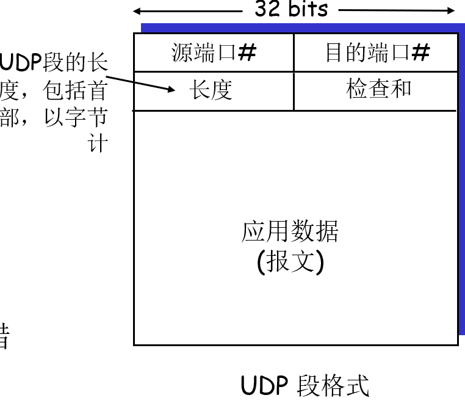
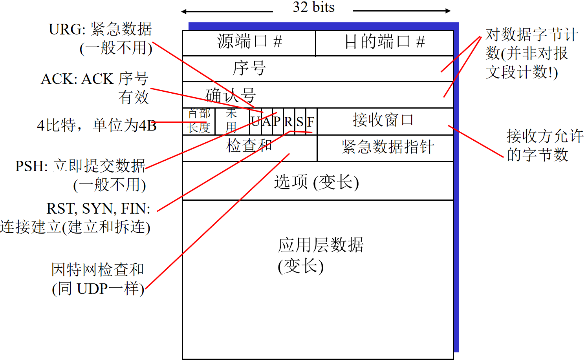
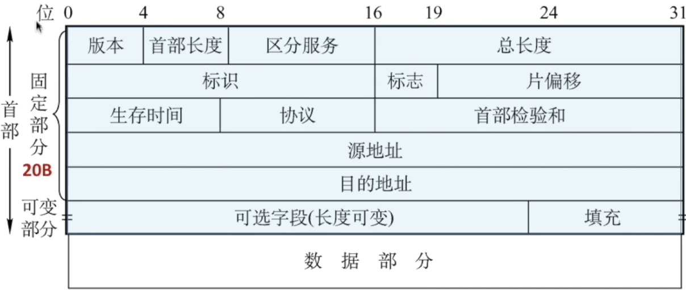

# 计算机网络

# 1 网络协议

## 1.1 网络核心

网络可以分为：

电路交换、报文交换、分组交换

（1）电路交换

带宽通过复用技术分配：==频分复用(frequency division)、时分复用(time division)==

（2）分组交换

统计复用(Statistical Multiplexing)、存储转发(路由器在接收到整个数据报后才前向转发)

分组交换网络分为：==数据报网络、虚电路（VC）网络==

## 1.2 网络性能计算

### 1.2.1 数据包延迟

（1）节点处理

（2）排队延迟

（3）传输时延

R=链路带宽 (bps)

L=数据报长度 (bits)

发送到链路的时间= L/R

（4）传播时延

d = 物理介质长度

s = 介质传输速度(~2x108 m/sec)

传播延时= d/s

总的延迟 = 节点处理 + 排队延迟  + 传输时延 + 传播时延

> 时延带宽积：
>
> 时延带宽积 = 传播时延 × 带宽 = $d_{prop}$ * $R(bits)$，链路的时延带宽积又称为以比特为单位的链路长度

### 1.2.2 数据丢包

队列所在的内存有限

队列满了以后到达的数据包会丢失(lost)

丢失的数据包会被重传, 或者根本不会被重传

> $丢包率 = \frac{丢包数}{已发分组总数}$

### 1.2.3 吞吐率

发送方和接收方之间数据传输的速率，单位为 `bps`

通常由链路带宽最小的那条决定

## 1.3 计算机网络协议

### 1.3.1 协议三要素

（1）语法，即信息格式，协议数据单元PDU的结构或格式，包括哪些字段，字段的作用

（2）语义，某些信息位组合的含义，标识通信双方可以理解的确定的意义，PDU给出何种控制信息、完成何种操作、做出何种响应，即各字段中若干二进制位0或1的组合代表什么样的含义

（3）同步（时序），即收、发双方能分辨出通信的开始和结束，哪些动作先执行，哪些动作后执行。为完成一次通信所需要的不同PDU之间有操作顺序规程。有时同步也称为规程语法定义了怎么做

（4）语法定义了怎么做，语义定义了做什么，同步时序关系定义了什么时候做

### 1.3.2 计算机网络体系结构

1、网络体系结构是从功能上描述计算机网络结构

2、计算机网络体系结构是分层结构

3、每层遵循某个或某些网络协议完成本层功能

4、计算机网络体系结构是计算机网络的各层及其协议的集合

5、计算机网络体系结构是抽象的，具体实现由不同的厂商来实现

> 1、实体表示任何可发送或接收信息的硬件或软件进程。
>
> 2、协议是控制两个对等实体进行通信的规则的集合，协议是“水平”的
>
> 3、任一层实体需要使用下层服务，遵循本层协议，实现本层功能
>
> 4、向上提供服务，服务是“垂直”的
>
> 5、下层协议的实现对上层的服务用户是透明的
>
> 6、同系统的相邻实体间通过接口进行交互，通过服务访问点SAP，交换原语，指定请求的特定服务。

### 1.3.3 参考模型

#### （1）OSI参考模型(Open System Interconnection)

1、定义

国际标准化组织（ISO，`International Organization for Standardization`）制定的一个用于计算机或通信系统间互联的标准体系，一般称为OSI参考模型或七层模型

```
OSI参考模型（7层）

应用层（报文）   |端到端
表示层          |端到端
会话层          |端到端
传输层（报文段） |端到端
网络层（数据报）
数据链路层（帧）
物理层
```

> [!tip]
>
> 协议是横向的，服务是纵向的，下层协议为上层协议提供服务

2、各层功能

> 1、应用层
>
> ```
> 应用层
> 
> 支持用户通过用户代理（如浏览器）或网络接口使用网络
> 
> 典型应用层服务：
> 
> 文件传输（FTP）
> 
> 电子邮件（SMTP）
> 
> Web（HTTP）
> ```
>
> 2、传输层
>
> ```
> 负责源-目的（端-端）进程间完整报文传输
> 
> 包含连接控制，流量控制，差错控制
> 分段与重组
> SAP寻址（Service Access Point Addressing）
> 确保将完整报文提交给正确进程
> 连接控制
> 流量控制
> 差错控制
> ```
>
> 3、网络层
>
> ```
> 负责源主机到目的主机数据分组交付
> 可能穿越多个网络
> 
> 逻辑寻址
> 全局唯一逻辑地址，确保数据分组送达目的主机
> 
> 路由
> 路由器互连网络，并路由分组至最终目的主机
> 路径选择
> 分组转发
> ```
>
> 4、数据链路层
>
> ```
> 负责结点-结点数据传输
> 组帧
> 物理寻址
> 在帧头中增加发送端和接收端的物理地址标识数据帧的发送端和接收端
> 
> 流量控制
> 避免淹没接收端
> 差错控制
> 检测并重传损坏或丢失帧，并避免重复帧
> 访问(接入)控制
> 在任一给定时刻决定哪个设备拥有链路控制使用权
> ```
>
> 5、物理层
>
> ```
> 接口特性
> 机械特性、电气特性、功能特性、规程特性
> 比特编码
> 数据率
> 比特同步
> 传输模式
> 单工
> 半双工
> 全双工
> ```
>
> 6、表示层
>
> ```
> 处理两个系统间交换信息的语法与语义问题
> 数据表示转化
> 转换为主机独立的编码
> 加密、解密
> 压缩、解压缩
> ```
>
> 7、会话层
>
> ```
> 对话控制
> 建立、维护
> 同步
> 在数据流中插入“同步点”
> ```
>
> ==处了物理层和应用层之外，上层到下层的数据传输都要进行封装==

#### （2）TCP/IP参考模型（沙漏模型）

```
应用层             （HTTP  SMTP  DNS  RTP）
运输层                  （TCP  UDP）
网际层                     （IP）
网络接口层（网络接口1  网络接口2  网络接口2  网络接口2）
```

#### （3）5层参考模型

```
OSI参考模型（7层）

应用层（报文）【支持网络应用 FTP, SMTP, HTTP】   |端到端
传输层（报文段） 【process-process 数据传输 TCP, UDP】|端到端
网络层（数据报）【从源到目的地路由数据包 IP, routing protocols】
数据链路层（帧） 【相邻两个网络设备之间传输数据 PPP, Ethernet】
物理层
```

### 1.3.4 补充内容

#### （1）网络速率

1、传播速率

传播速率，是一个常量，与光速联系

2、调制速率

调制速率也称为码元速率、波形速率或信号速率，指的是每秒种发送信号的数目，单位为波特(baud)

3、数据传输率

为每秒种发送的二进制位数，单位为bps，读作每秒位。

> 调制速率与数据传输率之间的关系为：
>
> `C = B log2 V (bps)`
>
> C为数据传输率；B为调制速率；V为一个信号可能取值的个数

> [!note]
>
> 信道的极限传输率
>
> 1、奈奎斯特定理（无噪声情况下）
>
> 极限波特率 = $2W(baud/s)$
>
> 极限比特率 = $2Wlog_{2}V(b/s)$
>
> > `W`表示带宽，单位为`Hz`，`V`表示每个码元可以取值的状态数
>
> 2、香农定理（有噪声情况下）
>
> 极限比特率 = $Wlog_{2}(1+\frac{S}{N})(b/s)$
>
> > 其中`S/N`为信噪比，有两种记法：
> >
> > 1、分贝记法——$10log_{10}\frac{S}{N}(dB)$
> >
> > 2、无单位记法——$\frac{S}{N} = \frac{信号功率}{噪声功率}$

题目：

> 下列选项中， 不属于网络体系结构所描述的内容是（）
>
> A. 网络的层次
> B. 每一层使用的协议
> C. 协议的内部实现细节
> D. 每一层必须完成的功能
>
> > C，协议的内部实现细节由各种网络供应商来实现
> >
>
> 下列说法中， 正确描述了OSI 参考模型中数据的封装过程的是（   ）。
> A. 数据链路层在分组上仅增加了源物理地址和目的物理地址
> B. 网络层将高层协议产生的数据封装成分组， 并增加了第三层的地址和控制信息
> C. 传输层将数据流封装成数据帧， 并增加了可靠性和流控制信息
> D. 表示层将高层协议产生的数据分割成数据段， 并增加了相应的源和目的端口信息
>
> > B，对于A，还有差错控制等，对于C，应该为报文段，对于D，应该是传输层
>
> 在 OSI 参考模型中，自下而上第一个提供端到端服务的层次是（）
> A. 数据链路层
> B. 传输层
> C. 会话层
> D. 应用层
>
> > B

> TCP/IP 参考模型的网络层提供的是 （
>
> A. 无连接不可靠的数据报服务
>
> B. 无连接可靠的数据报服务
>
> D. 有连接可靠的虚电路服务
>
> C.有连接不可靠的虚电路服务
>
> > A，可靠服务在传输层提供

# 2、应用层

## 2.1 Web And Http

### 2.1.1 协议说明

万维网的三大基本技术：超文本标记语言(html)、超文本传输协议(http)和统一资源定位符(URL)

1、**HTTP: 超文本传输协议 HyperText transfer protocol**

2、**HTML:超文本标记语言 HyperText Markup Language**

3、**URL:统一资源定位符 Uniform Resource Locator**，是一种统一格式的Internet 信息资源地址的标识方法

URL由4部分组成：`协议://主机:端口/路径`，需要说明的是URL是不区分大小写的

> HTTP服务器不保存关于用户的任何信息，是无状态协议

### 2.1.2 HTTP连接

1、非持久连接

（1）一次 TCP 连接最多发送一个object；

（2）HTTP 1.0使用非持久连接

（3）每个 object需要 2 RTTs

2、持久连接

（1）一次 TCP 连接可以发送多个object;

（2）HTTP 1.1使用持久连接，大部分浏览器默认支持

（3）一个object一RTT时间

### 2.1.3 HTTP报文

（1）请求报文

ASCII (人可读的格式)，包含请求行、首部行、实体体

1、第一行是请求行有三个字段，包括方法字段、URL字段和HTTP版本字段，大部分HTTP请求的方法字段使用`GET`

2、后续的几行为首部行

3、首部行之后有一个空行，然后为实体体，实体体通常用于POST方法来提交表单

> 方法字段
>
> 1、HTTP/1.0
>
> GET、POST、HEAD（响应时不返回请求对象）
>
> 2、HTTP/1.1
>
> GET、POST、HEAD、PUT（向URL字段中定义的路径，上载在实体主体中文件）、DELETE（删除在URL字段中定义的文件）

（2）响应报文

包含状态行、首部行、实体体

1、状态行：三个信息，协议版本字段、状态码、相应状态信息

2、首部行。

3、首部行之后有一个空行，然后为实体体，是报文的主要部分，包含了请求的对象本身

> [!warning]
>
> 在首部行中，有一个Connection字段：
>
> connection:close，表示非持久连接
>
> connection:keep-alive，表示持久连接

### 2.1.4 Cookie

由于HTTP协议是无状态的，所以就设置了Cookie用于追踪用户状态，四个组成部分:

1) HTTP 响应消息头部
2) HTTP 请求消息头部
3) 保留在客户端的cookie文件, 由用户浏览器管理
4) Web 站点后台数据库

### 2.1.5 代理和条件Get

1、Web缓存器也叫代理服务器，用于保存请求过的对象的副本。

2、使用条件GET机制使得缓存的对象是最新的。

> [!note]
>
> 条件GET
>
> 在首部行中加入一个字段`If-modified-since`，用于存放最后的修改时间，如果发生变化，那么就返回最新的请求对象给代理服务器。

## 2.2 文件传输协议

FTP（File Transfer Protocol）: 文件传输协议

1、客户机与服务器的==21号端口建立控制连接，基于TCP协议，之后一直保持打开状态==

2、之后，如果客户机想要上传或下载文件，==使用服务器的20号端口进行传输，一次文件传输完成之后，20号端口便断开连接==。如果还要传输文件，重新建立20号端口的连接

> 上述中的传输方式为主动模式

## 2.3 电子邮件协议

### 2.3.1 组成部分

用户代理、邮件服务器、简单邮件传输协议（SMTP，Simple Mail Transfer Protocol）

### 2.3.2 SMTP协议

SMTP协议，Simple Mail Transfer Protocol，简单邮件传输协议

1、使用TCP从客户端可靠的传输邮件信息到服务器

2、==使用端口25直接传送==

3、三个阶段：握手、传输、关闭

4、SMTP协议使用的消息是==7-bit ASCII字符，使用持久连接==

### 2.3.3 传输过程

1、发送方使用用户代理写好邮件，使用**SMTP协议**传输到发送方邮件服务器

2、发送方邮件服务器使用TCP连接到接收方的服务器，然后通过**SMTP协议**将邮件发送出去

2、接收方使用**邮件访问协议**接收邮件

> 邮件访问协议有：
>
> 1、POP3：Post Office Protocol
>
> 2、IMAP：Internet Mail Access Protocol 
>
> 3、HTTP

## 2.4 DNS

1、DNS，Domain Name System，域名系统

> 作用： 把主机名转换为IP地址，一个别名对应多个地址，可以负载均衡
>
> 协议与端口： ==运行在UDP之上， 使用53号端口==

2、服务器分类：

根域名服务器： 知道所有顶级域名服务器的IP地址

顶级域名服务器： 负责管理在其服务器注册的所有二级域名

授权域名服务器： 能够将其管辖的主机名转换为该主机的IP地址

本地域名服务器： 本地网络提供商负责的域名服务器

3、查询方式

递归查询： 由查询的服务器发起下一次的查询

迭代查询： 除第一次查询外， 其余均由本地域名服务器向外查询

4、DNS记录格式

DNS记录是一个包含了四个字段的四元组：（Name,Value,Type,TTL）。

其中TTL指的是改记录的生存时间，表示着这条记录应当从缓存中删除的时间。而Name和Type的意义取决于Type。

1、如果Type=A，那么Name表示一个主机名，Value表示该主机名对应的IP地址。

2、如果Type=NS，那么Name表示域名，而Value表示该域名的权威服务器的主机名。

3、如果Type=CNAME，那么Name表示主机的别名，Value表示该主机的规范名称。

4、如果Type=MX，那么表示一个邮件服务器的别名，而Value表示该邮件服务器的规范主机名

> DNS的查询和回答报文都具有相同的报文格式

> 下列关于 Cookie 的说法中， 错误的是 （
>
> A. Cookie 存储在服务器端
>
> B. Cookie 是服务器产生的
>
> D. Cookie 的作用是跟踪用户 的访问和状态
>
> C. Cookie 会威胁客户的隐私
>
> > A，cookie保存在服务器的数据库以及本地客户端系统的cookie文件中

> 当仅需 Web 服务器对 HTTP 报文进行响应， 但并不需要返回请求对象时，HTTP 请求报文应该使用的方法是（）。
>
> A. GET     B. PUT     C. POST   D. HEAD
>
> > D

> 关于传输层的面向连接服务的特性是 （）.
> A. 不保证可靠和顺序的交付
> B. 不保证可靠、 但保证顺序的交付
> C. 保证可靠、但不保证顺序的交付
> D. 保证可靠和顺序的交付
>
> > D

> 以下关于 UDP 协议的主要特点的描述中， 错误的是 （ ）。
> A. UDP 报头主要包括端口号、长度、校验和等字段
>
> B. UDP 长度字段是 UDP 数据报的长度， 包括伪首部的长度
>
> C.UDP 校验和对伪首部、 UDP 报文头以及应用层数据进行校验
>
> D. 伪首部包括 IP 分组报头的一部分
>
> > B,不包括伪首部的长度

> 域名与（）具有一一对应的关系。
> A. IP 地址
>
> B. MAC 地址
>
> C. 主机
>
> D. 以上都不是
>
> > D
> >
> > 解析（[【易懂IT】IP地址和域名竟然不是一一对应 - 知乎 (zhihu.com)](https://zhuanlan.zhihu.com/p/144283835)）：
> >
> > 1. **一个域名也可以绑定N个IP**
> > 2. **一个IP可以绑定N个域名**

# 3 传输层

网络层提供了==主机==之间的逻辑通信，运输层为不同==主机上的进程==提供逻辑通信

传输层的数据称为==报文段（segment）==

## 3.1 传输层服务

1、UDP协议（User Datagram Protocol，用户数据报协议）

特点：不可靠、无连接、无序

服务：进程到进程的数据交付、差错检查

2、TCP协议（Transmission Control Protocol，传输控制协议）

特点：可靠的、面向连接、有序

服务：进程到进程的数据交付、差错检查、可靠数据传输、拥塞控制、流量控制

> 服务不具的特性:
>
> 延迟保证、带宽保证

## 3.2 多路复用和多路分解

地址：

计算机网络中有四种地址：域名地址、端口地址、IP地址、物理地址。自顶向下依次与应用层、运输层、网络层、数据链路层对应

> 网络中寻址时需进行地址转换，需要用到地址转换（映射）协议 
>
> 1、域名地址通过域名服务器和域名解析协议(DNS)找到对应的IP地址
>
> 2、IP地址通过地址解析协议(ARP)找到对应的物理地址 
>
> 3、IP地址与端口地址构成套接字(Socket)，用于标识不同的应用服务进程 

==多路分解==：将传输层报文段中的数据交付到正确的套接字的工作。

==多路复用==：从源主机的不同套接字中收集数据块，并为每个数据块封装上首部信息（这将在多路分解时使用）从而生成报文段，然后将报文段传递到网络层的工作。

UDP套接字：由一个二元组全面标识（目的IP地址，目的端口号）

TCP套接字：由一个四元组全面标识（源IP地址，源端口号，目的IP地址，目的端口号）

> [!warning] 
>
> 对于UDP和TCP报文段，都有特殊字符来指示该报文段所要交付到的套接字，这些特殊字段是**源端口号字段**和**目的端口号字段**，除此之外，UDP和TCP报文段还有其他字段

## 3.3 UDP协议

1、特点：

> 1、无连接创建(它将增加时延)
>
> 2、简单：在发送方、接收方无连接状态
>
> 3、段首部小
>
> 4、无拥塞控制: UDP能够尽可能快地传输

2、应用：

- 常用于流式多媒体应用
  - 丢包容忍、速率敏感

- 其他UDP应用
  - DNS、SNMP

- 经UDP的可靠传输 : 在应用层增加可靠性
  - 应用程序特定的差错恢复！

| 应用             | 应用层协议 | 下面传输层协议 |
| ---------------- | ---------- | -------------- |
| 电子邮件         | SMTP       | TCP            |
| 远程终端访问     | Telnet     | TCP            |
| 安全远程终端访问 | SSH        | TCP            |
| Web              | HTTP       | TCP            |
| 文件传输         | FTP        | TCP            |
| 远程文件服务器   | NFS        | 通常为UDP      |
| 流式多媒体       | 通常专用   | UDP或TCP       |
| 因特网电话       | 通常专用   | UDP或TCP       |
| 网络管理         | SNMP       | 通常为UDP      |
| 名字转换         | DNS        | 通常为UDP      |

3、报文段




> UDP首部只有4个字段，每个字段由两个字节（16bit）组成

4、检验和

发送方：

添加**IP首部的一些字段**（伪首部），将伪首部和UDP报文段一起，分成若干个16位的bit流进行**反码相加**（按位相加，有溢出则向高位进1(和一般的二进制法则一样) ，**若最高位有进位，则向最低位进1**，得到的结果再取反 ），作为校验和填入UDP数据报中。

接收方：

和发送方一样进行反码求和，然后和校验和求和，如果为全0，表示校验成功。

> [!tip]
>
> 对于检验和，如果为全0，表示不进行校验；
>
> 如果检验和算出来为全0，那么用全1表示。

## 3.4 可靠数据传输协议（reliable data transfer protocol）

### 3.4.1 rdt1.0

Rdt1.0: 经可靠信道的可靠传输

- 底层信道非常可靠
  - 无比特差错
  - 无分组丢失

- 装发送方、接收方的单独FSM:
  - 发送方将数据发向底层信道
  - 接收方从底层信道读取数据

### 3.4.2 rdt2.0

#### 3.4.2.1 rdt2.0

Rdt2.0:：具有比特位错误的信道

- 错误检测
- 接收者反馈: 控制信息(ACK,NAK)
- 重传

如果ACK/NAK受损，将会出现何种情况？会导致：

> 重传：可能导致冗余

#### 3.4.2.1 rdt2.1

Rdt2.1：处理混淆的ACK/NAKs

发送方：

- 给每个数据报添加顺序号
- 检测ACK/NAK是否出错

接受方：

- 对ACK/NAK添加校验和

#### 3.4.2.3 rdt2.2

rdt2.2: 不需要NAK的协议

- 接收方对ACK加入编号
- 接收者使用上一次发送的ACK(针对最近一次正确的接收) 取代NAK

### 3.4.3 rdt3.0

rdt3.0: 具有差错和丢包的信道，有时也叫**比特交替协议**

方法: 发送方等待ACK一段“合理的”时间

（1）如在这段时间没有收到ACK则重传

（2）如果分组(或ACK)只是延迟(没有丢失)：

​	重传将是冗余的，但序号的使用已经处理了该情况

​	接收方必须定义被确认的分组序号

（3）需要倒计时定时器

> - 停止等待协议：
>   - 发送方发送一个分组，然后等待接收方响应
>   - rdt2.0 rdt2.1 rdt2.2 rdt3.0都是停等协议

rdt3.0的信道利用率计算公式：
$$
U = \frac{L/R}{RTT + L/R}
$$
可以发现rdt3.0的信道利用率很低，为了解决这个问题，提出了流水线传输协议或者说滑动窗口协议。

流水线传输协议的信道利用率：
$$
U = \frac{n \cdot L/R}{RTT + L/R}
$$

> RTT: round-trip time
>
> 信道吞吐率 = 信道利用率 * 发送方的发送速率
>
> 或者
>
> 信道吞吐量 = $\frac{CWnd}{RTT}$ （近似等于）

## 3.5 滑动窗口协议

### 3.5.1 Go-Back-N协议（GBN协议）

假设分组序号的字段的比特数为k，那么该序号空间大小为[0，2^k - 1]。

对于发送方和接收方：

==发送窗口长度：N==，表示连续未确认的长度

==接收窗口长度：1==

1、ACK(n)：使用**累积确认原则**，如果发送方收到序号为n的分组，表述接收方已经正确接收到了需要为n的以前包括n在内的所有分组。

2、对于定时器timer，只有一个，并且只对最开始发送的序号设定定时器。如果有超时事件，那么要重新发送已经发送但是未确认过的分组。

3、对于接收方，如果当前想要接受的分组被正确接收，那么向右滑动窗口，返回新的ACK；如果接收到不正确的数据，那么直接丢弃（**不予以缓冲**），返回原来的ACK。

### 3.5.3 选择重传协议（SR协议）

对于发送方和接收方：

==发送窗口长度：N==，表示连续未确认的长度

==接收窗口长度：N==

1、ACK：没有累积确认功能，接收方收到一个数据包则回复对应的ACK

2、定时器Timer：有多个，分别为每个发送的数据包设计一个定时器。

3、对于接收方，如果收到失序的数据包并且在接受窗口内，那么进行缓存，否则丢弃；如果数据包有序，那么交付给应用层，同时滑动窗口到下一个未接受报文段的序号。

$2^{k}$

$W_{a}$

> 如果需要用**k**位二进制表示，那么序号空间大小为$2^k$
>
> 对于滑动窗口协议，有如下基本关系（发送窗口大小+接收窗口大小$\leq 2^k$ ）：
>
> ​					$W_{sender} + W_{receive} \leq 2^k$

具体来说：

| 可靠数据传输协议 | 发送窗口大小              | 接收窗口大小              |
| ---------------- | ------------------------- | ------------------------- |
| 停等协议         | $W_T = 1$                 | $W_R = 1$                 |
| Go-Back-N        | $W_T =  2^k - 1$          | $W_R = 1$                 |
| 选择重传协议     | $ 1 < W_T \leq 2^{k - 1}$ | $ 1 < W_R \leq 2^{k - 1}$ |

> [!note]
>
> 协议对比：
>
> | Go-Back-N协议                                                | 选择重传协议                                                 |
> | ------------------------------------------------------------ | ------------------------------------------------------------ |
> | 发送者在流水线中最多有 N 个未确认的数据报                    | 发送者在流水线中最多有 N 个未确认的数据报                    |
> | 接收者仅发送累计的确认，如果中间有数据报缺失，就不予以确认   | 接收者对单个数据报进行确认                                   |
> | 发送者对最久未确认的数据报进行计时，如果计时器到点，**重传所有未确认的数据报** | 发送者对每一个未确认的数据报进行计时，如果计时器到点，**仅重传该个未确认的数据报** |

## 3.6 TCP协议

### 3.6.1 概述

1、**点到点（不支持广播）**

- 一个发送方, 一个接收方

- 连接状态与端系统有关，不为路由器所知 

2、**可靠、有序的字节流**

- 没有 “报文边界”

3、**全双工数据**

- 同一连接上的双向数据流

- MSS: 最大报文段长度

- MTU:最大传输单元

4、**发送和接收缓冲区**

5、**面向连接**

- 在进行数据交换前，初始化发送方与接收方状态，进行握手(交换控制信息)

6、**流水线**

- TCP拥塞和流量控制设置滑动窗口协议

7、**流量控制**

- 发送方不能淹没接收方

8、**拥塞控制**

- 抑止发送方速率来防止过分占用网络资源

> 最大报文段长度：
>
> MSS = MTU - IP首部长度（默认为20）-TCP首部长度（默认为20） = MTU - 40;
>
> 对于以太网络，默认：MSS = MTU - 40 = 1500 - 40 = 1460

### 3.6.2 报文段



`Seq`:该报文段第一个字节在字节流中的编号

`ACKs`:从对方期望收到的下一个报文段首字节序号、累计确认

### 3.6.3 RTT和超时

方法：**指数加权移动平均（EWMA）**

1、TCP协议中往返时间（RTT）的估计：

**$EstimateRTT = (1 - \alpha) * EstimateRTT + \alpha * SampleRTT(\alpha  推荐为0.125)$**

2、RTT偏差（DevRTT）的估计:

$DevRTT = (1 - \beta) * DevRTT + \beta * |SampleRTT - EstimateRTT|(\beta  推荐为0.25)$

3、设置超时间隔

$TimeoutInterval = EstimatedRTT + 4 * DevRTT$

### 3.6.4 数据传输

1、ACK有**累积确认功能**

2、定时器Timer只有一个，设置为最先开始发送的数据报。如果出现超时，则只是重传最先开始发送的数据报

3、**快速重传**：如果发送方收到了三个冗余的ACK，那么也要进行重传。

4、流量控制

接收端告诉发送方 **Rwnd** 大小，表明还有多少可用的缓存空间，确保接收端缓冲区不会溢出

5、连接管理

建立连接：三次握手（标志：SYN）

断开连接：四次挥手（标志：FIN）

### 3.6.5 拥塞控制

1、感知拥塞

报文段丢失事件： 超时或3个重复acks

TCP 减少发送速率(`CWnd`) 

> TCP发送窗口 $\leq min $ {接受窗口`RWnd`， 拥塞窗口`CWnd`}

2、拥塞控制机制:

AIMD（加性增，乘性减）、慢启动、拥塞避免、快速恢复

**（1）慢启动阶段**

`CWnd`从1MSS开始，以2为底进行指数增长

**（2）拥塞避免阶段**

当`CWnd`到达阈值（threshold）时，进入拥塞避免阶段，此时`CWnd`按+1进行线性增长

如果感知到丢包：

1. 如果为收到三个重复的Acks，**阈值（Threshold）** 设为`CWnd/2`,  `CWnd`设为`CWnd/2+3MSS`，进入快速恢复阶段
2. 如果为超时事件，那么**阈值（Threshold）**设为`CWnd/2`, `CWnd`设为`1MMS`大小，进入慢启动阶段

> [!warning]
>
> **TCP数据包中的单位为字节（B）。**

# 4 网络层

## 4.1 概述

1、网络层的功能

前向转发：将数据报从路由的输入端口前向转发到相应的输出端口

路由选择：决定数据报从源到目的地所经过的路径

> 在因特网中，IP分组的传输需要经过源主机和中间路由器到达目的主机，通常 （   ）。
>
> A. 源主机和中间路由器都知道IP分组到达目的主机需要经过的完整路径
>
> B. 源主机和中间路由器都不知道 IP分组到达目的主机需要经过的完整路径
>
> C. 源主机知道IP分组到达目的主机需要经过的完整路径， 而中间路由器不知道
>
> D. 源主机不知道IP分组到达目的主机需要经过的完整路径， 而中间路由器知道
>
> > B

## 4.2 IP数据报

1、IP数据报格式：`首部 + 数据部分`

2、首部字段：




> 说明：
>
> 1、版本：占4bit，用于确定IP版本为IPv4还是IPv6
>
> 2、首部长度：==占4bit，单位是4B。由于固定部分为20B，所以首部至少为0101(5)。==
>
> 3、区分服务：指示期望获得哪种类型的服务
>
> 4、总长度：==占16bit，表示首部+数据的总长度，单位是1B==
>
> 5、标识、标志、片偏移：与IP的分片有关，==其中片偏移的单位是8B==
>
> 6、生存时间（TTL）：IP分组的保质期。经过一个路由器-1，变成0则丢弃。
>
> 7、协议：数据部分使用的协议。值为6表示TCP，值为17表示UDP
>
> 8、首部检验和：只检验首部，每台路由器对每个数据报都必须检验首部
>
> 9、源地址和目的地址：占32bit

## 4.3 IP数据报分片

> ==除了最后一个分片，每个分片长度一定是8B的整数倍。==
>
> 如果一个分片长度不能被8整除，那么就要取能被8整除的最大整数
>
> > [!tip]
> >
> > 1、==TCP协议下的IP协议不需要分片，UDP协议下的IP协议支持分片==
> >
> > 2、对于同一个分片，它们的16位标识相同
> >
> > 3、对于3为标志，介绍如下：
> >
> > > （1）第1位（Reserved Bit，保留位）------------最高位
> > >
> > > 这一位目前保留未用，通常被设置为0。
> > >
> > > （2）第2位（Don't Fragment，不允许分片）------------中间位
> > >
> > > 当这一位被设置为1时，表示该数据包不允许被路由器分片。如果数据包的大小超过了沿途任何链路的MTU（最大传输单元），则会被丢弃，并可能返回一个ICMP错误消息给发送方。
> > >
> > > 当这一位被设置为0时，表示允许数据包被分片。
> > >
> > > （3）第3位（More Fragments，更多分片）--------------最低位
> > >
> > > 当这一位被设置为1时，表示该数据包是原始数据包的一个分片，并且后面还有更多的分片。
> > >
> > > 当这一位被设置为0时，表示该数据包是原始数据包的一个分片，并且是最后一个分片（或者如果数据包未被分片，则此位也为0）。

> 如果 IPv4 的分组太大， 则会在传输中被分片，那么在 （）地方将对分片后的数据报重组。
>
> A. 中间路由器
>
> B. 下一跳路由器
>
> C. 核心路由器
>
> D. 目的主机
>
> > D

## 4.4 IP地址

### 4.4.1 IPv4地址

1、分类的IP地址

| 类别                                       | 网络号                   | 主机号 |
| ------------------------------------------ | ------------------------ | ------ |
| A类（1-126）                               | 占8bit(1B)，以`0`开头    | 24bit  |
| B类（128-191）                             | 占16bit(2B)，以`10`开头  | 16bit  |
| C类（192-223）                             | 占24bit(3B)，以`110`开头 | 8bit   |
| D类（224-239），以`1110`开头，作为多播地址 | 无                       | 无     |
| E类（240-255），以`1111`开头，一般不用     | 无                       | 无     |

特殊的IP地址

| NetID网络号 | HostID 主机号     | 能否作为IP分组源地址 | 能否作为IP分组目的地址 | 用途                                                         |
| ----------- | ----------------- | -------------------- | ---------------------- | ------------------------------------------------------------ |
| 全0         | 全0               | 可以                 | 不可以                 | `本网范围内表示主机，路由表中用于表示默认路由（表示整个lnternet网络）` |
| 全0         | 特定值            | 可以                 | 不可以                 | `表示本网内某个特定主机`                                     |
| 全1         | 全1               | 不可以               | 可以                   | `本网广播地址 （路由器不转发）`                              |
| 特定值      | 全0               | 不可以               | 不可以                 | `网络地址，表示一个网络`                                     |
| 特定值      | 全1               | 不可以               | 可以                   | `直接广播地址，对特定网络上的所有主机进行广播`               |
| 127         | 任何数（非全0/1） | 可以                 | 可以                   | `于本地软件环回测试，称为环回地址`                           |

主机数和网络数

| 网络类别 | 最大可用网络数 | 第一个可用的网络号 | 最后一个可用的网络号 | 每个网络中的最大主机数 |
| :------: | :------------: | :----------------: | :------------------: | :--------------------: |
|    A     |   $2^7 - 2$    |         1          |         126          |      $2^{24} - 2$      |
|    B     |  $2^{14} - 1$  |       128.1        |       191.255        |      $2^{16} - 2$      |
|    C     |  $2^{21} - 1$  |      192.0.1       |     223.255.255      |       $2^8 - 2$        |

2、子网划分和子网掩码

3、无分类地址编址（CIDR，Classless Interdomain Routing）

地址形式为`a.b.c.d/x`，其中地址的最高x位构成了IP地址的网络部分，称为网络地址的**前缀**

> （1）作用
>
> 1、消除了传统的A类，B类和C类地址以及划分子网的概念。
>
> 2、融合子网地址与子网掩码，方便子网划分。
>
> （2）应用
>
> ==1、构成超网==
>
> 将多个子网聚合成一个较大的子网，叫做构成超网，或路由聚合。
>
> 方法：将网络前缀缩短 （所有网络地址取交集）。
>
> ==2、最长前缀匹配==
>
> 使用CIDR时，查找路由表可能得到几个匹配结果，应选择具有最长网络前缀的路由。前缀越长，地址块越小，路由越具体。

4、每个路由器的转发表结构：

| 目的网络地址 | 目的IP子网掩码 | 下一跳 | 接口 |
| ------------ | -------------- | ------ | ---- |

> 其中`下一跳`指的是从当前路由器要去的下一个路由器的端口的IP地址，如果已经到达目的网路，那么没有下一跳

### 4.4.2 DHCP协议

动态主机配置协议DHCP是应用层协议，使用客户/服务器方式，客户端和服务端通过广播方式进行交互，基于**UDP**，**Dynamic Host Configuration Protocol，动态主机配置协议**。

DHCP提供即插即用联网的机制，主机可以从服务器动态获取IP地址、子网掩码、默认网关、DNS服务器名称与IP地址，允许地址重用，支持移动用户加入网络，支持在用地址续租。

| 步骤                       | 通俗解释                                                     |
| -------------------------- | ------------------------------------------------------------ |
| 主机广播DHCP发现报文       | 有没有DHCP服务器呀？” 试图找到网络中的服务器，服务器获得一个IP地址。 |
| DHCP服务器广播DHCP提供报文 | “有！”“有！”“有！”服务器拟分配给主机一个IP地址及相关配置，先到先得。 |
| .主机厂播DHCP请求报文      | “我用你给我的IP地址啦？”主机向服务器请求提供IP地址。         |
| DHCP服务器广播DHCP确认报文 | “用吧！”正式将IP地址分配给主机。                             |

### 4.4.3 NAT技术

1、网络地址转换NAT （Network Address Translation）：在专用网连接到因特网的路由器上安装NAT软件，安装了 NAT软件的路由器叫NAT路由器，它至少有一个有效的外部全球IP地址。

2、所有使用专用地址的主机在和外界通信时都要在NAT路由器上将其专用地址转换成全球IP地址才能和互联网通信

> 在内部主机与外部主机通信时，在NAT路由器上发生了两次地址转换：
>
> 离开专用网时：替换源地址， 将专用地址替换为全球地址。
>
> 进入专用网时：替换目的地址，将全球地址替换为专用地址

### 4.4.4 ICMP协议

ICMP协议，全称为互联网控制报文协议（Internet Control Message Protocol）。

==ICMP本身是网络层的一个协议，但报文不是直接传给链路层，而是要封装成IP数据报，然后再传给数据链路层==。ICMP报文分为查询报文和差错报文。

（1）差错报文

差错报文又分为5种：

终点不可达、源点抑制、参数问题、改变路由、时间超时

> ICMP差错报告具有以下特点：
>
> 1）只报告差错，但不负责纠正错误，纠错工作留给高层协议去处理。
>
> 2）发现出错的设备只向==信源==报告差错。
>
> 3）差错报告作为一般数据传输，不享受特别优先权和可靠性。
>
> 4）产生ICMP差错报告的同时，会丢弃出错的IP数据报。

不发送差错报文的情况：

1）对**ICMP差错报文**本身不会再产生ICMP差错报告。

2）对第一个分片的数据报片的所有**后续数据报片**都不发送ICMP差错报告报文。

3）目的地址是**广播地址或多播地址**的报文不会产生ICMP差错报告。

4）特殊地址127.0.0.0和0.0.0.0的报文不会产生ICMP差错报告。

（2）查询报文

查询报文又分为5种：

回答请求和应答、时间戳请求和应答、路由器询问和通告、地址掩码请求和应答

> 应用：
>
> 1、`ping`命令，测试两个主机之间的连通性，使用了==ICMP回送请求和回答报文==。
>
> 2、`tracert`命令，跟踪一个分组从源点到终点的路径，使用了==ICMP时间超时差错报告报文==。

> 在 TCP/IP 体系结构中， 直接为 ICMP 提供服务协议的是（）
> A. PPP    B. IP    C. UDP    D. TCP
>
> > B

## 4.5 路由算法和路由选择协议

### 4.5.1 路由算法

1、路由算法可分为**静态路由算法**和**动态路由算法**。

其中，静态路由算法也叫非自适应路由算法，由管理员手工配置路由信息。

> 优缺点：
>
> 1、简便、可靠，在负荷稳定、拓扑变化不大的网络中运行效果很好，广泛用于高度安全性的军事网络和较小的商业网络。
>
> 2、路由更新慢，不适用大型网络。

动态路由算法也叫自适应路由算法，路由器间彼此交换信息，按照路由算法优化出路由表项。

> 优缺点：
>
> 1、路由更新快，适用大型网络，及时响应链路费用或网络拓扑变化
>
> 2、算法复杂，增加网络负担。

2、动态路由算法还可以细分为**链路状态路由算法（LS）**和**距离向量路由算法(DV)**

> 链路状态路由算法基于==迪杰斯特拉算法==，具有全局性，所有路由器掌握完整的网络拓扑和链路费用信息。网络拓扑和所有的链路费用都是已知的，通过 `链路状态广播`来获得信息， 所有节点都有相同信息
>
> 距离向量路由算法基于==Bellman-Ford 等式==，是迭代的、异步的和分布式的算法。路由器只掌握物理相连的邻居及链路费用。

### 4.5.2 路由选择协议

由于因特网的规模很大，所以会将因特网分为好几个的**自治系统AS**

所以会将路由选择协议分为：

内部网关协议（IGP）：用于一个AS的内部使用，主要有**RIP协议**和**OSPF协议**

外部网关协议（EGP）：用于AS之间使用，主要有**BGP协议**

#### 4.5.2.1 RIP协议

RIP协议，全称为Routing Information Protocol，路由信息协议

> 特点：
>
> 1、RIP是一种分布式的基于==距离向量路由算法==的路由选择协议，是因特网的协议标准，最大优点是简单。
>
> 2、RIP协议要求网络中每一个路由器都维护从它自己到其他每一个目的网络的唯一最佳距离记录（即一组距离）。
>
> 3、距离：通常为“跳数”，即从源端口到目的端口所经过的路由器个数，经过一个路由器跳数+1。特别的，从一路由器到直接连接的网络距离为1。==RIP允许一条路由最多只能包含15个路由器==，因此==距离为16表示网络不可达==
>
> 4、RIP协议只适用于小互联网。

> 实现细节：
>
> 1、和谁交换？
>
> 仅和==相邻路由器==交换信息。
>
> 2、交换什么？
>
> 路由器交换的信息是==自己的路由表==
>
> 3、多久交换？
>
> 每==30秒==交换一次路由信息，然后路由器根据新信息更新路由表。若超过==180s==没收到邻居路由器的通告，则判定邻居没了，并更新自己路由表。
>
> 路由器刚开始工作时，只知道直接连接的网络的距离 （距离为1），接着每一个路由器也只和数目非常有限的相邻路由器交换并更新路由信息。
>
> 经过若干次更新后，所有路由器最终都会知道到达本自治系统任何一个网络的最短距离和下一跳路由器的地址，即“收敛”。

> [!caution]
>
> 1、RIP是**应用层协议**，使用**UDP传送数据**。
>
> 2、一个RIP报文最多可包括**25个路由**，如超过，必须再用一个RIP报文传送。
>
> 3、RIP协议好消息传得快，坏消息传得慢

#### 4.5.2.2 OSPF协议

OSPF ，全称为`Open Shortest Path First`，开放式最短路径优先，基于==链路状态路由算法==

”开放“表明OSPF协议不是受某一家厂商控制，而是公开发表的；“最短路径优先”是因为使用了Dijkstra提出的最短路径算法sPF。

> 特点：
>
> 1、和谁交换？
>
> 使用洪泛法向自治系统内==所有路由器==发送信息，即路由器通过输出端口向所有相邻的路由器发送信息，而每一个相邻路由器又再次将此信息发往其所有的相邻路由器。（广播）
>
> 最终整个区域内所有路由器都得到了这个信息的一个副本。
>
> 2、交换什么？
>
> 发送的信息就是==与本路由器相邻的所有路由器的链路状态==（本路由器和哪些路由器相邻，以及该链路的度量/代价一一费用、距离、时延、带宽等）。
>
> 3、多久交换？
>
> 只有当==链路状态发生变化==时，路由器才向所有路由器洪泛发送此信息。
>
> > 最后，所有路由器都能建立一个链路状态数据库，即全网拓扑图。

> 其他特点：
>
> 1.每隔30min，要刷新一次数据库中的链路状态。
>
> 2.由于一个路由器的链路状态只涉及到与相邻路由器的连通状态，因而与整个互联网的规模并无直接关系。因此当互联网规模很大时，OSPF 协议要比距离向量协议RIP好得多。
>
> 3.OSPF不存在坏消息传的慢的问题，它的收敛速度很快。

> [!caution]
>
> OSPF是**网络层协议**，**直接用IP数据报传送**

#### 4.5.2.3 BGP协议

BGP协议，全称为`Border Gateway Protocol`，边界网关协议

> 特点
>
> 1、和谁交换？
>
> 与其他AS的邻站BGP发言人交换信息。
>
> 2、交换什么？
>
> 交换的网络可达性的信息，即要到达某个网络所要经过的一系列AS。
>
> 3、多久交换？
>
> 发生变化时更新有变化的部分。

> [!caution]
>
> 1、BGP**是应用层协议，借助TCP传送**。

对比：

| 协议     | RIP                                        | OSPF                                 | BGP                                              |
| -------- | ------------------------------------------ | ------------------------------------ | ------------------------------------------------ |
| 类型     | 内部                                       | 内部                                 | 外部                                             |
| 路由算法 | 距离向量路由算法                           | 链路状态路由算法                     | 路径向量路由算法                                 |
| 传递协议 | UDP                                        | IP                                   | TCP                                              |
| 路径选择 | 跳数最少                                   | 代价最低                             | 较好，非最佳                                     |
| 交换节点 | 和本节点相邻的路由器                       | 网络中的所有路由器                   | 和本节点相邻的路由器                             |
| 交换内容 | 当前本路由器知道的全部信息，即自己的路由表 | 与本路由器相邻的所有路由器的链路状态 | 首次时交换整个路由表，其他的时候交换有变化的部分 |


# 5 数据链路层

## 5.1 概述

1、概念

结点 ：主机、路由器

链路 ：网络中两个结点之间的**物理通道**，链路的传输介质主要有双绞线、光纤和微波。分为有线链路、无线链路

数据链路：网络中两个结点之间的**逻辑通道**，把实现控制数据传输协议的硬件和软件加到链路上就构成数据链路

帧 ：链路层的协议数据单元，封装网络层数据报。

2、提供的服务

成帧、链路接入、可靠交付、差错检测和纠正、流控

3、何处实现

大多数情况下，链路层是在网络适配器的芯片上实现的，有时候也称为网络接口控制器（NIC）

> 网络适配器实现了许多链路层服务，包括成帧、链路访问、错误检测等

## 5.2 差错检测和纠正技术

### 5.2.1 奇偶校验

在发送的信息中的最末尾加入一位，==如果是奇校验码，那么1的个数为奇数；如果是偶校验码，那么1的个数为偶数==。

> 奇偶校验码特点：
>
> 只能检查出奇数个比特错误，检错能力为50%。

### 5.2.2 循环冗余检测

1、有效数据, D, 使用二进制编码

2、选择 r+1 比特模式作为生成多项式 (generator), G 

3、goal: 选择r CRC附加比特位, R, 得到d+r模式 

​	<D,R> 恰好能被 G (modulo 2) 整除

​	接收方知道 G, 将 <D，R> 除 G.。如果余数为非零：则出错！

​	==能够检测少于r+1位突发差错==

4、被广泛采用 (Ethernet, 802.11 WiFi, ATM)

## 5.3 多路访问链路和协议

### 5.3.1 传输数据链路

1、点对点链路

两个相邻节点通过一个链路相连，没有第三者。

应用：**PPP(point-to-point protocol)协议**，常用于**广域网**。

2、广播式链路

所有主机共享通信介质。

应用：早期的总线以太网、无线局域网，常用于**局域网**。

### 5.3.2 多路访问协议

对于广播链路，由于所有的节点都能够传输帧，会产生**碰撞**。为了解决碰撞，需要进行介质访问控制，即设计多路访问协议。

多路访问协议分为：固定信道划分协议、随机接入协议、轮流协议

#### （1）固定信道划分协议

频分多路复用`FDM`

时分多路复用`TDM`

波分多路复用`WDM`

码分多路复用`CDM`

空分多路复用`SDM`

#### （2）随机接入协议

所有用户可随机发送信息，发送信息时占全部带宽。

1、ALOHA协议

- 纯ALOHA比时隙ALOHA吞吐量更低，效率更低。
- 纯ALOHA想发就发，时隙ALOHA只有在时间片段开始时才能发。

2、CSMA协议

CSMA，全称为`carrier sense multiple access`，载波侦听多路访问协议

> CSMA：节点中传输前先侦听信道
>
> 如果侦听到信道是空闲的，则传输整个帧
>
> 如果侦听到信道忙，则等待一段时间

|          | 1-坚持CSMA   | 非坚持CSMA                       | p-坚持CSMA                               |
| -------- | ------------ | -------------------------------- | ---------------------------------------- |
| 信道空闲 | 马上发送     | 马上发送                         | p概率马上发，1-p概率等到下一个时隙再发送 |
| 信道忙   | 继续坚持监听 | 放弃监听，等待一个随机时间再监听 | 持续监听，直到信道空闲再以p概率发送      |

3、CSMA/CD协议

CSMA/CD，全称为`carrier sense multiple access with collision detection`，载波监听多点接入 /碰撞检测，==用于总线型以太网络==

CS：载波侦听/监听，每一个站在发送数据之前以及发送数据时都要检测一下总线上是否有其他计算机在发送数据。

MA：多点接入，表示许多计算机以多点接入的方式连接在一根总线上。总线型网络

CD：碰撞检测（冲突检测），“边发送边监听”，适配器边发送数据边检测信道上信号电压的变化情况，以便判断自己在发送数据时其他站是否也在发送数据。

> 二进制指数退避算法
>
> 1、确定基本退避（推迟）时间为争用期 2$\tau$。
>
> 2、定义参数k，它等于重传次数，但k不超过10，即k=min[重传次数，10]。当重传次数不超过10时，k等于重传次数；当重传次数大于10时，k就不再增大而一直等于10。
>
> 3、从离散的整数集合[0,1,……,$2 ^ k -1 $]中随机取出一个数r，重传所需要退避的时间就是r倍的基本退避时间，即$2r * \tau$。
>
> 4、当重传达`16`次仍不能成功时，说明网络太拥挤，认为此顿永远无法正确发出，抛弃此帧并向高层报告出错。

> 最短帧长：
>
> $\frac{帧长(bit)}{数据传输速率} \geq {2*传输时延} ({2*\tau})$
>
> 所以，最小帧长 = 2 * 总线传播时延 * 数据传输速率，即
>
> $最小帧长 = 2 * \tau* 数据传输速率$

4、CSMA/CA协议

CAMA/CA，全称为`carrier sense multiple access with collision avoidance`，载波监听多点接入 /碰撞避免，用于无线局域网

> 工作原理：
>
> 1、发送数据前，先检测信道是否空闲。
>
> 2、空闲则发出RTS （request to send），RTS包括发射端的地址、接收端的地址、下一份数据将持续发送的时间等信息；信道忙则等待。
>
> 3、接收端收到RTS后，将响应CTS （clear to send）
>
> 4、发送端收到CTS后，开始发送数据帧（同时预约信道：发送方告知其他站点自己要传多久数据）。
>
> 5、接收端收到数据帧后，将用CRC来检验数据是否正确，正确则响应ACK帧。
>
> 6、发送方收到ACK就可以进行下一个数据帧的发送，若没有则一直重传至规定重发次数为止（采用二进制指数退避算法来确定随机的推迟时间）。

5、CSMA/CD和CSMA/CD对比

（1）相同点：

CSMA/CD与CSMA/CA机制都从属于CSMA的思路，其核心是**先听再说**。换言之，两个在接入信道之前都须要进行监听。当发现信道空闲后，才能进行接入。

（2）不同点：

1.**传输介质不同**：CSMA/CD用于总线式以太网【有线】，而CSMA/CA用于无线局域网【无线】。

2.载波检测方式不同：因传输介质不同，CSMA/CD与CSMA/CA的检测方式也不同。CSMA/CD通过电缆中电压的变化来检测，当数据发生碰撞时，电缆中的电压就会随着发生变化；而CSMA/CA采用能量检测（ED）、载波检测 （CS）和能量载波混合检测三种检测信道空闲的方式。

3.**CSMA/CD检测冲突，CSMA/CA避免冲突**，二者出现冲突后都会进行有上限的重传。


#### （3）轮流协议

轮询协议、令牌传递协议

## 5.4 交换局域网

数据链路层中的地址为，MAC（`Medium Access Control`）地址，或LAN地址（LAN address）、物理地址（physical address），==MAC地址长度为6字节，占48位，共有$2^{48}$个可能的MAC地址==

### 5.4.1 ARP协议

ARP协议，全称为`Address Resolution Protocol`，地址解析协议，负责网络层地址（IP地址）和链路层（MAC地址）地址之间进行转化

由于在实际网络的链路上传送数据帧时，最终必须使用MAC地址。

ARP协议：完成主机或路由器IP地址到MAC地址的映射。解决下一跳走哪的问题

> ARP协议使用过程：
>
> 检查ARP高速缓存，有对应表项则写入MAC帧，没有则用目的MAC地址为FF-FF-FF-FF-FF-FF的帧封装并广播ARP请求分组，同一局域网中所有主机都能收到该请求。目的主机收到请求后就会向源主机单播一个ARP响应分组，源主机收到后将此映射写入ARP缓存 （10-20min更新一次）。
>
> ARP协议4种典型情况：
>
> 1、主机A发给本网络上的主机B：用ARP找到主机B的硬件地址：
>
> 2、主机A发给另一网络上的主机B：用ARP找到本网络上一个路由器 （网关）的硬件地址；
>
> 3、路由器发给本网络的主机A：用ARP找到主机A的硬件地址；
>
> 4、路由器发给另一网络的主机B：用ARP找到本网络上的一个路由器的硬件地址。

> [!caution]
>
> ARP是网络层协议

### 5.4.2 以太网技术

同轴电缆：10Base5、 10Base2

双绞线：10BaseT、 100BaseTX、2.5GBaseT

光纤：10BaseF、 100BaseFX、40GBaseFR

> ==如果一个网段工作在半双工模式下，才需要使用CSMA/CD协议实现介质访问控制==
> 1、同轴电缆网段：
>
> 仅支持半双工
>
> 2、双绞线网段：
>
> 如果连接集线器，就只能工作在半双工模式下
>
> 如果连接交换机，就默认工作在全双工模式下
>
> 3、光纤网段：仅支持全双工

### 5.4.3 链路层交换机

特点：

1、透明性(transparent)，主机意识不到交换机的存在

2、即插即用和自学习(plug-and-play, self-learning)，交换机基本不需要配置

### 5.4.4 集线器、交换机、路由器的对比


| 设备           | 具体                  | 能够隔离冲突域 | 能够隔离广播域 |
| -------------- | --------------------- | -------------- | -------------- |
| 网络层设备     | 路由器                | 可以           | 可以           |
| 数据链路层设备 | 交换机、网桥          | 可以           | 不能           |
| 物理层设备     | 集线器（hub）、中继器 | 不能           | 不能           |

> 1、路由器、交换机都有MAC地址，而集线器没有MAC地址
>
> 2、交换机会将收到的广播帧转发至其他端口，路由器不会转发广播帧
>
> 3、冲突域：如果两个节点同时发送数据，会导致冲突，则二者处于同一个“冲突域”
>
> 4、广播域：如果一个节点发送广播帧，可以被另一个节点接收，则二者处于同一个“广播域”

# 6 网络协议及默认使用端口

常用协议及其对应的端口号如下：

1.  **TCP/IP协议**：
    * TCP（传输控制协议）：端口号为6
    * UDP（用户数据报协议）：端口号为17
2.  **网络应用协议**：

    * HTTP（超文本传输协议）：端口号为80
    * HTTPS（安全的超文本传输协议）：端口号为443
    * FTP（文件传输协议）：数据传输端口`为20`，控制信令传输端口为21
    * TFTP（简单文件传输协议）：端口号为69，使用UDP连接
    * SMTP（简单邮件传输协议）：`端口号为25`
    * POP3（邮局协议版本3，负责邮件的接受）：`端口号为110`
    * Telnet：端口号为23
    * DNS（域名系统）：端口号为53，支持TCP和UDP
3.  **数据库和中间件协议**：

    * Oracle数据库服务：端口号为1521
    * MySQL：端口号为3306
    * WebLogic：默认端口号为7001
    * WebSphere：默认端口号为9080
    * JBoss：默认端口号为8080
    * Tomcat：默认端口号为8080
    * SSH（安全外壳协议）：端口号为22
4.  **其他协议**：

    * DHCP（动态主机配置协议）：服务器端端口号为67，客户机端端口号为68
    * SNMP（简单网络管理协议）：端口号为161，使用UDP
    * NTP（网络时间协议）：端口号为123，使用UDP
    * SMB/CIFS（服务器消息块/公共互联网文件系统）：端口号为445
    * RADIUS（远程认证拨号用户服务）：端口号为1645，使用UDP
    * L2TP（层2隧道协议）：端口号为1701，使用UDP
    * PPTP（点对点隧道协议）：端口号为1723，使用TCP

这些协议和端口号在分布式系统、网络通信和中间件中扮演着重要的角色。


     常用服务           协议      端口

1.FTP 传数据流      TCP        20

2.FTP 传控制流      TCP        21

3\.      Telnet             TCP        23

4\.      [SMTP](https://so.csdn.net/so/search?q=SMTP&spm=1001.2101.3001.7020)             TCP        25

5\.       DNS              TCP        53

6\.       DNS              UDP        53

7\.      [DHCP](https://so.csdn.net/so/search?q=DHCP&spm=1001.2101.3001.7020)            UDP      67/68

8\.      TFTP             UDP        69

9\.      HTTP             TCP        80

10\.    POP3             TCP       110

11\.     NTP               UDP       123

12\.   NetBEUI      TCP/UDP   139

（用于Netbios接口共享文件夹网络传输服务）

13\.     IMAP              TCP       143

12\.    SNMP             UDP       161

13\.   HTTPS            TCP        443

14\.  SMB/CIFS        TCP        445

15\.     ipsec             UDP        500

16\.   RADIUS           UDP       1645

17\.     L2TP              UDP       1701

18\.     PPTP             TCP       1723

19\.     Mysql              TCP       3306

20\. mstsc终端服务  TCP       3389

&nbsp;

代理服务器常用以下端口：

（1）. HTTP协议代理服务器常用端口号：80/8080/3128/8081/9080

（2）. SOCKS代理协议服务器常用端口号：1080

（3）. FTP（文件传输）协议代理服务器常用端口号：21

（4）. Telnet（远程登录）协议代理服务器常用端口：23

&nbsp;

HTTP服务器，默认的端口号为80/tcp（木马Executor开放此端口）；

HTTPS（securely transferring web pages）服务器，默认的端口号为443/tcp 443/udp；

Telnet（不安全的文本传送），默认端口号为23/tcp（木马Tiny Telnet Server所开放的端口）；

FTP，默认的端口号为21/tcp（木马Doly Trojan、Fore、Invisible FTP、WebEx、WinCrash和Blade Runner所开放的端口）；

TFTP（Trivial File Transfer Protocol ），默认的端口号为69/udp；

SSH（安全登录）、SCP（文件传输）、端口重定向，默认的端口号为22/tcp；

SMTP Simple Mail Transfer Protocol (E-mail)，默认的端口号为25/tcp（木马Antigen、Email Password Sender、Haebu Coceda、Shtrilitz Stealth、WinPC、WinSpy都开放这个端口）；

POP3 Post Office Protocol (E-mail) ，默认的端口号为110/tcp；

WebLogic，默认的端口号为7001；

Webshpere应用程序，默认的端口号为9080；

webshpere管理工具，默认的端口号为9090；

JBOSS，默认的端口号为8080；

TOMCAT，默认的端口号为8080；

WIN2003远程登陆，默认的端口号为3389；

Symantec AV/Filter for MSE ,默认端口号为8081；

Oracle 数据库，默认的端口号为1521；

ORACLE EMCTL，默认的端口号为1158；

Oracle XDB（XML 数据库），默认的端口号为8080；

Oracle XDB FTP服务，默认的端口号为2100；

MS SQL\*SERVER数据库server，默认的端口号为1433/tcp 1433/udp；

MS SQL\*SERVER数据库monitor，默认的端口号为1434/tcp 1434/udp；


|  缩写   |                          英文                          |             中文             |
| :-----: | :----------------------------------------------------: | :--------------------------: |
|  PSTN   |            public switch telephone network             |          打电话网络          |
|   NAP   |                  network access port                   |          网络接入点          |
|   ISP   |               Internet Service provider                |          网络服务商          |
|   RFC   |                  Request For Comment                   |          征求意见稿          |
|  IETF   |            Internet Engineering Task Force             |     维护RFC的工程任务组      |
|  ADSL   |           Asymmetric Digital Subscriber Line           |       非对称数字用户线       |
|   HFC   |                   Hybrid Fiber Coax                    |       混合光纤同轴电缆       |
|   LAN   |                   Local Area Network                   |            局域网            |
|   FDM   |              Frequency Division Multiplex              |           频率复用           |
|   TDM   |                Time Division Multiplex                 |           时分复用           |
|  CDMA   |             Code Division Multiplex Access             |           码分复用           |
|   ATM   |               Asynchronous Transmit Mode               |         异步传输模式         |
|   PDU   |                   Protocol Data Unit                   |         协议数据单元         |
|   ISO   |             Internet Standard Organization             |        国际标准化组织        |
|   OSI   |              Open System Interconnection               |         开放系统互联         |
|   RTP   |               Realtime Transfer Protocol               |         实时传输协议         |
|  SMTP   |             Simple Mail Transfer Protocol              |       简单邮件传输协议       |
|  HTTP   |              Hyper Text Transfer Protocol              |        超文本传输协议        |
|  HTTPS  | Hyper Text Transfer Protocol over Secure Socket Layer  |      超文本传输安全协议      |
|  HTML   |               Hyper Text Markup Language               |        超文本标记语言        |
|   FTP   |                 File Transfer Protocol                 |         文件传输协议         |
|  TFTP   |             Trivial File Transfer Protocol             |       简单文件传输协议       |
|   SIP   |            Session Initialization Protocol             |         会话初始协议         |
|   TCP   |             Transmission Control Protocol              |         传输控制协议         |
|   UDP   |                 User Datagram Protocol                 |        用户数据报协议        |
|   URL   |                Uniform Resource Locator                |        统一资源定位器        |
|   URI   |              Uniform Resource Identifier               |        统一资源标识符        |
|   RTT   |                    Round Trip Time                     |  服务器和客户端间的往返时间  |
|  ASCII  |   American Standard Code for Information Interchange   |     美国信息交换标准代码     |
|   CGI   |                Common Gateway Interface                |         公共网关接口         |
|  pop3   |                  Post Office Protocol                  |           邮局协议           |
|  IMAP   |             Internet Mail Access Protocol              |       网络邮件访问协议       |
|  MIME   |          Multipurpose Internet Mail Extension          |      多用途网络邮件扩展      |
|   DNS   |                   Domain Name System                   |         域名服务系统         |
|   RR    |                    Resource Records                    |        DNS的资源记录         |
|   TTL   |                      Time To Live                      |           保留时间           |
|   NFS   |                  Network File System                   |         网络文件系统         |
|  SNMP   |           Simple Network Management Protocol           |       简单网络管理协议       |
|  DHCP   |          Dynamic Host Configuration Protocol           |       动态主机配置协议       |
|   RIP   |              Routing Information Protocol              |         路由信息协议         |
|   MSS   |                  Maximum Segment Size                  |          最大段大小          |
|  EFCI   |         Explicit Forward Congestion Indication         |       明确转发拥塞指示       |
|  AIMD   |       Additive Increase Multiplicative Decrease        |         加性增乘性减         |
|   BGP   |                Border Gateway Protocol                 |         边界网关协议         |
|  OSPF   |           Open Shortest Path First Protocol            |     开放式最短路径优协议     |
|  ICMP   |           Internet Control Message Protocol            |         控制报文协议         |
|   MTU   |               Maximum Transmission Unit                |         最大传输单元         |
|  CIDR   |             Classless Inter Domain Routing             |        无类的域间路由        |
|   NAT   |              Network Address Translation               |         网络地址变换         |
|   MAC   |              Media Access Control Address              |           硬件地址           |
|   NIC   |                 Network Interface Card                 |             网卡             |
|   CRC   |                Cyclic Redundancy Check                 |         循环冗余校验         |
|  CSMA   |             Carrier Sense Multiple Access              |       载波侦听多路访问       |
| CSMA/CD | Carrier Sense Multiple Access With Collision Detection | 带碰撞检测的载波侦听多路访问 |
| CSMA/CA | Carrier Sense Multiple Access With Collision Avoidance | 带碰撞避免的载波侦听多路访问 |
|   ARP   |              Address Resolution Protocol               |         地址解析协议         |
|  jpeg   |            Joint Photographic Expert Group             |        联合图像专家组        |
|  ISDN   |           Integred Services Digital Network            |        综合服务数字网        |
|   WAN   |                   Wide Area Network                    |            广域网            |
|   MAN   |                Metopolitan Area Network                |            城域网            |
|  WLAN   |              Wireless Local Area Network               |          无线局域网          |
|  MPEG   |              Moving Picture Experts Group              |        动态图像专家组        |
|   FSM   |                  Finite State Machine                  |          有限状态机          |
|  IGRP   |           Interior Gateway Routing Protocol            |       内部网关路由协议       |
|  RARP   |          Reverse Address Resolution Protocol           |       反向地址转换协议       |
